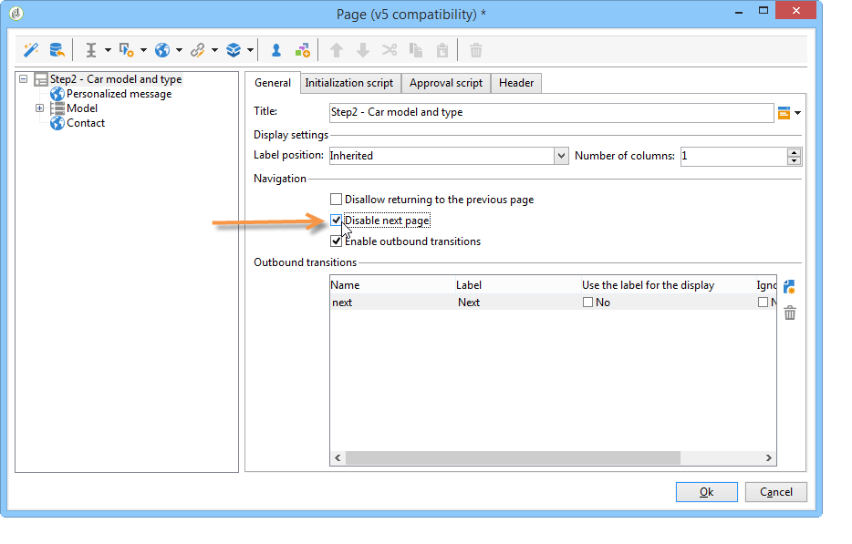
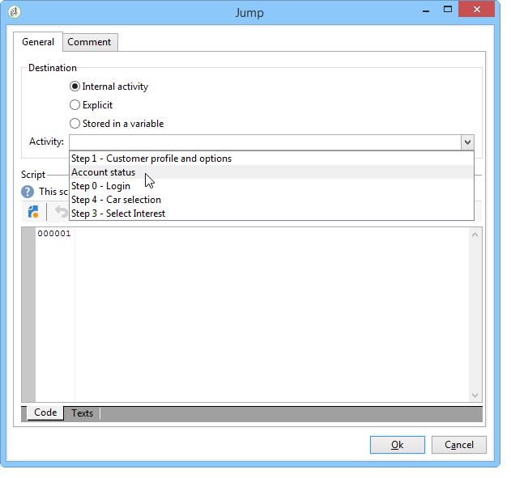
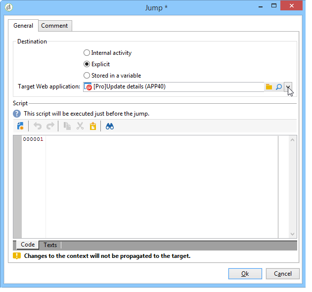
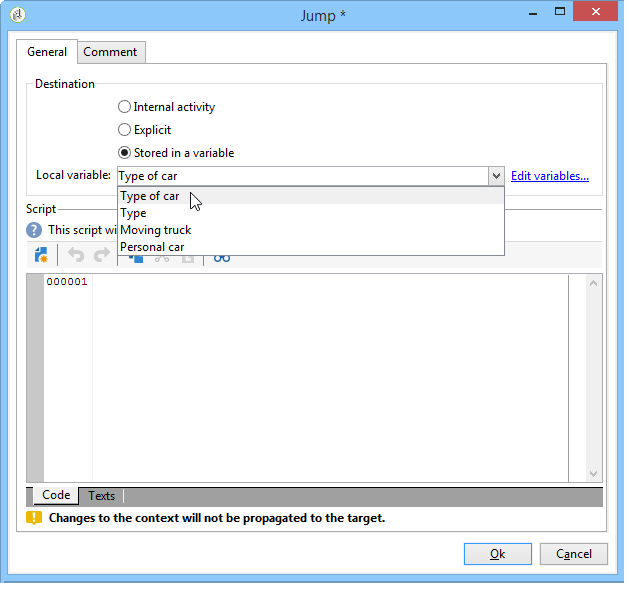
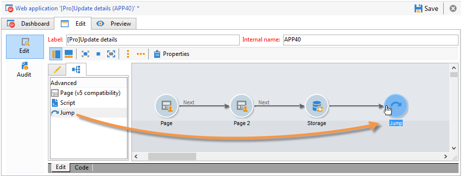
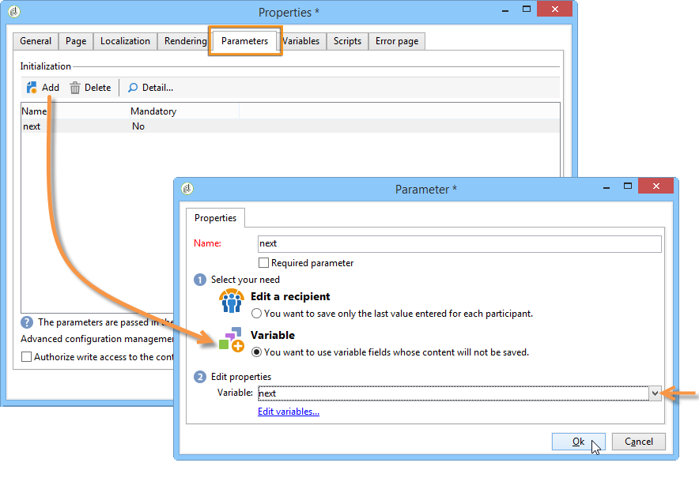
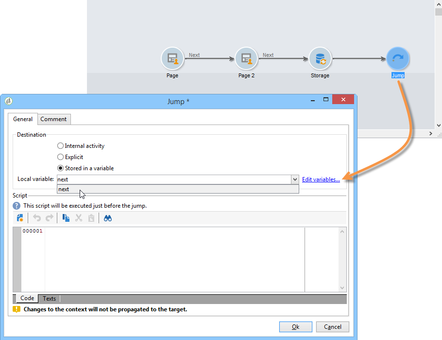
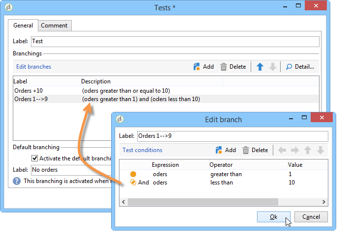
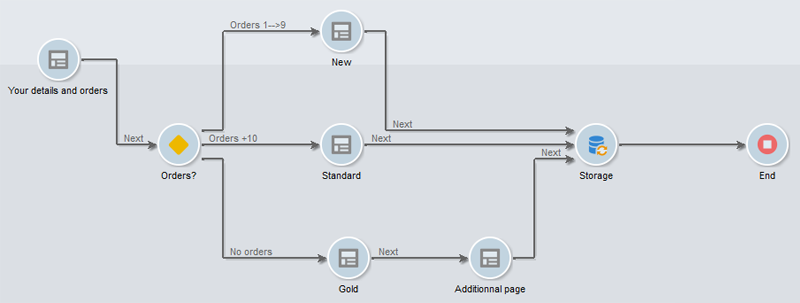
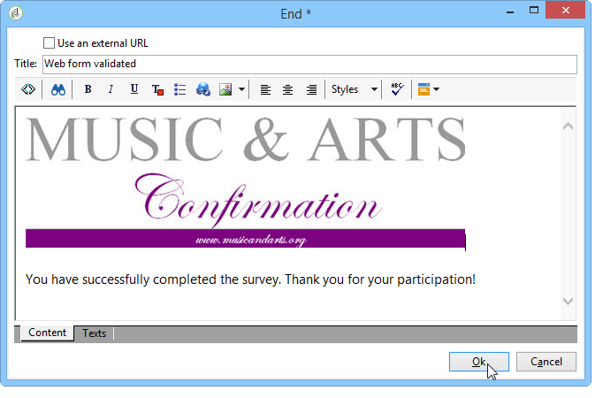

# Defining web forms page sequencing{#defining-web-forms-page-sequencing}

The form can contain one or more pages. It is built via a diagram which lets you sequence pages, testing, script execution, page jump and recording steps. Global diagram design mode is the same as for a Campaign workflow.

## About previous page and next page {#about-previous-page-and-next-page}

For each page, you can delete the **[!UICONTROL Next]** or **[!UICONTROL Previous]** buttons. To do this, select the page concerned and select the option **[!UICONTROL Disable next page]** or **[!UICONTROL Disallow returning to the previous page]** .



You can replace these buttons with links. See [Inserting HTML content](static-elements-in-a-web-form.md#inserting-html-content).

## Inserting a jump {#inserting-a-jump}

The **[!UICONTROL Jump]** object gives access to another page or another form when the user clicks **[!UICONTROL Next]**.

The destination can be:

* Another page of the form. To do this, select **[!UICONTROL Internal activity]** and then specify the desired page, as below:

  

* Another form. To do this, select the **[!UICONTROL Explicit]** option and specify the destination form. 

  

* The destination can be stored in a variable. In this case, select it from the drop-down list, as shown below:

  

* The **[!UICONTROL Comment]** tab lets you enter information that will be visible by the operator when they click the object in the diagram. 

  

## Example: accessing another form according to a parameter of the URL {#example--accessing-another-form-according-to-a-parameter-of-the-url}

In the following example, we want to configure a Web form which, when approved, will display another form designated by a parameter of the URL. To do this, apply the following steps:

1. Insert a jump at the end of a form: this replaces the **[!UICONTROL End]** box.

   

1. In the form properties, add a parameter (**next**) stored in a local variable (**next**). Local variables are detailed in [Storing data in a local variable](web-forms-answers.md#storing-data-in-a-local-variable).

   

1. Edit the **[!UICONTROL Jump]** object, select the **[!UICONTROL Stored in a variable]** option and select the **next** variable from the drop-down box.

   

1. The delivery URL must include the internal name of the destination form, for example:

   ```
   https://[myserver]/webForm/APP62?&next=APP22
   ```

   When the user clicks the **[!UICONTROL Approve]** button, form **APP22** is displayed.

## Inserting a link to another page of the form {#inserting-a-link-to-another-page-of-the-form}

You can insert links to other pages of the form. To do this, add a **[!UICONTROL Link]** type static element to the page. For more on this, refer to [Inserting a link](static-elements-in-a-web-form.md#inserting-a-link).

## Conditional page display {#conditional-page-display}

### Display based on responses {#display-based-on-responses}

The **[!UICONTROL Test]** box lets you condition the sequencing of pages in a form. It lets you define various branch lines depending on test results. This enables you to display different pages depending on the answers provided by users.

For example, you can display a different page for customers who have already ordered online, and another for those who have placed over ten orders. To do this, in the first page of the form, insert a **[!UICONTROL Number]** type input field for the user to state how many orders they have placed. 


You can either store this information in a field of the database or use a local variable.

>[!NOTE]
>
>The storage modes are detailed in [Response storage fields](web-forms-answers.md#response-storage-fields).

In our example, we want to use a variable:


In the diagram of the form, insert a test box in order to define the conditions. For each condition, a new branch will be added at the output of the test box. 



Select the **[!UICONTROL Activate the default branching]** option to add a transition for cases where none of the conditions is true. This option is unnecessary if every possible case is covered by the conditions defined.

Next, define the page sequencing when one or other of the conditions is true, for example:



### Display based on parameters {#display-based-on-parameters}

You can also personalize the page sequencing according to the initialization parameters of the Web form or according to the values stored in the database. See [Form URL parameters](defining-web-forms-properties.md#form-url-parameters).

## Adding scripts {#adding-scripts}

The **[!UICONTROL Script]** object lets you enter a JavaScript script directly, for example to modify the value of a field, retrieve data from the database, or call an Adobe Campaign API.

## Personalizing the end page {#personalizing-the-end-page}

You must place an end page at the end of the diagram. The end page is displayed when the user clicks the **[!UICONTROL Approve]** button in the Web form.

To personalize this page, double-click **[!UICONTROL End]** and enter the content of the page in the central editor. 



* You can copy and paste existing HTML content. To do this, click **[!UICONTROL Display source code]** and insert the HTML code.
* You can use an external URL; to do this, select the corresponding option and enter the URL of the page to be displayed.
