# Defining web forms properties{#defining-web-forms-properties}

Web forms are fully configurable and personalizable to satisfy your requirements. The parameters must be entered in the properties window.

The properties window is accessible via the **[!UICONTROL Properties]** button in the toolbar of the Web form. This window lets you access a range of settings specific to the Web form. Some settings may stem from template configuration. 

## Overall form properties {#overall-form-properties}

In the **[!UICONTROL General]** tab of the properties window, you can modify the **Label** of the form. It is strongly recommended not to change the **Internal name**. 

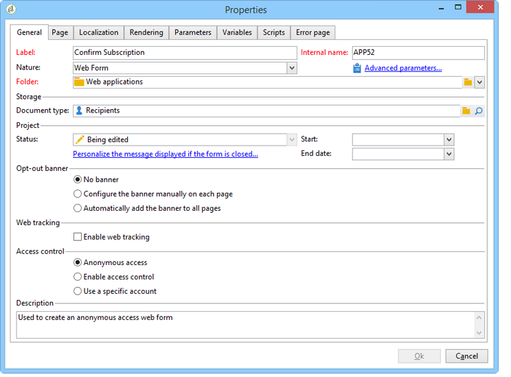

The form template is chosen during form creation. It cannot be changed later. For more on creating and managing form templates, refer to [Using a web form template](../../web/using/using-a-web-form-template.md).

## Form data storage {#form-data-storage}

The fields of Web forms are stored in the recipients table by default. You can change the table used by selecting a new table from the **[!UICONTROL Document type]** field. The **[!UICONTROL Zoom]** icon lets you view the content of the selected table.

By default, answers are stored in the **Answer to a recipient form** table.

## Setting up an error page {#setting-up-an-error-page}

You can configure an error page: this page will be displayed in case of errors during form execution.

The error page is defined in the corresponding tab of the form properties window.

By default, it displays the following information:

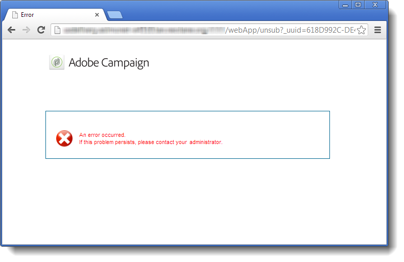

The content of the strings displayed is defined in the **[!UICONTROL Error page]** tab of the properties window. The **[!UICONTROL HTML]** tab displays the rendering and the **[!UICONTROL Texts]** tab lets you modify the text strings and add some text if necessary:

## Form localization {#form-localization}

The **[!UICONTROL Localization]** tab lets you select the design and display languages for the Web form.

See [Translating a web form](../../web/using/translating-a-web-form.md).

## Form browsing and rendering {#form-browsing-and-rendering}

The **[!UICONTROL Rendering]** tab lets you define the type of browsing between pages of the Web form and the rendering template used.

You can choose to navigate via links or buttons. 

Buttons are the navigation elements by default. They let you perform the following actions:

* Approve the current page and display the next page by clicking **[!UICONTROL Next]**. This button is displayed on all pages except the last.
* Display the previous page by clicking **[!UICONTROL Previous]**. This button is displayed on all pages except the first.
* Save the form responses by clicking the **[!UICONTROL Approve]** button. This button is only shown on the last page.

These elements are displayed at the bottom of each page. Their positions can be changed. To do this, you must modify the style sheet.

>[!NOTE]
>
>It's possible to hide the **[!UICONTROL Previous]** button on some pages. To do this, go to the concerned page and check the **[!UICONTROL Disallow returning to the previous page]** option. This option is accessible when the root of the page tree is selected.

The **[!UICONTROL Template]** field of the **[!UICONTROL Rendering]** tab lets you select a theme from those available.

Themes are saved in the **[!UICONTROL Administration>Configuration>Form rendering]** node of the tree. See [Selecting the form rendering template](../../web/using/form-rendering.md#selecting-the-form-rendering-template)

A sample rendering is displayed in the lower part of the properties window. The **[!UICONTROL Edit link]** icon lets you view the configuration for the selected theme.

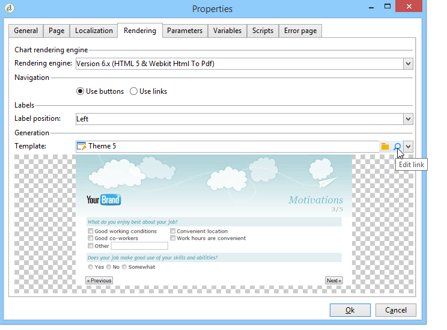

## Texts in the form {#texts-in-the-form}

The **[!UICONTROL Page]** tab lets you define the content of the form header and footer. See [Defining headers and footers](../../web/using/form-rendering.md#defining-headers-and-footers).

It also lets you manage translations. See [Translating a web form](../../web/using/translating-a-web-form.md).

## Accessibility of the form {#accessibility-of-the-form}

A Web form is accessible to users if it is **[!UICONTROL Online]** and if the current date is within its validity period. The status of the form is modified during the publication stage (see [Publishing a form](../../web/using/publishing-a-web-form.md#publishing-a-form)). The status is displayed in the **Project** section of the **[!UICONTROL General]** tab of the properties window.

The validity period runs from the **[!UICONTROL Start]** date to the **[!UICONTROL End date]**. If no dates are specified in these fields, the form has permanent validity.

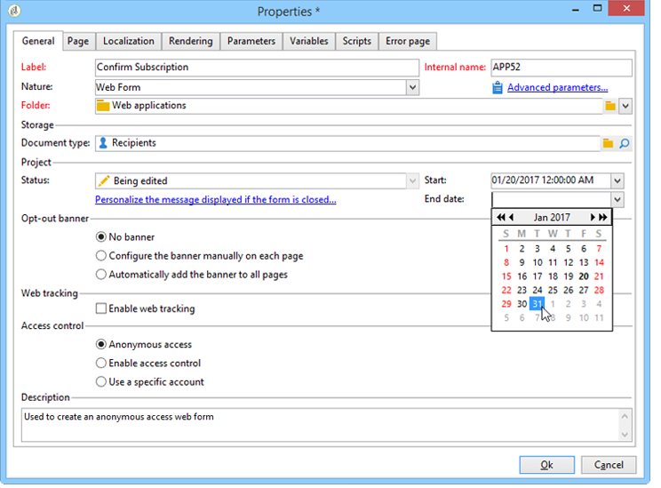

>[!NOTE]
>
>If the form is closed, and therefore its validity period has not been reached or has expired, or if it was closed by the Adobe Campaign operator, a message is displayed when the user attempts to access it. You can personalize this message by clicking **[!UICONTROL Personalize the message displayed if the form is closed...]**.

## Form access control {#form-access-control}

By default, access to the Web forms is carried out in anonymous mode: all operators who access the form are assigned WebApp operator rights.

You can enable access control for the display of the form, for example when delivering a form on an intranet site, in order to authenticate users. To do this, display the **[!UICONTROL Properties]** window of the concerned form and click the **[!UICONTROL Enable access control]** option, as shown below:

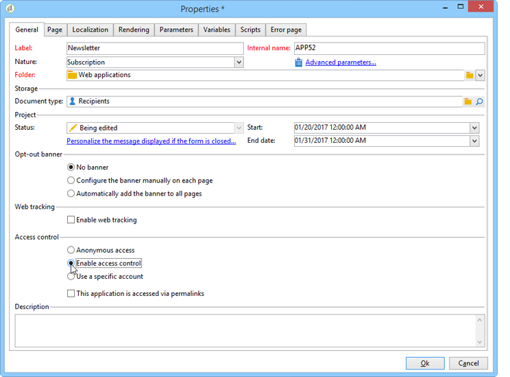

When the page is accessed, the following authentication form will come up:

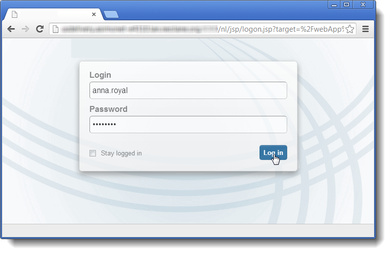

Login and password are those used by Adobe Campaign operators. For more on this, refer to [this section](../../platform/using/access-management.md).

The **[!UICONTROL Use a specific account]** option lets you limit the read or write permission of the operator who accesses the form. Use the drop-down box to select an operator or group of operators who will be in charge of granting these permissions. 

## Form URL parameters {#form-url-parameters}

You can add additional parameters in the URL of a form to personalize its content and initialize a context (language, encrypted recipient ID, company, calculated formula stored in a variable, etc.). This lets you give access to one form via several different URLs and personalize page content based on the value of the parameter(s) indicated in the URL.

By default, Adobe Campaign offers parameters for previewing the form and checking errors. You can create new settings linked to the form, which may use the values of a field in the database or of a local variable.

## Standard parameters {#standard-parameters}

The following parameters are available by default:

* **id** to indicate the encrypted identifier.
* **lang** to change the display language.
* **origin** to specify the origin of the respondent.
* **_uuid** enables form viewing before publication and error tracking. This parameter is for internal use (creation and debug): when you access the Web form via this URL, the records created aren't taken into account in the tracking (reports). The origin is forced to the **[!UICONTROL Adobe Campaign]** value.

  It is used with the **_preview** parameters and/or **_debug**:

  **_preview** to display the last saved version. This parameter must be used in the test phase only.

  **_debug** to display the trace of the data input or calculated in the pages of the form. This is used to obtain more information about errors, including once the form has been published.

  >[!CAUTION]
  >
  >When the form is displayed via a URL with the **_uuid** parameter, the value of the **[!UICONTROL origin]** parameter is forced to **Adobe Campaign**.

## Adding parameters {#adding-parameters}

Parameters can be added via the **[!UICONTROL Parameters...]** tab in the Properties window of the form. They can be made mandatory, as shown below: 

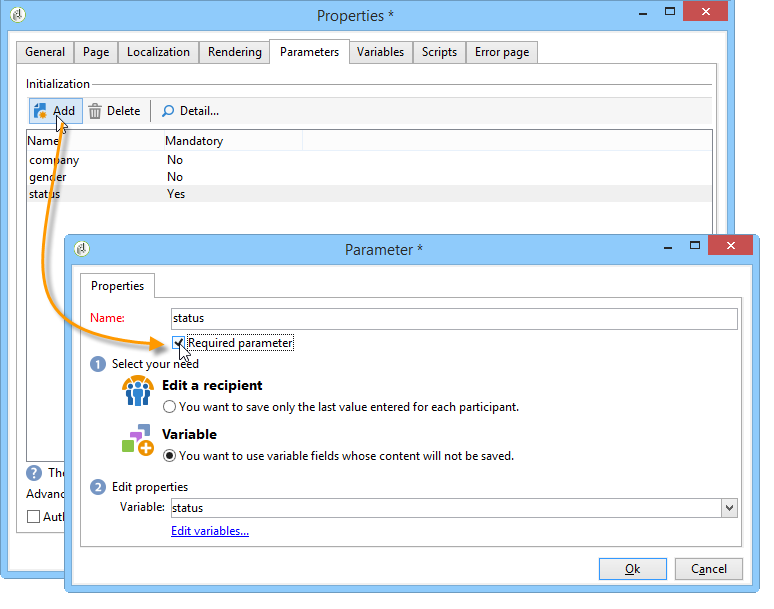

You must specify a storage location from which the value of the parameter will be retrieved. To do this, select one of the storage options and then click the **[!UICONTROL Storage]** tab to select the field or the variable concerned. The storage options are detailed in [Response storage fields](../../web/using/web-forms-answers.md#response-storage-fields).

The respondent status (0, 1 or any other value) may then be added to the URL for accessing the form. This information can be re-used in the pages of the form or in a test box. The pages displayed can be conditioned based on the value of the context, as shown below:

1. Home page for customers (**status=1**):

   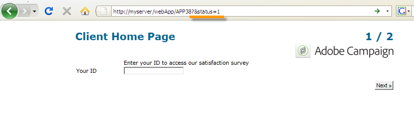

1. Home page for prospects (**status=0**):

   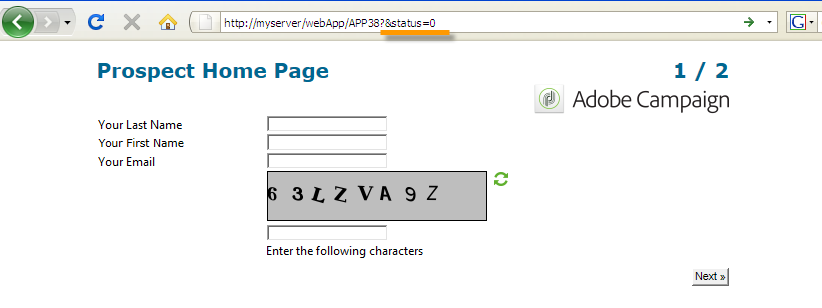

1. Home page for other profiles (e.g., **status=12**):

   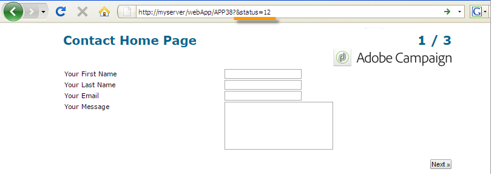

To configure this form, create a test box and place it at the start of the diagram, as shown below:

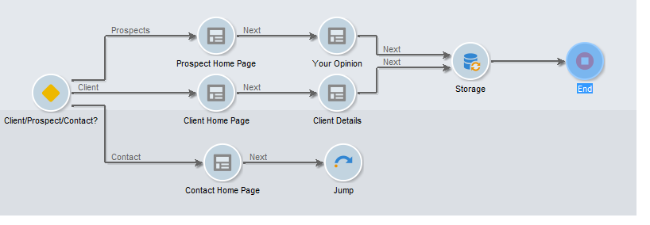

The test box lets you configure the page sequencing conditions:

