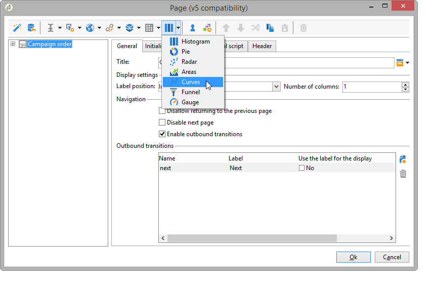
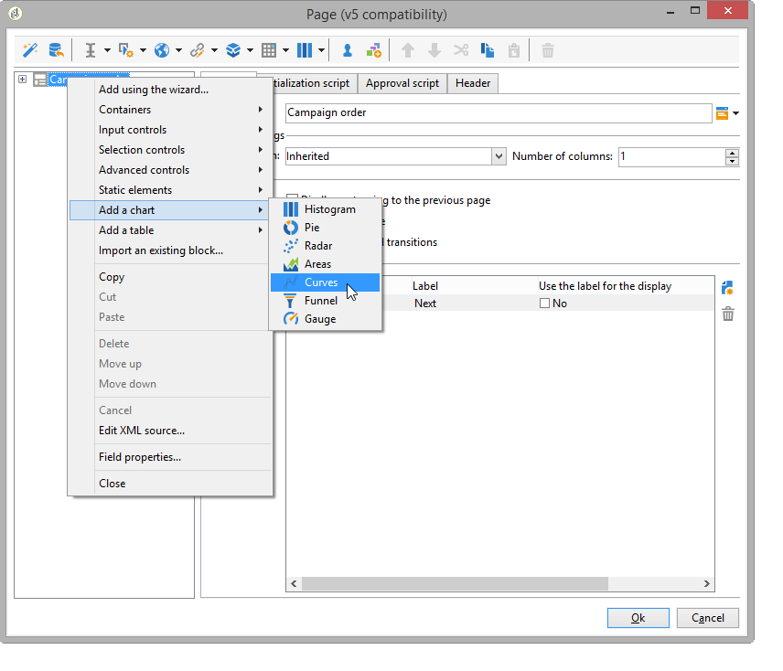
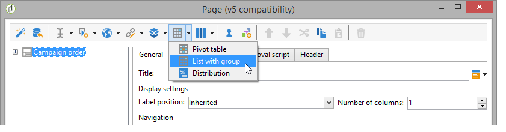
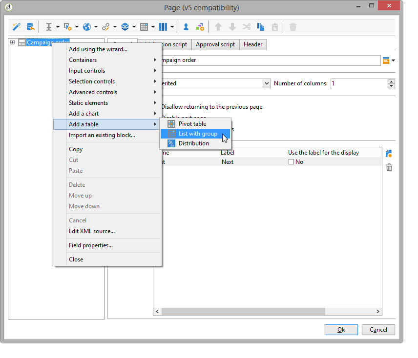

# Design a web application{#designing-a-web-application}

Web applications are created and managed according to the same principle as [online surveys](../../web/using/about-surveys.md).

However, the functional differences are as follows:

* Web applications use no archived fields. Data can therefore be stored in database fields or local variables only.
* There are no built-in reports on Web applications.
* Additional fields are offered, mainly for creating tables and charts.

>[!CAUTION]
>
>It is highly recommended that the configurations applied be continually checked in order to detect any errors early in the Web application construction process. To check the rendering of a modification, save the application, then click the **[!UICONTROL Preview]** sub-tab.   
>
>Until the Web application is published, the changes cannot be seen by the end user.

## Inserting charts in a Web application {#inserting-charts-in-a-web-application}

You can include charts in Web applications. To do this, use the drop-down list of charts in the task bar to select the type of chart to be inserted.

You can also select the **[!UICONTROL Add a chart]** menu.

## Inserting tables in a Web application {#inserting-tables-in-a-web-application}

To add a table, use the drop-down list of tables in the task bar to select the type of table to be used.

You can also select the type of table in the drop-down menu.

## Overview-type Web applications {#overview-type-web-applications}

The Adobe Campaign interface uses many Web applications to access, manage, and interact with recipients, deliveries, campaigns, stocks, etc.

They are seen in the interface in the form of dashboards with only one page.

The out-of-the-box Web applications are stored in the **[!UICONTROL Administration > Configuration > Web applications]** node.

## Edit forms-type Web applications {#edit-forms-type-web-applications}

Edit form Web applications for an extranet are characterized by:

* A preloading box

  In most cases, the data to be displayed must be preloaded. Because the users who access these forms are identified (via an access control), preloading is not necessarily encrypted.

* A save box
* Adding pages

  Whereas "Overview"-type Web applications all have a single page, edit forms can offer a sequence of pages based on specific criteria (tests, selections, profile of connected operator, etc.).

The operation of this type of Web application is similar to **Surveys**, but without history management or field archiving. Users usually access it via a login page where they must identify themselves.
