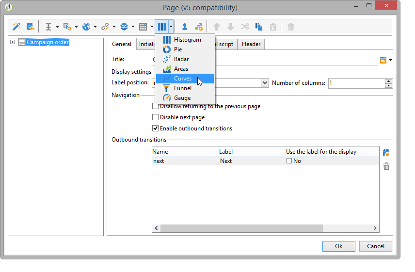

# Design a web application{#designing-a-web-application}

 

Web applications are created and managed according to the same principle as [web forms](about-web-forms.md).

>[!CAUTION]
>
>Use the **[!UICONTROL Preview]** sub-tab to check errors during web application design. Note that the profile test used to preview your web application needs to be in a folder with **[!UICONTROL Access rights]** for the **[!UICONTROL Web application agent]** operator.  Until the Web application is published, changes are not exposed to end users.

## Inserting charts in a Web application {#inserting-charts-in-a-web-application}

You can include charts in Web applications. To do this, use the drop-down list of charts in the task bar to select the type of chart to be inserted.

You can also select the **[!UICONTROL Add a chart]** menu.

## Inserting tables in a Web application {#inserting-tables-in-a-web-application}

To add a table, use the drop-down list of tables in the task bar to select the type of table to be used.

You can also select the type of table in the drop-down menu.

## Overview-type Web applications {#overview-type-web-applications}

The Adobe Campaign interface uses many Web applications to access, manage, and interact with recipients, deliveries, campaigns, stocks, etc.

They are seen in the interface in the form of dashboards with only one page.

The out-of-the-box Web applications are stored in the **[!UICONTROL Administration > Configuration > Web applications]** node.

## Edit forms-type Web applications {#edit-forms-type-web-applications}

Edit form Web applications for an extranet are characterized by:

* A preloading box

  In most cases, the data to be displayed must be preloaded. Because the users who access these forms are identified (via an access control), preloading is not necessarily encrypted.

* A save box
* Adding pages

  Whereas "Overview"-type Web applications all have a single page, edit forms can offer a sequence of pages based on specific criteria (tests, selections, profile of connected operator, etc.).

