# Editing content{#editing-content}

## Defining a visibility condition {#defining-a-visibility-condition}

You can specify a visibility condition on a web page element: this element will only be visible if the condition is respected.

To add a visibility condition, select a block and enter the condition in the **[!UICONTROL Visibility condition]** field using the expression editor.

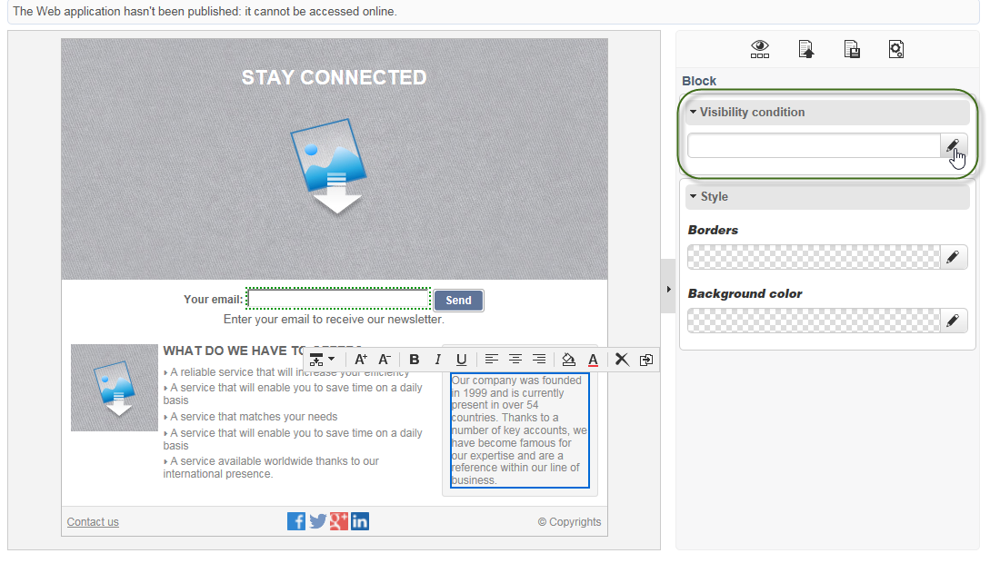

>[!NOTE]
>
>Advanced expression editing is presented on [this page](../../platform/using/defining-filter-conditions.md#list-of-functions).

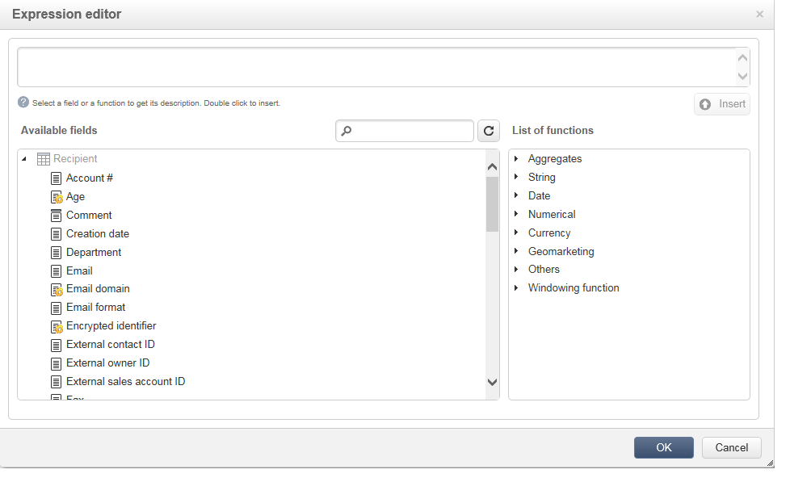

These conditions adopt the XTK expression syntax (for example **ctx.recipient.@email != ""** or **ctx.recipient.@status=="0"**). By default, all fields are visible.

>[!NOTE]
>
>Non-visible dynamic blocks, such as drop-down menus, cannot be edited.

## Adding a border and background {#adding-a-border-and-background}

You can add a **border** to a selected block. The borders are defined using three options: style, size and color.

You can also define a **background color** by selecting a color from the color chart.

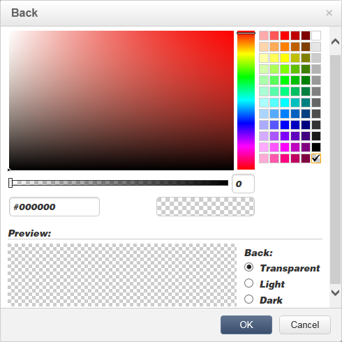

## Editing forms {#editing-forms}

### Changing the data properties for a form {#changing-the-data-properties-for-a-form}

You can link database fields with input zone, radio button or checkbox type blocks.

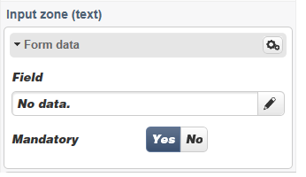

>[!NOTE]
>
>The default fields are those in the Web application storage schema.

The **field** input zone lets you select a database field to link with the form field.

By default, the fields offered are those in the **nms:recipient** table.

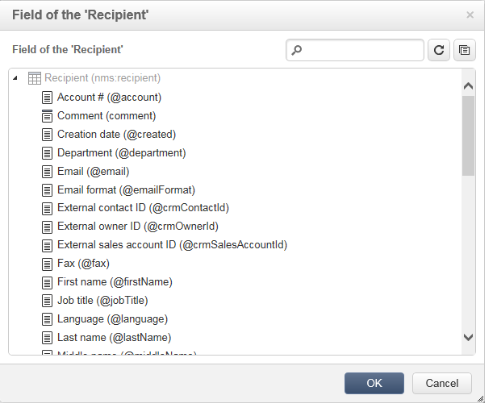

The **Required field** option lets you only authorize the page's approval if the user has filled in the field. If a required field is not filled in, an error message will appear.

For radio buttons and checkboxes, **additional configuration is required**.

Indeed, if the template used does not contain a value by default, you must complete it in the editor.

To do this:

* Click the **[!UICONTROL Edit]** icon.

  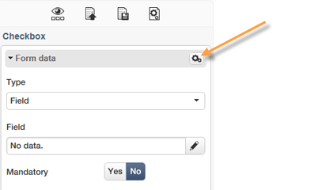

* Enter the itemized list value (defined by the selected field) into the **[!UICONTROL Value]** field.

  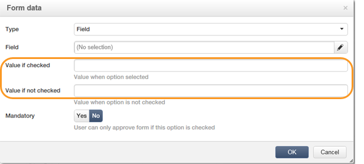

### Modifying form fields {#modifying-form-fields}

Form fields such as radio buttons, input zones, drop-down lists, etc. can be modified from their toolbars.

This means you can:

* Delete the block containing the form fields using the **[!UICONTROL Delete]** icon.
* Duplicate the selected field by creating a new block using the **[!UICONTROL Duplicate]** icon.
* Edit the **[!UICONTROL Form data]** window to link a database field to the form zone, using the **[!UICONTROL Edit]** icon.

  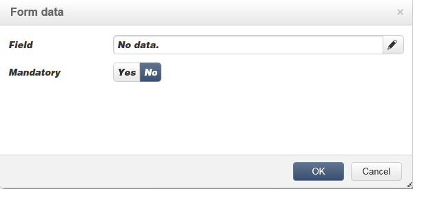

## Adding an action to a button {#adding-an-action-to-a-button}

When the user clicks a button, you can define an associated action. To do this, select the action to be carried out from the drop-down list.

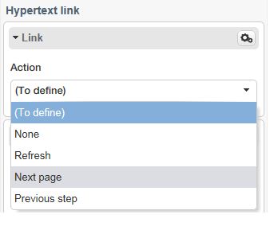

The actions available are as follows:

* **[!UICONTROL Refresh]** : refreshes the current page.
* **[!UICONTROL Next page]** : creates a link to the next page in the Web application.
* **[!UICONTROL Previous page]** : creates a link to the previous page in the Web application.

>[!NOTE]
>
>The **[!UICONTROL None]** value allows you to not activate the button.

You can modify the label linked to the button in the corresponding field.

## Adding a link {#adding-a-link}

You can insert a link into any page element: image, word, group of words, block of text, etc.

To do this, select the element then use the first icon from the pop-up menu.

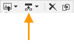

This icon lets you access all the available types of links.

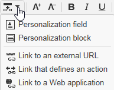

Personalization blocks and fields can only be inserted into Text type blocks.

>[!NOTE]
>
>For each type of link, you can configure the opening mode: select the target window in the **Target** drop-down list. This value corresponds to the **`<target>`** HTML tag.  
>
>The list of available **targets** is as follows:  
>
>* Other (IFrame)
>* Top window (_top)
>* Parent window (_parent)
>* New window (_blank)
>* Current window (_self)
>* Default browser behavior
>

### Link to a URL {#link-to-a-url}

The **Link to an external URL** option lets you open any URL from the source content. 

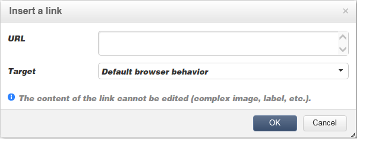

Enter the link address in question into the **URL** field. The URL field should be entered as: **https://www.myURL.com**.

### Link to a Web application {#link-to-a-web-application}

The **Link to a Web application** option lets you access an Adobe Campaign Web application.

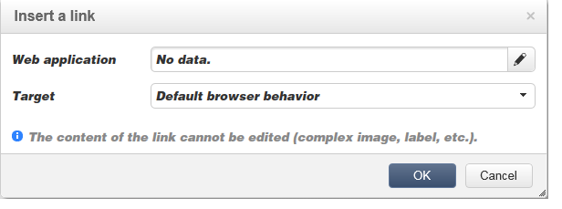

Select the Web application from the corresponding field.

The list of suggested Web applications corresponds to the available applications in the **[!UICONTROL Resources > Online > Web Applications]** node.

### Link to an action {#link-to-an-action}

The **Link that defines an action** option lets you configure an action when clicking a source element.

>[!NOTE]
>
>Available actions are detailed in the [Adding an action to a button](#adding-an-action-to-a-button) section.

### Delete a link {#delete-a-link}

When a link has been inserted, the tool bar offers two new icons: **Edit link** and **Break the link** that let you interact with the link created.

* **[!UICONTROL Edit link]** lets you display a window featuring all the parameters of the link.
* **[!UICONTROL Break the link]** lets you delete, after confirmation, the link and all related parameters.

>[!NOTE]
>
>If the link is deleted, the content is still kept.

## Changing font attributes {#changing-font-attributes}

When you select a text element, you can modify font attributes (style, format).

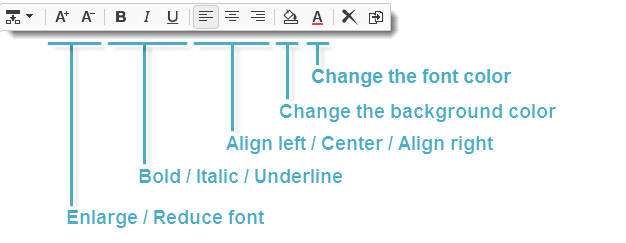

The available options are as follows:

* **Enlarge font** icon: increases the size of the selected text (add ``)
* **Reduce font** icon: reduces the size of the selected text (add ``)
* **Bold** icon: makes selected text bold (wrap text with the `<strong> </strong>` tag)
* **Italic** icon: makes selected text italic (wrap text with the  `<em> </em>` tag)
* **Underline** icon: makes selected text underlined (wrap text with the `` tag)
* **Align left** icon: aligns text to the left of the selected block (add style="text-align: left;")
* **Center** icon: centers the text for the selected block (add style="text-align: center;")
* **Align right** icon: aligns text to the right of the selected block (add style="text-align: right;")
* **Change the background color** icon: lets you change the background color for the selected block (add style="background-color: rgba(170, 86, 255, 0.87))
* **Change text color** icon: lets you change the text color of the selected block or just the selected text (``)

>[!NOTE]
>
>* **Delete** icon: deletes the block and all its content.
>
>* **Duplicate** icon: duplicates the block as well as all the styles related to the block.

## Managing images and animations {#managing-images-and-animations}

The Digital Content Editor lets you work on **any type of image** compatible with browsers.

>[!CAUTION]
>
>You must not call up external files in a **script** tag of the HTML page. These files will not be imported onto the Adobe Campaign server.

### Adding / Deleting / Duplicating an image {#adding---deleting---duplicating-an-image}

To insert an image, select an Image type block and click the **Image** icon.

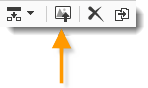

Select an image file saved locally.

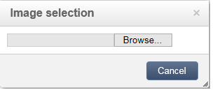

The **Delete** icon deletes the  tag containing the image.

The **Duplicate** icon duplicates the  tag and its content.

>[!CAUTION]
>
>When you duplicate an image, the identifiers related to the new image are deleted.

### Editing image properties {#editing-image-properties}

When you select a block containing an image, you access the following properties:

* **Caption** lets you define the caption linked to the image (corresponds to the **alt** HTML attribute).
* **Dimensions** lets you specify the image size, in pixels.

  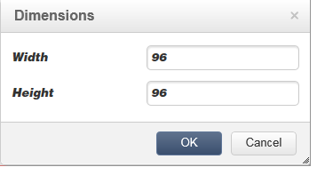

## Adding personalization content {#adding-personalization-content}

### Inserting a personalization field {#inserting-a-personalization-field}

The **Personalization field** option for the insert icon lets you add a database field into the content, such as the recipient's name. This option is only available for text type blocks.

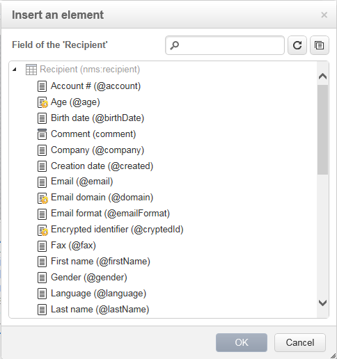

By default, the fields offered are from the **[!UICONTROL Recipient]** table. Where necessary, edit the Web application properties to select another table.

The field name appears in the editor, highlighted in yellow. It will be replaced by the profile of the targeted recipient when the personalization is generated (for example, when previewing a landing page).

An example is presented in the [Inserting a personalization field](creating-a-landing-page.md#inserting-a-personalization-field) section.

### Inserting a personalization block {#inserting-a-personalization-block}

The **Personalization block** option lets you insert dynamic and personalized blocks into the content. For example, you can add a logo or a greeting message. It is not available for Text type blocks.

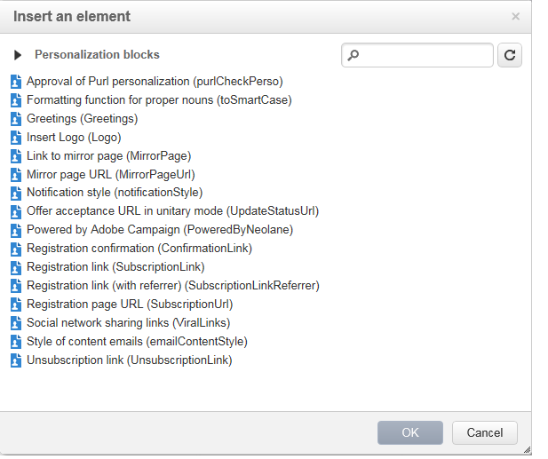

Once inserted, the personalization block name appears in the editor, highlighted in yellow. It is automatically adapted to the recipient profile when personalization is generated.

For more on built-in personalization blocks and how to define custom personalization blocks, refer to [this page](../../delivery/using/personalization-blocks.md).
