# Form rendering{#form-rendering}

## Selecting the form rendering template {#selecting-the-form-rendering-template}

The form settings enable you to select the template used to generate the pages. To access them, click the **[!UICONTROL Settings]** button in the form detail toolbar, and select the **[!UICONTROL Rendering]** tab. There are a number of templates (style sheets) available by default.

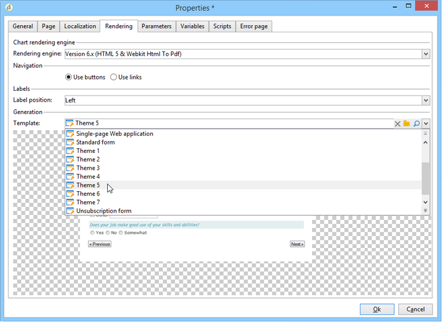

The bottom section of the editor enables you to view a rendering of the selected template.

The zoom feature lets you edit the selected template.

You can modify or override these templates. To do this, click the **[!UICONTROL Page layout...]** link and personalize the information.

You can:

* Change the image used as a logo and adapt its size, 
* Also specify the path for accessing the preview image when users select this rendering template.

The **[!UICONTROL Headers/Footers]** tab lets you change the information displayed in the headers and footers of each form page using this template.

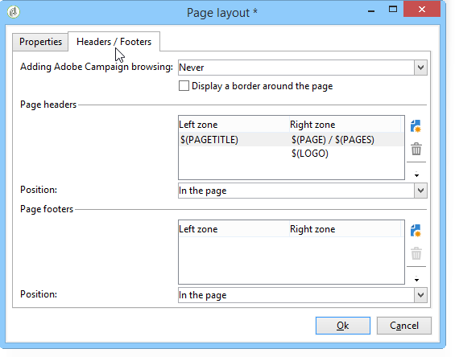

Each line of the **[!UICONTROL Page headers]** and **[!UICONTROL Page footers]** section corresponds to a line in the HTML page. Click **[!UICONTROL Add]** to create a new line.

Select an existing line and click the **[!UICONTROL Detail]** button to personalize it.

You can change the content of the line, add borders, and change the font attributes via the relevant tabs. Click **[!UICONTROL OK]** to confirm these changes.

The **[!UICONTROL Position]** fields let you define the position of elements in the page header and footer.

>[!NOTE]
>
>Rendering templates are stored in the **[!UICONTROL Administration > Configuration > Form rendering]** node.  
>For more on this, refer to [Customizing form rendering](#customizing-form-rendering)

## Customizing form rendering {#customizing-form-rendering}

### Changing the layout of elements {#changing-the-layout-of-elements}

You can overload the style sheet for each element of the form (input fields, images, radio buttons, etc.).

To do this, use the **[!UICONTROL Advanced]** tab.

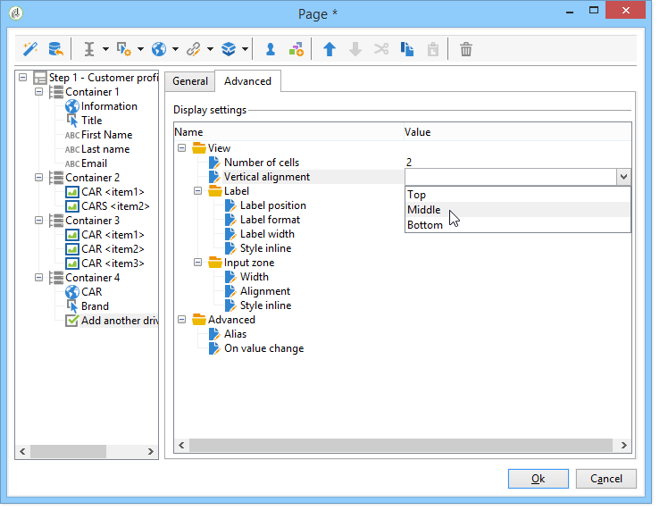

It enables you to define the following properties:

* **[!UICONTROL Label position]**: see [Defining the position of labels](defining-web-forms-layout.md#defining-the-position-of-labels),
* **[!UICONTROL Label format]**: Word wrap or No word wrap,
* **[!UICONTROL Number of cells]** : see [Positioning the fields on the page](defining-web-forms-layout.md#positioning-the-fields-on-the-page),
* **[!UICONTROL Horizontal alignment]** (Left, Right, Centered) and **[!UICONTROL Vertical alignment]** (High, Low, Middle),
* **[!UICONTROL Width]** of the zone: this can be expressed as a percentage or in ems, points, or pixels (default value),
* Maximum **[!UICONTROL Length]**: Maximum number of characters allowed (for Text, Number and Password type controls),
* **[!UICONTROL Lines]**: number of lines for a **[!UICONTROL Multi-line text]** type zone,
* **[!UICONTROL Style inline]**: enables you to overload the CSS style sheet with additional settings. These are separated using **;** characters as shown in the example below:

  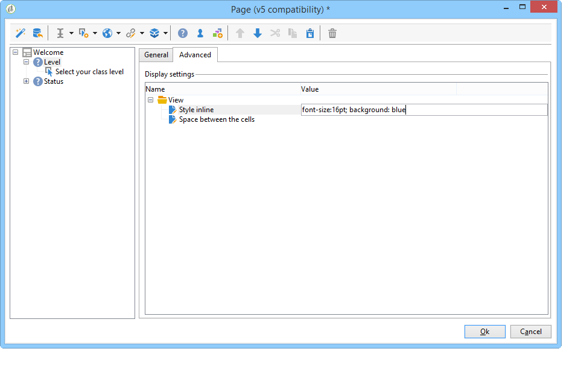

### Defining headers and footers {#defining-headers-and-footers}

Fields are sequenced in a tree structure whose root has the same name as the page. Select it to modify the name.

The title of the window must be entered in the **[!UICONTROL Page]** tab of the form property window. You can also add a set content to the page header and footer (this information will be shown on every page). This content is entered in the matching sections of the **[!UICONTROL Texts]** tab, as shown below:

### Adding elements to HTML header {#adding-elements-to-html-header}

You can enter additional elements to be inserted into the HTML header of a form page. To do this, enter the elements in the **[!UICONTROL Header]** tab of the relevant page.

This lets you reference an icon that will be displayed in the page's title bar, for example.

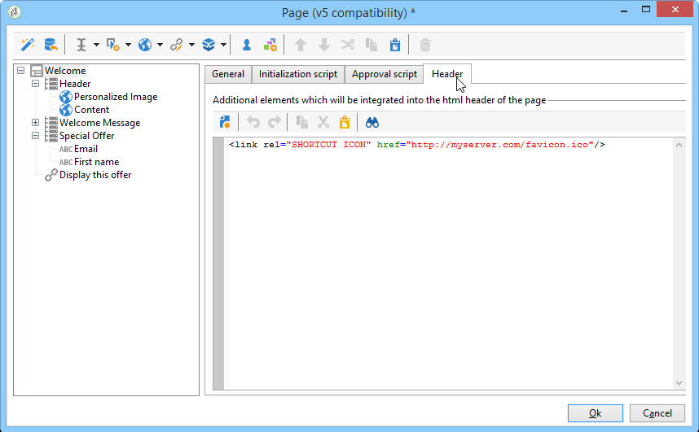

## Defining control settings {#defining-control-settings}

When the user fills in the form, a check is automatically carried out on certain fields depending on their format or configuration. This lets you make certain fields mandatory (refer to [Defining mandatory fields](#defining-mandatory-fields)) or check the format of the data entered (refer to [Checking data format](#checking-data-format)). Checks are carried out during page approval (by clicking a link or button which enables an output transition).

### Defining mandatory fields {#defining-mandatory-fields}

To make certain fields mandatory, select this option when creating the field.

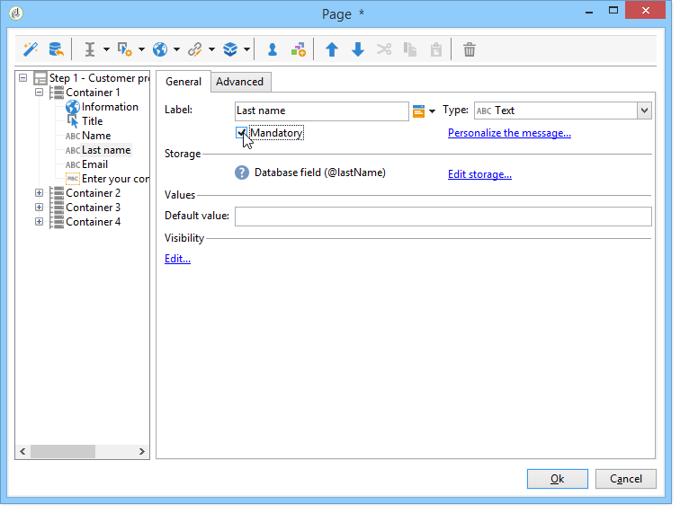

If the user approves this page without having entered the field, the following message will be displayed: 

You can personalize this message by clicking the **[!UICONTROL Personalize this message]** link.

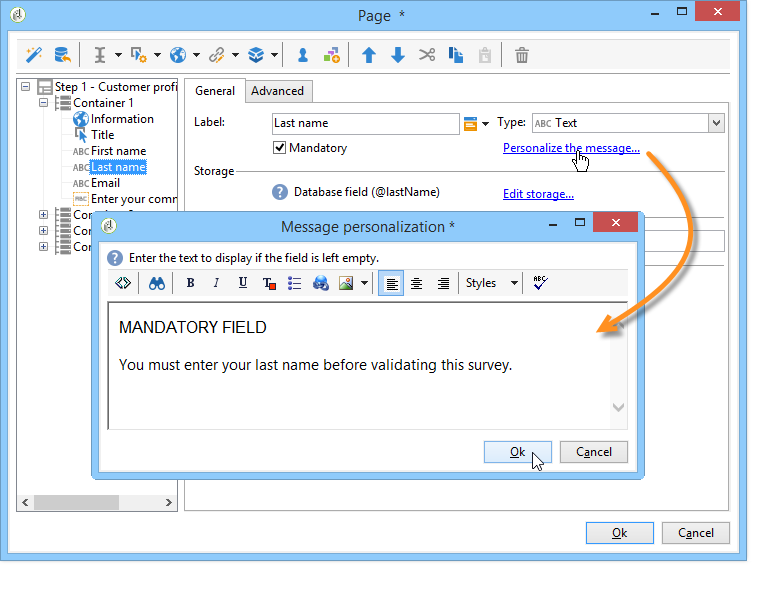

If the user approves this page without having entered the field, the following message will be displayed: 

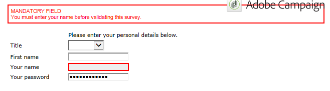

### Checking data format {#checking-data-format}

For form checks whose values are stored in an existing field of the database, the rules for the storage field will be applied.

For form checks whose values are stored in a variable, approval rules depend on the format of the variable.

For example, if you create a **[!UICONTROL Number]** check to store the client number, as shown below:

The user must enter an integer in the form field.

## Defining fields conditional display {#defining-fields-conditional-display}

You can configure the display of fields on the page to be displayed based on the values chosen by the user. This can apply to one field or a group of fields (when they are grouped in a container).

For each element of the page, the **[!UICONTROL Visibility]** section lets you define the display conditions. 

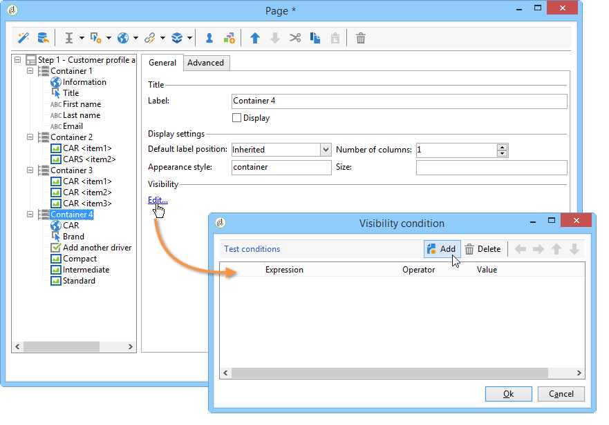

Conditions can concern the value of database fields or variables.

In the field selection window, you can choose from the following data:

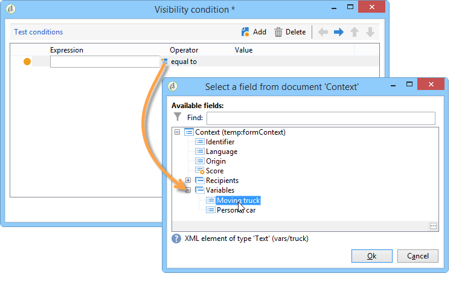

* The main tree contains the parameters of the form context. The default parameters are the Identifier (which matches the encrypted identifier of the recipient), Language and Origin.

  For more on this, refer to this [page](defining-web-forms-properties.md#form-url-parameters).

* The **[!UICONTROL Recipients]** sub-tree contains the input fields inserted into the form and stored in the database.

  For more on this, refer to [Storing data in the database](web-forms-answers.md#storing-data-in-the-database). 

* The **[!UICONTROL Variables]** sub-tree contains the available variables for this form. For more on this, refer to [Storing data in a local variable](web-forms-answers.md#storing-data-in-a-local-variable).

For more on this, refer to the use case available here: [Displaying different options depending on the selected values](use-cases--web-forms.md#displaying-different-options-depending-on-the-selected-values).

You can also condition the display of form pages using the **[!UICONTROL Test]** object. For more on this, refer to this [page](defining-web-forms-page-sequencing.md#conditional-page-display).

## Importing elements from an existing form {#importing-elements-from-an-existing-form}

It's possible to import fields or containers from other Web forms. This lets you create a library of re-usable blocks which will be inserted into forms, such as the address block, the newsletter subscription area, etc.

To import an element into a form, apply the following steps:

1. Edit the page which you want to insert one or more elements into, then click **[!UICONTROL Import an existing block]** in the toolbar.

   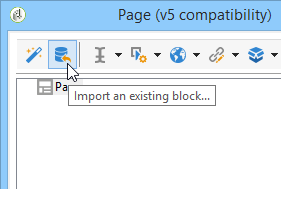

1. Select the Web form which contains the fields to import and choose the containers and fields to import.

   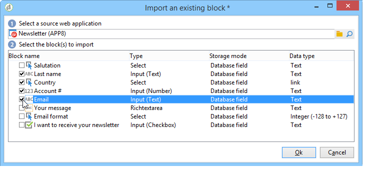

   >[!NOTE]
   >
   >The **[!UICONTROL Edit link]** icon to the right of the source form name lets you view the selected Web form.

1. Click **[!UICONTROL Ok]** to confirm insertion.

   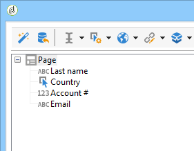
