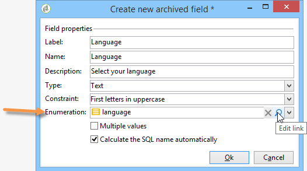
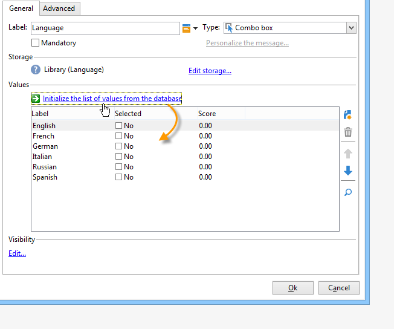
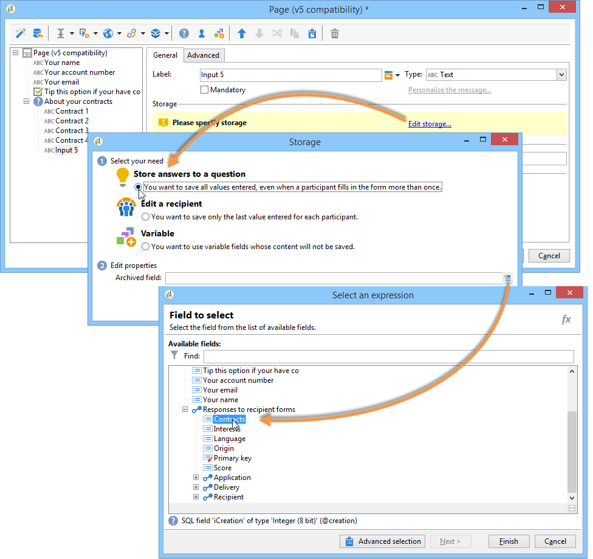
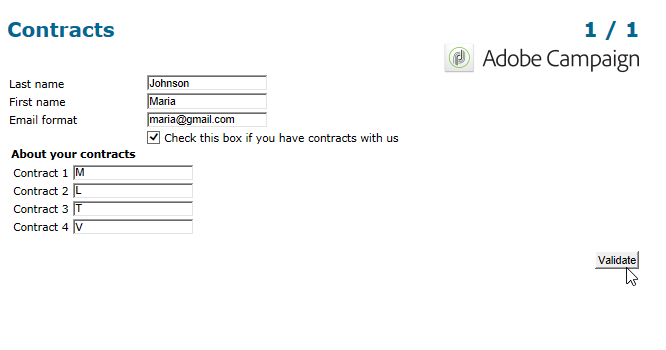
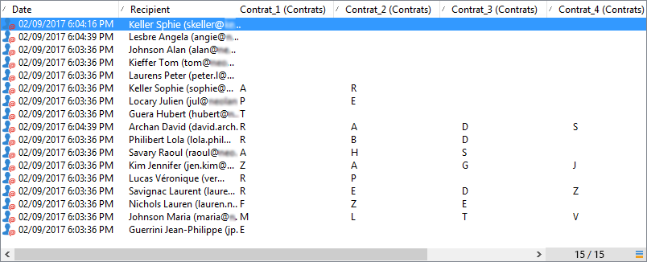
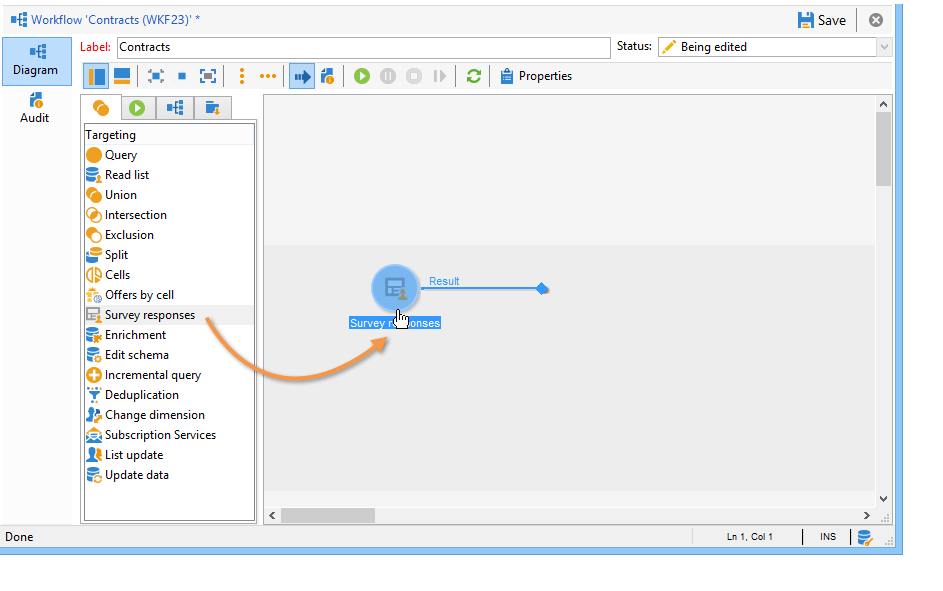
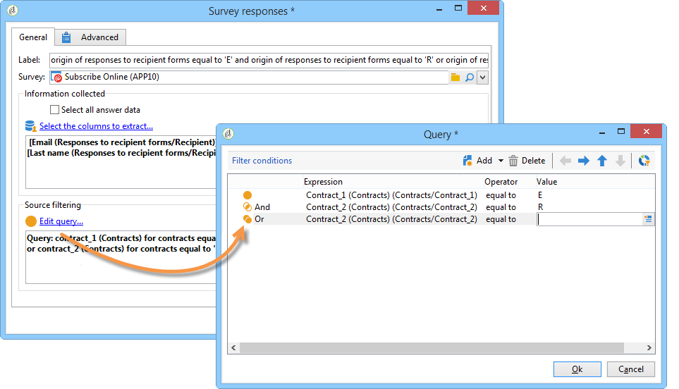
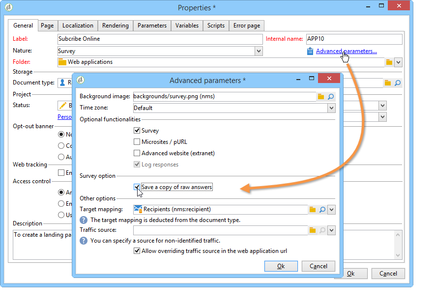
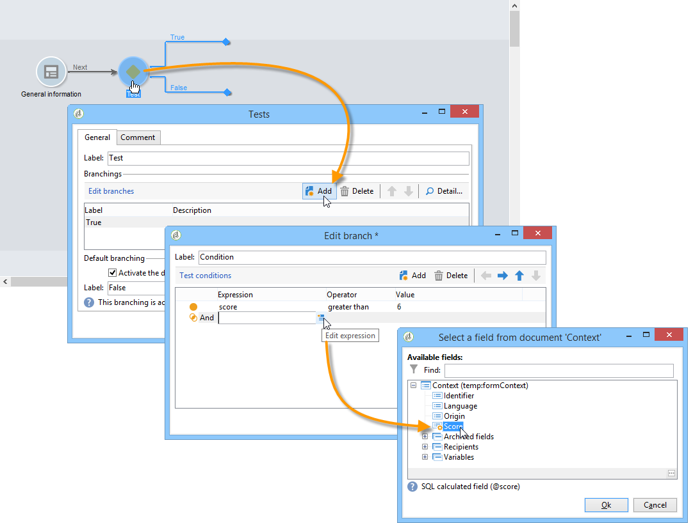

# Managing answers{#managing-answers}

## Storing collected answers {#storing-collected-answers}

In addition to the standard storage modes common to all Web forms in Adobe Campaign (database field and local variable), surveys enable the dynamic extension of the data model using archived fields.

>[!CAUTION]
>
>This option is available for **Survey** type Web applications only. It is not offered for other types of Web forms.

### Storing in an archived field {#storing-in-an-archived-field}

It is easy to extend the data template by adding new storage spaces to save the responses provided in surveys. To do this, select the **[!UICONTROL Store answers to a question]** option when creating the input field. Click the **[!UICONTROL New field...]** link and give its properties:


Enter the label and name of the field and select the type of field: Text, Boolean, Integer or decimal number, Date, etc.

The type of field selected involves a control of the data when responses are entered by users. For **text** fields, you can add a constraint (case, format) or link to an existing enumeration to force selection.

To add a constraint, select it from the drop-down list. There are two types of constraints:

1. Character case

   The information entered can be stored in the field in the following formats: all uppercase, all lowercase, or with initial uppercase. This constraint does not require the user to enter the data in the selected format, but the content entered in the field will be converted when saved.

1. Data format

If this field is used in a list, the values of the enumeration can be retrieved automatically in the table of values using the **[!UICONTROL Initialize the list of values from the database]** link above the list of values.

For example, you can create a drop-down list for the user to select his or her native language. The corresponding archived field can be associated with the **language** enumeration which contains a list of languages:



The **[!UICONTROL Edit link]** icon located to the right of the field lets you edit the content of this enumeration:


In the **[!UICONTROL General]** tab of the field, the **[!UICONTROL Initialize the list of values from the database]** link lets you automatically enter the list of labels offered.



**Example**: storing a recipient's contracts in one field

To store different types of contracts in one field, create a **[!UICONTROL Text]** input field and select the **[!UICONTROL Store answers to a question]** option.

Click the **[!UICONTROL New field...]** link and enter the field properties. Select the **[!UICONTROL Multiple values]** option to enable several values to be stored.


Create entry fields for the other contracts, and store the data in the same archived field.



When users approve the survey, their answers will be stored in the **[!UICONTROL Contracts]** field.

In our example, for the following answers:



The respondent's profile will contain the four contracts entered.

They can be viewed in the **[!UICONTROL Answers]** tab of the survey by displaying the relevant columns.



You can also filter recipients based on answers to display only the users that interest you. To do this, create a targeting workflow and use the **[!UICONTROL Survey responses]** box.



Create your query based on the profiles you want to recover. In the following example, the query lets you select profiles with at least two contracts, including an A type contract.



For each form, the answers provided can be used in fields or labels. Use the following syntax for content stored in an archived field:

```
<%= ctx.webAppLogRcpData.name of the archived field %
```

>[!NOTE]
>
>For other types of fields, the syntax is detailed in [this section](../../platform/using/about-queries-in-campaign.md).

### Storage settings {#storage-settings}

It is possible to archive answers to surveys in XML format. This lets you save a raw copy of the answers collected, which can be useful in case of excessive standardization of the data in an itemized list (for more on this, refer to [Standardizing data](../../web/using/publish--track-and-use-collected-data.md#standardizing-data)).

>[!CAUTION]
>
>Archiving raw responses greatly increases the storage space required. Use this option with care.

To do this:

* Edit the survey properties via the **[!UICONTROL Properties]** button of the **[!UICONTROL Edit]** tab.
* Click the **[!UICONTROL Advanced parameters]** link and check the **[!UICONTROL Save a copy of raw answers]** option.



You can enable it by default for all surveys (this option is applied when the survey is published). To do this, create the **[!UICONTROL NmsWebApp_XmlBackup]** option and assign value **[!UICONTROL 1]** to it, as shown below:


## Score management {#score-management}

You can assign a score to the options offered in the pages of the form. Scores can only be linked to closed questions: checkbox, value from a drop-down list, subscription, etc.

>[!CAUTION]
>
>Score management is available for **Surveys** only.


The scores are accumulated and saved on the server side when the page is confirmed, i.e. when the user clicks the **[!UICONTROL Next]** or **[!UICONTROL Finish]** button.

>[!NOTE]
>
>You can use positive or negative, integer or non-integer values.

Scores can be used in tests or scripts.

>[!CAUTION]
>
>Scores cannot be used in the visibility conditions for fields which are on the same page. However, they can be used in subsequent pages.

* To use scores in tests, use the **[!UICONTROL Score]** field in the test calculation formula, as shown below: 

  

* You can use the score in a script.

**Example**: calculate a score and use it as a condition for the display of the next page:

* In a survey, the next page lets you assign different scores to users depending on the value selected in the drop-down list:

  

* You can combine this score with a second value, depending on the selected option:

  

* When the user clicks the **[!UICONTROL Next]** button, the two values are added up.

  

* Conditions can be applied for the page to be displayed according to the score. This is configured as follows:

  

  
