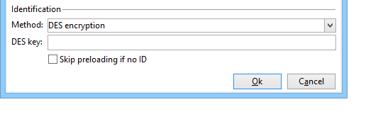
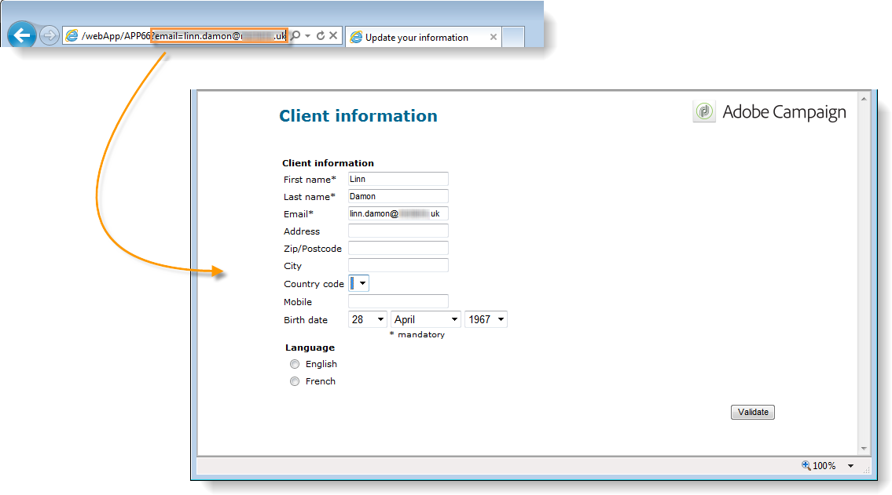
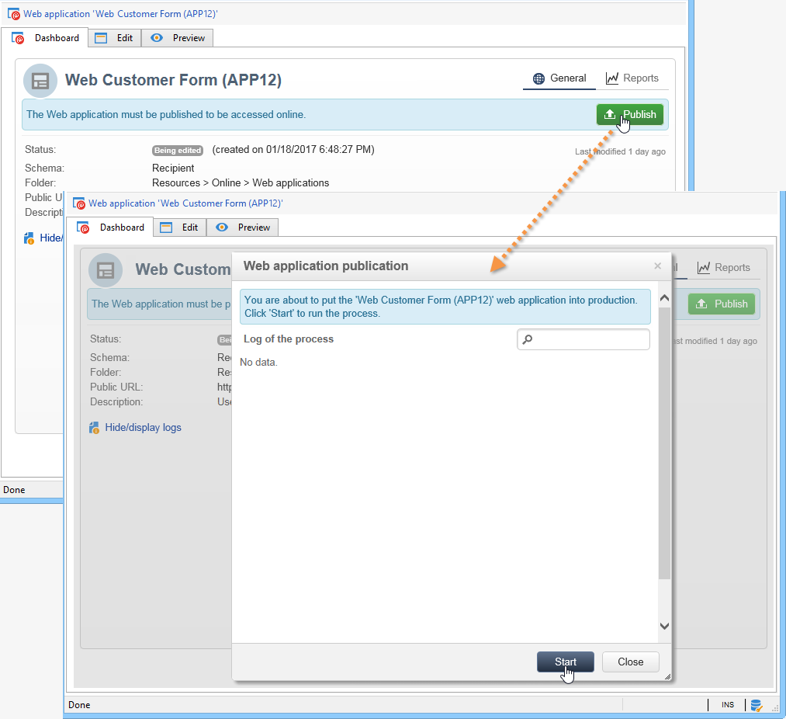
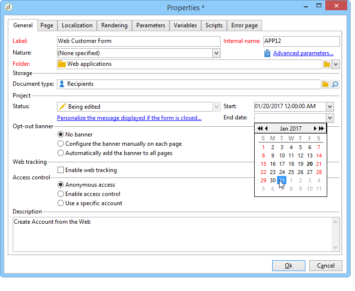
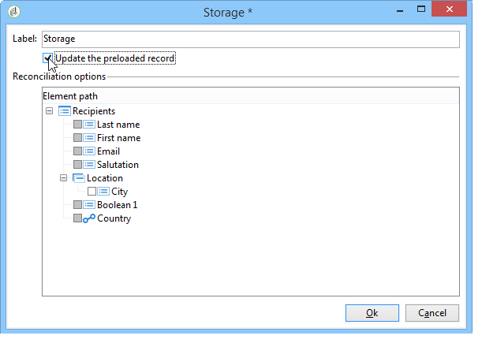
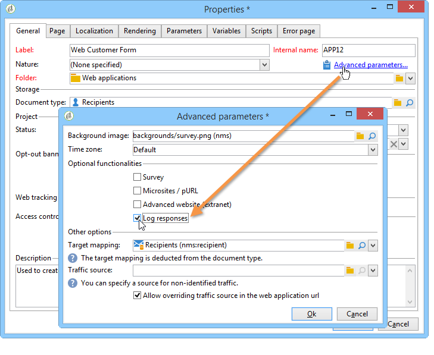
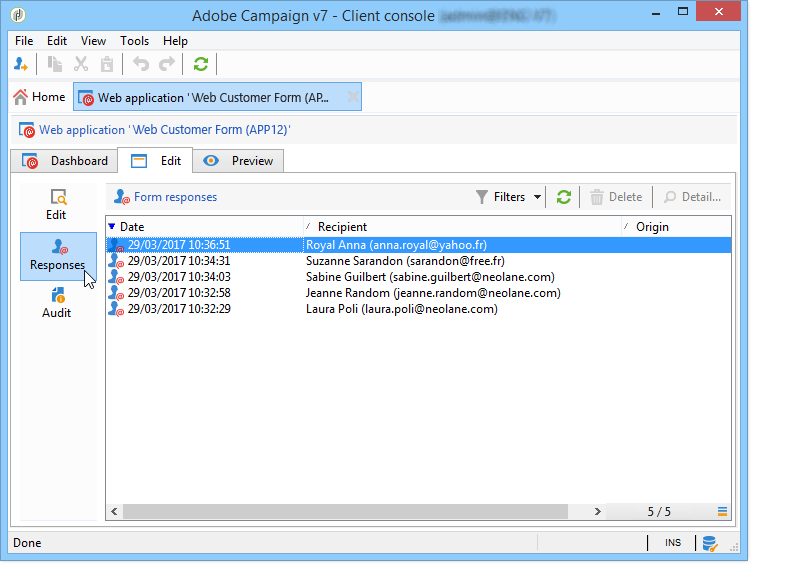
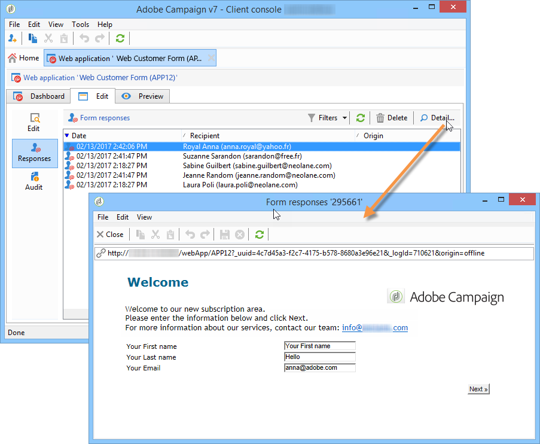

# Publishing a web form{#publishing-a-web-form}


## Pre-loading the form data {#pre-loading-the-form-data}

If you wish to update the profiles stored in the database via a Web form, you can use a preloading box. The preloading box lets you indicate how to find the record to be updated in the database.

The following identification methods are possible:

* **[!UICONTROL Adobe Campaign Encryption]**

  This encryption method uses the encrypted Adobe Campaign identifier (ID). This method is only applicable on an Adobe Campaign object and the encrypted ID may only be generated by the Adobe Campaign platform.

  When using this method, you need to adapt the URL of the form to deliver to the email address by adding the **`<%=escapeUrl(recipient.cryptedId) %>`** parameter. For more on this, refer to [Delivering a form via email](#delivering-a-form-via-email).

* **[!UICONTROL DES encryption]** 

  

  This encryption method uses an identifier (ID) provided externally, linked to a key shared by Adobe Campaign and the external provider. The **[!UICONTROL Des key]** field lets you enter this encryption key.

* **[!UICONTROL List of fields]**

  This option lets you choose from the fields in the current context of the form, those that will be used to find the corresponding profile in the database. 

  

  Fields can be added to the form properties via the **[!UICONTROL Parameters]** tab (refer to [Adding parameters](defining-web-forms-properties.md#adding-parameters)). They are placed in the form URL or input zones.

  >[!CAUTION]
  >
  >The data in the selected fields isn't encrypted. It must not be provided in an encrypted form because Adobe Campaign will not be able to decrypt it if the **[!UICONTROL Field list]** option is selected.

  In the following example, profile preloading is based on the email address.

  The URL can include the unencrypted email address, in which case users have direct access to the pages that concern them. 

  

  If not, they will be asked for their password.

  

  >[!CAUTION]
  >
  >If several fields are specified in the list, the data of **ALL FIELDS** must match the data stored in the database in order for the profile to be updated. Otherwise, a new profile is created.
  > 
  >This function is particularly useful for Web applications but not recommended for public forms. The selected access control option must be "Enable access control".

The **[!UICONTROL Skip preloading if no ID]** option must be selected if you do not wish to update profiles. In this case, each profile entered will be added to the database after approval of the form. This option is used, for example, when the form is posted on a website.

The **[!UICONTROL Auto-load data referenced in the form]** option lets you automatically preload the data that matches input and merge fields in the form. However, data referenced in **[!UICONTROL Script]** and **[!UICONTROL Test]** activities is not concerned. If this option isn't selected, you need to define the fields using the **[!UICONTROL Load additional data]** option.

The **[!UICONTROL Load additional data]** option lets you add information which is not used in the pages of the form, but will nonetheless be preloaded.

You can, for example, preload the gender of the recipient and automatically direct him or her to the appropriate page via a test box.


## Managing web forms delivery and tracking {#managing-web-forms-delivery-and-tracking}

Once the form has been created, configured and published, you can deliver it and track the user responses.

### Life cycle of a form {#life-cycle-of-a-form}

There are three stages in the life cycle of a form:

1. **Form Being edited**

   This is the initial design phase. When a new form is created, it is in the editing phase. Access to the form, for testing purposes only, then requires the parameter **[!UICONTROL __uuid]** to be used in its URL. This URL is accessible in the **[!UICONTROL Preview]** sub-tab. See [Form URL parameters](defining-web-forms-properties.md#form-url-parameters).

   >[!CAUTION]
   >
   >As long as the form is being edited, its access URL is a special URL.

1. **Form Online**

   Once the design phase is complete, the form can be delivered. First, it needs to be published. For more on this, refer to [Publishing a form](#publishing-a-form).

   The form will be **[!UICONTROL Live]** until it expires.

   >[!CAUTION]
   >
   >To be delivered, the URL of the survey must not contain the **[!UICONTROL __uuid]** parameter.

1. **Form Unavailable**

   Once the form is closed, the delivery phase is over and the form becomes unavailable: it is no longer accessible to users.

   The expiry date can be defined in the form properties window. For more on this, refer to [Making a form available online](#making-a-form-available-online)

The publication status of a form is displayed in the list of forms.


### Publishing a form {#publishing-a-form}

To change the state of a form, you need to publish it. To do this, click the **[!UICONTROL Publication]** button above the list of Web forms and select the state in the drop-down box.



### Making a form available online {#making-a-form-available-online}

To be accessed by users, the form must be in production and started, i.e. within its validity period. The validity dates are entered via the **[!UICONTROL Properties]** link of the form.

* Use the fields in the **[!UICONTROL Project]** section to enter start and end dates for the form. 

  

* Click the **[!UICONTROL Personalize the message displayed if the form is closed...]** link to define the error message to display if the user tries to access the form while it isn't valid.

  See [Accessibility of the form](defining-web-forms-properties.md#accessibility-of-the-form).

### Delivering a form via email {#delivering-a-form-via-email}

When you deliver an invitation via email, you can use the **[!UICONTROL Adobe Campaign Encryption]** option for data reconciliation. To do this, go to the delivery wizard and adapt the link to the form by adding the following parameter:

```
<a href="https://server/webApp/APP264?&id=<%=escapeUrl(recipient.cryptedId) %>">
```

In this case, the reconciliation key for data storage must be the recipient's encrypted identifier. For more on this, refer to [Pre-loading the form data](#pre-loading-the-form-data).

In this case, you need to check the **[!UICONTROL Update the preloaded record]** option in the record box. For more on this, refer to [Saving Web forms answers](web-forms-answers.md#saving-web-forms-answers).



### Log responses {#log-responses}

Response tracking can be activated in a dedicated tab to monitor the impact of your Web form. To do this, click the **[!UICONTROL Advanced parameters...]** link in the form properties window and select the **[!UICONTROL Log responses]** option.



The **[!UICONTROL Responses]** tab appears to let you view the identity of respondents.



Select a recipient and click the **[!UICONTROL Detail...]** button to view the responses provided.



You can process the response logs provided in queries, for instance to target only non-respondents when sending reminders, or to offer specific communications to respondents only.
