# Static elements in a web form{#static-elements-in-a-web-form}


You can include elements with which the user has no interaction in the pages of the form; these are static elements such as images, HTML content, a horizontal bar, or a hypertext link. These elements are created via the first button in the toolbar, by selecting **[!UICONTROL Static elements]**.

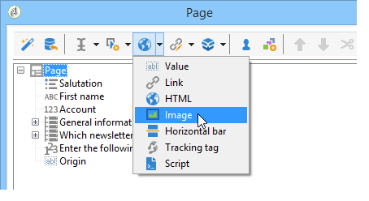

The following types of field are available:

* Value based on previously provided answers (in the context of the form) or on the database.
* Hypertext link, HTML, horizontal bar. See [Inserting HTML content](#inserting-html-content).
* Image saved in the resource library or on a server accessible by users. See [Inserting images](#inserting-images).
* Script executed on client side and/or server side. It must be written in JavaScript and be compatible with most browsers to ensure correct execution on the client side.

  >[!NOTE]
  >
  >On the server side, the script can use the functions defined in [Campaign JSAPI documentation](https://docs.adobe.com/content/help/en/campaign-classic/technicalresources/api/index.html).

## Insert HTML content {#inserting-html-content}

You can include HTML content in a form page: hypertext links, images, formatted paragraphs, videos, etc.

The HTML editor lets you enter the content to insert into the form page. To open the editor, click **[!UICONTROL Static elements]** > **[!UICONTROL HTML]** .

You can enter and format your content directly or display the source code window to paste in some external content. To switch to "source code" mode, click the first icon in the toolbar:


To insert a database field, use the personalization button.

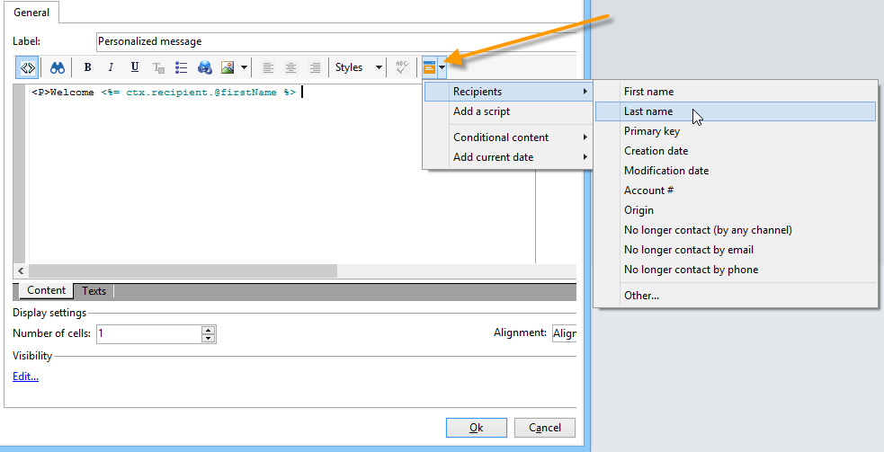

>[!NOTE]
>
>The strings entered in the HTML editor are only translated if they are defined in the **[!UICONTROL Texts]** sub-tab. Otherwise they will not be collected. For more on this, refer to [Translating a web form](translating-a-web-form.md).

### Insert a link {#inserting-a-link}

Fill in the fields in the editing window as shown in the following example:

To add a hypertext link, go to **[!UICONTROL Static elements]** > **[!UICONTROL Link]**.

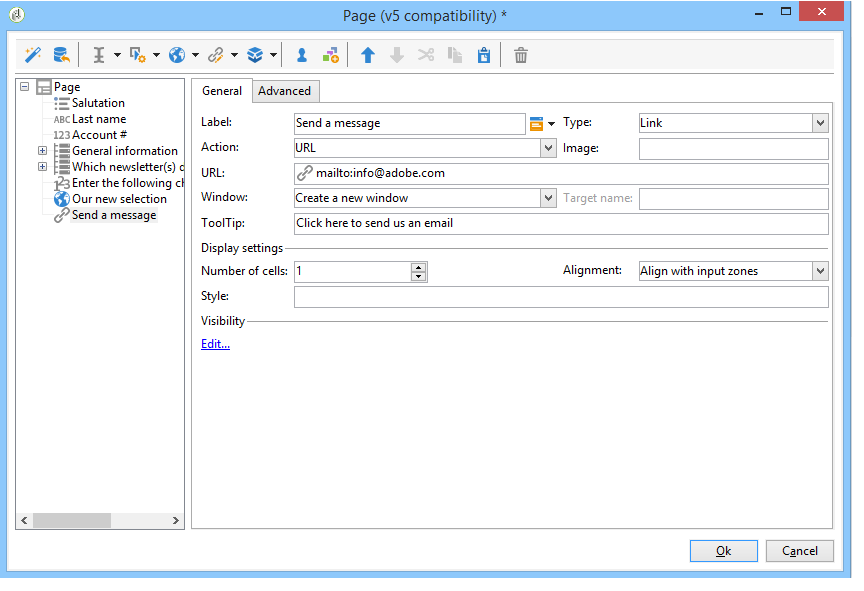

* The **[!UICONTROL Label]** is the content of the hypertext link as it will be displayed on the form page.
* The **[!UICONTROL URL]** is the desired address, e.g.: [https://www.adobe.com](https://www.adobe.com) for a website, or [info@adobe.com](mailto:info@adobe.com) to send a message.
* The **[!UICONTROL Window]** field lets you select the display mode for the link in the case of a site. You can decide to open the link in a new window, the current window, or another window.
* You can add a ToolTip, as shown below: 

  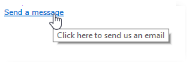

* You can choose to display the link as a button or an image. To do this, select the type of display in the **[!UICONTROL Type]** field.

### Types of links {#types-of-links}

By default, the links are associated with a URL-type action, so that a link destination address can be entered in the URL field.

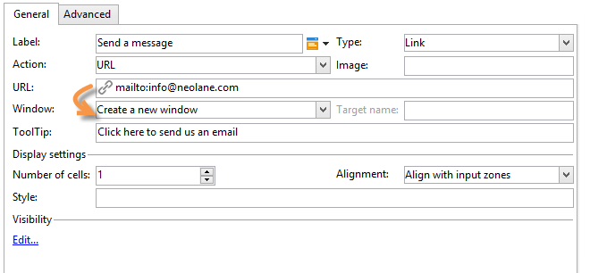

You can define other actions for the link, so that the user can click the link to do the following:

* Refresh the page

  To do this, select the **[!UICONTROL Refresh page]** option in the drop-down box of the **[!UICONTROL Action]** field.

  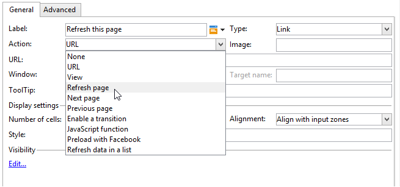

* Display the next/previous page

  To do this, select the **[!UICONTROL Next page]** or **[!UICONTROL Previous page]** option in the drop-down box of the **[!UICONTROL Action]** field. 

  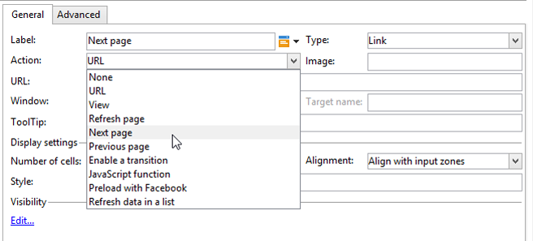

  You can hide the **[!UICONTROL Next]** and/or **[!UICONTROL Back]** buttons if they are to be replaced by a link. Refer to this [page](defining-web-forms-page-sequencing.md).

  The link will replace the **[!UICONTROL Next]** button used by default.

  

* Display another page

  The **[!UICONTROL Enable a transition]** option lets you display a specific page associated with the outgoing transition selected in the **[!UICONTROL Transition]** field.

  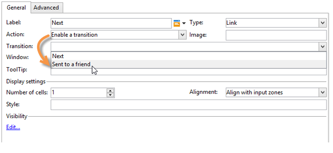

  By default, a page has only one output transition. To create new transitions, select the page and then click the **[!UICONTROL Add]** button in the **[!UICONTROL Output transitions]** section, as shown below:

  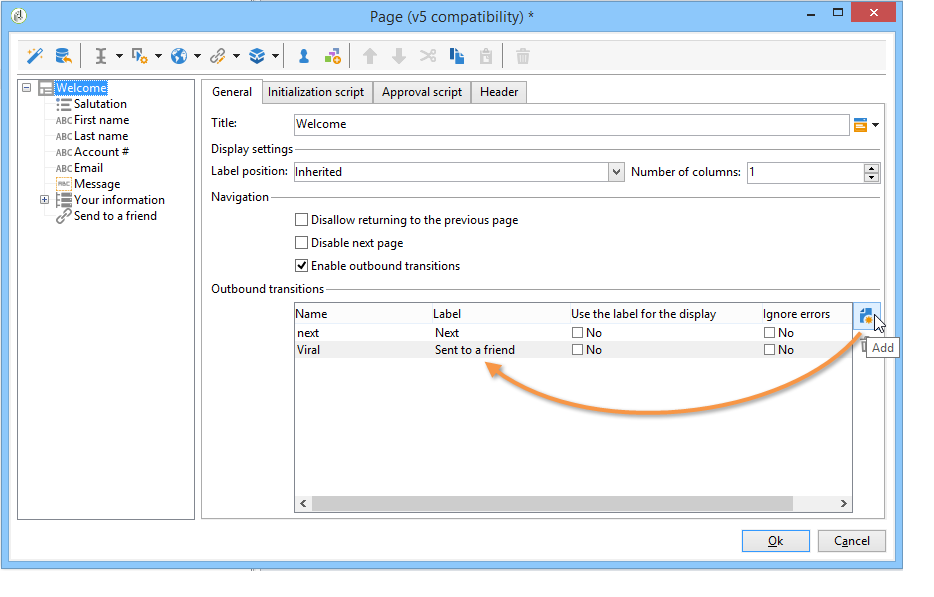

  In the diagram, this addition will look like this:

  

  >[!NOTE]
  >
  >For more on page sequencing in a Web form, refer to [Defining web forms page sequencing](defining-web-forms-page-sequencing.md).

### Personalize HTML content {#personalizing-html-content}

You can personalize the HTML content of a form page with data recorded in a previous page. For example, you can create a car insurance Web form whose first page lets you provide contact information and the brand of the car.


Use personalization fields to re-inject the user name and selected brand into the next page. The syntax to use depends on the information storage mode. For more on this, refer to [Using collected information](web-forms-answers.md#using-collected-information).

>[!NOTE]
>
>For security reasons, the value entered in the **`<%=`** formula is replaced with escaped characters.

In our example, the first and last name of the recipient are stored in a field of the database, while the brand of their car is stored in a variable. The syntax of the message personalized on page 2 will be as follows:

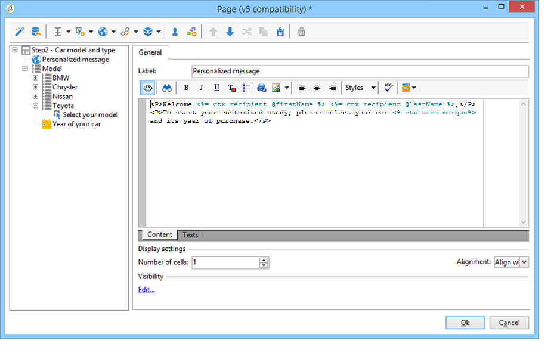

```
<P>Welcome <%= ctx.recipient.@firstName %> <%= ctx.recipient.@lastName %>,</P>
<P>To start your customized study, please select your car <%=ctx.vars.marque%> and its year of purchase.</P>
```

This produces the following result:


### Use text variables {#using-text-variables}

The **[!UICONTROL Text]** tab lets you create variable fields which can be used in the HTML between the <%= and %> characters with the following syntax: **$(IDENTIFIER)**.

Use this method to easily have your strings localized. See [Translating a web form](translating-a-web-form.md)

For example, you can create a **Contact** field that will enable you to display the "Date of last contact:" string to the HTML content. To do this, follow the steps below:

1. Click on the **[!UICONTROL Text]** tab of the HTML text.
1. Click the **[!UICONTROL Add]** icon.
1. In the **[!UICONTROL Identifier]** column, enter the name of the variable
1. In the **[!UICONTROL Text]** column, enter the default value.

   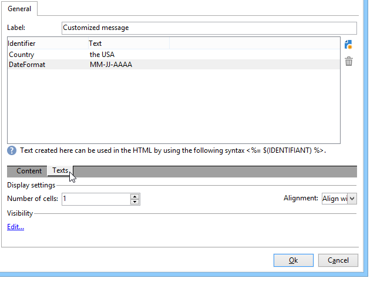

1. In the HTML content, insert this text variable via the **<%= $(Contact) %>** syntax.

   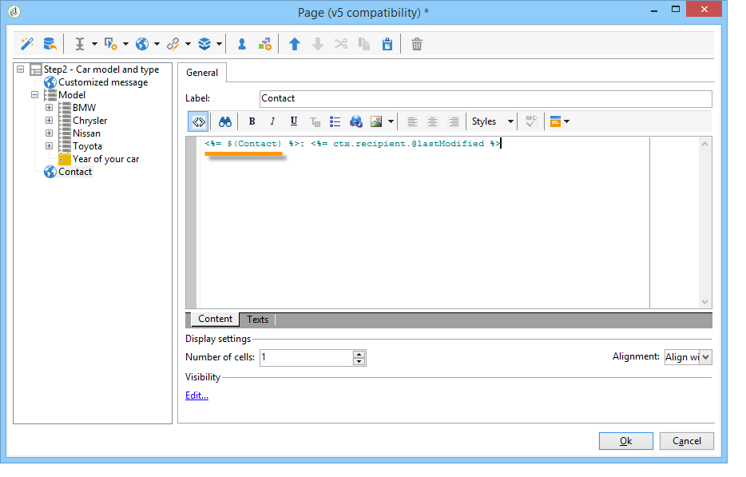

   >[!CAUTION]
   >
   >If you enter these characters in the HTML editor, the **<** and **>** fields will be replaced with their escaped characters. In this case, you need to correct the source code by clicking the **[!UICONTROL Display source code]** icon of the HTML text editor.

1. Open the **[!UICONTROL Preview]** label of the form to view the value entered in the HTML:

   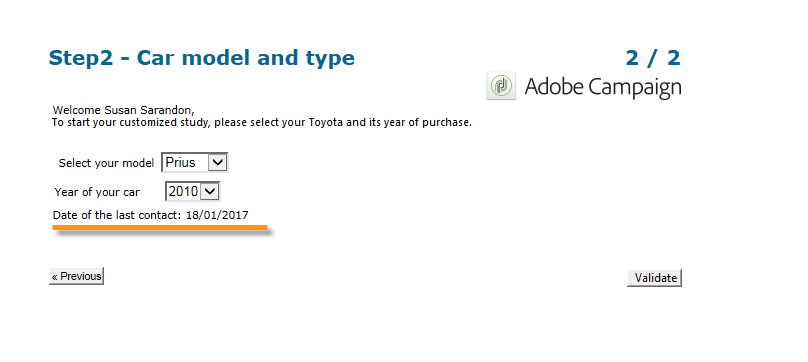

This operating mode lets you define the text of Web forms only once, and manage translations using the integrated translation tool. For more on this, refer to [Translating a web form](translating-a-web-form.md).

## Insert images {#inserting-images}

For images to be included in forms, they must be saved on a server that is accessible from outside.

Select the **[!UICONTROL Static elements]** > **[!UICONTROL Image]** menu.

Select the source of the image to be inserted: it can come from the public resource library or be stored on an external server accessible from outside.

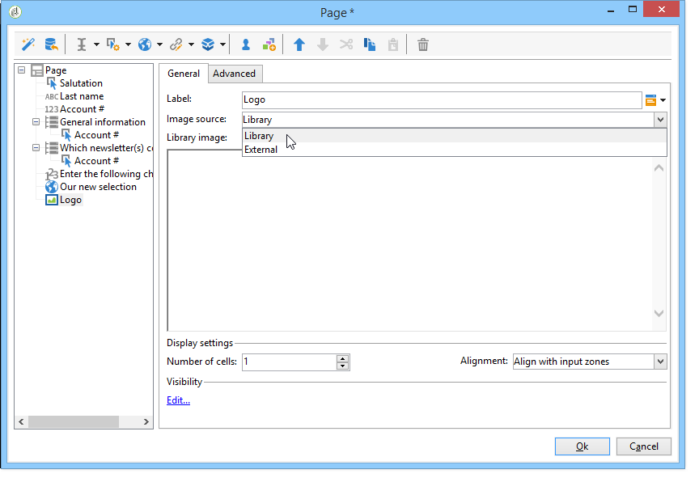

If this is an image from the library, select it in the combo-box of the field; if it is located in an external file, enter the access path. The label will be displayed by passing the cursor over the image (coincides with an ALT field in HTML), or when the image isn't displayed.

The image can be viewed in the central section of the editor.
