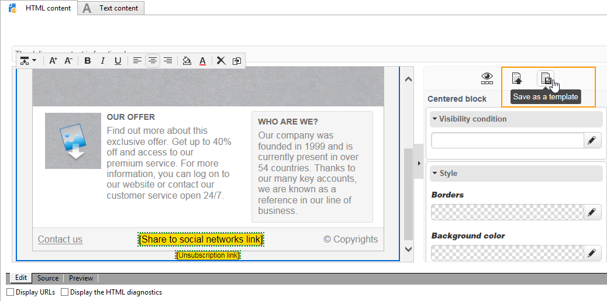

# Template management{#template-management}

The Digital Content Editor offers **standard templates** for Web applications and deliveries.

When creating a Landing Page type Web application, the user can choose one of these templates. You may also import an HTML template created outside of Adobe Campaign.

To add a template, refer to [Global options](content-editor-interface.md#global-options).

## Saving a delivery as a template {#saving-a-delivery-as-a-template}

After configuring a delivery, you can save it as a template in order to re-use it for future deliveries.

In the **Campaigns** tab, open the chosen delivery. Click on the **Save as template** button, name the template and then save.

The new template is saved under **Resources > Templates > Content templates** node in the explorer.
