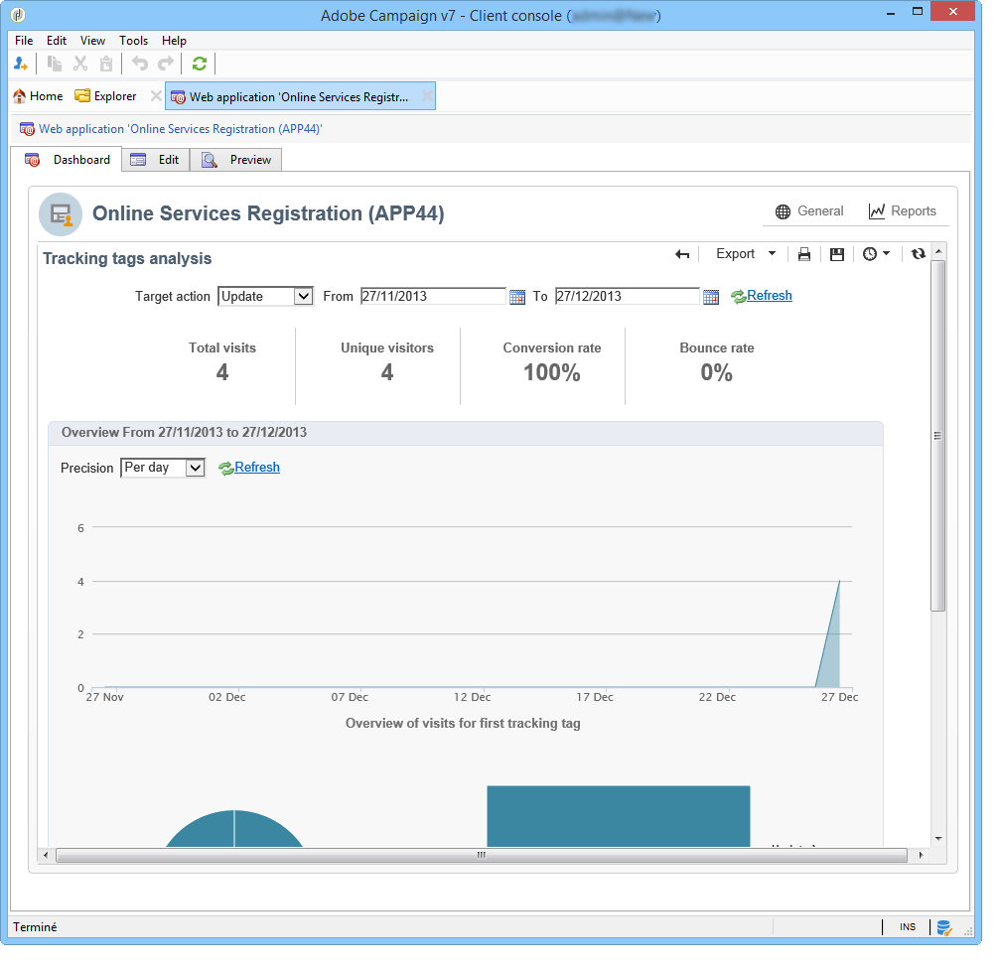
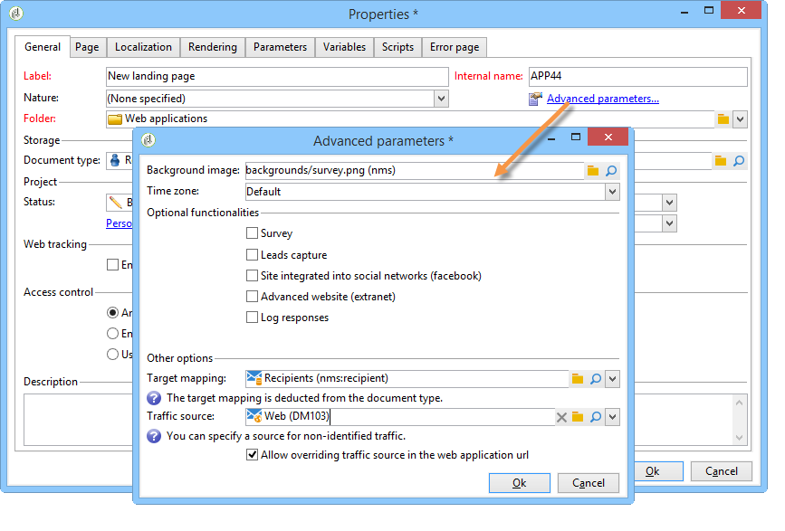
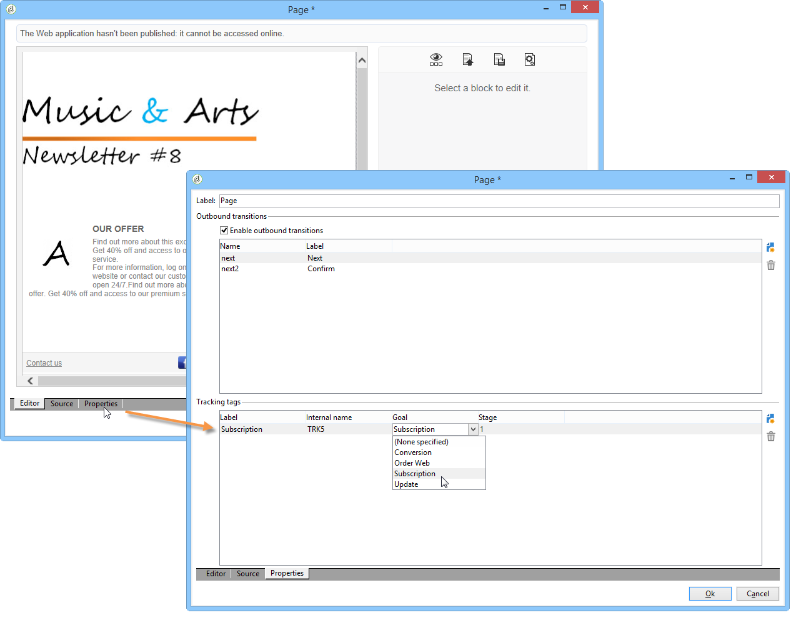
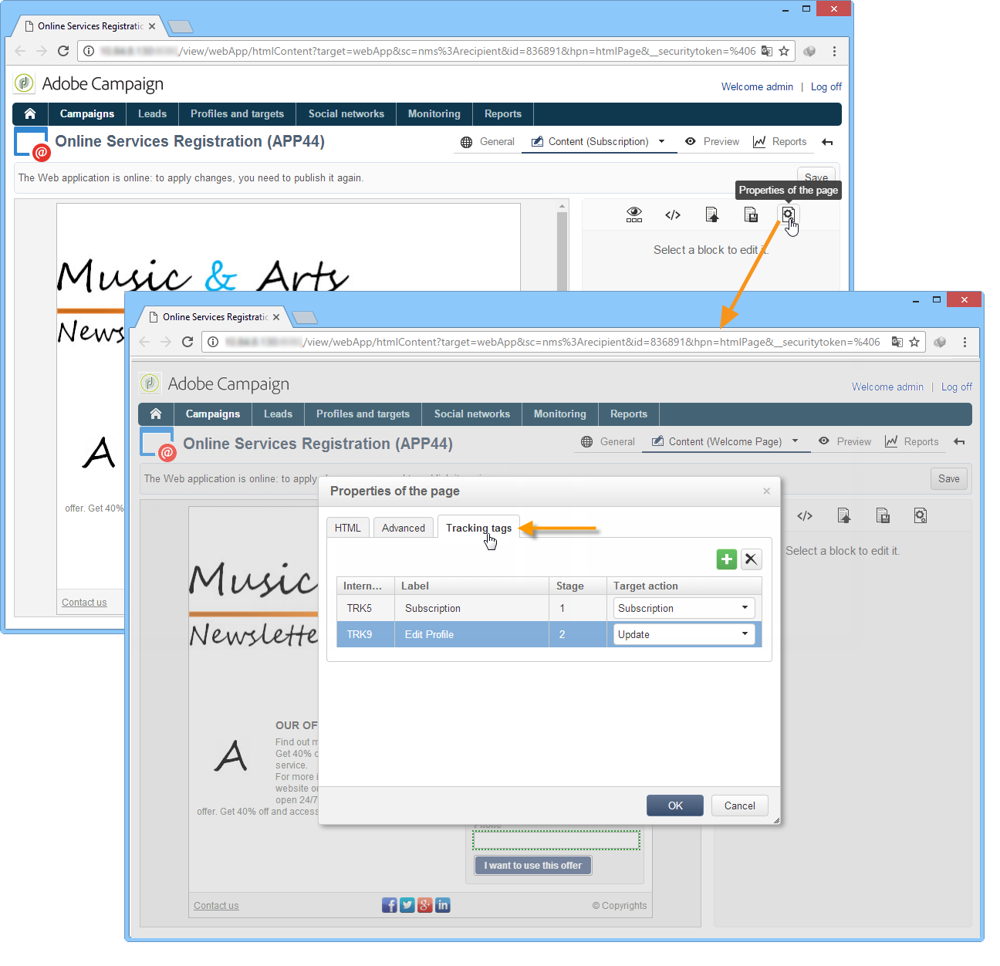

# Track visits on a web application{#tracking-a-web-application}

Adobe Campaign allows you to track and measure visits on Web application pages by inserting tracking tags. This functionality can be used for all Web application types (forms, Web pages, etc.).

Thus, you can define several navigation paths and assess their success. The data recovered is then available in the reports of each application.

The main improvements featured in this version are as follows:

* Possibility to insert several tracking tags on the same page in order to ease the navigation paths definition (e.g. purchase, subscription, return, etc.).
* Viewing navigation paths and tracking tags of the different pages in the Web application dashboard.

  

* Generating a full tracking report.

  

  The main indicators are as follows:

    * **Conversion rate**: number of persons who displayed all steps of a navigation path.
    * **Bounce rate**: number of persons who displayed the first step only 
    * **Conversion funnel**: loss rate between each step.

  In addition, a **Sector** type chart shows the population according to its source.

## Identifying the traffic source {#identifying-the-traffic-source}

Two different modes can be used to identify where the visitor comes from when accessing a Web application:

1. Sending a specific delivery to grant access to the Web application pages: in this case, the traffic source is this delivery,
1. Associating the Web application to a dedicated traffic source: in this case, it must be an external 'traffic source'-type delivery. It can be selected from the Web application properties or from the target mapping.

   

In order to identify the traffic source in a Web application, Adobe Campaign successively looks for the following information:

1. the source delivery identifier, if it exists (nlId cookie),
1. the identifier of the external delivery defined in the Web application properties, if it exists,
1. the identifier of the external delivery defined in the target mapping, if it exists.

>[!NOTE]
>
>Anonymous tracking is only available if the option has been activated in the deployment wizard when installing Campaign. 

## Web applications designed with Digital Content Editor (DCE) {#web-applications-designed-with-digital-content-editor--dce-}

When a Web application is created using the HTML content editor - **Digital Content Editor (DCE)** - tracking tags are inserted from the **[!UICONTROL Properties]** tab of the editor. For more information on the Digital Content Editor (DCE), refer to [this section](about-campaign-html-editor.md).

When using the Web interface, tracking tags must be inserted from the page properties.

The **[!UICONTROL Display blocks]** icon lets you view the number of tracking tags defined for the page.

