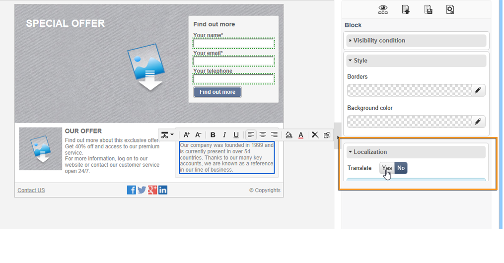
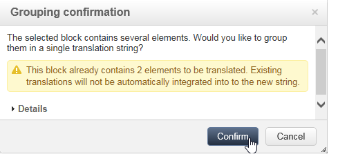
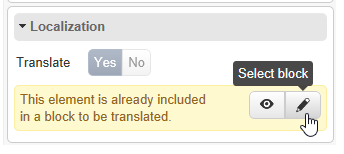

# Translating a web application{#translating-a-web-application}

You can translate Web application pages created with the Adobe Campaign Digital content editor (DCE).

If you select at least one additional language via the **[!UICONTROL Localization]** tab in the **[!UICONTROL Properties]** of a Web application, a new option becomes available when adding an HTML content block in a page edited with DCE.

This option lets you indicate if the block content has to be translated or not.

Strings to be translated are collected the same way as the other strings of the Web application, via the **[!UICONTROL Translations]** tab of the application. For more on this, refer to [this page](translating-a-web-form.md).

To flag the strings to be translated:

1. Open a content page edited with DCE in a Web application.

   

1. Select an HTML block.
1. In the parameters block on the right, the **[!UICONTROL Localization]** option lets you flag the content of the selected block. By default, only the page title is to be translated.

   

   >[!NOTE]
   >
   >Strings must not exceed 1023 characters.

   There are three specific cases:

    * When the selected block contains several strings/blocks, it is flagged as a single string to be translated. The string contains then the HTML code of the elements inside this block.
    * When you want to flag a block that contains several strings and if at least one of these strings is already flagged, a warning is displayed. You can then remove the flag from the isolated string and add the entire block.
    
      

    * When you want to remove the flag from a string contained in a block which is already flagged, you cannot directly modify the string translation option. However, you can access the block containing the string in order to change it.
    
      

1. Once you have finished flagging the strings, go back to the Web application and select the **[!UICONTROL Translations]** tab.
1. Select **[!UICONTROL Collect the strings to translate]**. The strings flagged in DCE are added to the Web application's strings.

   >[!NOTE]
   >
   >Once the strings have been collected, they will not be removed from the list if you remove the translation flag in DCE. This allows to keep them in the translation memory.

1. Translate and approve the strings.

   You can then preview the translations by selecting the desired language from the **[!UICONTROL Preview]** tab in the Web application.
