# Translating a web form{#translating-a-web-form}

It's possible to localize a Web application into several languages.

You can carry out translations directly in the Adobe Campaign console (refer to [Managing translations in the editor](#managing-translations-in-the-editor)), or export and import strings to externalize translation (refer to [Externalizing translation](#externalizing-translation)).

The list of translation languages available by default is detailed in [Changing forms display language](#changing-forms-display-language).

The Web application is designed in an editing language: this is the reference language used to enter labels and other content to be translated.

The default language is the language which the Web application will be displayed in if no language setting is added to its access URL.

>[!NOTE]
>
>By default, the editing language and the default language are the same as the console language.

## Choosing languages {#choosing-languages}

To define one or more translation languages, click the **[!UICONTROL Properties]** button of the Web application, then the **[!UICONTROL Localization]** tab. Click the **[!UICONTROL Add]** button to define a new translation language for the Web application.

>[!NOTE]
>
>This window also lets you change the default language and the editing language.


When you add translation languages for a Web application (or when the default language and the editing language are different), a **[!UICONTROL Translation]** sub-tab is added to the **[!UICONTROL Edit]** tab to manage translations.

Adobe Campaign includes a tool for translating and managing multi-lingual translations. This editor lets you view the strings to translate or approve, enter translations directly into the interface or import/export character strings to externalize translations.

## Managing translations in the editor {#managing-translations-in-the-editor}

### Collecting strings {#collecting-strings}

The **[!UICONTROL Translations]** tab lets you enter translations for the character strings that make up the Web application.

The first time you open this tab it won't contain any data. Click the **[!UICONTROL Collect the strings to translate]** link to update the strings in the Web application.

Adobe Campaign collects labels of fields and strings defined in the **[!UICONTROL Texts]** tabs of all static elements: HTML blocks, Javascript, etc. Static elements are detailed in [Static elements in a web form](static-elements-in-a-web-form.md).

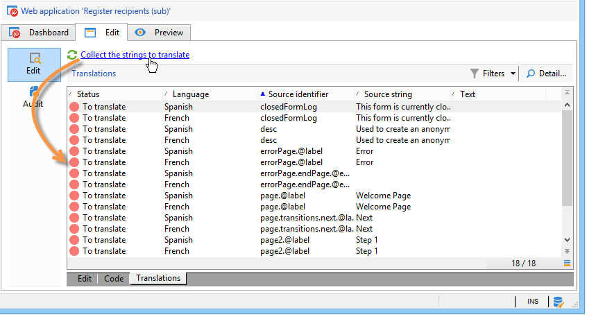

>[!CAUTION]
>
>This process can take several minutes depending on the volume of data to be processed.
> 
>If a warning appears to say that some translations are missing in the system dictionary, refer to [Translating the system strings](#translating-the-system-strings).

Each time a string is translated, its translation is added to the translation dictionary.

When the collection process detects that a translation already exists, this translation is displayed in the **[!UICONTROL Text]** column of the string. The status of the string is turned to **[!UICONTROL Translated]**.

For characters strings which have never been translated, the **[!UICONTROL Text]** field is empty and the status is **[!UICONTROL To translate]**.

### Filtering strings {#filtering-strings}

By default, each translation language of the Web application is displayed. There are two default filters: language and status. Click the **[!UICONTROL Filters]** button, then click **[!UICONTROL By language or status]** to display the matching drop-down boxes. You can also create an advanced filter. For more on this, refer to [this page](../../platform/using/creating-filters.md#creating-an-advanced-filter).

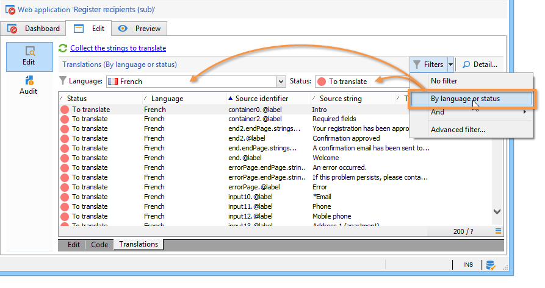

Go to the **[!UICONTROL Language]** drop-down box to select the translation language.

To display only untranslated strings, select **[!UICONTROL To translate]** in the **[!UICONTROL Status]** drop-down box. You can also display only translated or approved strings.

### Translating strings {#translating-strings}

1. To translate a word, double-click its line on the list of strings.

   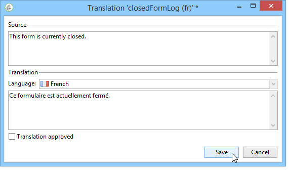

   The source string is displayed in the upper section of the window. 

1. Enter its translation in the lower section. To approve it, check the **[!UICONTROL Translation approved]** option.

   >[!NOTE]
   >
   >Translation approval is optional and will not block the process.

   Non-approved translations are displayed as **[!UICONTROL Translated]**. Approved translations are displayed as **[!UICONTROL Approved]**.

## Externalizing translation {#externalizing-translation}

It's possible to export and import character strings to translate them using a tool other than Adobe Campaign.

>[!CAUTION]
>
>Once you have exported the strings, don't carry out any translations using the integrated tool. This would lead to a conflict when you re-import the translations and these will be lost.

### Exporting files {#exporting-files}

1. Select the Web application(s) whose strings you want to export, right-click, then select **[!UICONTROL Actions > Export strings for translation...]** 

   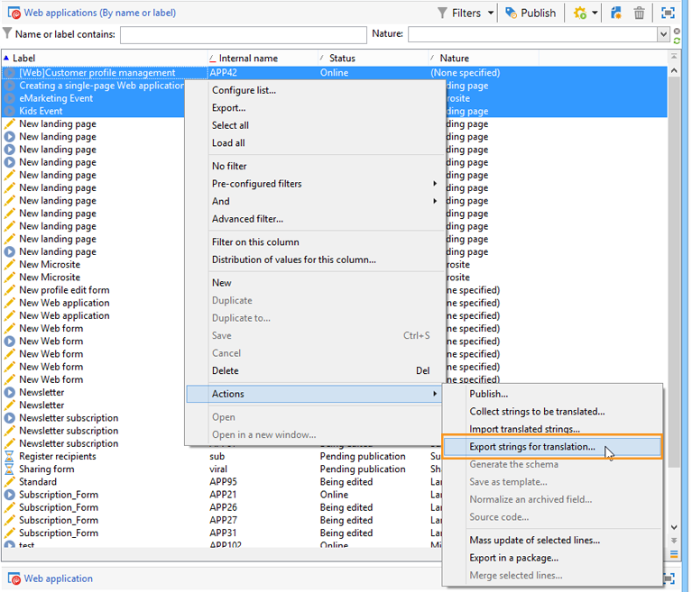

1. Select an **[!UICONTROL Export strategy]** :

    * **[!UICONTROL One file per language]**: the export will generate one file per translation language. Each file will be common to all selected Web applications.
    * **[!UICONTROL One file per Web application]**: the export will generate one file per selected Web application. Each file will contain all translation languages.

      >[!NOTE]
      >
      >This type of export is not available for XLIFF exports.

    * **[!UICONTROL One file per language and per Web application]**: the export will generate several files. Each file will contain one translation language per Web application.
    * **[!UICONTROL One file for all]**: the export will generate a single multi-lingual file for all Web applications. It will contain all translation languages for all selected Web applications.

      >[!NOTE]
      >
      >This type of export is not available for XLIFF exports.

1. Then chose the **[!UICONTROL Target folder]** where files will be recorded.
1. Select the file format ( **[!UICONTROL CSV]** or **[!UICONTROL XLIFF]** ) and click **[!UICONTROL Start]**.

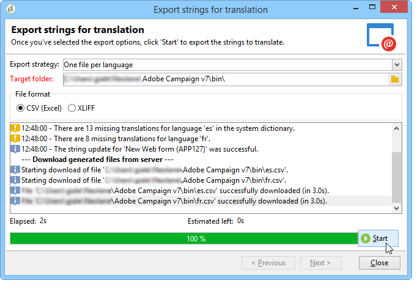

>[!NOTE]
>
>The names of export files are generated automatically. If you carry out the same export several times, you will replace existing files by the new ones. If you need to keep the previous files, change the **[!UICONTROL Target folder]** , then click **[!UICONTROL Start]** again to run the export.

When you export files in **CSV format**, each language is linked to a status and approval status. The **Approve?** column lets you approve a translation. This column may contain the values **Yes** or **No**. As for the integrated editor (refer to [Managing translations in the editor](#managing-translations-in-the-editor)), approving translations is optional and does not block the process.

### Importing files {#importing-files}

Once external translation is completed, you can import the translated files.

1. Go to the list of Web applications, right-click, then select **[!UICONTROL Actions > Import translated strings...]**

   >[!NOTE]
   >
   >There is no need to select the Web applications concerned by the translation. Place the cursor anywhere on the list of Web applications.

   

1. Select the file to import, then click **[!UICONTROL Upload]**.

   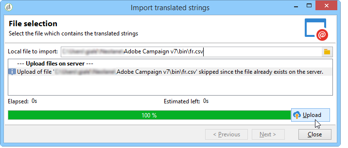

>[!NOTE]
>
>External translations always take priority over internal translations. In case of conflicts, the internal translation will be overwritten with the external translation.

## Changing forms display language {#changing-forms-display-language}

Web forms are displayed in the default language specified in the **[!UICONTROL Localization]** tab of the Web application properties. To change languages, you must add the following characters to the end of the URL (where **xx** is the symbol of the language):

  ```
  ?lang=xx
  ```

  if the language is the first or only parameter of the URL. For example: **https://myserver/webApp/APP34?lang=en**

  ```
  &lang=xx
  ```

  if there are other parameters before the language in the URL. For example: **https://myserver/webApp/APP34?status=1&lang=en**

The translation languages and dictionaries available by default are listed below.

**Default system dictionary**: some languages include a default dictionary which contains the translation of the system strings. For more on this, refer to [Translating the system strings](#translating-the-system-strings).

**Calendar management**: the pages of a Web application can include a calendar for entering dates. By default, this calendar is available in several languages (translation of days, date format).

<table> 
 <tbody> 
  <tr> 
   <td> <strong>Language (symbols)</strong><br /> </td> 
   <td> <strong>Default system dictionary</strong><br /> </td> 
   <td> <strong>Calendar management</strong><br /> </td> 
  </tr> 
  <tr> 
   <td> German (de)<br /> </td> 
   <td> yes<br /> </td> 
   <td> yes<br /> </td> 
  </tr> 
  <tr> 
   <td> English (en)<br /> </td> 
   <td> yes<br /> </td> 
   <td> yes<br /> </td> 
  </tr> 
  <tr> 
   <td> English (United States) (en_US)<br /> </td> 
   <td> </td> 
   <td> </td> 
  </tr> 
  <tr> 
   <td> English (United Kingdom) (en_GB)<br /> </td> 
   <td> </td> 
   <td> </td> 
  </tr> 
  <tr> 
   <td> Arabic (ar)<br /> </td> 
   <td> </td> 
   <td> </td> 
  </tr> 
  <tr> 
   <td> Chinese (zh)<br /> </td> 
   <td> </td> 
   <td> </td> 
  </tr> 
  <tr> 
   <td> Korean (ko)<br /> </td> 
   <td> </td> 
   <td> </td> 
  </tr> 
  <tr> 
   <td> Danish (da)<br /> </td> 
   <td> yes<br /> </td> 
   <td> yes<br /> </td> 
  </tr> 
  <tr> 
   <td> Spanish (es)<br /> </td> 
   <td> yes<br /> </td> 
   <td> yes<br /> </td> 
  </tr> 
  <tr> 
   <td> Estonian (et)<br /> </td> 
   <td> </td> 
   <td> </td> 
  </tr> 
  <tr> 
   <td> Finnish (fi)<br /> </td> 
   <td> </td> 
   <td> yes<br /> </td> 
  </tr> 
  <tr> 
   <td> French (fr)<br /> </td> 
   <td> yes<br /> </td> 
   <td> yes<br /> </td> 
  </tr> 
  <tr> 
   <td> French (Belgium) (fr_BE)<br /> </td> 
   <td> </td> 
   <td> </td> 
  </tr> 
  <tr> 
   <td> French (France) (fr_FR)<br /> </td> 
   <td> </td> 
   <td> </td> 
  </tr> 
  <tr> 
   <td> Greek (el)<br /> </td> 
   <td> </td> 
   <td> yes<br /> </td> 
  </tr> 
  <tr> 
   <td> Hebrew (he)<br /> </td> 
   <td> </td> 
   <td> </td> 
  </tr> 
  <tr> 
   <td> Hungarian (hu)<br /> </td> 
   <td> </td> 
   <td> yes<br /> </td> 
  </tr> 
  <tr> 
   <td> Indonesian (id)<br /> </td> 
   <td> </td> 
   <td> </td> 
  </tr> 
  <tr> 
   <td> Irish (ga)<br /> </td> 
   <td> </td> 
   <td> </td> 
  </tr> 
  <tr> 
   <td> Italian (it)<br /> </td> 
   <td> yes<br /> </td> 
   <td> yes<br /> </td> 
  </tr> 
  <tr> 
   <td> Italian (Italy) (it_IT)<br /> </td> 
   <td> </td> 
   <td> </td> 
  </tr> 
  <tr> 
   <td> Italian (Swiss) (it_CH)<br /> </td> 
   <td> </td> 
   <td> </td> 
  </tr> 
  <tr> 
   <td> Japanese (ja)<br /> </td> 
   <td> </td> 
   <td> </td> 
  </tr> 
  <tr> 
   <td> Latvian (lv)<br /> </td> 
   <td> </td> 
   <td> yes<br /> </td> 
  </tr> 
  <tr> 
   <td> Lithuanian (lt)<br /> </td> 
   <td> </td> 
   <td> </td> 
  </tr> 
  <tr> 
   <td> Maltese (mt)<br /> </td> 
   <td> </td> 
   <td> </td> 
  </tr> 
  <tr> 
   <td> Dutch (nl)<br /> </td> 
   <td> </td> 
   <td> yes<br /> </td> 
  </tr> 
  <tr> 
   <td> Dutch (Belgium) (nl_BE)<br /> </td> 
   <td> </td> 
   <td> </td> 
  </tr> 
  <tr> 
   <td> Dutch (Holland) (nl_NL)<br /> </td> 
   <td> </td> 
   <td> </td> 
  </tr> 
  <tr> 
   <td> Norwegian (Norway) (no_NO)<br /> </td> 
   <td> </td> 
   <td> yes<br /> </td> 
  </tr> 
  <tr> 
   <td> Polish (pl)<br /> </td> 
   <td> </td> 
   <td> yes<br /> </td> 
  </tr> 
  <tr> 
   <td> Portuguese (pt)<br /> </td> 
   <td> </td> 
   <td> yes<br /> </td> 
  </tr> 
  <tr> 
   <td> Portugese (Brazil) (pt_BR)<br /> </td> 
   <td> </td> 
   <td> </td> 
  </tr> 
  <tr> 
   <td> Portuguese (Portugal) (pt_PT)<br /> </td> 
   <td> </td> 
   <td> </td> 
  </tr> 
  <tr> 
   <td> Russian (ru)<br /> </td> 
   <td> </td> 
   <td> yes<br /> </td> 
  </tr> 
  <tr> 
   <td> Slovene (sl)<br /> </td> 
   <td> </td> 
   <td> </td> 
  </tr> 
  <tr> 
   <td> Slovak (sk)<br /> </td> 
   <td> </td> 
   <td> </td> 
  </tr> 
  <tr> 
   <td> Swedish (sv)<br /> </td> 
   <td> yes<br /> </td> 
   <td> yes<br /> </td> 
  </tr> 
  <tr> 
   <td> Swedish (Finland) (sv_FI)<br /> </td> 
   <td> </td> 
   <td> </td> 
  </tr> 
  <tr> 
   <td> Swedish (Sweden) (sv_SE)<br /> </td> 
   <td> </td> 
   <td> </td> 
  </tr> 
  <tr> 
   <td> Czech (cs)<br /> </td> 
   <td> </td> 
   <td> </td> 
  </tr> 
  <tr> 
   <td> Thai (th)<br /> </td> 
   <td> </td> 
   <td> </td> 
  </tr> 
  <tr> 
   <td> Vietnamese (vi)<br /> </td> 
   <td> </td> 
   <td> </td> 
  </tr> 
  <tr> 
   <td> Waloon (wa)<br /> </td> 
   <td> </td> 
   <td> </td> 
  </tr> 
 </tbody> 
</table>

>[!NOTE]
>
>To add other languages than those offered by default, refer to [Adding a translation language](#adding-a-translation-language)

## Example: displaying a Web application in several languages {#example--displaying-a-web-application-in-several-languages}

The following Web form is available in four languages: English, French, German and Spanish. The character strings have all been translated via the **[!UICONTROL Translation]** tab of the Web form. Because the default language is English, when the survey is published, use the standard URL to display it in English.

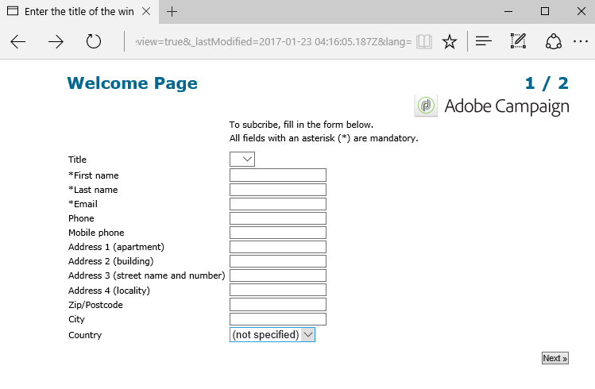

Add **?lang=fr** to the end of the URL to display it in French:

>[!NOTE]
>
>The list of symbols for each language is detailed in [Changing forms display language](#changing-forms-display-language).

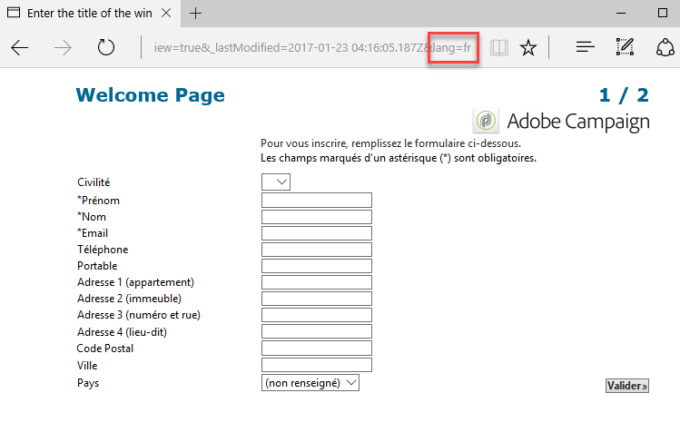

You can add **?lang=es** or **?lang=de** to display it in Spanish or German.

>[!NOTE]
>
>If other parameters are already used for this Web application, add **&lang=**.  
>For example: **https://myserver/webApp/APP34?status=1&lang=en**

## Advanced translation configuration {#advanced-translation-configuration}

>[!CAUTION]
>
>This section is only for expert users.

### Translating the system strings {#translating-the-system-strings}

System strings are out-of-the-box character strings used by all Web applications. For example: **[!UICONTROL Next]** , **[!UICONTROL Previous]**, **[!UICONTROL Approve]** buttons, **[!UICONTROL Loading]** messages, etc. By default, some languages contain a dictionary with translations for these strings. The list of languages is detailed in [Changing forms display language](#changing-forms-display-language).

If you translate your Web application into a language for which the system dictionary isn't translated, a warning message will appear to let you know that some translations are missing.

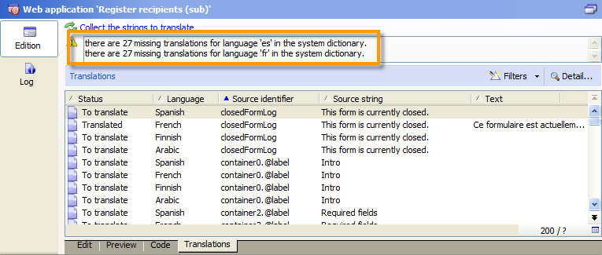

To add a language, apply the following steps:

1. Go to the Adobe Campaign tree and click **[!UICONTROL Administration > Configuration > Global dictionary > System dictionary]** .
1. In the upper section of the window, select the system string to translate, then click **[!UICONTROL Add]** in the lower section.

   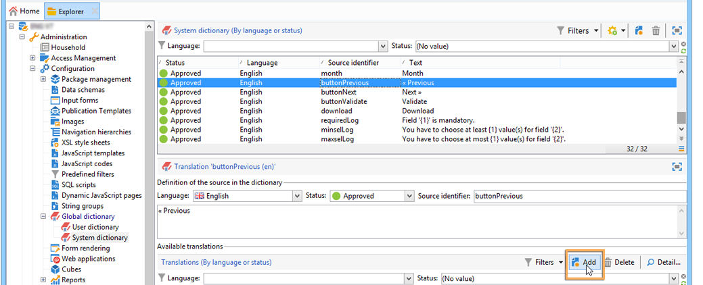

1. Select the translation language and enter a translation for the string. You can approve the translation by checking the **[!UICONTROL Translation approved]** option. 

   

   >[!NOTE]
   >
   >Translation approval is optional and will not block the process.

>[!CAUTION]
>
>Don't delete the out-of-the-box system strings.

### Adding a translation language {#adding-a-translation-language}

To translate Web applications into languages other than the default ones (refer to [Changing forms display language](#changing-forms-display-language)), you will need to add a new translation language.

1. Click the **[!UICONTROL Administration > Platform > Enumerations]** node of the Adobe Campaign tree and select **[!UICONTROL Languages available for translation]** from the list. The list of available translations is displayed in the lower section of the window. 

   

1. Click the **[!UICONTROL Add]** button, then enter the **[!UICONTROL Internal name]**, **[!UICONTROL Label]** and identifier of the image (flag). To add a new image, please contact your administrator.

   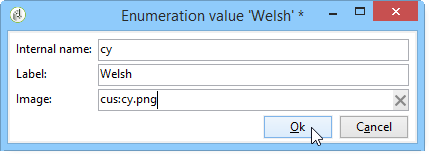
