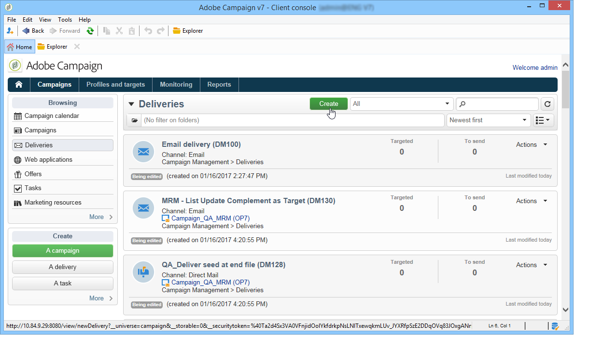
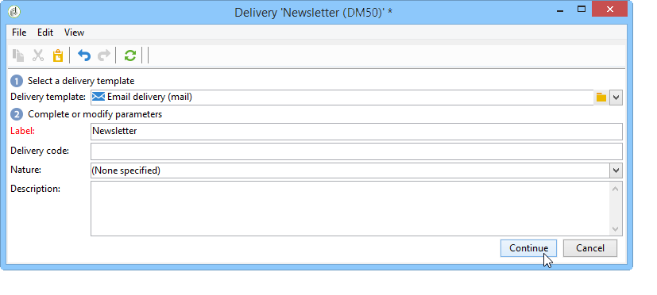
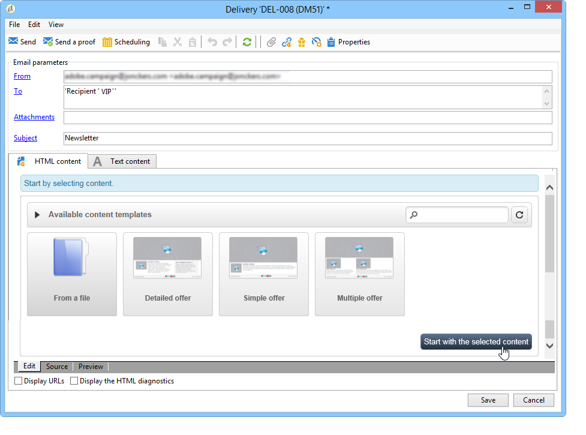
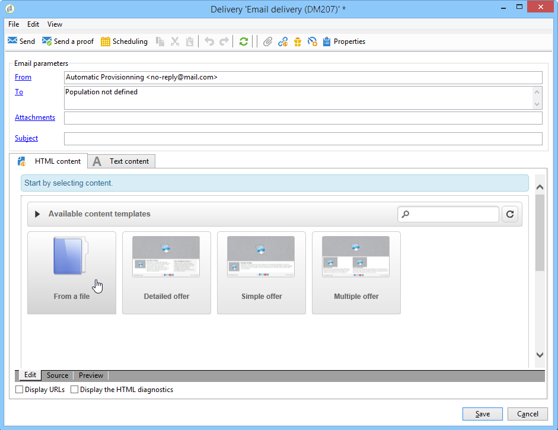
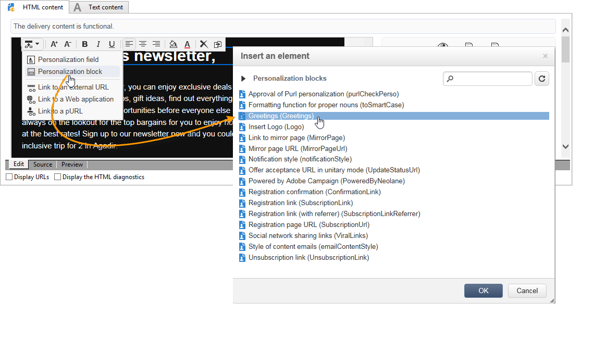
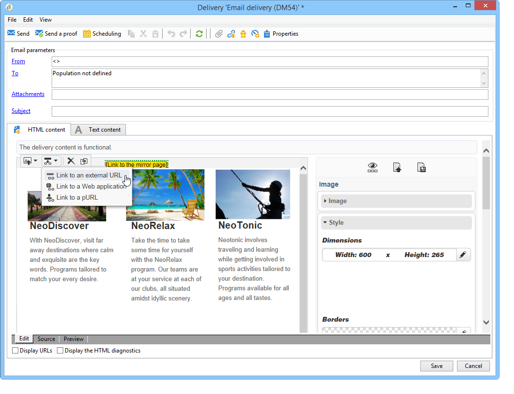
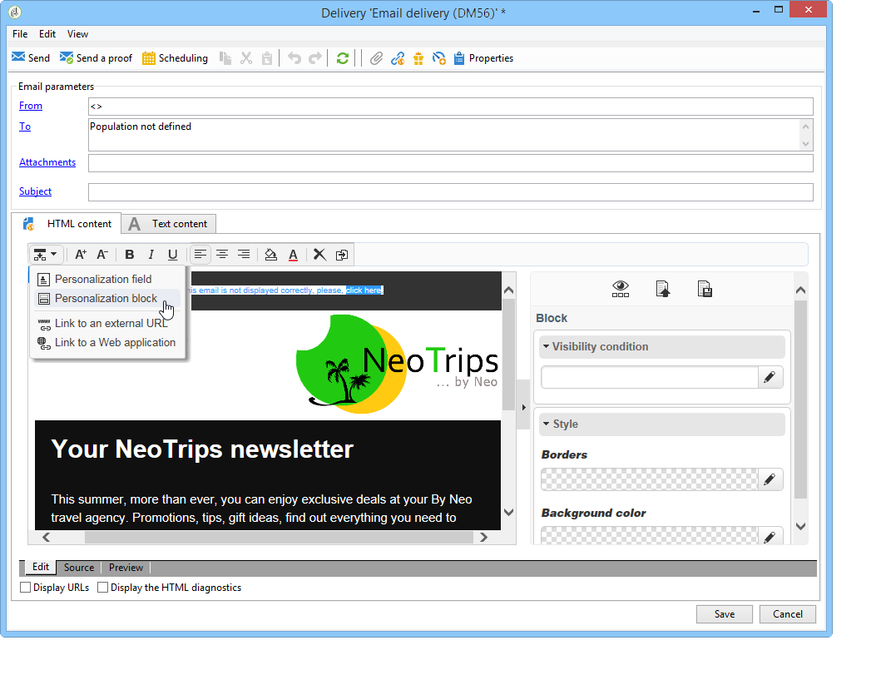
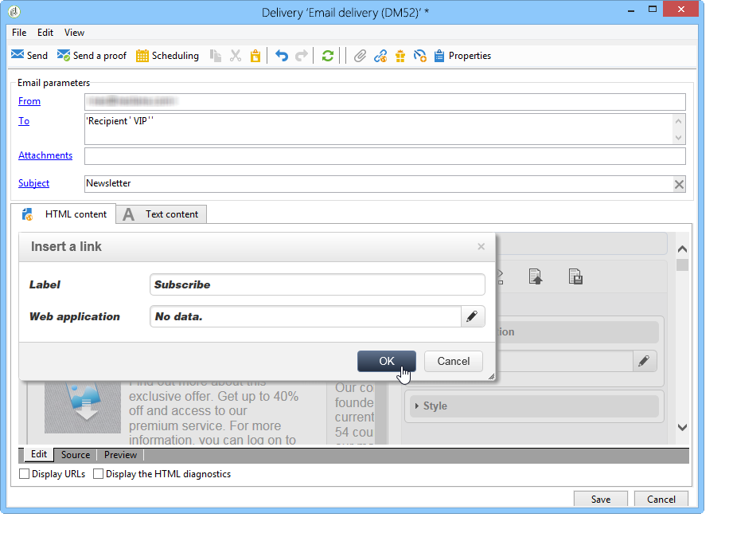

# Use case: creating an email delivery{#use-case-creating-an-email-delivery}

In this use case, you will learn steps to design an email delivery using Adobe Campaign Digital Content Editor (DCE).

Our final goal is to create a delivery with a personalized template which contains:

* A direct address for a recipient (using first and second names)
* Two types of links to an external URL
* A mirror page
* A link to a Web application

>[!NOTE]
>
>Before you start, you must have at least one **HTML template** configured to host the content of your future deliveries.
>
>In the delivery **[!UICONTROL Properties]**, make sure that the **[!UICONTROL Content editing mode]** (in the **[!UICONTROL Advanced]** tab) is set to **[!UICONTROL DCE]**. To ensure the editor's optimal operation, refer to the [Content editing best practices](content-editing-best-practices.md).

## Step 1 - Creating a delivery {#step-1---creating-a-delivery}

To create a new delivery, place your cursor in the **Campaigns** tab and click **Deliveries**. Next click the **Create** button above the list of existing deliveries. For more on creating deliveries, refer to [this page](../../delivery/using/about-email-channel.md).

## Step 2 - Selecting a template {#step-2---selecting-a-template}

Select a delivery template, then name your delivery. This name will only be visible to users of the Adobe Campaign console and not by your recipients, however this heading will be displayed in your list of deliveries. Click **[!UICONTROL Continue]**.

## Step 3 - Selecting a content {#step-3---selecting-a-content}

The Digital Content Editor comes with various out-of-the-box templates with varying structures (columns, text areas, etc.).

Select the content template that you want to use, then click the **[!UICONTROL Start with the selected content]** button to display the template in the created delivery.

You can also import an HTML content created outside of Adobe Campaign by selecting **[!UICONTROL From a file]**.

You can save this content as a template for future use. Once a personalized content template is created, you can preview it from the list of templates. For more on this, refer to [Template management](template-management.md).

>[!CAUTION]
>
>If you are using the **Adobe Campaign web interface**, you must import a .zip file containing the HTML content and related images.

## Step 4 - Designing the message {#step-4---designing-the-message}

* Display the first and second names of your recipients

  To insert the first and second names of your recipients into a text field in your delivery, click your chosen text field, then place your cursor where you want to display them. Click the first icon in the pop-up toolbar, then click **[!UICONTROL Personalization block]**. Select **[!UICONTROL Greetings]**, then click **[!UICONTROL OK]**.

  

* Insert a link into an image

  To take delivery recipients to an external address via an image, click on the relevant image to display the pop-up toolbar, place the cursor on the first icon then click **[!UICONTROL Link to an external URL]**. For more on this, refer to [Adding a link](editing-content.md#adding-a-link).

  

  Enter the URL for the link in the **URL** field using the following format **https://www.myURL.com**, then confirm.

  The link can be changed at any time using the section to the right of the window.

* Insert a link into text

  To integrate an external link into the text in your delivery, select some text or a block of text then click on the first icon in the pop-up toolbar. Click **[!UICONTROL Link to an external URL]**, enter the link address into the **[!UICONTROL URL]** field. For more on this, refer to [Adding a link](editing-content.md#adding-a-link).

  The link can be changed at any time using the section to the right of the window.

  >[!CAUTION]
  >
  >The text entered in the **[!UICONTROL Label]** field replaces the original text.

* Add a mirror page

  To allow your recipients to view your delivery content in a Web browser, you can integrate a link to a mirror page into your delivery.

  Click the text field in which you wish to see the link posted. Click the first icon in the pop-up toolbar, select **[!UICONTROL Personalization block]**, then **[!UICONTROL Link to Mirror Page (MirrorPage)]**. Click **[!UICONTROL Save]** to confirm.

  

  >[!CAUTION]
  >
  >The personalization block label automatically replaces the original text in your delivery.

* Integrate a link to a Web application

  The Digital Content Editor lets you integrate links to Web applications from your Adobe Campaign console, such as a landing page or a form page. For more on this, refer to [Link to a Web application](editing-content.md#link-to-a-web-application).

  Select a text field for your link to a Web application, then click the first icon. Choose **[!UICONTROL Link to a Web application]**, then select the desired application by clicking the icon at the end of the **Web Application** field.

  

  Click **Save** to confirm.

  >[!NOTE]
  >
  >This step requires you to save at least one Web application beforehand. These can be found in the **[!UICONTROL Campaigns > Web applications]** tab of your console.

## Step 5 - Saving the delivery {#step-5---saving-the-delivery}

Once the content is integrated, save the delivery by clicking **Save**. It will now be displayed in your list of deliveries, found in the **[!UICONTROL Campaigns > Deliveries]** tab.
