# Use cases: creating overviews{#use-cases-creating-overviews}

In the following example, we will create overview-type Web applications to display all the Web applications in your database. Configure the following elements:

* a filter on the folder (refer to [Adding a filter on a folder](../../web/using/use-cases--creating-overviews.md#adding-a-filter-on-a-folder)),
* a button for creating a new Web application (refer to [Adding a button to configure a new Web application](../../web/using/use-cases--creating-overviews.md#adding-a-button-to-configure-a-new-web-application)),
* detail display for each entry in the list (refer to [Adding detail to a list](../../web/using/use-cases--creating-overviews.md#adding-detail-to-a-list)),
* one filter per link editing tool (refer to [Creating a filter using a link editor](../../web/using/use-cases--creating-overviews.md#creating-a-filter-using-a-link-editor)), 
* a refresh link (refer to [Creating a refresh link](../../web/using/use-cases--creating-overviews.md#creating-a-refresh-link)).


## Creating a single-page Web application {#creating-a-single-page-web-application}

1. Create a single **Page** Web application and disable outbound transitions and transitions to the next page.

   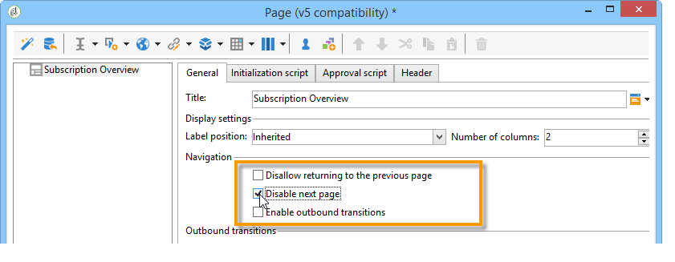

1. Changing the page title.

   This title will appear in the overview header and in the Web application overview.

1. In the Web application properties, modify the rendering of your application by selecting the **Single-page Web application** template.

   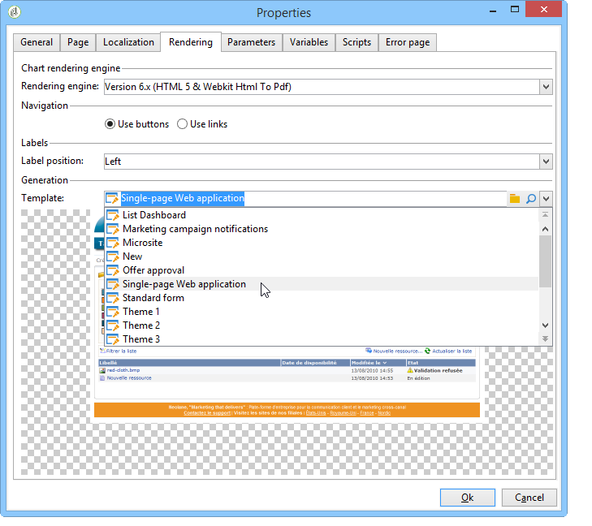

1. Open the **Page** activity of your Web application and open a list (**Static element > List**).
1. In the **Data** tab of your list, select the type of **Web applications** document and the **Label**, **Creation date** and **Type of application** output columns.
1. In the **Filter** sub-tab, create the following filter as shown below in order to display Web applications only and exclude templates from your view.

   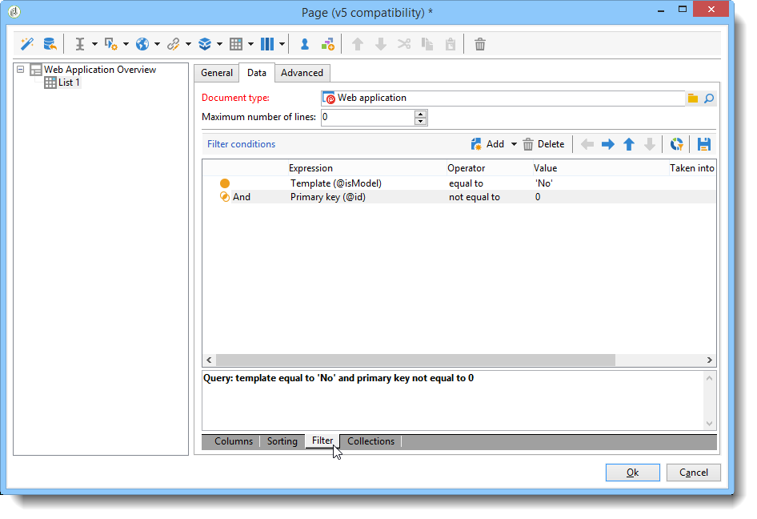

1. Close the configuration window of your page and click **Preview**.

   The list of Web applications available in your database is displayed.

   

## Adding a filter on a folder {#adding-a-filter-on-a-folder}

In an overview, you can choose to access data depending on its location in the Adobe Campaign tree. This is a filter on a folder. Apply the following process to add it to your overview.

1. Place your cursor on the **Page** node of your Web application and add a **Select folder** element (**Advanced controls > Select folder**).
1. In the **Storage** window which comes up, click the **Edit variables** link.
1. Change the variable label to suit your needs.
1. Change the variable name with the **folder** value.

   >[!NOTE]
   >
   >The name of the variable must match the name of the element linked to the folder (defined in the schema), i.e. **folder** in this case. You must re-use this name when you reference the table.

1. Apply the **XML** type to the variable.

   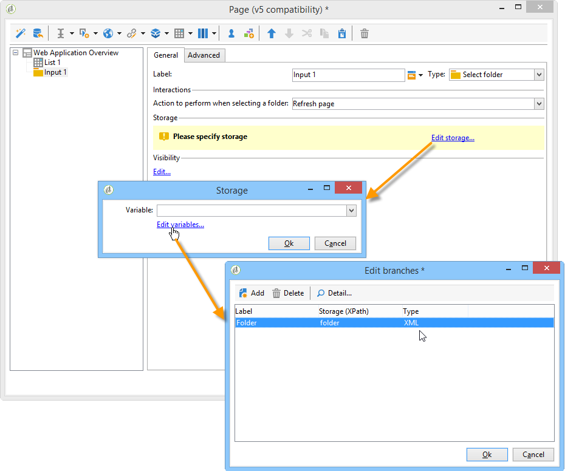

1. Select the **Refresh page** interaction.

   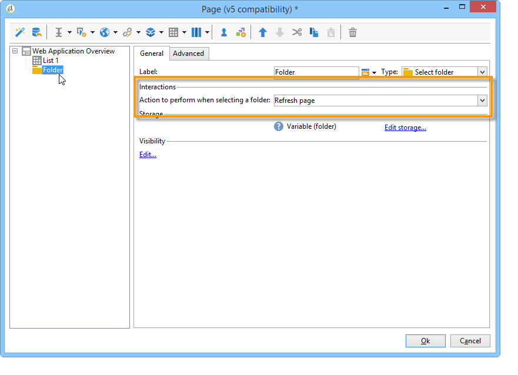

1. Place your cursor on your list, and in the **Advanced** tab, reference the variable previously created in the **Folder filter XPath** tab of the list. You must use the name of the element concerned by the folder link, i.e. **folder**.

   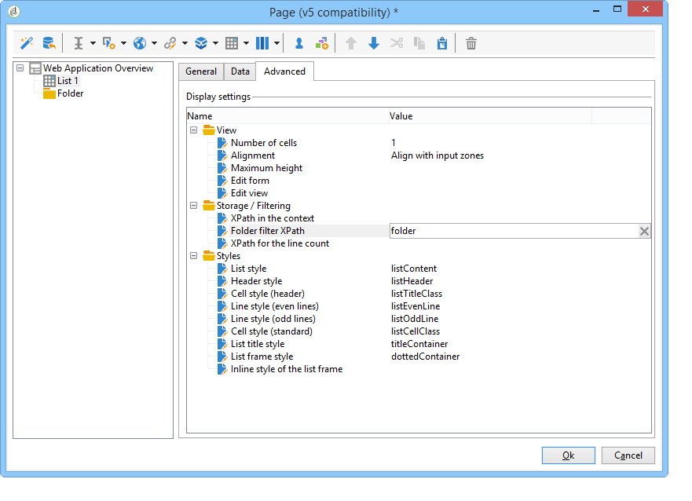

   >[!NOTE]
   >
   >At this stage, the Web application is not within its application context, the filter can therefore not be tested on the folder.

## Adding a button to configure a new Web application {#adding-a-button-to-configure-a-new-web-application}

1. Place your cursor on the **Page** element and add a link (**Static elements > Link**).
1. Modify the link label since it will appear on the button in the overview.

   In our example, the label is **New**.

1. Insert the following URL in the URL field: **xtk://open/?schema=nms:webApp&form=nms:newWebApp**.

   >[!NOTE]
   >
   >**nms:webApp** coincides with the Web application schema.  
   >**nms:newWebApp** coincides with the new Web application creation wizard.

1. Choose to display the URL in the same window.
1. Add the Web application icon in the image field: **/nms/img/webApp.png**.

   This icon will appear on the **New** button.

1. Enter **button** in the **Style** field.

   This style is referred to in the **Single-page Web application** template selected previously.

   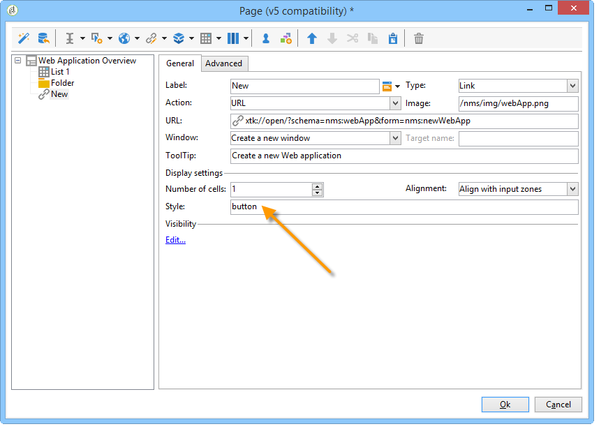

## Adding detail to a list {#adding-detail-to-a-list}

When you configure a list in your overview, you can choose to display additional details for each entry on your list.

1. Place your cursor on the previously created list element.
1. In the **General** tab, select the **Columns and additional detail** display mode in the drop-down list.

   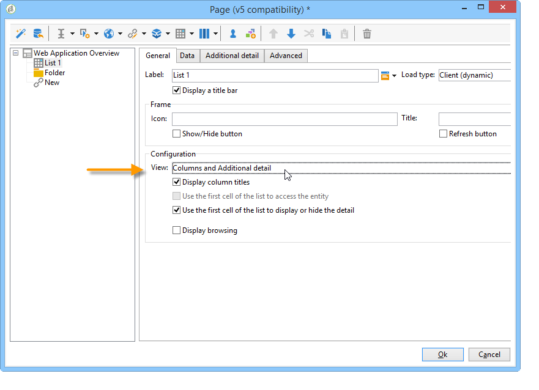

1. In the **Data** tab, add the **Primary key**, **Internal name** and **Description** column and select the **Hidden field** option for each one.

   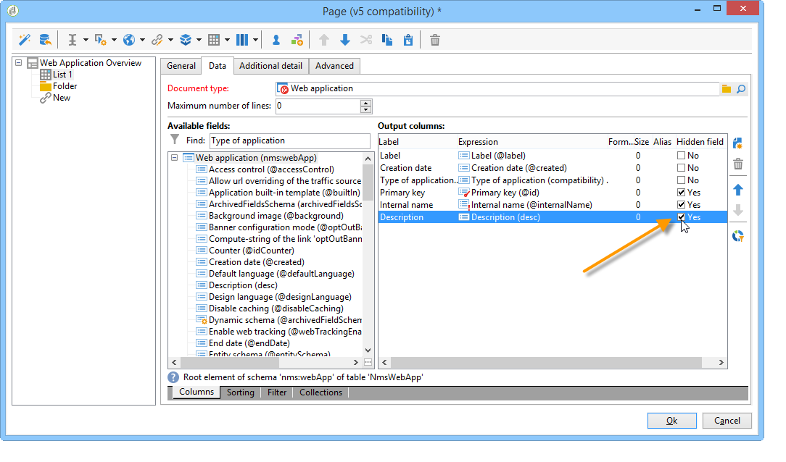

   This way, this information will only be visible in the detail of each entry.

1. In the **Additional detail** tab, add the following code:

   ```
   <div class="detailBox">
     <div class="actionBox">
       <span class="action"><a title="Open" class="linkAction" href="xtk://open/?schema=nms:webApp&form=nms:webApp&pk=
       <%=webApp.id%>">Open...</a></span>
       <% 
       if( webApp.@appType == 1 ) { //survey
       %>
       <span class="action"><a target="_blank" title="Reports" class="linkAction" href="/xtk/report.jssp?_context=selection&
         _schema=nms:webApp&_selection=<%=webApp.@id%>
         &__sessiontoken=<%=document.controller.getSessionToken()%>">Reports</a></span>
       <% 
       } 
       %>
     </div>
     <div>
       Internal name: <%= webApp.@internalName %>
     </div>
     <%
     if( webApp.desc != "" )
     {
     %>
     <div>
       Description: <%= webApp.desc %>
     </div>
     <% 
     } 
     %>
   </div>
   ```

>[!NOTE]
>
>JavaScript libraries take five minutes to refresh on the server. You can restart the server to avoid waiting for this delay.

## Filtering and updating the list {#filtering-and-updating-the-list}

In this section, you will create a filter for displaying the overview of Web applications created by a specific operator. This filter is created with a link editor. Once you have selected an operator, refresh the list to apply your filter; this requires creating a refresh link.

These two elements will be grouped in the same container in order to be graphically grouped in the overview.

1. Place your cursor on the **Page** element and select **Container > Standard**.
1. Set the number of columns to **2**, so that the link editor and the link are next to each other.

   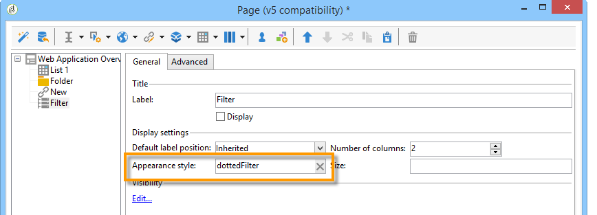

   For information on element layout, refer to [this section](../../web/using/about-web-forms.md).

1. Apply **dottedFilter**.

   This style is referred to in the **Single-page Web applicatio**n template selected previously.

   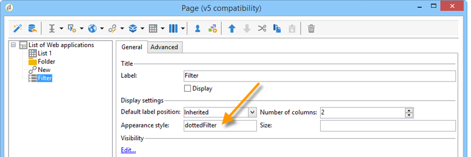

### Creating a filter using a link editor {#creating-a-filter-using-a-link-editor}

1. Place your cursor on the container created during the previous stage and insert a link editor via the **Advanced controls** menu.
1. In the storage window which opens automatically, select the **Variables** option, then click the **Edit variables** link and create an XML variable for filtering data.

   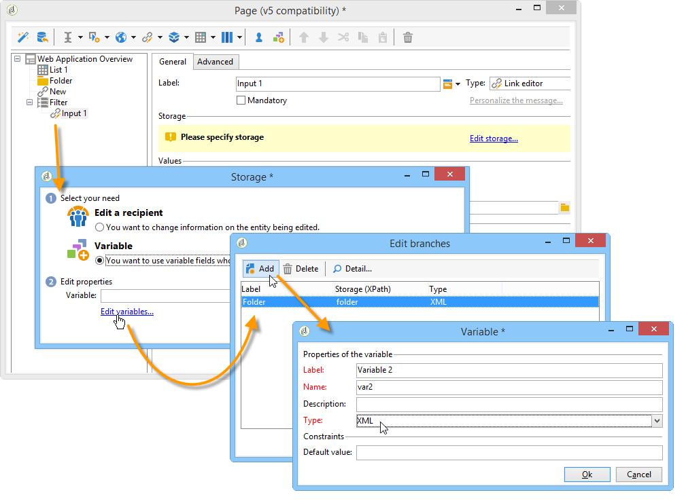

1. Modify the label.

   It will appear next to the **Filter** field in the overview.

1. Choose the Operator table as an application schema.

   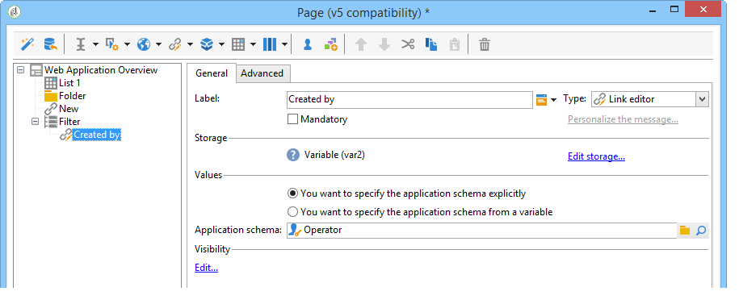

1. Place your cursor on the list element and create a filter via the **Data > Filter** tab:

    * **Expression:** Foreign key of the 'Created by' link
    * **Operator:** equals to
    * **Value:** Variables (variables)
    * **Taken into account if:** '$(var2/@id)'!=''

   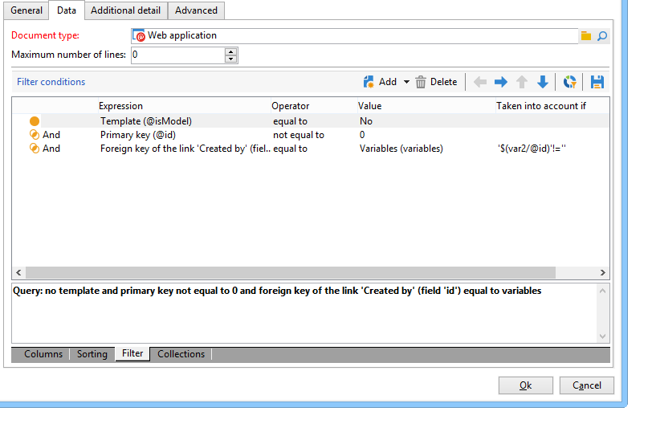

>[!CAUTION]
>
>The Web application user must be an identified operator with the appropriate Adobe Campaign rights to access the information. This type of configuration will not work for anonymous Web applications.

### Creating a refresh link {#creating-a-refresh-link}

1. Place the cursor on the container and insert a **Link** via the **Static elements** menu.
1. Modify the label.
1. Select **Refresh data in a list**.
1. Add the previously created list.

   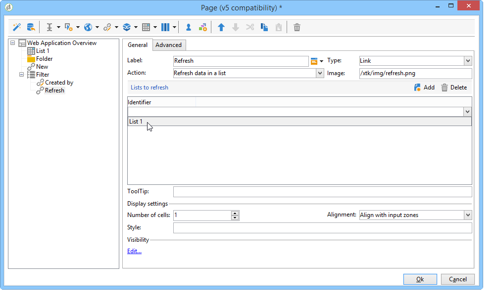

1. Add the refresh icon on the **Image** field: **/xtk/img/refresh.png **.
1. Using the sort-order arrows, reorganize the various elements of your Web application as shown below.

   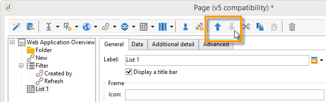

The Web application is now configured. You can click the **Preview** tab to preview it.

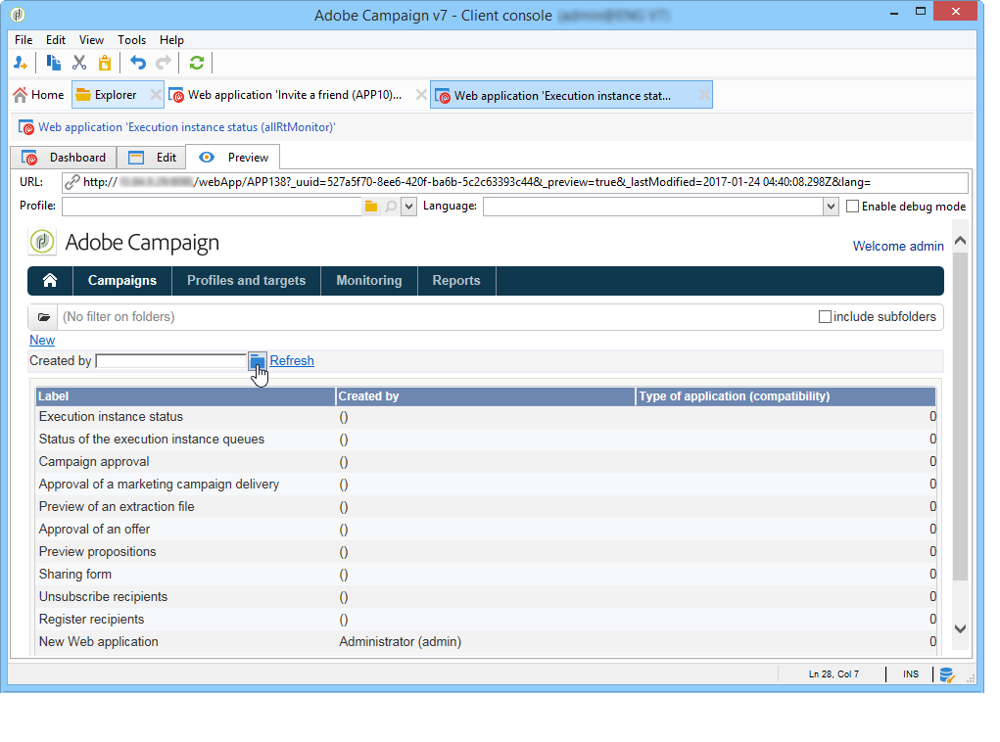

