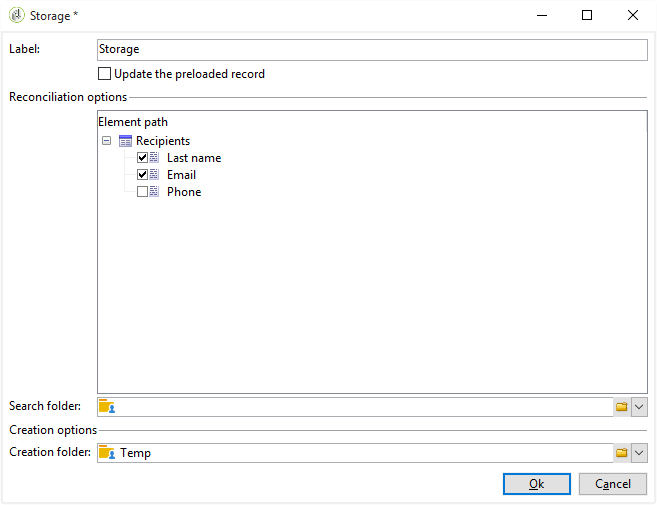

# Use cases: web forms{#use-cases-web-forms}

## Create a subscription form with double opt-in {#create-a-subscription--form-with-double-opt-in}

When you offer information services, recipients need to subscribe to receive all linked communications. To avoid improper communications and make sure the recipient subscribed intentionally, we recommend sending a subscription confirmation request to create a double opt-in. The subscription will only be effective once the user clicks the link included in the confirmation message.

This example is based on the following scenario:

1. Creating a newsletter subscription form on a website that contains a checkbox for subscribing to a temporary service. This service will enable you to deliver subscription confirmation messages.
1. Creating the subscription confirmation delivery with a delivery template linked to the Web form. It contains the confirmation link that calls up the form for newsletter subscription and displays a subscription approval message.

### Step 1 - Creating information services {#step-1---creating-information-services}

1. Create the newsletter subscription service to be offered to your recipients. For more information on how to create a newsletter, refer to [this section](../../delivery/using/about-services-and-subscriptions.md).

   

1. Create a second information service, a temporary service linked to a delivery template for sending subscription confirmation messages.

   

### Step 2 - Creating confirmation messages {#step-2---creating-confirmation-messages}

Confirmation messages are sent via a dedicated delivery template referenced at the temporary service level.

1. In the **[!UICONTROL Explorer]** , select **[!UICONTROL Resources > Templates > Delivery templates]**.
1. Create a delivery template for sending the subscription confirmation messages. 
1. Click the **[!UICONTROL To]** button in the **[!UICONTROL Email parameters]** to associate the delivery template with the Subscriptions target mapping instead of Recipients.

   

1. Since the recipients of this delivery haven't confirmed their approval, they are still on the database denylist. For them to receive this communication, you need to authorize deliveries based on this template to target recipients on denylist.

   To do this, click the **[!UICONTROL Exclusions]** tab.

1. Click the **[!UICONTROL Edit...]** link and uncheck the **[!UICONTROL Exclude recipients who no longer want to be contacted]** option.

   <!-- -->

   >[!IMPORTANT]
   >
   >This option may only be disabled in this type of context.

1. Personalize your delivery and insert the confirmation link into the message content. This link lets you access the Web form to record subscription confirmation.

   

1. With the DCE, link your URL to the Web form. Since the Web form is not yet created, replace the value as soon as you create it.

   

1. Finally, link this template to the temporary service previously created.

   

### Step 3 - Creating the subscription form {#step-3---creating-the-subscription-form}

The Web form enables both recipient subscription and subscription confirmation.

The Web form workflow will include the following activities:


To do this, follow the steps below:

1. Create a Web form and choose the template **[!UICONTROL Newsletter subscription (subNewsletter)]**.

   

1. In the **[!UICONTROL Edit]** tab, we need to configure the existing workflow since we want to add a confirmation message to the recipients who want to subscribe.

   To do so, double-click the **[!UICONTROL Preloading]** box and configure it as follows. 

   

   This means that if the user accesses this form via the link in the confirmation message, their profile information will be loaded. If they access the Web form via a page of the website, no information will be loaded.

1. Add a **[!UICONTROL Test]** activity to your workflow.

   

   The **[!UICONTROL Test]** activity can concern the recipient email. In this case, configure it as follows:

   

1. Add two **[!UICONTROL Script]** activities to your workflow.

   

   The first **[!UICONTROL Script]** activity will add recipients on denylist until they confirmed their subscription to the newsletter. Its content must be as follows:

   ```
   ctx.recipient.@blackList=1
   ```

   

   The second **[!UICONTROL Script]** activity authorizes deliveries to be send to the users and subscribes them to the newsletter. The last two lines of the script will allow you to transfer your recipients from the temp folder to another folder and be reconciled with existing profiles as soon as they confirmed the subscription.

   ```
   ctx.recipient.@blackList=0
   nms.subscription.Subscribe("INTERNAL_NAME_OF_THE_NEWSLETTER", ctx.recipient, false)
   ctx.recipient.folder = <folder name="nmsRootRecipient"/>
   nms.subscription.Unsubscribe("TEMP", ctx.recipient)
   
   ```

   >[!NOTE]
   >
   >The **[!UICONTROL Temp]** partition can also be purged on a regular basis using a workflow.

   

1. Double-click the **[!UICONTROL Subscription]** activity to personalize the subscription form and link a checkbox with the temporary service previously created.

   

1. Configure the **[!UICONTROL Storage]** activity to save the information entered in the form page.

   This activity lets you create recipient profiles in a dedicated temporary folder to set them apart from the profiles in the database, whom communications can be sent to.

   

   >[!NOTE]
   >
   >You must not define any reconciliation options.

1. Add two **[!UICONTROL End]** activities to display a message for the user.

   The second **[!UICONTROL End]** box will display the confirmation message once the subscription is complete.

   

1. Once the Web form is created and configured, you can now reference it in the delivery template to send confirmation messages.

   

### Step 4 - Publishing and testing the form {#step-4---publishing-and-testing-the-form}

You can now publish the form to make it accessible to users.


Subscription to the newsletter involves the following steps:

1. The user of the website logs on to the subscription page and approves the form.

   

   They are notified via a message in their browser that their request has been taken into account.

   

   The user is added to the Adobe Campaign database in the **[!UICONTROL Temp]** folder, and their profile is on denylist until they confirm their subscription with the email.

   

1. A confirmation message including a link for approving their subscription is sent to them.

   

1. When they click this link, the approval page is displayed in their browser.

   

   In Adobe Campaign, the user profile is updated:

    * they are no longer on denylist,
    * they are subscribed to the information service.
    
      

## Displaying different options depending on the selected values {#displaying-different-options-depending-on-the-selected-values}

In the following example, the user is asked to select a type of vehicle. You can display the available vehicle categories according to the type selected. This means that the items displayed in the right-hand column depend on the user's selection:


* When the user selects 'private vehicle', the choice between "Compact" and "Minivan" is offered.

  

* When the user selects 'commercial vehicle', a selection is displayed in a drop-down list: 

  

In this example, the vehicle type is not stored in the database. The drop-down list is configured as follows: 


This information is stored in a local variable.

The right-hand column's conditional display is configured in the containers: 


* Conditional visibility of fields for a private vehicle:

  

* Conditional visibility of fields for a commercial vehicle:

  
