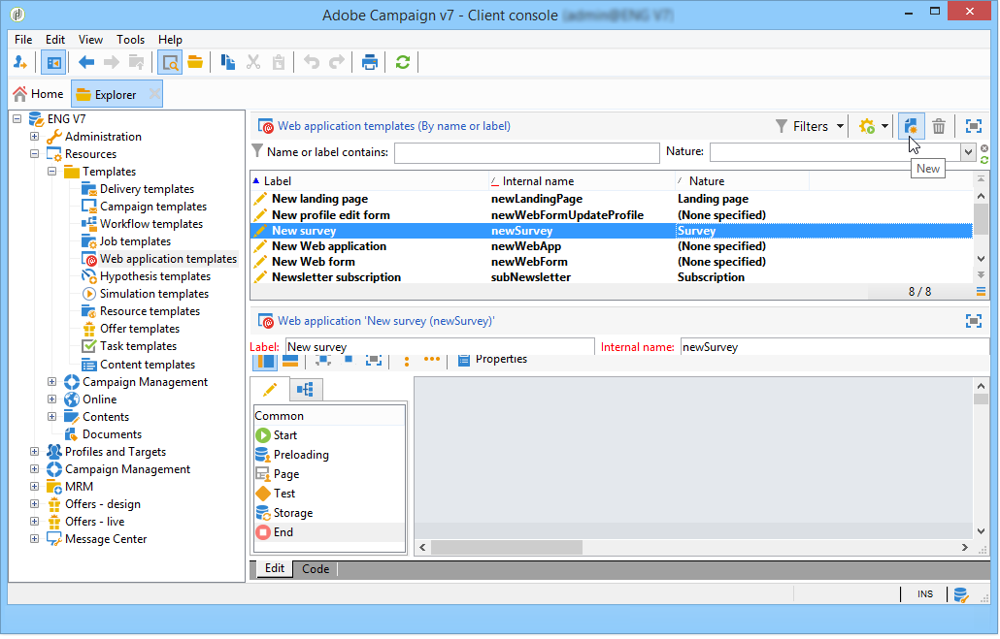
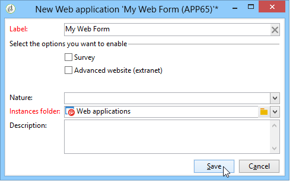

# Using a web form template{#using-a-web-form-template}

Form templates are re-usable configurations which let you create new forms. By default, form templates are stored with Web application templates in the **[!UICONTROL Resources > Templates > Web application templates]** node.

From here you can either create new templates or convert an existing form into a template.

## Convert an existing form into a template {#convert-an-existing-form-into-a-template}

A form can be changed into a template and its configuration re-used. To do this, select the form, right-click and select **[!UICONTROL Actions > Save as template...]**.

This action opens the window for creating Web applications. You can enter the name and description of the template and select the folder where it will be saved.

## Create a new form template {#create-a-new-form-template}

To create a Web form template, right-click the list of Web application templates and select **[!UICONTROL New]**. You can also use the **[!UICONTROL New]** button above the list of templates.

Enter the name of the template. In the **[!UICONTROL Instance folder]** field, select the folder where the Web forms created based on this template are saved. The **[!UICONTROL Nature]** field lets you add descriptive information to sort and/or filter your various Web application templates. 

Click the **[!UICONTROL Save]** button to create the template, then build the content of this template and define its parameters.

You may now select this template when creating a new form.
