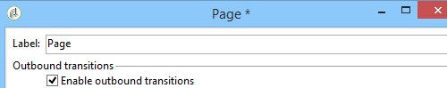
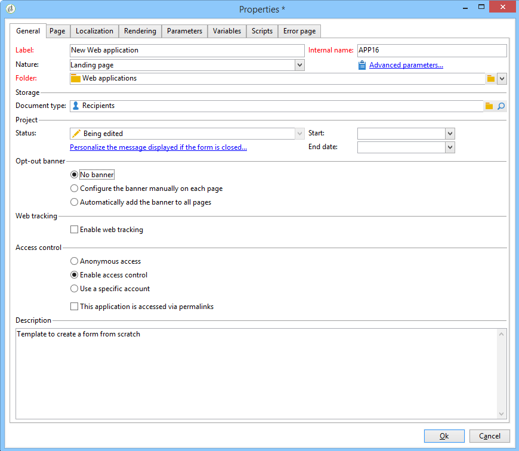

# Web application tracking opt-out{#web-application-tracking-opt-out}

Adobe Campaign enables you to stop tracking web behaviors of end-users who opt-out of behavioral tracking via cookies or web beacons. The feature includes the ability to display a banner to present the end-user with that option; you may add these banners into web applications or landing pages.

If an end-user opts-out of behavioral tracking via cookies or web beacons, then that information is transmitted to the Adobe Campaign tracking server with JavaScript APIs. Please note that some jurisdictions may require that Customer present end-users with an opt-in before an opt-out can be offered (or have other legal requirements), and it is Customer’s responsibility to comply with applicable laws.

>[!NOTE]
>
>When scripting always follow the guidelines described in the [Security and Privacy checklist](https://helpx.adobe.com/campaign/kb/acc-security.html#dev).

## Configuring the banner {#configuring-the-banner-}

To be displayed within Web applications or Landing pages, the banner needs to be configured.

Adobe Campaign is delivered with a sample banner that you must adapt to your needs. This banner version appears as a personalization block located in the content model folder. Refer to [this page](../../delivery/using/personalization-blocks.md).

>[!IMPORTANT]
>
>To create your own banner, you must personalize the out-of-the-box banner.

To activate the banner, you have to configure the Web application properties. Refer to the [Designing a web application](designing-a-web-application.md) section.

If the Web tracking is activated, you can either have:

* No banner.
* Configure the banner manually on each page: check this option and select the banner in each page in the page properties.

  

* Automatically add the banner to all pages: select the banner directly in the Web application properties.

  

>[!NOTE]
>
>A compatibility mode is available for the v5 Web application with the same behavior.

The default banner has the following structure:

```

<div onClick="NL.ClientWebTracking.closeOptOutBanner(this);" id="defaultOptOutBanner">
  <p>Please insert your message here
   <a onClick="NL.ClientWebTracking.allow();" class="optout-accept">Accept</a>
   <a onClick="NL.ClientWebTracking.forbid();" class="optout-decline">Refuse</a>
  </p>
</div>
      
```

You must replace the **Please insert your message here** with the block containing your tracking information. This replacement should be executed in your new personalization block related to the Opt-out banner.

The banner is delivered with a specific CSS. However, you can overwrite the styles when creating and configuring a webpage. Refer to [this page](content-editor-interface.md).

## Setting the opt-out cookie using API {#setting-the-opt-out-cookie-using-api}

Adobe Campaign is delivered with APIs that allows you to manage the cookie value and to retrieve user preferences.

The cookie name is **acoptout**. The common values are:

* 0: user has allowed Web tracking (default value)
* 1: user has forbidden Web tracking
* null: user has not chosen but Web tracking is allowed as it is the default value

The available client-side APIs to customize the banner are:

* **NL.ClientWebTracking.allow()**: Sets the opt-out cookie value to allow Web tracking. Web tracking is allowed by default.
* **NL.ClientWebTracking.forbid()**: Sets the opt-out cookie value to forbid Web tracking. Web tracking needs a user input to be forbidden.
* **NL.ClientWebTracking.closeOptOutBanner(bannerDomElt)**: Closes the opt-out cookie banner after the user has clicked the Accept or Refuse button. (during the click event bubbling phase)

  bannerDomElt {DOMElement} the root DOM element of the cookie banner that needs to be removed

* **NL.ClientWebTracking.hasUserPrefs()**: Returns true if the user has chosen his preferences for Web tracking.
* **NL.ClientWebTracking.getUserPrefs()**: Returns the opt-out cookie value that defines the user's preferences.

If you have to write a JSSP, Server-Side APIs are available:

* **NL.ServerWebTracking.generateOptOutBanner(escapeJs)**: Generates the markup for the opt-out banner to insert in the JSSP page

  **escapeJs {Boolean}**: true when the generated markup needs to be escaped to be used inside JavaScript.

  It returns the HTML of the opt-out banner markup that needs to be printed in the page.

* **NL.ServerWebTracking._displayOptOutBanner()**

  Returns "true" if the opt-out banner should be displayed after an opt-out banner was selected by the administrator

  This code is called when the administrator has already chosen to use the Web tracking opt-out banner.

  The banner should be displayed if the user has not yet chosen to be tracked or not.

* **NL.ServerWebTracking.renderOptOutBanner(escapeJs)**

  Renders the markup for the opt-out banner by inserting it into the JSSP page. It is called as is in Jssp between <% %>

  **escapeJs {Boolean}**: true when the generated markup needs to be escaped to be used inside JavaScript

JSSP example:

```
<%@ page import="/nl/core/shared/nl.js" %>
<!doctype html>
<%
NL.require('/nl/core/shared/webTracking.js');
NL.client.require('/nl/core/shared/webTracking.js');
%>
<html>
<head>
<%==NL.client.deps()%>
</head>

<body>

<!-- TEST USING SERVER API IN JSSP -->
<% 
var webTracking = new NL.ServerWebTracking(request, 'optOutBanner');
webTracking.renderOptOutBanner();
%>

<!-- TEST USING SERVER API IN A SCRIPT -->
<!--
<% 
var webTracking = new NL.ServerWebTracking(request, 'optOutBanner');
%>
<script>var el = document.createElement('div'); el.innerHTML =  "<% webTracking.renderOptOutBanner(true); %>";document.body.appendChild(el);</script>
-->

<!-- TEST OF THE CLIENT API -->
<!--
<div onClick="NL.ClientWebTracking.closeOptOutBanner(this);" id="defaultOptOutBanner">
  <p>Please insert your message here
   <a onClick="NL.ClientWebTracking.allow();" class="optout-accept">Accept</a>
   <a onClick="NL.ClientWebTracking.forbid();" class="optout-decline">Refuse</a>
  </p>
</div>
-->
</body>
</html>
```
