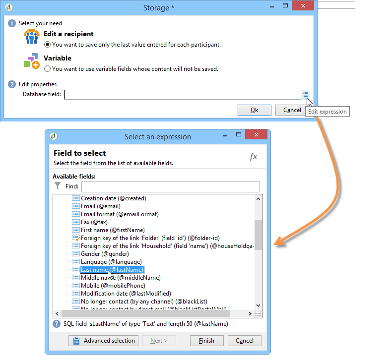
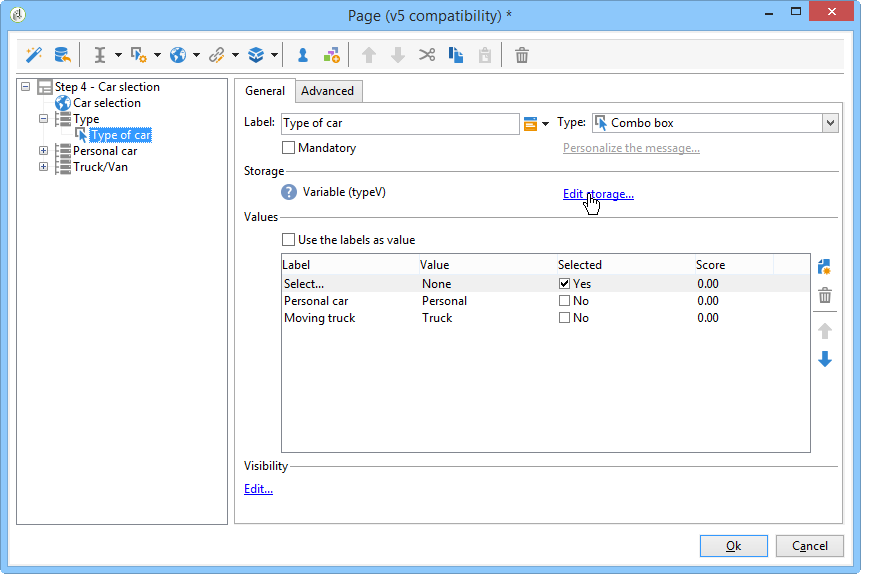
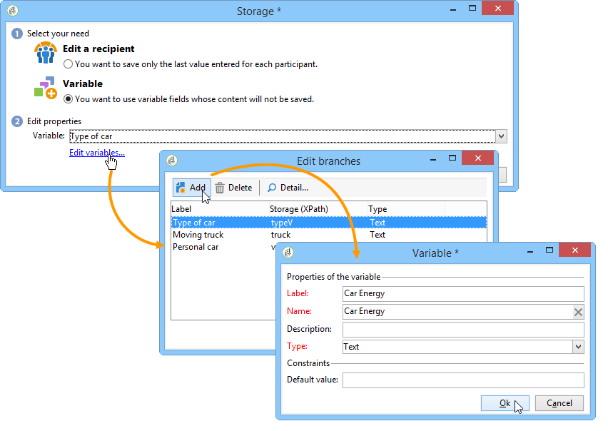
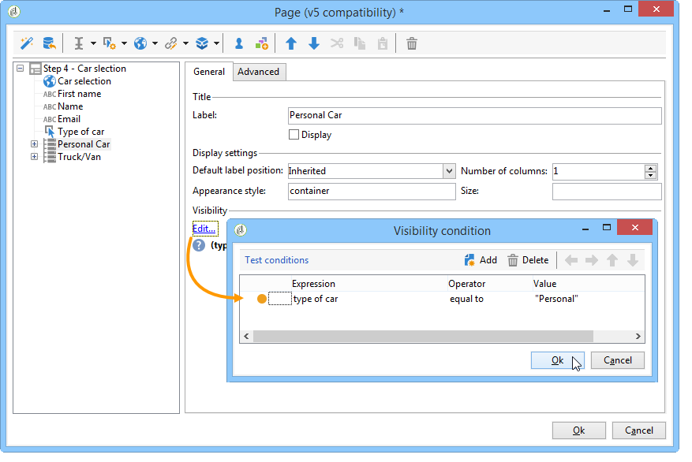
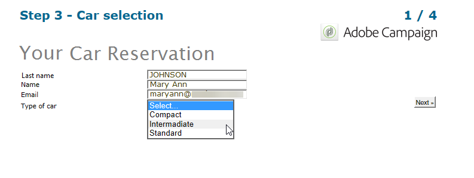
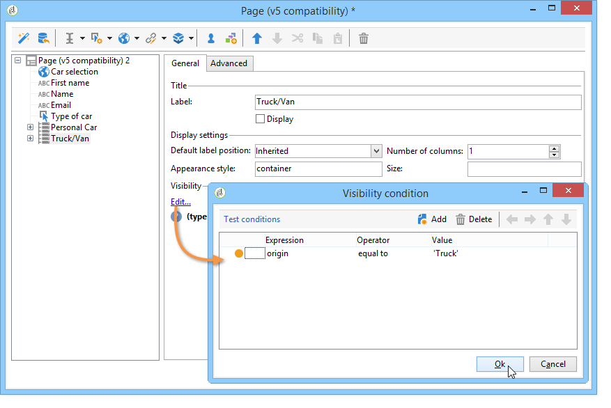
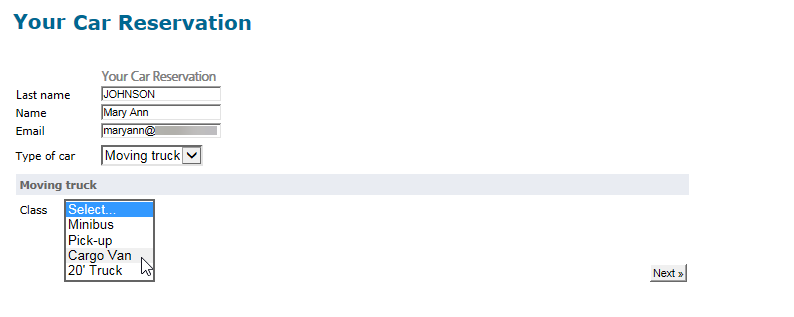
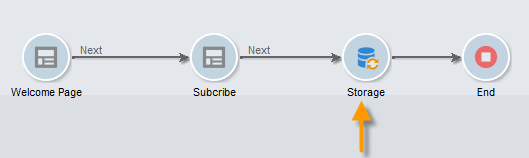
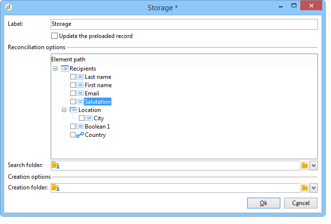
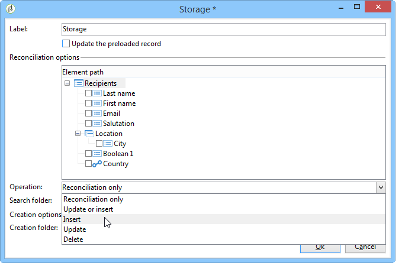

# Web forms answers{#web-forms-answers}

## Response storage fields {#response-storage-fields}

Answers to forms can be saved in a field of the database or temporarily in a local variable. The storage mode for answers is chosen during field creation. It can be edited via the **[!UICONTROL Edit storage...]** link.

For each input field in a form, the following storage options are available:


* **[!UICONTROL Edit a recipient]**

  You can select a field of the database: users' answers will be stored in this field. For each user, only the last value entered is saved: it is added to their profile: Refer to [Storing data in the database](#storing-data-in-the-database).

* **[!UICONTROL Variable]**

  If you don't want to store information in the database, you can use a variable. Local variables can be declared upstream. Refer to [Storing data in a local variable](#storing-data-in-a-local-variable).

### Storing data in the database {#storing-data-in-the-database}

To save the data in an existing field of the database, click the **[!UICONTROL Edit expression]** icon and select it from the list of available fields. 



>[!NOTE]
>
>The default reference document is the **nms:recipient** schema. To view it or to choose a new one, select the form from the list, and click the **[!UICONTROL Properties]** button.

### Storing data in a local variable {#storing-data-in-a-local-variable}

You can use local variables so that even if data is not stored in the database, it can be reused on the page or the other pages, for example to place conditions on the display of a field or to personalize a message.

This means that you can use the value of an unsaved field to authorize the display of a group of options on the page. In the page below, the vehicle type is not stored in the database:



It is stored in a variable which must be selected when the drop-down box is created, or via the **[!UICONTROL Edit storage...]** link. 


You can display existing variables and create new ones via the **[!UICONTROL Edit variables...]** link. Click the **[!UICONTROL Add]** button to create a new variable.



The added variable will be available in the list of local variables when the page's input fields are created.

>[!NOTE]
>
>For each form, you can create variables upstream. To do this, select the form and click the **[!UICONTROL Properties]** button. The **[!UICONTROL Variables]** tab contains the local variables for the form.

**Example of local storage with conditioning**

In the above example, the container that includes data concerning private vehicles is displayed only if the **[!UICONTROL Private]** option is selected from the drop-down list, as indicated in the visibility condition:



If the user selects a private vehicle, the Web form offers the following options:



The container holding the data concerning commercial vehicles will be displayed if the Professional option is selected, as expressed in the visibility condition:



This means that, if the user selects a commercial vehicle, the form offers the following options:



## Using collected information {#using-collected-information}

For each form, the answers provided can be re-used in the fields or the labels. The following syntaxes must be used:

* For a content stored in a field of the database:

  ```
  <%=ctx.recipient.@field name%
  ```

* For a content stored in a local variable:

  ```
  <%= ctx.vars.variable name %
  ```

* For a content stored in an HTML text field:

  ```
  <%== HTML field name %
  ```

  >[!NOTE]
  >
  >Unlike the other fields for which `<%=` characters are replaced with escape characters, the HTML content is saved as is by using the `<%==` syntax.

## Saving Web forms answers {#saving-web-forms-answers}

To save the information collected in the pages of a form, you need to place a storage box in the diagram.



There are two ways of using this box:

* If the Web form is accessed via a link sent in an email, and if the user accessing the application is already in the database, you can check the **[!UICONTROL Update the preloaded record]** option. For more on this, refer to [Delivering a form via email](publishing-a-web-form.md#delivering-a-form-via-email).

  In this case, Adobe Campaign uses the encrypted primary key of the user profile, a unique identifier assigned to each profile by Adobe Campaign. You need to configure the information to preload via the preloading box. For more on this, refer to [Pre-loading the form data](publishing-a-web-form.md#pre-loading-the-form-data).

  >[!CAUTION]
  >
  >This option overrides the user data, including the e-mail address if there is a field in which to enter it. It cannot be used to create new profiles, and requires the use of a pre-loading box in the form.

* To enrich the data of recipients in the database, edit the storage box and select the reconciliation key. For internal use (typically an intranet system) or for a form used to create new profiles for instance, you can select the reconciliation field(s). The box offers all fields of the database used in the various pages of the Web application:

  

By default, the data is imported into the database by an **[!UICONTROL Update or insertion]** operation: if it exists in the database, the element is updated (for example, the selected newsletter or the e-mail address entered). If it does not exist, the information is added.

You can, however, change this behavior. To do this, select the root of the element and select the operation to be performed from the drop-down list:



You can select a search folder for reconciliation and the creation folder for new profiles. If these fields are empty, the profiles are searched for and created in the operator's default folder.

>[!NOTE]
>
>Possible operations are: **[!UICONTROL Simple reconciliation]**, **[!UICONTROL Update or insertion]**, **[!UICONTROL Insertion]**, **[!UICONTROL Update]**, **[!UICONTROL Deletion]**.  
>The default folder of the operator is the first folder for which the operator has write-permission.   
>Refer to [this section](../../platform/using/access-management.md).
