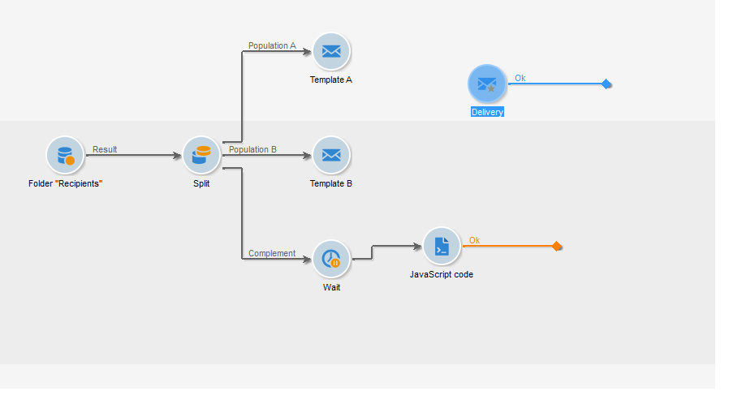

# A/B testing{#a-b-testing}

If you have several contents for an email delivery and you want to find out which version will have the biggest impact on the targeted population, you can send the different versions to some of your recipients, then select the one with the highest success rate and send it to the rest of your recipients.

In this use case, we are going to compare two email delivery contents via a targeting workflow. The message and the text are identical in both deliveries: only the layout changes.

The targeted population is divided into three: two test groups and the remaining population. A different version of the delivery is sent to each test group. After the delivery, a 5-day wait period is configured before collecting the results of the best open rates. The content of the delivery with the highest score is then recovered by a script and sent to the population that wasn't used as a test group.

Please note that the criteria that will decide which delivery is the best may be altered to meet your needs. It can be the open rate, the click-through rate, the subscription rate, reactivity, etc.

Moreover, the test detailed in this use case concerns only two deliveries, but you can test as many versions as necessary. Simply add activities to the workflow.

To create the A/B test, apply the following steps:

* [Step 1: Creating a targeting workflow](../../workflow/using/a-b-testing.md#step-1--creating-a-targeting-workflow)
* [Step 2: Configuring population samples](../../workflow/using/a-b-testing.md#step-2--configuring-population-samples)
* [Step 3: Creating two delivery templates](../../workflow/using/a-b-testing.md#step-3--creating-two-delivery-templates)
* [Step 4: Configuring the deliveries in the workflow](../../workflow/using/a-b-testing.md#step-4--configuring-the-deliveries-in-the-workflow)
* [Step 5: Creating the script](../../workflow/using/a-b-testing.md#step-5--creating-the-script)
* [Step 7: Starting the workflow](../../workflow/using/a-b-testing.md#step-7--starting-the-workflow)
* [Step 8: Analyzing the result](../../workflow/using/a-b-testing.md#step-8--analyzing-the-result).

## Step 1: Creating a targeting workflow {#step-1--creating-a-targeting-workflow}

You need to create your workflow in the **[!UICONTROL Targeting and Workflows]** tab of a campaign. It is made up of a **[!UICONTROL Query]** activity, a **[!UICONTROL Split]** activity linked to two **[!UICONTROL Email delivery]** activities, a **[!UICONTROL Wait]** activity, a **[!UICONTROL JavaScript code]** activity, and a **[!UICONTROL Delivery]** activity.

1. If you haven't already done so, create a campaign (for more on this, refer to this [section](../../campaign/using/setting-up-marketing-campaigns.md#creating-a-campaign)).

   

1. Go to the **[!UICONTROL Targeting and Workflows]** tab.

   

1. Change the label of the existing workflow or click **[!UICONTROL Add]** to create a new one (for more on this, refer to this [section](../../campaign/using/setting-up-marketing-campaigns.md#selecting-the-target-population)).

   

1. Use the mouse to drag and drop activities into the workflow diagram, including a **[!UICONTROL Query]** (**[!UICONTROL Target]** tab), a **[!UICONTROL Split]** (**[!UICONTROL Target]** tab), two **[!UICONTROL Email deliveries]** (**[!UICONTROL Deliveries]** tab), a **[!UICONTROL Wait]** activity (**[!UICONTROL Flow Control]** tab), a **[!UICONTROL JavaScript code]** activity (**[!UICONTROL Actions]** tab), and a **[!UICONTROL Delivery]** activity (**[!UICONTROL Actions]** tab).


## Step 2: Configuring population samples {#step-2--configuring-population-samples}

### Configuring the Query activity {#configuring-the-query-activity}

* Double-click the **[!UICONTROL Query]** activity.

  

* Click the **[!UICONTROL Edit query]** link and select the recipients you want to target.

  

* Link the **[!UICONTROL Query]** activity to the **[!UICONTROL Split]** activity.

  

### Configuring the Split activity {#configuring-the-split-activity}

This activity lets you create several populations: the one that receives delivery A, the one that receives delivery B, and the remaining population. Using random selection lets you target just part of the population of each delivery.

1. Creating population A:

    * Double-click the **[!UICONTROL Split]** activity.
    
      

    * In the existing tab, change the label to population A.
    
      

    * Select the **[!UICONTROL Limit the selected records]** option.
    
      

    * Click the **[!UICONTROL Edit]** link, select **[!UICONTROL Activate random sampling]**, and click **[!UICONTROL Next]**.
    
      

    * Set the threshold to 10%, then click **[!UICONTROL Finish]**.
    
      

1. Creating population B:

    * Click **[!UICONTROL Add]** to create a new tab for population B.
    
      

    * Limit the population to 10% as previously.
    
      

1. Creating the remaining population:

    * Go to the **[!UICONTROL General]** tab.
    
      

    * Select **[!UICONTROL Generate complement]**.
    
      

    * Change the label to specify that this population includes neither A nor B, and click **[!UICONTROL OK]** to close the activity.
    
      

## Step 3: Creating two delivery templates {#step-3--creating-two-delivery-templates}

We now want to create two delivery templates. Each template will be referenced in an **[!UICONTROL Email delivery]** activity linked to the **[!UICONTROL Split]** activity. For more on this, refer to this [section](../../delivery/using/about-templates.md).

1. Go to the **[!UICONTROL Resources > Delivery template]** folder.
1. Duplicate the **[!UICONTROL Email]** delivery template.

   

1. Create the content to be used for delivery A.

   

1. Repeat this process to create a template for delivery B.

   

## Step 4: Configuring the deliveries in the workflow {#step-4--configuring-the-deliveries-in-the-workflow}

The next step is to configure the deliveries. They are destined for the three populations created during the previous stage: [Step 2: Configuring population samples](../../workflow/using/a-b-testing.md#step-2--configuring-population-samples). The first two deliveries enable you to send different contents to population A and B. The third delivery is destined for the population that received neither A nor B. Its content will be calculated by a script and will be identical to either A or B, depending on which one scored the highest open rate. We need to configure a wait period for the third delivery, to find out the outcome of deliveries A and B. This is why the third delivery includes a **[!UICONTROL Wait]** activity.

1. Go to the **[!UICONTROL Split]** activity and link the transition destined for population A to one of the email deliveries already in the workflow.

   

1. Double-click the delivery to open it.
1. Using the drop-down list, select the template for delivery A.

   

1. Click **[!UICONTROL Continue]** to view the delivery, then save it.

   

1. Link the transition of the **[!UICONTROL Split]** activity destined for population B to the second email delivery.

   

1. Open the delivery and select the template in delivery B, then save the delivery.

   

1. Link the transition destined for the remaining population to the **[!UICONTROL Wait]** activity.

   

1. Open the **[!UICONTROL Wait]** activity and configure a 5-day waiting period.

   

1. Link the **[!UICONTROL Wait]** activity to the **[!UICONTROL JavaScript code]** activity.

   

## Step 5: Creating the script {#step-5--creating-the-script}

The choice of the delivery content destined for the remaining population is calculated by a script. This script recovers the information concerning the delivery with the highest rate of opens and copies the content into the final delivery.

### Example of a script {#example-of-a-script}

The following script can be used as is in the targeting workflow. For more on this, refer to [Implementation](../../workflow/using/a-b-testing.md#implementation).

```
 // query the database to find the winner (best open rate)
   var winner = xtk.queryDef.create(
     <queryDef schema="nms:delivery" operation="get">
       <select>
         <node expr="@id"/>
         <node expr="@label"/>
         <node expr="[@operation-id]"/>
         <node expr="[@workflow-id]"/>
       </select>
       <where>
         <condition expr={"@FCP=0 and [@workflow-id]= " + instance.id}/>
       </where>
       <orderBy>
         <node expr="[indicators/@estimatedRecipientOpenRatio]" sortDesc="true"/>
       </orderBy>
     </queryDef>).ExecuteQuery()
   
   // create a new delivery object and initialize it by doing a copy of
   // the winner delivery
   var delivery = nms.delivery.create()
   delivery.Duplicate("nms:delivery|" + winner.@id)

   // append 'final' to the delivery label
   delivery.label = winner.@label + " final"

   // link the delivery to the operation to make sure it will be displayed in
   // the campaign dashboard. This attribute needs to be set manually here since 
   // the Duplicate() method has reset it to its default value => 0
   delivery.operation_id = winner.@["operation-id"]
   delivery.workflow_id = winner.@["workflow-id"]

   // adjust some delivery parameters to make it compatible with the 
   // "Prepare and start" option selected in the Delivery tab of this activity
   delivery.scheduling.validationMode = "manual"
   delivery.scheduling.delayed = 0
 
   // save the delivery in database
   delivery.save()
 
   // store the new delivery Id in event variables
   vars.deliveryId = delivery.id
```

For a detailed explanation of the script, refer to [Details of the script](../../workflow/using/a-b-testing.md#details-of-the-script).

### Implementation {#implementation}

1. Open your **[!UICONTROL JavaScript code]** activity.
1. Copy the script offered in [Example of a script](../../workflow/using/a-b-testing.md#example-of-a-script) into the **[!UICONTROL JavaScript code]** window.

   

1. In the **[!UICONTROL Label]** field, enter the name of the script, i.e.

   ```
   <%= vars.deliveryId %>
   ```

   

1. Close the **[!UICONTROL JavaScript code]** activity.
1. Save your workflow.

### Details of the script {#details-of-the-script}

This section details the various parts of the script and their operating mode.

* The first part of the script is a query. The **queryDef** command lets you recover from the **NmsDelivery** table the deliveries created by executing the targeting workflow and to sort them based on their estimated rate of opens, then the information from the delivery with the highest rate of opens is recovered.

  ```
  // query the database to find the winner (best open rate)
     var winner = xtk.queryDef.create(
       <queryDef schema="nms:delivery" operation="get">
         <select>
           <node expr="@id"/>
           <node expr="@label"/>
           <node expr="[@operation-id]"/>
         </select>
         <where>
           <condition expr={"@FCP=0 and [@workflow-id]= " + instance.id}/>
         </where>
         <orderBy>
           <node expr="[indicators/@estimatedRecipientOpenRatio]" sortDesc="true"/>
         </orderBy>
       </queryDef>).ExecuteQuery()
  ```

* The delivery with the highest rate of opens is duplicated.

  ```
   // create a new delivery object and initialize it by doing a copy of
   // the winner delivery
  var delivery = nms.delivery.create()
  delivery.Duplicate("nms:delivery|" + winner.@id)
  ```

* The label of the duplicated delivery is modified, and the word **final** is added to it.

  ```
  // append 'final' to the delivery label
  delivery.label = winner.@label + " final"
  ```

* The delivery is copied into the campaign dashboard.

  ```
  // link the delivery to the operation to make sure it will be displayed in
  // the campaign dashboard. This attribute needs to be set manually here since 
  // the Duplicate() method has reset it to its default value => 0
  delivery.operation_id = winner.@["operation-id"]
  delivery.workflow_id = winner.@["workflow-id"]
  ```

  ```
  // adjust some delivery parameters to make it compatible with the 
  // "Prepare and start" option selected in the Delivery tab of this activity
  delivery.scheduling.validationMode = "manual"
  delivery.scheduling.delayed = 0
  ```

* The delivery is saved in the database.

  ```
  // save the delivery in database
  delivery.save()
  ```

* The unique identifier of the duplicated delivery is stored in the workflow variable.

  ```
  // store the new delivery Id in event variables
  vars.deliveryId = delivery.id
  ```

### Other selection criteria {#other-selection-criteria}

The example above lets you select the content of a delivery based on the rate of opens of emails. You can adapt it to base yourself on other delivery-specific indicators:

* Best click throughput: `[indicators/@recipientClickRatio]`,
* Highest reactivity rate (email open and clicks in the message): `[indicators/@reactivity]`,
* Lowest complaint rate: `[indicators/@refusedRatio]` (use the false value for the sortDesc attribute),
* Highest conversion rate: `[indicators/@transactionRatio]`,
* Number of pages visited following the reception of a message: `[indicators/@totalWebPage]`,
* Lowest unsubscription rate: `[indicators/@optOutRatio]`,
* Transaction amount: `[indicators/@amount]`.

## Step 6: Defining the final delivery {#step-6--defining-the-final-delivery}

Once the script is created to select the A/B test winner, you can define the parameters of the final delivery.

1. Connect the **[!UICONTROL JavaScript code]** activity to the remaining **[!UICONTROL Delivery]** activity.
1. Open the **[!UICONTROL Delivery]** activity.
1. Uncheck the **[!UICONTROL Generate an outbound transition]** option to finish the workflow with this activity.
1. Leave the other options to their default values. 

   

By preparing the delivery specified in the transition (defined via the **[!UICONTROL Javascript Code]** activity), you will be then able to approve it and to start the sending, as described in the next step.

## Step 7: Starting the workflow {#step-7--starting-the-workflow}

1. Click **[!UICONTROL Start]** the workflow.

   

1. Approve target and content for deliveries A and B via the campaign dashboard.
1. Confirm delivery.
1. Wait until the end of the 5-day period to find out which content was calculated after delivery opening results.

   

   In this case, template B was chosen.

1. Once the content of the third delivery is determined, approve the target and the content.

## Step 8: Analyzing the result {#step-8--analyzing-the-result}

Once the test deliveries have been sent, you can check which recipient(s) they have been sent to and whether or not they were opened.

* To find out which recipients have been targeted, open a delivery via the campaign dashboard and click the **[!UICONTROL Delivery]** tab.

  

* To find out whether the delivery has been opened, go to the **[!UICONTROL Tracking]** tab.

  

* Compare with the other delivery.

  

In our example, delivery B has scored the highest open rate. This means that content B will be used for the final delivery.


