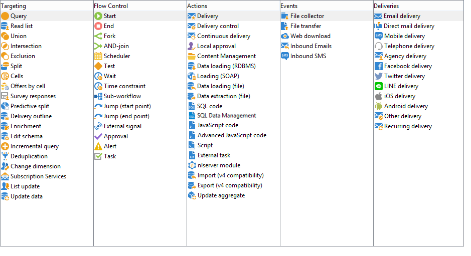

# About activities{#about-activities}

This section describes all of the available activities. According to the node or the context in which the workflow is created/edited, the activities available may vary. For example, the workflows created in a campaign have channel-specific delivery activities.

Workflow activities are grouped by category. There are four tabs available at the same time.

In the campaign workflows, the **[!UICONTROL Events]** tab is replaced by the **[!UICONTROL Deliveries]** tab. The activities in this tab are detailed in the [Action activities](../../workflow/using/about-action-activities.md) section.

Read more:

* [About Targeting activities](../../workflow/using/about-targeting-activities.md)
* [Executing a workflow](../../workflow/using/starting-a-workflow.md)
* [Workflow best practices](../../workflow/using/workflow-best-practices.md)
