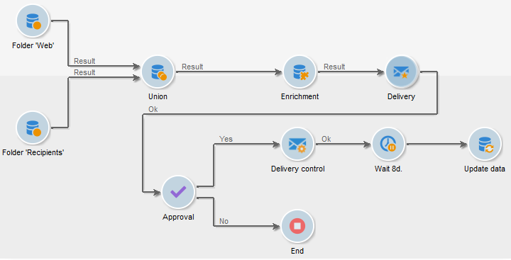

# About workflows{#about-workflows}

Adobe Campaign includes a workflow module that empowers you to orchestrate the full range of processes and tasks across the different modules of the application server. This comprehensive graphical environment lets you design processes including segmentation, campaign execution, file processing, human participation, etc. The workflow engine executes and tracks these processes.

You can use a workflow, for example, to download a file from a server, decompress it, and then import records contained within into the Adobe Campaign database.

A workflow can also involve one or more operators to be notified or who can make choices and approve processes. In this way, it is possible to create a delivery action, assign a task to one or more operators to work on content, specify targets, and to approve proofs before starting the delivery.

Workflows occur within various contexts and stages of the campaign management process.

Adobe Campaign uses workflows to:

* Carry out targeting campaigns. For more on this, refer to [Implementation steps](../../workflow/using/about-workflows.md#implementation-steps-).
* Build campaigns: for each campaign, the **Workflow** tab lets you build the target and create the deliveries. For more on this, refer to [Campaign workflows](../../workflow/using/about-workflows.md#campaign-workflows).
* Perform technical processes: cleanup, collecting tracking information or provisional calculations. For more on this, refer to [Technical workflows](../../workflow/using/about-workflows.md#technical-workflows).

A workflow can mean both a process definition (the workflow model, which is a representation of what is supposed to happen) and an instance of this process (a workflow instance, which is a representation of what is actually happening).

The workflow template describes the various tasks to be performed and how they are linked together. The task templates are called activities and are represented by icons. They are linked together by transitions.

Each workflow contains:

* **Activities**

  An activity describes a task template. The various activities available are represented on the diagram by icons. Each type has common properties and specific properties. For example, while all activities have a name and label, only the **Approval** activity has an assignment.

  In a workflow diagram, a given activity can produce multiple tasks, in particular when there is a loop or recurrent (periodic) actions.

  All workflow activities are listed in [this section](../../workflow/using/about-activities.md), including use cases and samples.

* **Transitions**

  Transitions enable you to link activities and to define their sequence. A transition links a source activity to a destination activity. There are several sorts of transitions, which depend on the source activity. Some transitions have additional parameters such as a duration, a condition or a filter.

  A transition which is not linked to a destination activity is colored orange and the arrow head is shown as a diamond.

  >[!NOTE]
  >
  >A workflow containing unterminated transitions can still be executed: a warning message will be generated and the workflow will pause once it reaches the transition but it will not generate an error. It is thus possible to start a workflow without it being finished and to add to it as you go along.

  For more information about how to build a workflow, refer to [this section](../../workflow/using/building-a-workflow.md).

* **Worktables**

  The worktable contains all the information carried by the transition. Each workflow uses several worktables. The data conveyed in these tables can be accelerated and used throughout the workflow's life cycle, as long as it is not purged. Indeed, unneeded tables are purged each time the workflow is passivated, and possibly during the execution of the largest workflows to avoid overloading the server.

  Learn more on workflow data and tables in [this section](../../workflow/using/how-to-use-workflow-data.md).

