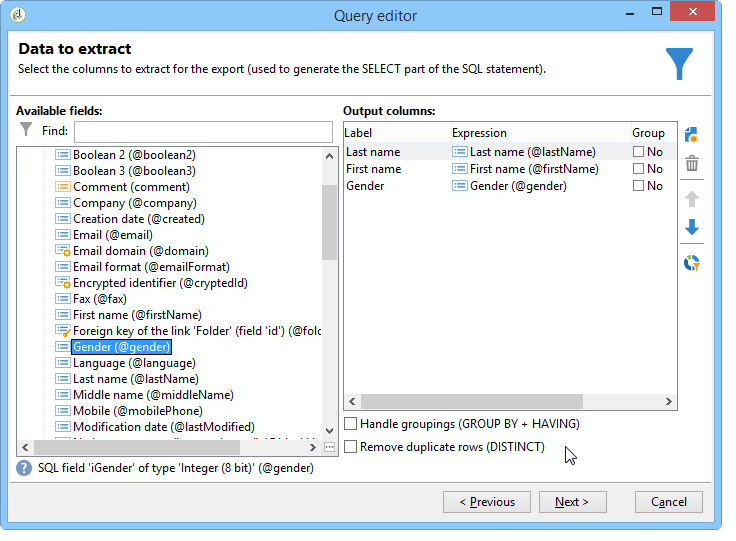
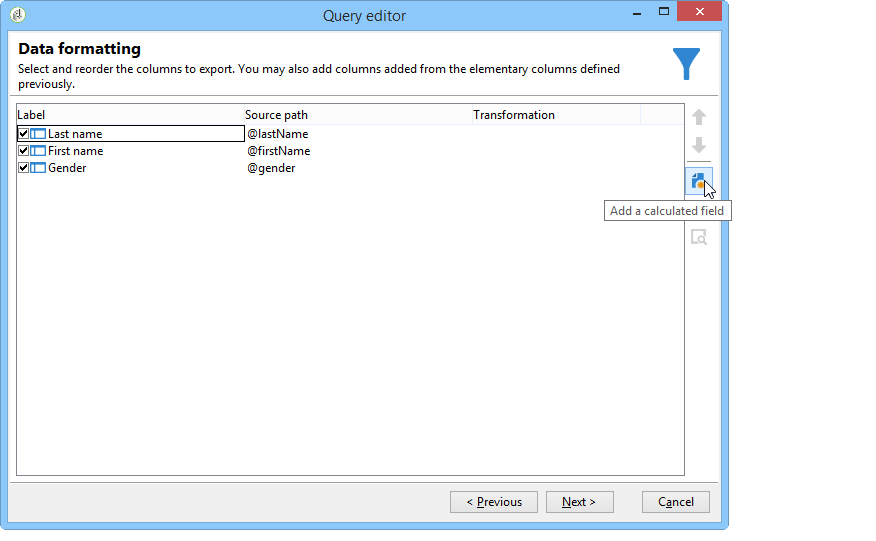
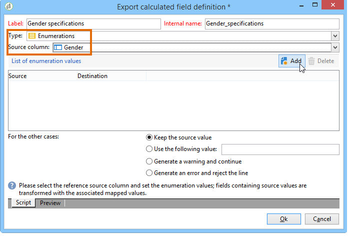
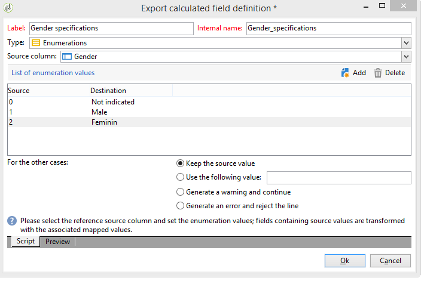
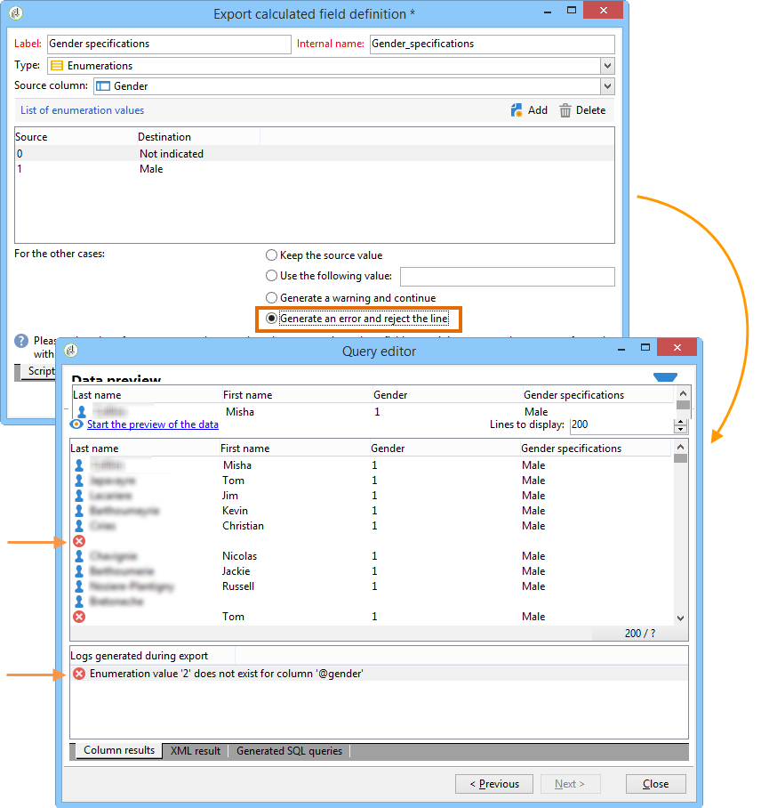

# Add an Enumeration type calculated field {#adding-an-enumeration-type-calculated-field}

Here we want to create a query with an **[!UICONTROL Enumerations]** type calculated field. This field will generate an additional column in the data preview window. This column will specify the numeric values returned as a result for each recipient (0, 1 and 2). A gender will be assigned to each value in the new column: "Male" for "1", "Female" for "2" or "Not indicated" if the value equals "0".

* Which table needs to be selected?

  The recipient table (nms:recipient)

* Fields to be selected in the output column?

  Last name, First name, Gender

* Criteria which the information will be filtered based on?

  The rrecipient language

Apply the following steps:

1. Open the Generic query editor and select the Recipient table (**[!UICONTROL nms:recipient]**).
1. In the **[!UICONTROL Data to extract]** window, select **[!UICONTROL Last name]**, **[!UICONTROL First name]** and **[!UICONTROL Gender]**.

   

1. In the **[!UICONTROL Sorting]** window, click **[!UICONTROL Next]**: no sort is necessary for this example.
1. In **[!UICONTROL Data filtering]**, select **[!UICONTROL Filtering conditions]**.
1. In the **[!UICONTROL Target element]** window, set a filter condition to collect recipients who speak English.

   

1. In the **[!UICONTROL Data formatting]** window, click **[!UICONTROL Add a calculated field]**.

   

1. Go to the **[!UICONTROL Type]** window of the **[!UICONTROL Export calculated field definition]** window and select **[!UICONTROL Enumerations]**.

   Define the column which the new calculated field must refer to. To do this, select the **[!UICONTROL Gender]** column in the drop-down menu of the **[!UICONTROL Source column]** field: the destination values will coincide with the **[!UICONTROL Gender]** column.

   

   Define the **Source** and **Destination** values: the destination value makes the query result easier to read. This query should return recipient gender and the result will either be 0, 1, or 2.

   For each "source-destination" line to be entered, click **[!UICONTROL Add]** in the **[!UICONTROL List of enumeration values]**:

    * In the **[!UICONTROL Source]** column, enter the source value for each gender (0,1,2) in a new line.
    * In the **[!UICONTROL Destination]** column, enter the values: "Not indicated" for line "0", "Male" for line "1", and "Female" for line "2".

   Select the **[!UICONTROL Keep the source value]** function.

   Click **[!UICONTROL OK]** to approve the calculated field.

   

1. In the **[!UICONTROL Data formatting]** window, click **[!UICONTROL Next]**.
1. In the preview window, **[!UICONTROL start the preview of the data]**.

   The additional column defines the gender of 0, 1 and 2:

    * 0 for "Not indicated"
    * 1 for "Male"
    * 2 for "Female"

   

   For example, if you don't enter gender "2" in the **[!UICONTROL List of enumeration values]**, and the **[!UICONTROL Generate a warning and continue]** function of the **[!UICONTROL In other cases]** field is selected, you will get a warning log. This log indicates that gender "2" (Female) has not been entered. It is displayed in the **[!UICONTROL Logs generated during export]** field of the data preview window.

   

   Let's take another example and say that enumeration value "2" isn't entered. Select the **[!UICONTROL Generate an error and reject the line]** function: all gender "2" recipients will raise anomalies and the other information in the line (first and last name, etc.) will not be exported. An error log is displayed in the **[!UICONTROL Logs generated during export]** field of the data preview window. This log indicates that enumeration value "2" isn't entered.

   
