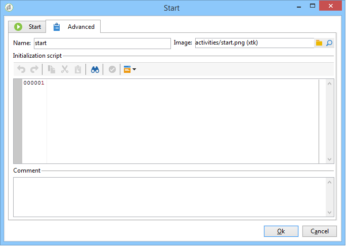
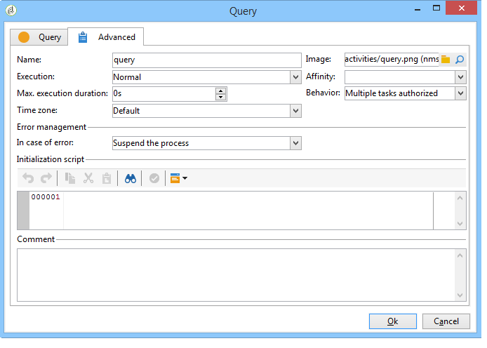

# Advanced parameters{#advanced-parameters}

The properties screen of an activity has an **Advanced** tab that lets you define a behavior in case of errors, the execution period for the activity; and lets you enter an initialization script. There are two versions of this tab:

* a simplified version (for **Start** and **End** activities for instance)

  

* a more detailed version (for the **Query** activity, for instance)

  

The fields to be entered in the **Advanced** tab are detailed in the following sections.

## Name {#name}

This field contains the internal name of the activity.

## Image {#image}

This field lets you change the image linked to an activity. For more on this, refer to: [Managing activity images](../../workflow/using/managing-activity-images.md).

## Execution {#execution}

This field lets you define the action to be carried out when the task is triggered. There are three possible options:

These options are generally selected in the cart by right-clicking the activity.

* **Normal**: the activity is executed as usual.
* **Do not activate**: this task and all the following tasks (in the same branch) are not executed. 
* **Activate but do not execute**: this task and all the following tasks (in the same branch) are automatically stopped. This can be useful if you want to be there when the task is started. To execute the task manually, right-click the activity and select **Normal execution**.

## Affinity {#affinity}

This field lets you force the execution of an activity on a specific machine. For more on this, refer to: [Managing propensity](../../workflow/using/managing-propensity.md).

## Max. execution period {#max--execution-period}

This field lets you set a warning for when the task takes too long. It won't impact workflow operation. If the task isn't finished by the time the **Max. execution period** is over, the **Instance monitoring** page will show a warning for this workflow. This page is accessed via the **Monitoring** tab of the home page.

## Behavior {#behavior}

This field lets you define the behavior to be applied for using asynchronous tasks. There are two possible options:

* **Several tasks authorized**: several tasks can be executed at once, even if the first one isn't finished. 
* **The current task has priority**: tasks in progress take priority. As long as a task is in progress, no other task will be executed.

## Time zone {#time-zone}

This field lets you select the time zone of the activity. For more on this: [Managing time zones](../../workflow/using/managing-time-zones.md).

## In case of errors {#in-case-of-errors}

This field lets you define the action to be carried out when the activity has errors. There are two possible options:

* **Stop the process**: the workflow is stopped automatically. Its status changes to **Failed**. Once the problem is solved, re-start the workflow.
* **Ignore**: this task and all the following tasks (in the same branch) aren't executed. This can be useful for recurring tasks. If the branch has a scheduler placed upstream, it will start as usual on the next execution date.

## Initialization script {#initialization-script}

This field lets you initialize variables or modify activity properties. For more on this, refer to: [JavaScript scripts and templates](../../workflow/using/javascript-scripts-and-templates.md).

## Comment {#comment}

The **Comment** field is a free field that lets you add a description.
