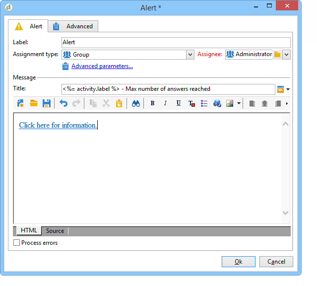

# Alert{#alert}

An **Alert** activity sends a message to a group of operators. It operates the same way as an approval activity, but no response is expected in this case.

An alert is not persistent, and is therefore not visible from the console. The operators of the assigned group must have a complete email address in order to receive the notification. The configuration of this activity is similar to that of an **Approval**. The default delivery template used to alert operators is 'alertAssignee'.
