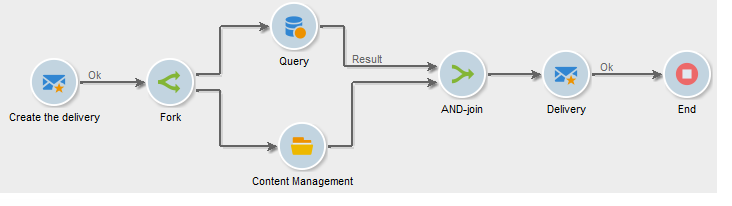

# AND-join{#and-join}

A join triggers its outbound transition only when all inbound transitions are activated, i.e. when all prior activities are finished. This allows you to make sure that certain activities have finished before continuing to execute the workflow.

For example, you can use an AND-join activity in the context of content creation and delivery sending automation, to make sure that a delivery is started only once target querying and content updates steps are complete. A dedicated use case is available in [this section](../../delivery/using/automating-via-workflows.md#creating-the-delivery-and-its-content)

>[!NOTE]
>
>Note that inbound transitions that are configured with different targeting dimensions cannot be joined together using an **[!UICONTROL AND-join]** activity.

The outbound sent population of the activity is determined by choosing a main set among the inbound transitions in the activity.

The outbound transition can only contain one of the inbound transition populations. If the activity is not configured, the outbound transition will randomly select one of the inbound populations.

>[!CAUTION]
>
>In the case of **AND-join** type activities, the event variables are merged but if a same variable is defined twice, there is a conflict and the value remains undetermined. For more on this, refer to [this section](javascript-scripts-and-templates.md#event-variables).
