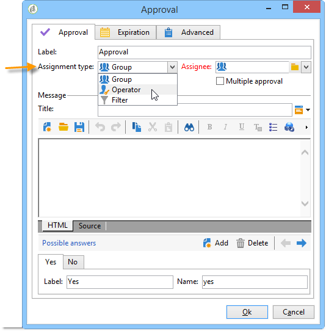
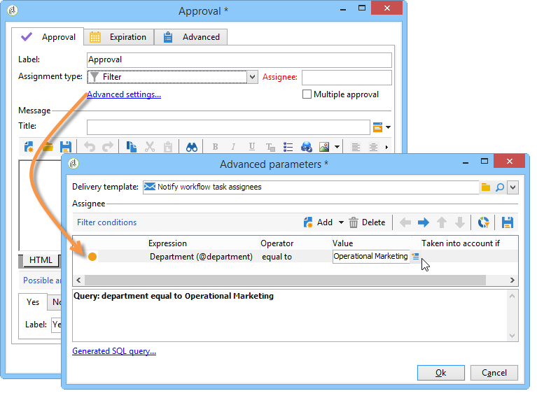
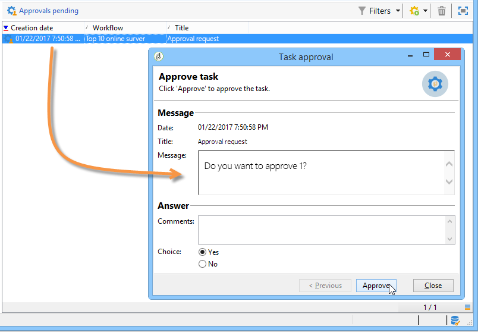
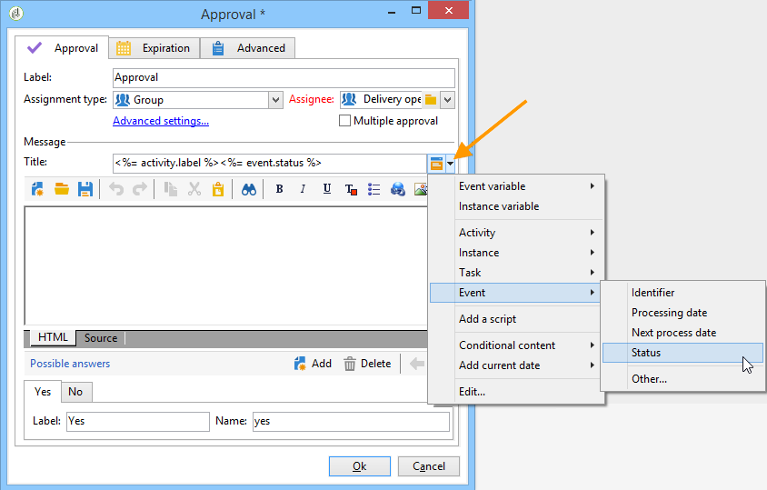

# Approval{#approval}

An **Approval** task requires the participation of an operator. The operator is assigned a task and can respond by email, using the Web page linked in the email message, or via the console.

## Task assignment {#task-assignment}

By default, approval is assigned to a group of operators. This group represents a role, e.g. 'Newsletter content group' or 'Newsletter targeting group'. Each operator in the group can answer, but only the first reply is taken into account (except in the event of multiple approvals).

If necessary, you can assign the approval task to a single operator or a set of operators defined by a filter.

* To select a single operator, select the **[!UICONTROL Operator]** value in the **[!UICONTROL Assignment type]** field and select the relevant operator in the drop-down list of the **[!UICONTROL Assignee]** field.

  

  >[!CAUTION]
  >
  >Only the chosen operator will be authorized to approve the task.

* You can define a query for filtering approving operators. To do this, select the **[!UICONTROL Filter]** value in the **[!UICONTROL Assignment type]** field and click the **[!UICONTROL Advanced parameters...]** link to define filtering conditions, as shown in the following example:

  

In the event of single approval, the transition corresponding to the choice of operator is activated and the task is finished: the other operators cannot reply.

In the event of multiple approvals, transitions corresponding to the choice of each operator are enabled. The task is finished when all operators of the group have replied, or when the task has expired.

This activity does not block processing, and the workflow can perform other tasks while waiting for a reply.

An operator can approve the tasks assigned to that operator from the console. An operator with administrator rights can view and delete the tasks assigned to any operator, but cannot reply to them.

Modifying the title or message body of the activity does not affect the current tasks, but, on the other hand, modifying the possible choices directly affects the current tasks, which automatically inherit the new list of choices.

**Approval** type tasks are accessible from the **[!UICONTROL Administration > Production > Objects created automatically > Approvals pending]** node: operators can access the approval form directly via this view.

## Properties {#properties}

Customization variables can be used in the message sent to reviewers. They can be inserted into the message title or body.

This **[!UICONTROL Title]** field contains the title of the message: This is the subject of the email message sent. The title, as well as the message body, are JavaScript templates and can therefore contain values calculated according to the context of the workflow.

The lower section of the editor lets you define the list of possible answers. There is a transition corresponding to each answer. The name is the internal identifier, and the label is the text that will be displayed in the list of choices.

Click the **[!UICONTROL Advanced parameters...]** link to select the delivery template to be used to notify operators. The default template (internal name 'notifyAssignee') takes the title and message, and adds a link to the web page used to answer.

This template can be modified to personalize message layout, but it is preferable to make a copy. The targeting mechanism (external file, target mapping) must not be modified because it is required for notifications to operate correctly.

An approval example is shown in [Defining approvals](defining-approvals.md).

## Output parameters {#output-parameters}

* **[!UICONTROL response]**

  Comment related to the response

* **[!UICONTROL responseOperator]**

  Identifier of the operator who responded. This field is a numerical value, but a **[!UICONTROL String]** field.
