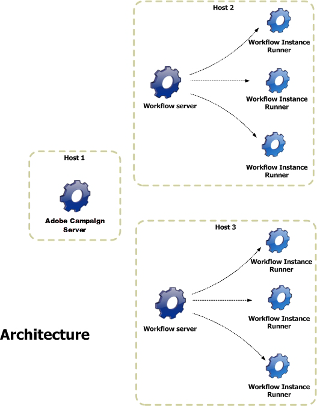

# Architecture {#architecture}

Workflows are handled by a specific module. This module can be started on multiple servers in order to share the processing load.

* The 'Workflow Instance Runner' (runwf) process executes all the tasks of a given workflow instance. When there are no tasks to be executed for the time being, it becomes 'passive', that is to say it saves its status in the database, then stops.
* The 'Workflow Server' (wfserver) module monitors current workflow instances. When there is a task to perform, this module creates a process to activate (or reactivate) the corresponding instance.
