# Building a workflow{#building-a-workflow}

This section details the key principles and best practices to build a workflow in Campaign.

* Create a workflow, see [Creating a new workflow](../../workflow/using/building-a-workflow.md#creating-a-new-workflow)
* Design the workflow diagram, see [Adding and linking activities](../../workflow/using/building-a-workflow.md#adding-and-linking-activities)
* Access parameters and properties of activities, see [Configuring activities](../../workflow/using/building-a-workflow.md#configuring-activities)
* Design targeting workflows, see [Targeting workflows](../../workflow/using/building-a-workflow.md#targeting-workflows)
* Use workflow to execute a campaign, see [Campaign workflows](../../workflow/using/building-a-workflow.md#campaign-workflows)
* Access and create technical workflows, see [Technical workflows](../../workflow/using/building-a-workflow.md#technical-workflows)
* Use templates to create workflows, see [Workflow templates](../../workflow/using/building-a-workflow.md#workflow-templates)

## Creating a new workflow {#creating-a-new-workflow}

From the **[!UICONTROL Explorer]** , access a workflow folder. By default, you can use **[!UICONTROL Profiles and Targets]** > **[!UICONTROL Jobs]** > **[!UICONTROL Targeting workflows]** .

Click the **[!UICONTROL New]** button located above the list of workflows. 

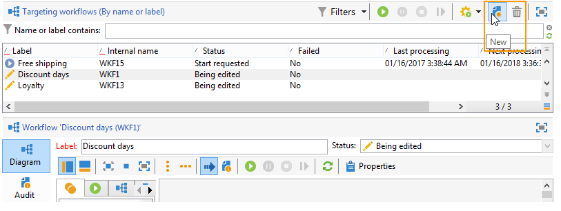

Or, you can also use the **[!UICONTROL Create]** button in the workflow overview ( **[!UICONTROL Monitoring]** > **[!UICONTROL Workflow]** link).

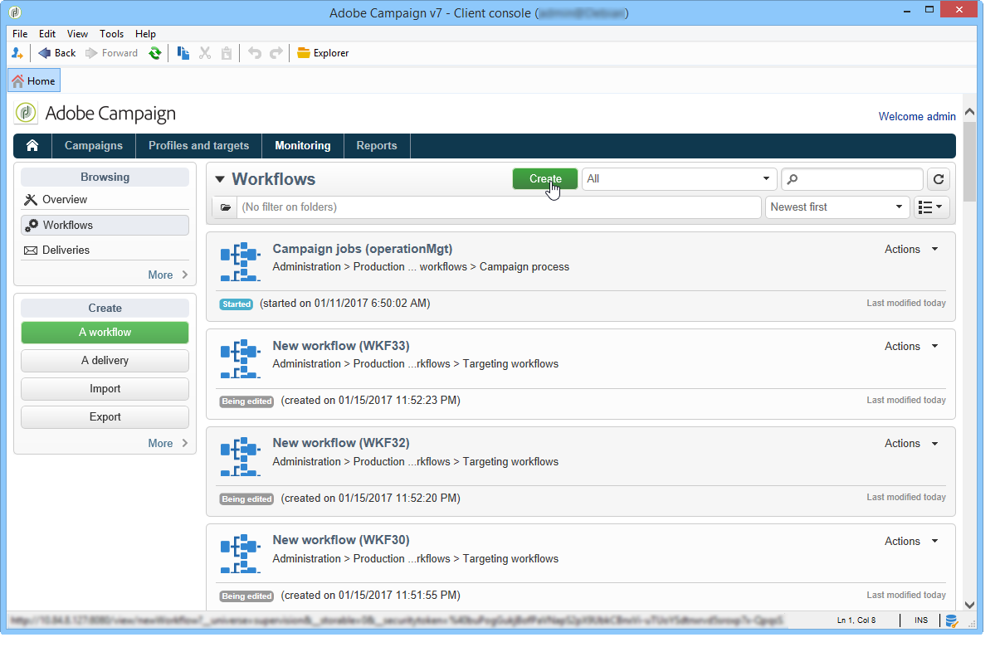

Enter a label and click **[!UICONTROL Save]** .

>[!NOTE]
>
>When you modify the internal name of a workflow activity or the workflow itself, make sure that you save the workflow before closing it so that the new internal name is correctly taken into account.

## Adding and linking activities {#adding-and-linking-activities}

You must now define the various activities and link them together in the diagram. At this stage of the configuration, we can see the diagram label and the workflow status (Editing in progress). The lower section of the window is used for editing the diagram only. It contains a toolbar, a palette of activities (on the left) and the diagram itself (on the right).

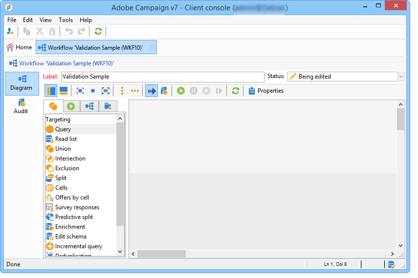

>[!NOTE]
>
>If the palette is not shown, click the first button on the toolbar to display it.

Activities are grouped by category inside the different tabs of the palette. Available tabs and activities can vary depending on the workflow type (technical, targeting or campaign workflow).

* The first tab contains targeting and data manipulation activities. These activities are detailed in [Targeting activities](../../workflow/using/about-action-activities.md#targeting-activities).
* The second tab contains the scheduling activities, which are mainly used for coordinating other activities. These activities are detailed in [Flow control activities](../../workflow/using/about-action-activities.md#flow-control-activities).
* The third tab contains tools and actions that can be used in the workflow. These activities are detailed in [Action activities](../../workflow/using/about-action-activities.md#action-activities).
* The fourth tab contains activities that depend on a given event, such as the receipt of an email or the arrival of a file on a server. These activities are detailed in [Event activities](../../workflow/using/about-action-activities.md#event-activities).

To create the diagram

1. Add an activity by selecting it in the palette and by moving it to the diagram using a drag-and-drop operation.

   Add a **Start** activity and then a **Delivery** activity on the diagram.

   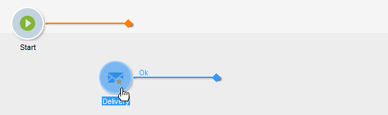

1. Link the activities together by dragging the **Start** activity transition and dropping it on to the **Delivery** activity.

   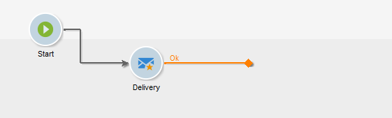

   You can automatically link an activity to the previous one by placing the new activity at the end of the transition.

1. Add the activities you need and link them together as shown in the diagram below.

   

### Additional layout options {#additional-layout-options}

You can change the display and layout of the chart using the following elements:

* **Using the toolbar**

  The diagram editing toolbar gives you access to the layout and execution functions of the workflow.

  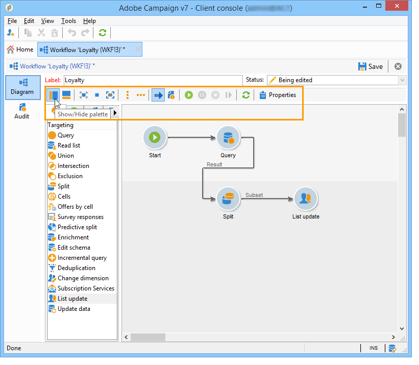

  This lets you adapt the layout of the editing tool: display of the palette and the overview, size and alignment of graphical objects.

  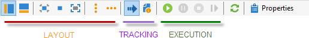

  Icons related to tracking and launching an advanced targeting workflow are detailed in this [section](../../campaign/using/setting-up-marketing-campaigns.md#creating-a-targeting-workflow).

* **Object alignment**

  To align icons, select them and click the **[!UICONTROL Align vertically]** or **[!UICONTROL Align horizontally]** icon.

  Use the **CTRL** key to select several scattered activities or to deselect one or more activities. Click on the diagram background to deselect everything.

* **Image management**

  You can customize the background image of the diagram as well as those related to the various activities. Refer to [Managing activity images](../../workflow/using/managing-activity-images.md).

## Configuring activities {#configuring-activities}

Double-click an activity to configure it or right-click and select **[!UICONTROL Open...]** .

>[!NOTE]
>
>Campaign workflow activities are detailed in [this section](../../workflow/using/about-activities.md).

The first tab contains the basic configuration. The **[!UICONTROL Advanced]** tab contains the additional parameters, which are used particularly for defining behavior when an error is encountered, specifying the execution duration for an activity, and for entering an initialization script.

For a better understanding of the activities and to improve workflow legibility, you can enter comments in the activities: these will be displayed automatically when operators scroll over the activity.

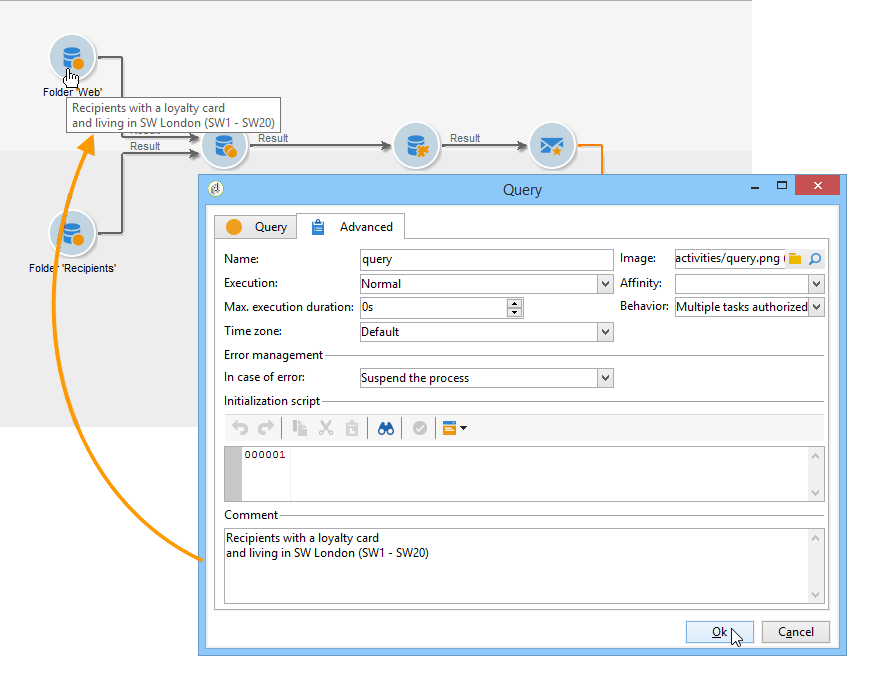

## Targeting workflows {#targeting-workflows}

Targeting workflows enable you to build several delivery targets. You can create queries, define unions or exclusions based on specific criteria, add scheduling, thanks to workflow activities. The result of this targeting can be transferred automatically to a list which can serve as the target of delivery actions

In addition to these activities, Data Management options let you manipulate data and access advanced functions to satisfy complex targeting issues. For more on this, refer to [Data Management](../../workflow/using/targeting-data.md#data-management).

All these activities can be found in the first workflow tab.

>[!NOTE]
>
>Targeting activities are detailed in [this section](../../workflow/using/about-activities.md).

Targeting workflows can be created and edited via the **[!UICONTROL Profiles and Targets > Jobs > Targeting workflows]** node of the Adobe Campaign tree or via the **[!UICONTROL Profiles and Targets > Targeting workflows]** menu of the home page.

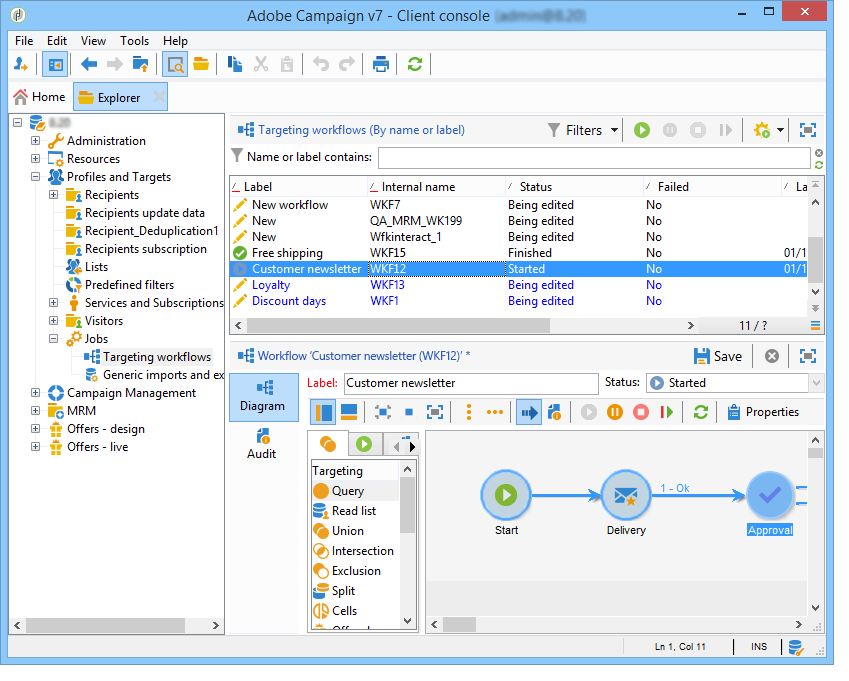

Targeting workflows within the framework of a campaign are stored with all campaign workflows.

### Implementation steps {#implementation-steps-}

Targeting data building stages are as follows:

1. For identifying data in the database, refer to [Creating queries](../../workflow/using/targeting-data.md#creating-queries).
1. For preparing data to meet delivery needs, refer to [Enriching and modifying data](../../workflow/using/targeting-data.md#enriching-and-modifying-data).
1. For using data to perform updates or within a delivery, refer to [Updating the database](../../workflow/using/how-to-use-workflow-data.md#updating-the-database).

The results of all enrichments and all handlings carried out during targeting are stored and accessible in personalization fields, in particular for use when creating personalized messages. For more on this, refer to [Target data](../../workflow/using/executing-a-workflow.md#target-data)

### Targeting and filtering dimensions {#targeting-and-filtering-dimensions}

During data segmentation operations, the targeting key is mapped to a filtering dimension. The targeting dimension lets you define the population targeted by the operation: recipients, contract beneficiaries, operator, subscribers, etc. The filtering dimension lets you select the population based on certain criteria: contract holders, newsletter subscribers, etc.

For example, to select clients who have had a life-insurance policy for over 5 years, select the following targeting dimension: **Clients** and the following filtering dimension: **Contract holder**. You can then define the filtering conditions within the query activity

During the targeting dimension selection stage, only compatible filtering dimensions are offered in the interface.

These two dimensions must be related. Thus, the content of the **[!UICONTROL Filtering dimension]** list depends on the targeting dimension specified in the first field.

For example, for recipients (**recipient**), the following filtering dimensions will be available:

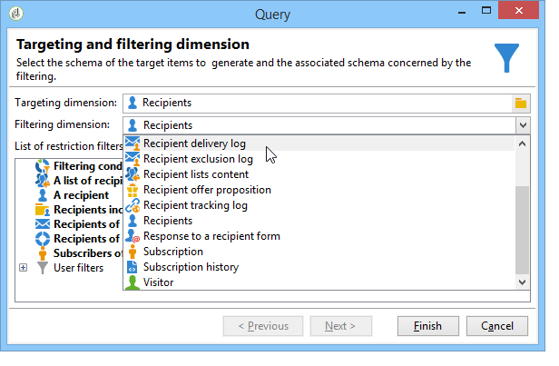

While for **Web Applications**, the list will contain the following filtering dimensions:

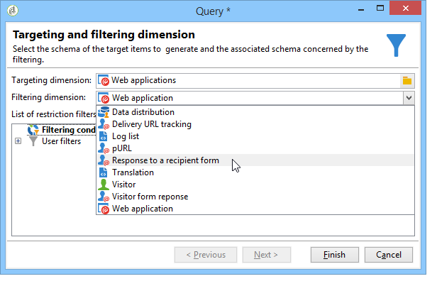

## Campaign workflows {#campaign-workflows}

For each campaign, you can create workflows to be executed from the **[!UICONTROL Targeting and workflows]** tab. These workflows are specific to the campaign.

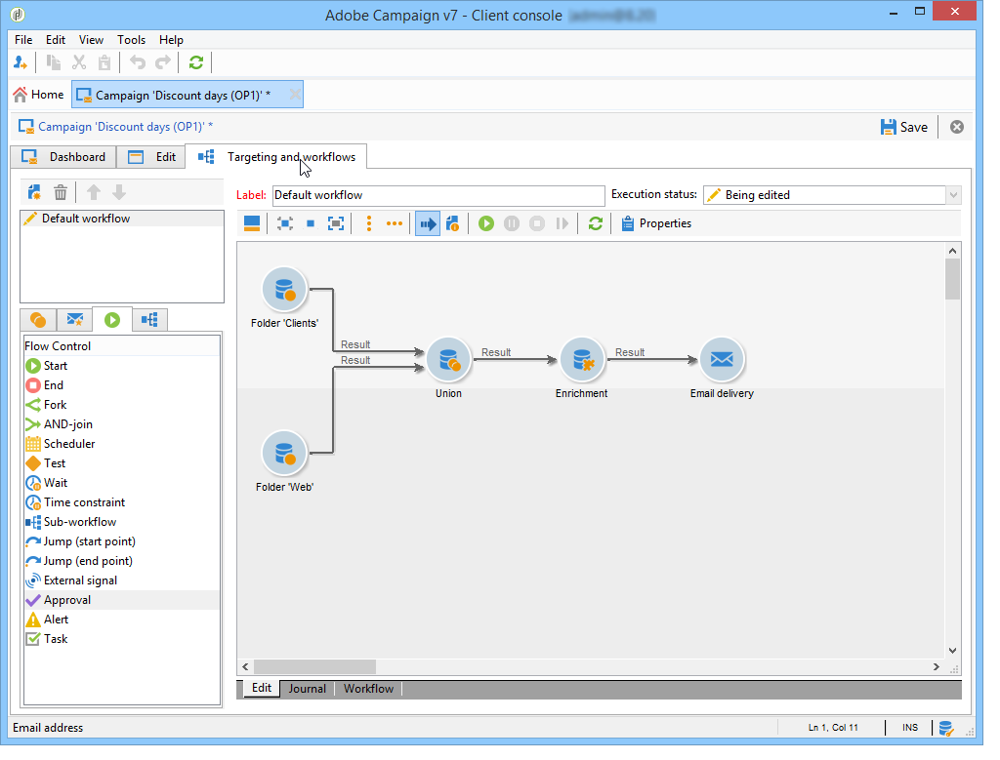

This tab contains the same activities as for all workflows. They are presented in the [Implementation steps](../../workflow/using/building-a-workflow.md#implementation-steps-) section.

In addition to targeting campaigns, campaign workflows enable you to create and configure deliveries entirely for all available channels. Once created in the workflow, these deliveries are available from the dashboard of the campaign.

All campaign workflows are centralized under the **[!UICONTROL Administration > Production > Objects created automatically > Campaign workflows]** node.

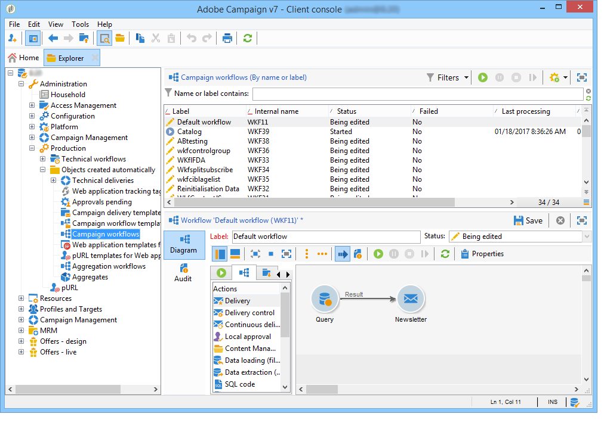

Campaign workflows and implementation examples are detailed in this [page](../../campaign/using/setting-up-marketing-campaigns.md#building-the-main-target-in-a-workflow).

## Technical workflows {#technical-workflows}

Technical workflows are provided out-of-the-box with Adobe Campaign. They are operations or jobs scheduled for periodic execution on the server. They let you carry out maintenance on the database, forward tracking information on deliveries and set up provisional processes on deliveries. Technical workflows are configured via the **[!UICONTROL Administration > Production > Technical workflows]** node.

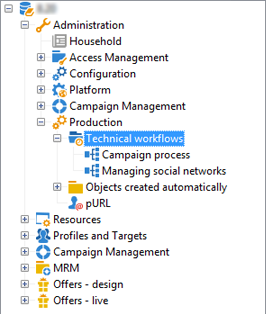

Native templates are available for creating technical workflows. They can be configured to suit your needs.

The **[!UICONTROL Campaign process]** subfolder centralizes the workflows required for executing processes within the campaigns: task notification, stock management, cost calculation, etc.

>[!NOTE]
>
>The list of technical workflows installed with each module is available in a [dedicated section](../../workflow/using/about-technical-workflows.md).

You can create other technical workflows in the **[!UICONTROL Administration > Production > Technical workflows]** node of the tree structure. However, this process is reserved for expert users.

The activities offered are the same as for targeting workflows. For more on this, refer to [Implementation steps](../../workflow/using/building-a-workflow.md#implementation-steps-).

## Workflow templates {#workflow-templates}

Workflow templates contain the overall configuration of properties and possibly a range of activities concatenated within a diagram. This configuration can be reused for creating new workflows containing a certain number of pre-configured elements

You can create new workflow templates based on existing templates or change a workflow into a template directly.

Workflow templates are stored in the **[!UICONTROL Resources > Templates > Workflow templates]** node of the Adobe Campaign tree.

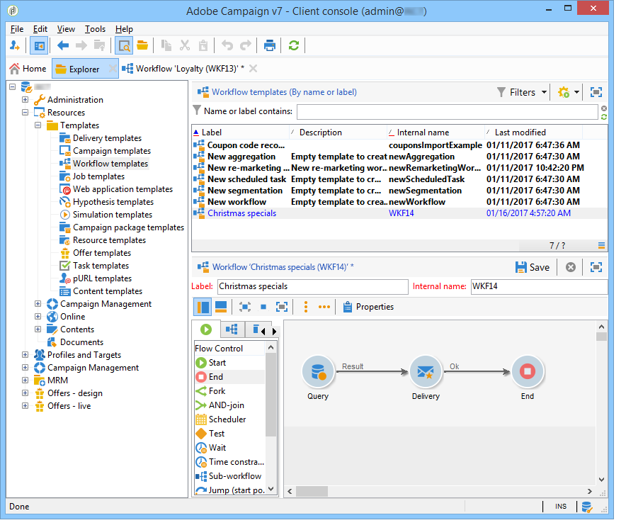

In addition to the usual workflow properties, the template properties allow you to specify the execution file for workflows created based on this template. 

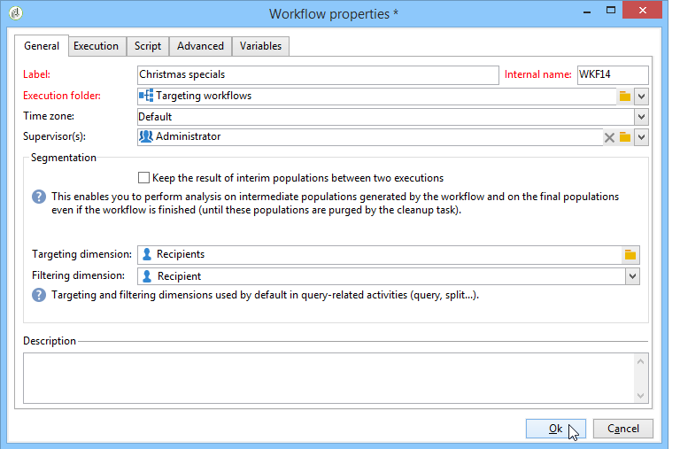

