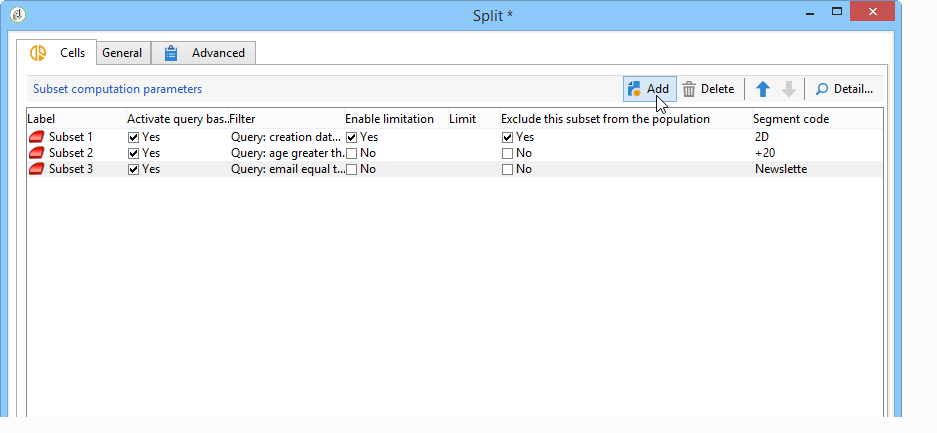
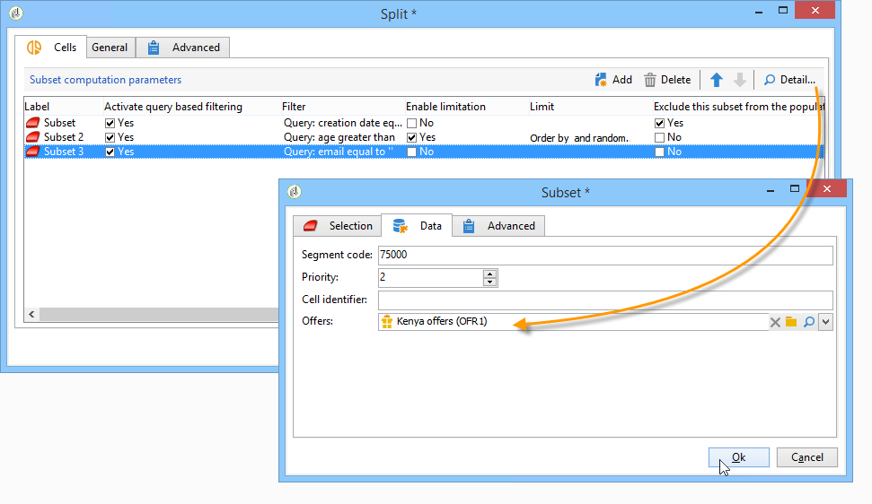

# Cells{#cells}

The **[!UICONTROL Cells]** activity provides a view of the various subsets in the form of data columns. It facilitates subset manipulation and is also designed to encourage personalization possibilities.



This activity can be configured to enter specific parameters based on user needs. By default, the detail of each subset is detailed in a dedicated window via the **[!UICONTROL Selection]** and **[!UICONTROL Advanced]** tabs. In the example below, the form has been modified: a **[!UICONTROL Data]** tab has been added to enable the association of an offer and a priority level for each subset.



For this configuration, the following information was added to the workflow form (in the **[!UICONTROL Administration > Configurations > Input forms]** node of the Adobe Campaign tree):

```
<container img="nms:miniatures/mini-enrich.png" label="Data">
                <input xpath="@code"/>
                <container xpath="select/node[@alias='@numTest']">
                  <input alwaysActive="true" expr="'long'" type="expr" xpath="@type"/>
                  <input alwaysActive="true" expr="'Priority'" type="expr" xpath="@label"/>
                  <input label="Priority" maxValue="12" minValue="0" type="number"
                         xpath="@value" xpathEditFromType="@type"/>
                </container>
                <container xpath="select/node[@alias='@test']">
                  <input alwaysActive="true" expr="'string'" type="expr" xpath="@type"/>
                  <input alwaysActive="true" expr="'Identifier'" type="expr" xpath="@label"/>
                  <input label="Cell identifier" xpath="@value"/>
                </container>
                <container xpath="select/node[@alias='linkTest']">
                  <input alwaysActive="true" expr="'link'" type="expr" xpath="@type"/>
                  <input alwaysActive="true" expr="'nms:offer'" type="expr" xpath="@dataType"/>
                  <input alwaysActive="true" expr="'Offre'" type="expr" xpath="@label"/>
                  <input computeStringAlias="@valueLabel" label="Offers" notifyPathList="@_cs|@valueLabel"
                         schema="nms:offer" type="linkEdit" xpath="@value"/>
                </container>
```

Entry form personalization in Adobe Campaign is reserved for expert users. For more on this, refer to this [section](../../configuration/using/identifying-a-form.md).
