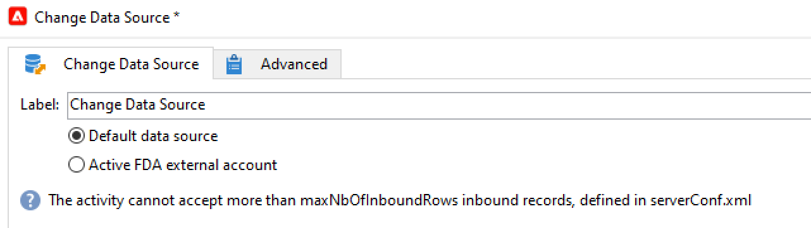
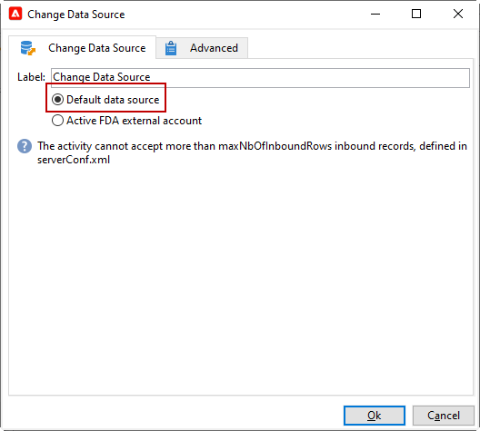
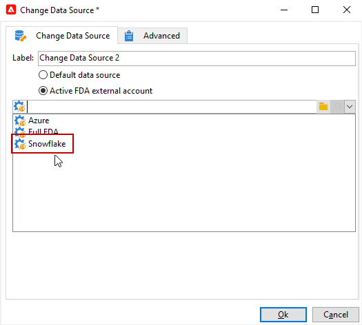

# Change data source {#change-data-source}

>[!NOTE]
>
> The **[!UICONTROL Change data source]** activity is only available with the **[!UICONTROL Access to external data (Federated Data Access)]** package. For more information on Adobe Campaign Classic built-in packages, refer to this [page](../../installation/using/installing-campaign-standard-packages.md).

The **[!UICONTROL Change data source]** activity allows you to change the data source of a workflow **[!UICONTROL Working table]**. This provides more flexibility to manage data across different data sources such as FDA, FFDA and local database.

The **[!UICONTROL Working table]** allows Adobe Campaign Classic workflow to handle data and share data with the workflow activities.
By default, the **[!UICONTROL Working table]** is created in the same database as the source of the data we query on.

For example, when querying the **[!UICONTROL Profiles]** table, stored on the Cloud database, you will create a **[!UICONTROL Working table]** on the same Cloud database.
To change this, you can add the **[!UICONTROL Change Data Source]** activity to choose a different data source for your **[!UICONTROL Working table]**.

Note that when using the **[!UICONTROL Change Data Source]** activity, you will need to switch back to the Cloud database to continue the workflow execution.

To use the **[!UICONTROL Change Data Source]** activity:

1. Create a workflow.

1. Query your targeted recipients with a **[!UICONTROL Query]** activity. 

    For more information on the **[!UICONTROL Query]** activity, refer to this [page](../../workflow/using/query.md#creating-a-query).

1. From the **[!UICONTROL Targeting]** tab, add a **[!UICONTROL Change data source]** activity.

   

1. Double-click your **[!UICONTROL Change data source]** activity to select **[!UICONTROL Default data source]**.
    
    The working table, which contains the result of your query, is then moved to the default PostgreSQL database.

   

1. From the **[!UICONTROL Actions]** tab, drag and drop a **[!UICONTROL JavaScript code]** activity to perform unitary operations on the working table.

    For more information on the **[!UICONTROL JavaScript code]** activity, refer to the [JavaScript code and Advanced JavaScript code](../../workflow/using/sql-code-and-javascript-code.md#javascript-code) page.

1. Add another **[!UICONTROL Change data source]** activity to switch back to the Cloud database. 
    
1. Double-click your activity and select **[!UICONTROL Active FDA external account]** then the corresponding **[!UICONTROL External database]** external account.

   

1. You can now start your workflow.
