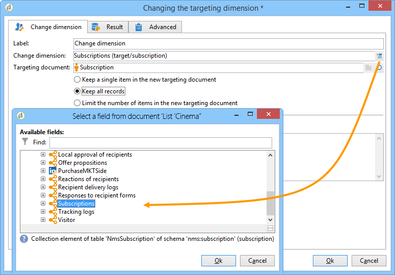
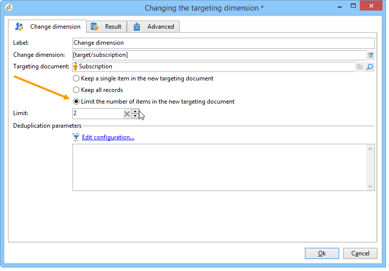
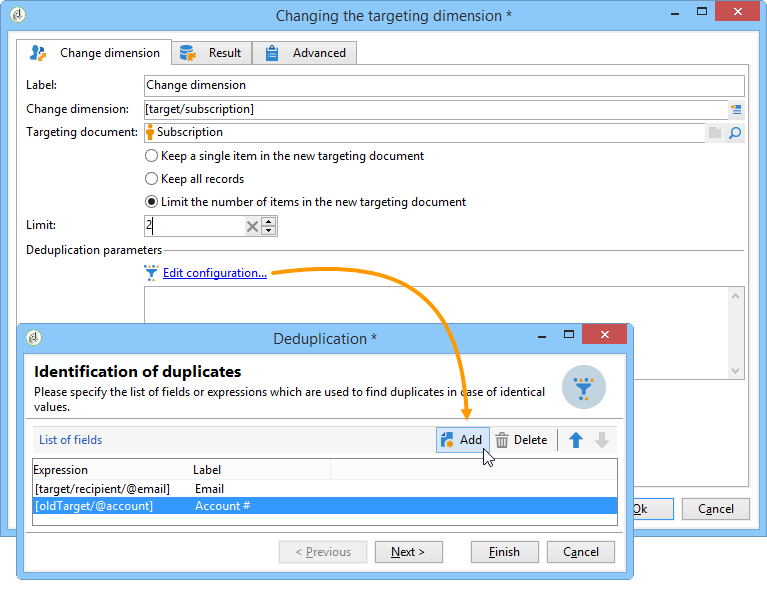
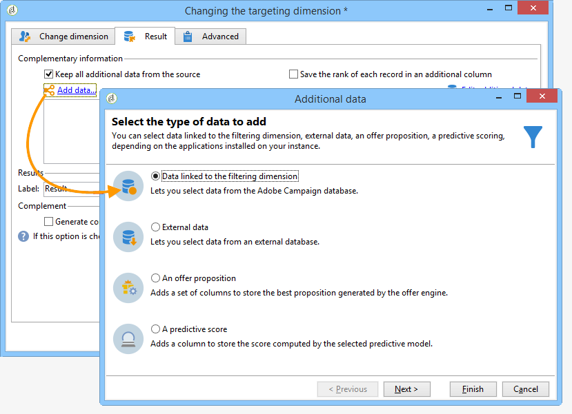
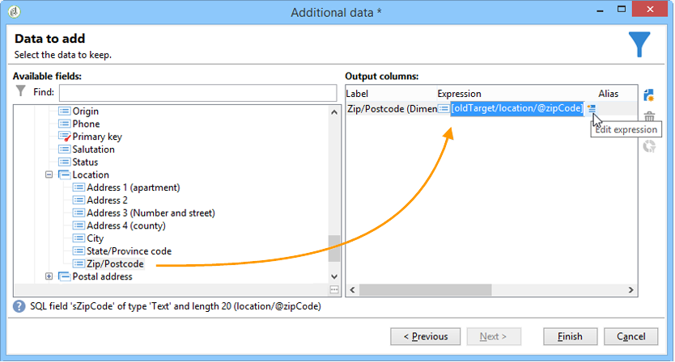
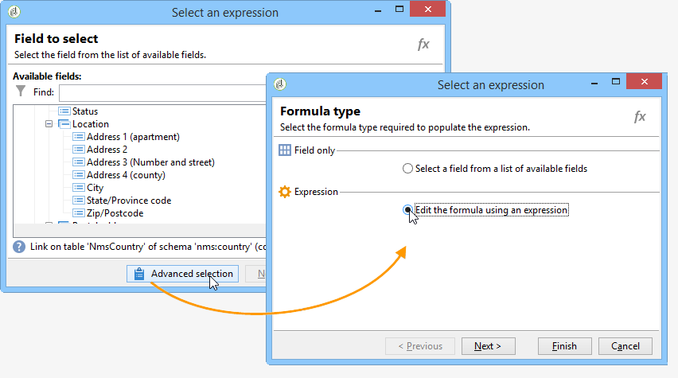
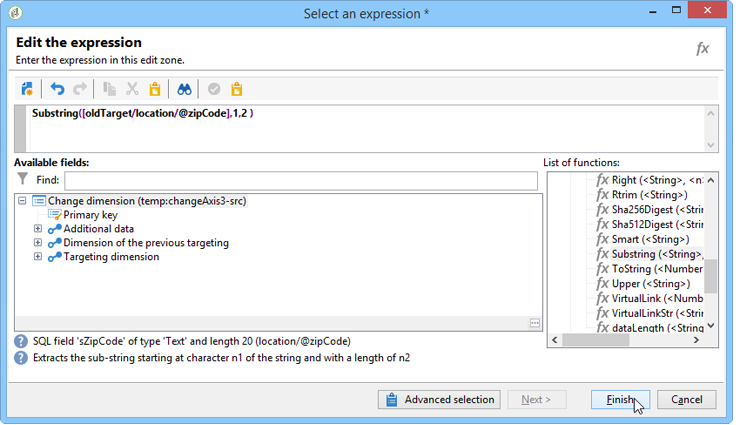
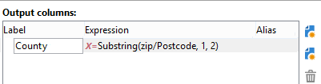
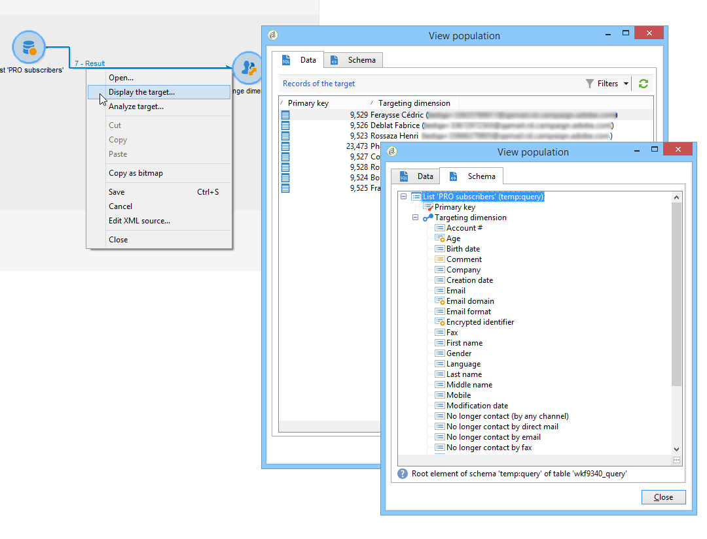
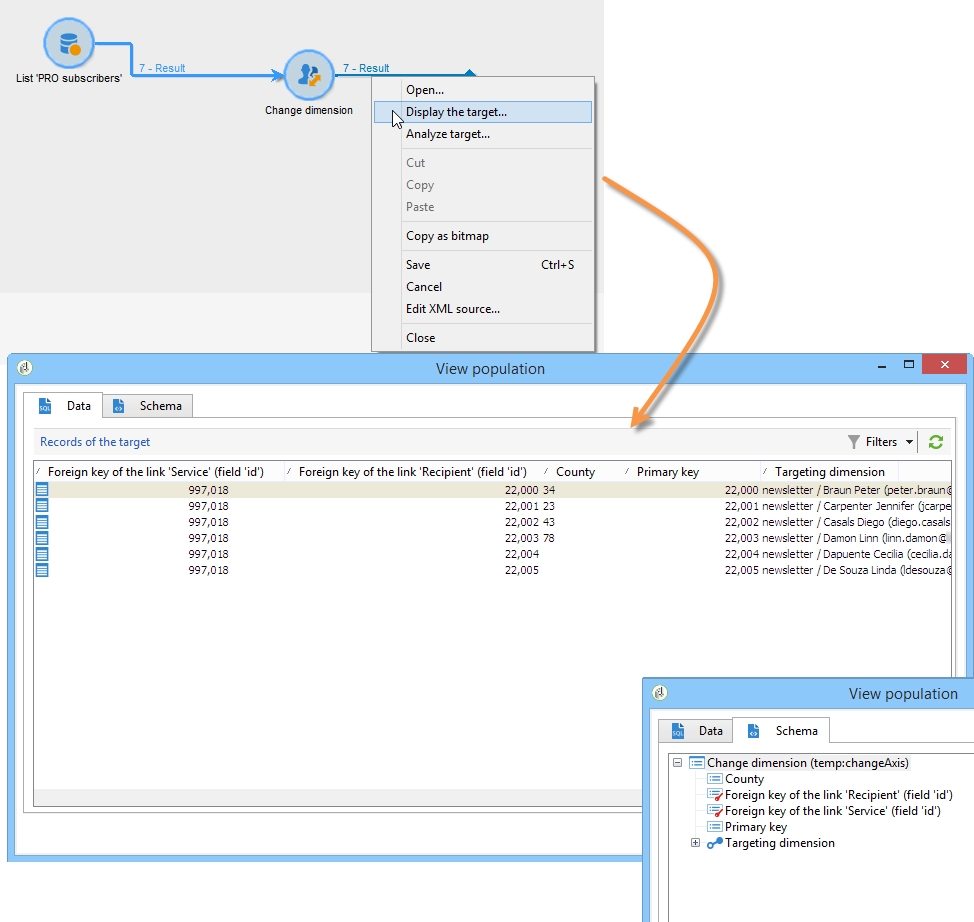

# Change dimension{#change-dimension}

The change dimension activity lets you change the targeting dimension during the target construction cycle. Axis shifting depends on the data template and the input dimension. This lets you switch from the "contracts" dimension to the "clients" dimension, for example.

You can also use this activity to define the additional columns of the new target.

It is possible to define data deduplication criteria.

## Configuration mode {#configuration-mode}

To configure the change dimension activity, apply the following steps:

1. Select the new targeting dimension via the **[!UICONTROL Change dimension]** field.

   

1. During dimension change, you can keep all elements or select those to be kept in output. In the following example, the max. number of duplicates is set to 2.

   

   When you choose to keep only one record, a collection is displayed in the work schema: This collection represents all records that will not be targeted in the final result (since only one record is kept). Like all other collections, this one lets you calculate aggregates or recover information in columns.

   For example, if you change the **[!UICONTROL Customers]** dimension to the **[!UICONTROL Recipients]** dimension, it will be possible to target customers of a specific store, while adding the number of purchases made.

1. If you choose not to keep all this information, you can configure the duplicate management mode.

   

   The blue arrows enable you to define the duplicate processing priority.

   In the example above, recipients will be deduplicated on their email address first, then on their account number if necessary.

1. The **[!UICONTROL Result]** tab lets you add additional information.

   For example, you can recover the county based on the zip code by using a **Substring** type function. To do this:

    * Click the **[!UICONTROL Add data...]** link and select **[!UICONTROL Data linked to the filtering dimension]**.
    
      

      >[!NOTE]
      >
      >For information on creating and managing additional columns, refer to [Adding data](../../workflow/using/query.md#adding-data).

    * Select the previous targeting dimension (before axis switch) and select the **[!UICONTROL Zip Code]** in the recipient's **[!UICONTROL Location]** sub-tree, then click **[!UICONTROL Edit expression]**.
    
      

    * Click **[!UICONTROL Advanced selection]** and choose **[!UICONTROL Edit the formula using an expression]**.
    
      

    * Use the functions offered in the list and specify the calculation to be performed.
    
      

    * Finally, enter the label of the column you have just created.
    
      

1. Execute the workflow to view the result of this configuration. Compare the data in the tables before and after the change dimension activity, and compare the structure of the workflow tables, as shown in the following examples:

   

   
