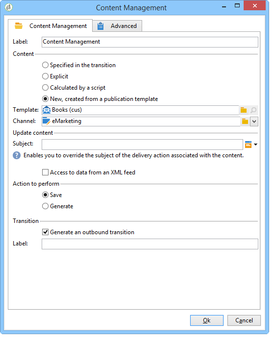
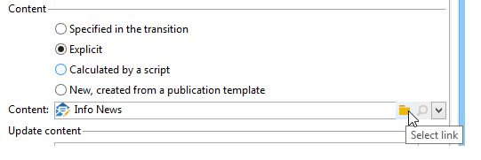
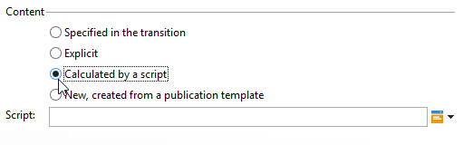
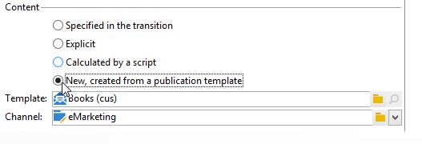
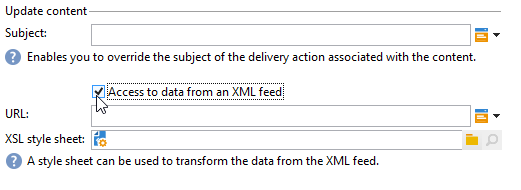
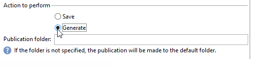

# Content Management{#content-management}

A **Content management** activity lets you create and manipulate a content and generate files based on this content. This content can then be delivered via a 'Delivery' activity.

>[!CAUTION]
>
>Content management is an optional Adobe Campaign module. Please check your license agreement.

The properties of the activity are divided into three steps:

* **Content selection**: the content can have been created previously or can be created via the activity.
* **Content update**: the task can modify the subject of the content or import all of the XML content.
* **Action**: the resulting content can be saved or generated.

  

  For more on configuring and using content management in Adobe Campaign, refer to this [section](../../delivery/using/about-content-management.md).

1. **Content**

    * **[!UICONTROL Specified in the transition]**

      This option lets you use the content specified in the transition, i.e. the event that activates content management must contain a **[!UICONTROL contentId]** variable. This variable can have been set by a previous content management or by any script.
    
    * **[!UICONTROL Explicit]**

      This option lets you select a content already created, via the **[!UICONTROL Content]** field. This field is visible only when the **[!UICONTROL Explicit]** option is selected.
    
      

    * **[!UICONTROL Calculated by a script]**

      The content identifier is calculated by a script. The **[!UICONTROL Script]** field lets you define a JavaScript template evaluating the identifier (primary key) of the content. This field is visible only when the **[!UICONTROL Calculated by a script]** option is selected.
    
      

    * **[!UICONTROL New, created from a publication template]**

      Creates a new content from a publication template. This new content will be saved in the file specified in the **[!UICONTROL String]** field. The **[!UICONTROL Template]** field specifies the publication template to be used to create the content.
    
      

1. **Update content**

    * **[!UICONTROL Subject]**

      This field lets you modify the subject of the content.
    
    * **[!UICONTROL Access to data from an XML feed]**

      This option lets you construct the content from an XML document downloaded via an XSL stylesheet. When this option is selected, the **[!UICONTROL URL]** field specifies the XML content downloading URL. The **[!UICONTROL XSL stylesheet]** lets you specify the stylesheet to be used to transform the downloaded XML document. This property is optional.
    
      

1. **Action to execute**

    * **[!UICONTROL Save]**

      This option saves the created or modified content.

      The outbound transition is activated only once, with the content saved in the **[!UICONTROL contentId]** variable as a parameter.
    
    * **[!UICONTROL Generate]**

      This option saves the content, then generates the output files for each transformation template with a 'File' type publication.
    
      

      The outbound transition is activated for each file generated with the identifier of the content saved in the **[!UICONTROL contentId]** variable as its parameter and the filename in the **[!UICONTROL filename]** variable.

## Input parameters {#input-parameters}

* contentId

Identifier of the content to be used if the **[!UICONTROL Specified in the transition]** option is enabled.

## Output parameters {#output-parameters}

* contentId

  Content identifier.

* filename

  Full name of the generated file if the selected action is **[!UICONTROL Generate]**.

## Examples {#examples}

Examples are provided in this [section](../../delivery/using/automating-via-workflows.md#examples).
