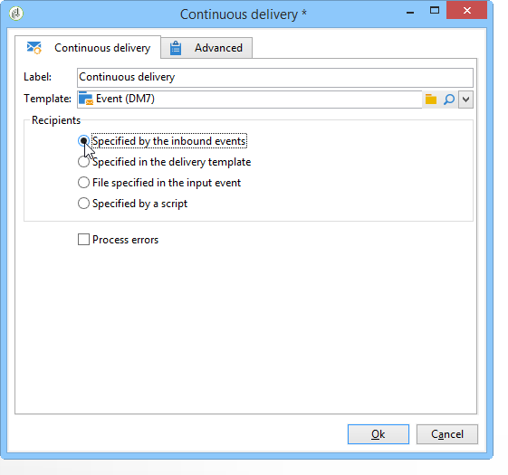
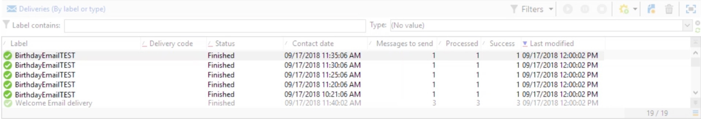

# Continuous delivery{#continuous-delivery}

A **Continuous delivery** type action lets you add new recipients to an existing delivery. This delivery type avoids you having to create a new delivery each time: This mode is often more efficient, in particular for low-volume alerts or notifications sent out as and when needed.

 [Discover this feature in video](#continuous-delivery-video)

At a delivery template level, you can specify a script to calculate the label (and the campaign folder) of the associated delivery. If the script calculates a delivery that does not yet exist, it is created on the fly.

The **[!UICONTROL Process errors]** option displays a particular transition which will be activated if an error is generated. In this case, the workflow does not go into error mode and carries on with the execution.

Errors taken into account are file system errors (file could not be moved, directory could not be accessed, etc.).

This option does not process errors related to activity configuration, i.e. invalid values.

## Input parameters {#input-parameters}

* tableName
* schema

Each inbound event must specify a target defined by these parameters.

Only when the **[!UICONTROL Specified by the inbound event]** option is selected.

## Output parameters {#output-parameters}

* tableName
* schema
* recCount

This set of three values identifies the target resulting from the on the fly delivery. **[!UICONTROL tableName]** is the name of the table which memorizes the target's identifiers, **[!UICONTROL schema]** is the schema of the population (usually nms:recipient) and **[!UICONTROL recCount]** is the number of elements in the table.

The transition associated with the complement has the same parameters.

## How to set up a continuous delivery

This section explains how to set up a continuous delivery.

The **continuous delivery** lets you add new recipients to an existing delivery and avoids you having to create a new delivery each time a new recipient is added. You can update the creative directly in the campaign workflow and it will update the template in the delivery template Resource folder.  
  
A continuous delivery will create a SINGLE delivery and delivery logs (broadLog) and tracking logs that reference that one delivery are added each time it executes.

## Tutorial video {#continuous-delivery-video}

This video shows how to configure a continuous delivery with an incremental query.

>[!VIDEO](https://video.tv.adobe.com/v/25039?quality=12)

Additional Campaign Classic how-to videos are available [here](https://experienceleague.adobe.com/docs/campaign-classic-learn/tutorials/overview.html).
