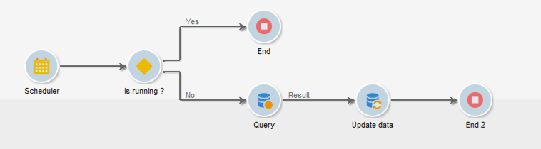
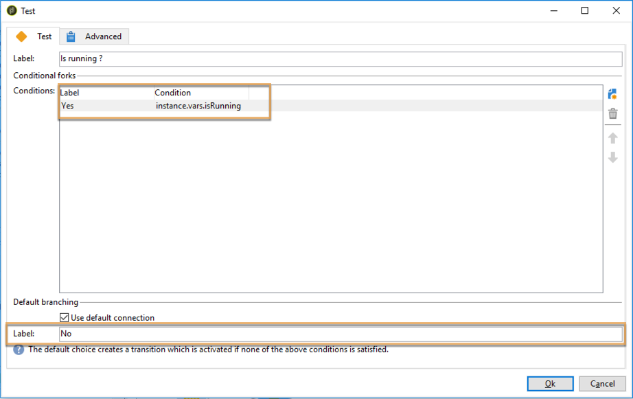
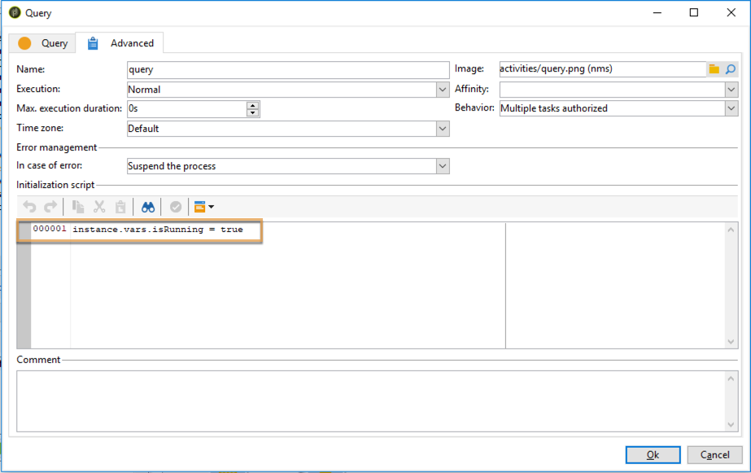
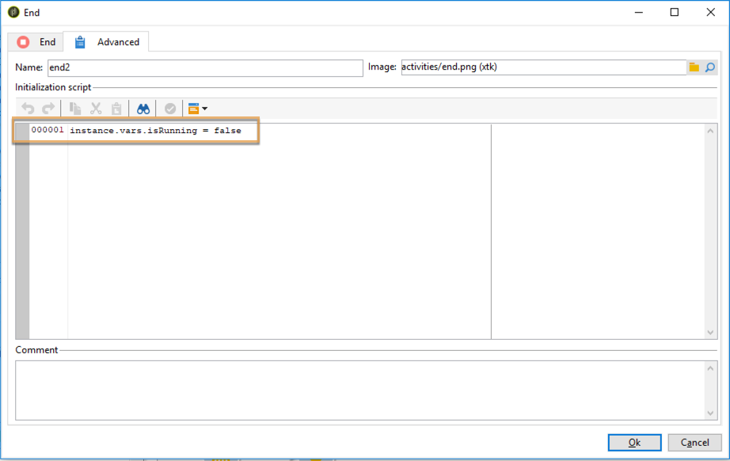

# Coordinating data updates{#coordinating-data-updates}

This use case details the creation of a workflow which lets you manage concomittent updates when using several executions of a workflow.

The aim is to check that the update process has ended before executing another update operation. To do this, we will set up an instance variable, and let the workflow test if the instance is running to decide whether or not to continue the execution of the workflow and perform the update.

This workflow is made up of:

* a **Scheduler** activity, that executes the workflow on a specific frequency.
* a **Test** activity that checks if the workflow is already executing.
* **Query** and **Update data** activities in case the workflow is not already executing, followed by an **End** activity that reinitializes the workflow instance variable to false.
* An **End** activity if the workflow is already executing.

To build the workflow, follow the steps below:

1. Add a **Scheduler** activity, then configure its frequency according to your needs.
1. Add a **Test** activity to check if the workflow is already executing, then configure it as below.

   >[!NOTE]
   >
   >"isRunning" is the instance variable name we have chosen for this example. This is not a built-in variable.

   

1. Add an **End** activity to the **No** fork. This way, nothing will be executed if the workflow is already executing.
1. Add the desired activities to the **Yes** fork. In our case, **Query** and **Update Data** activities.
1. Open the first activity, then add the **instance.vars.isRunning = true** command in the **[!UICONTROL Advanced]** tab. This way, the instance variable is set as running.

   

1. Add an **End** activity at the end of the **[!UICONTROL Yes]** fork, then add the **instance.vars.isRunning = false** command in the **[!UICONTROL Advanced]** tab.

   This way, no action will be executed as long the workflow is executing.

   

**Related topics:**

* [Preventing simultaneous multiple executions](../../workflow/using/monitoring-workflow-execution.md#preventing-simultaneous-multiple-executions)
* [Update Data activity](../../workflow/using/update-data.md)
