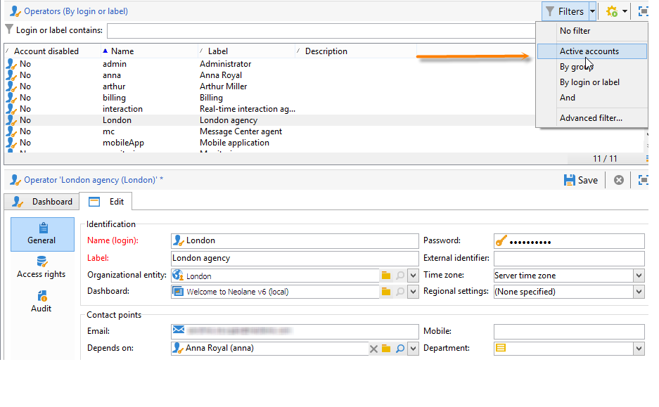
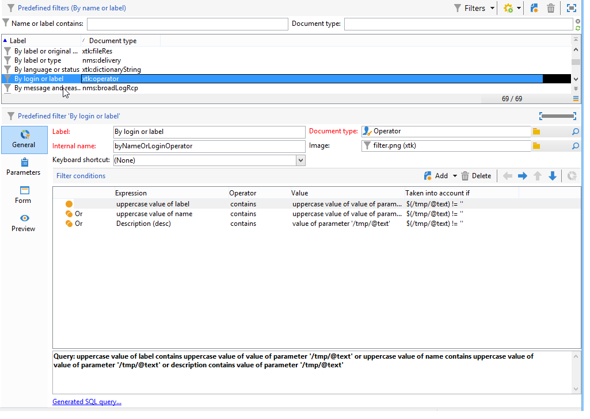
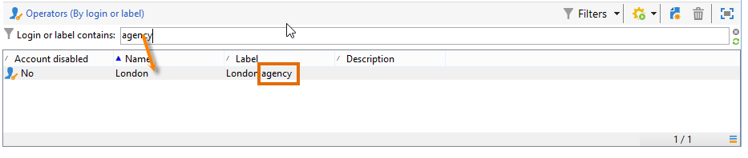
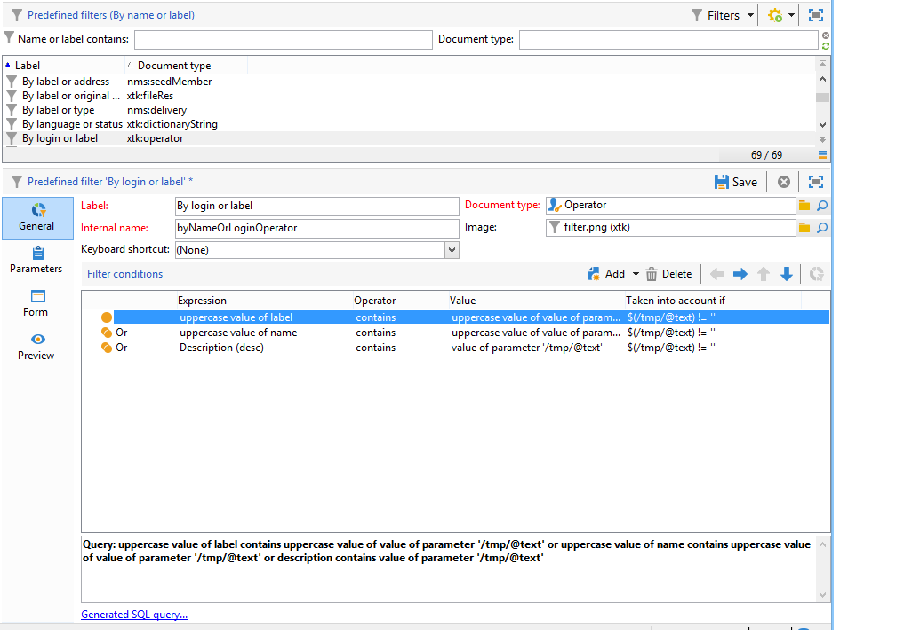
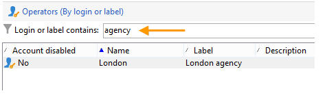

# Creating a filter {#creating-a-filter}

The filters available in Adobe Campaign are defined via filtering conditions which are created using the same operating mode as queries.

>[!NOTE]
>
>For more on creating filters, refer to [this section](../../platform/using/filtering-options.md).

The **[!UICONTROL Administration > Configuration > Predefined filters]** node contains all the filters used in the lists and overviews.

For example, the list of operators can be filtered by **[!UICONTROL Active accounts]**:

The matching filter contains the query on the **[!UICONTROL Account disabled]** value of the **[!UICONTROL Operators]** schema:

For the same list, the **[!UICONTROL By login or label]** filter lets you filter the data on the list based on the value entered in the filter field:

It is built as follows:

To match the filtering conditions, the operator account must check one of the following conditions:

* Its label contains the characters entered in the input field,
* The operator name contains the characters entered in the input field,
* The content of the description area contains the characters entered in the input field.

>[!NOTE]
>
>The **[!UICONTROL Upper]** function lets you deactivate the case-sensitive function.

The **[!UICONTROL Taken into account if]** column lets you define the application criteria for these filtering conditions. Here, the **$(/tmp/@text)** characters represent the content of the input field linked to the filter: 

Here, **$(/tmp/@text)='agency'**

The **$(/tmp/@text)!=''** expression applies each condition when the input field isn't empty.
