# Creating a summary list{#creating-a-summary-list}

This use case details the creation of a workflow which, after collecting files and following several enrichments, lets you create a summary list. The example is based on a list of contacts who made purchases in a store.

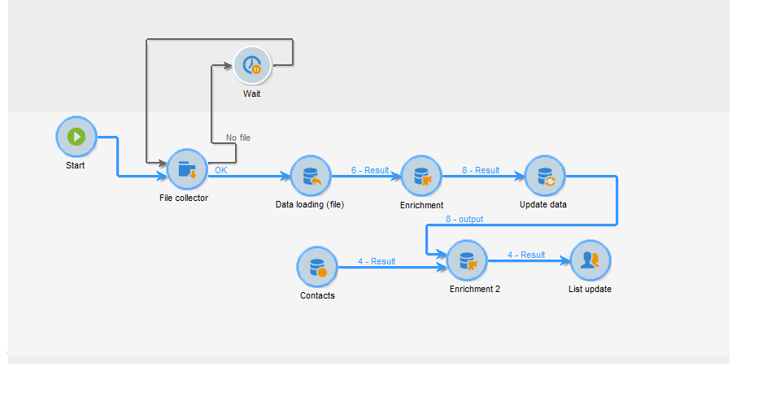

The following data structure is used:

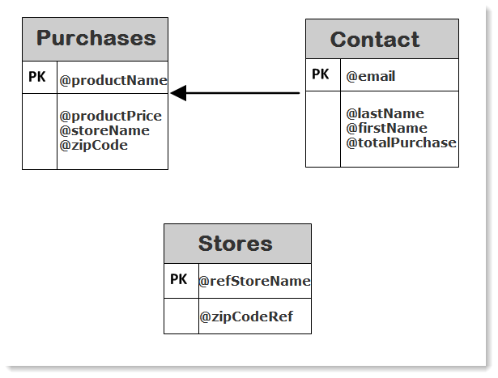

Its purpose is to:

* To use the various options of the enrichment activity
* To update the data in the database following a reconciliation
* To create a global "view" of the enriched data

To create a summary list, you need to follow these steps:

1. Collecting and loading a "Purchases" file in the work table of the workflow
1. Enriching the imported data by creating a link to a reference table
1. Updating the "Purchases" table with the enriched data
1. Enriching the "Contacts" data with an aggregate calculation from the "Purchases" table
1. Creating a summary list

## Step 1: Loading the file and reconciling the imported data {#step-1--loading-the-file-and-reconciling-the-imported-data}

The data to be loaded is "Purchase" related data with the following format:

```
Product Name;Product price;Store
Computer;2000;London 3
Tablet;600;Cambridge
Computer;2000;London 5
Comptuer;2000;London 8
Tablet;600;Cambridge
Phone;500;London 5
```

This data is contained in a "Purchases.txt" text file.

1. Add the **File collector** and **Data loading (file)** activities to the workflow.

   The **File collector** activity lets you collect and send files from and to the Adobe Campaign server.

   The **Data loading(file)** activity lets you enrich the work table of the workflow with the collected data.

   For more on this activity, refer to [Loading data from a file](../../platform/using/import-export-workflows.md#loading-data-from-a-file).

1. Configure the **File collector** activity to collect text (&#42;.txt) type files from the selected directory.

   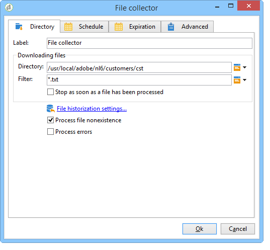

   The **File collector** activity lets you manage the absence of a file in the source directory. To do this, check the **[!UICONTROL Process file nonexistence]** option. In this workflow, a **Wait** activity has been added to try another file collection if it is missing from the directory at the time of collection.

1. Configure the **Data loading (file)** activity using a sample file with the same format as the data to be imported.

   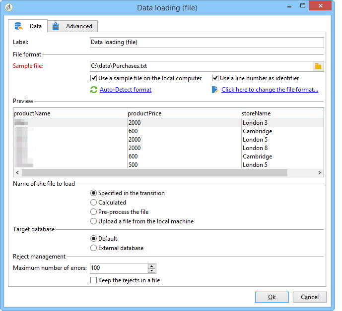

   Click the **[!UICONTROL Click here to change the file format...]** link to rename the columns using the internal names and labels of the "Purchases" table.

   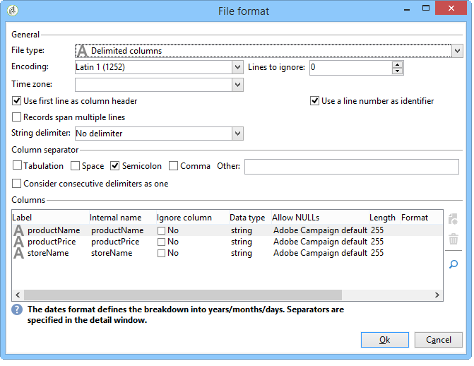

Once the data has been imported, enrichment is carried out by creating a link to a reference table which matches the "Stores" schema.

Add the Enrichment activity and configure it as follows:

1. Select the main set made up of the data from the **Data loading(file)** activity.

   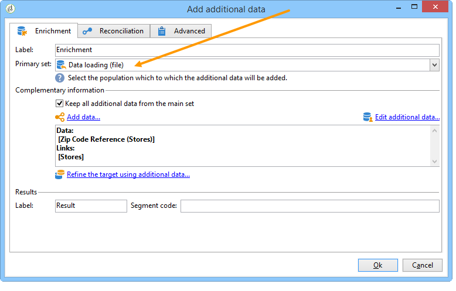

1. Click **[!UICONTROL Add data]**, then select the **[!UICONTROL A link]** option.

   

1. Select the **[!UICONTROL Define a collection]** option.
1. Select the "Stores" schema as a target.

   

For more on the various types of links, refer to [Enriching and modifying data](../../workflow/using/targeting-data.md#enriching-and-modifying-data).

In the following window, you need to create a join condition by selecting the source field (in the main set) and the target field (belonging to the "Stores" schema) to configure data reconciliation.

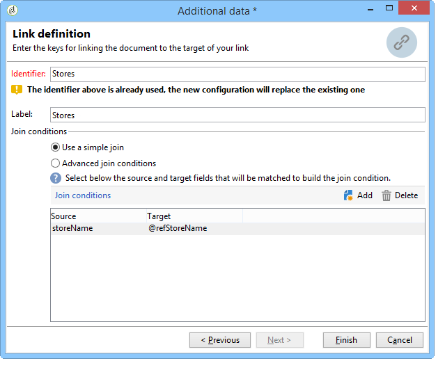

Now the link is created, we're going to add a column to the work table of the workflow from the "Stores" schema: the "ZipCode Reference" field.

1. Open the enrichment activity.
1. Click **[!UICONTROL Edit additional data]**.
1. Add the "ZipCode Reference" field to the **[!UICONTROL Output columns]**.

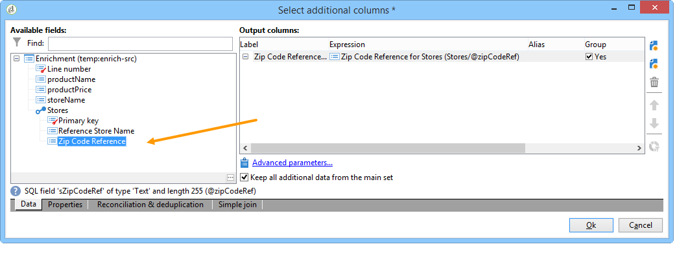

The data in the work table of the workflow after this enrichment will be as follows:

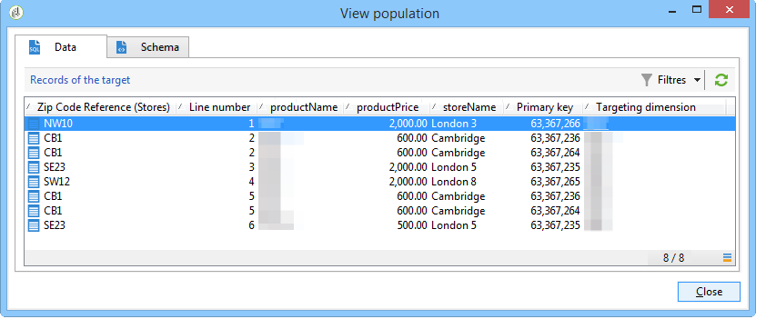

## Step 2: Writing enriched data to the 'Purchases' table {#step-2--writing-enriched-data-to-the--purchases--table}

This step details how to write the imported and enriched data to the "Purchases" table. To do this, we need to use an **Update data** activity.

A reconciliation between the data in the work table of the workflow and the **Purchases** targeting dimension must be carried out before the data in the **Purchases** table is updated.

1. Click the **[!UICONTROL Reconciliation]** tab of the enrichment activity.
1. Select the targeting dimension, the "Purchases" schema in this case.
1. Select a "Source expression" for the data in the workflow table (the "storeName" field in this case).
1. Select a "Destination expression" for the data in the "Purchases" table (the "storename" field in this case).
1. Check the **[!UICONTROL Keep unreconciled data coming from the work table]** option.

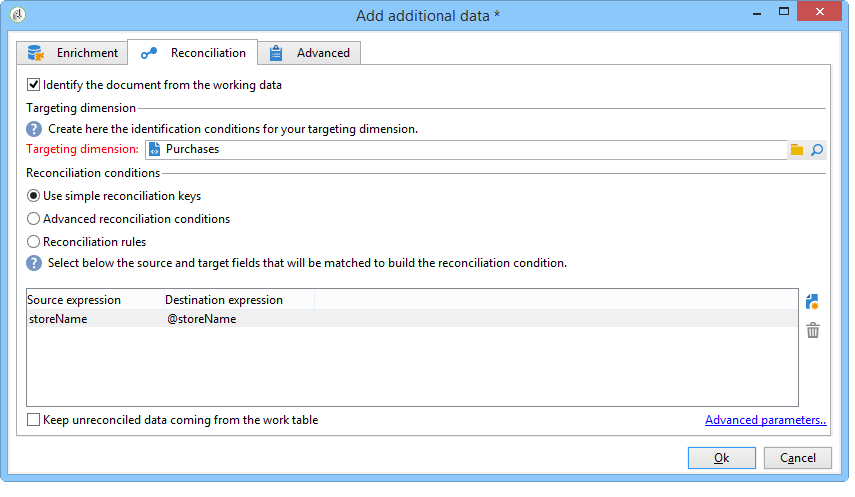

In the **Update data** activity, the following configuration is needed:

1. Select the **[!UICONTROL Insert or update]** option in the **[!UICONTROL Operation type]** field to avoid creating new records each time the file is collected.
1. Select the **[!UICONTROL By directly using the targeting dimension]** value for the **[!UICONTROL Record identification]** option.
1. Select the "Purchases" schema as a **[!UICONTROL Document type]**.
1. Specify the list of fields to be updated. The **[!UICONTROL Destination]** column lets you define the fields of the "Purchases" schema. The **[!UICONTROL Expression]** column lets you select the fields in the work table to carry out a mapping.
1. Click the **[!UICONTROL Generate an outbound transition]** option.

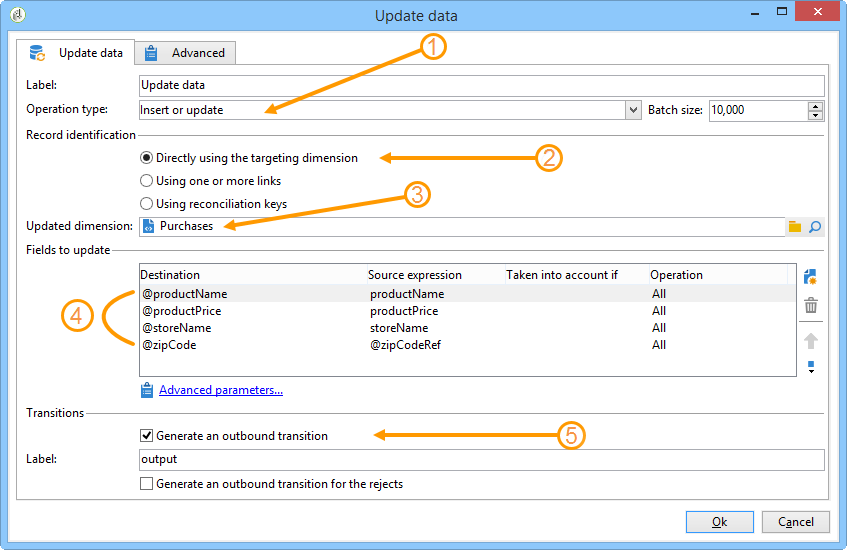

## Step 3: Enriching 'Contact' data {#step-3--enriching--contact--data-}

The "Contacts" schema is physically linked to the "Purchases" schema. This means you can use another option of the "Enrichment" option: adding data linked to the filtering dimension.

The purpose of this second enrichment is to create an aggregate on the purchase schema to calculate the total amount of purchases for each identified contact.

1. Add a **query** type activity that lets you recover all **Contacts** stored.
1. Add an **Enrichment** activity then select the main set resulting from the previous query.
1. Click add **[!UICONTROL Data]**.
1. Click the **[!UICONTROL Data linked to the targeting dimension]** option.
1. Click the **[!UICONTROL Data linked to the filtering dimension]** option in the **[!UICONTROL Select fields to add]** window.
1. Select the **[!UICONTROL Purchases]** node then click **[!UICONTROL Next]**.

   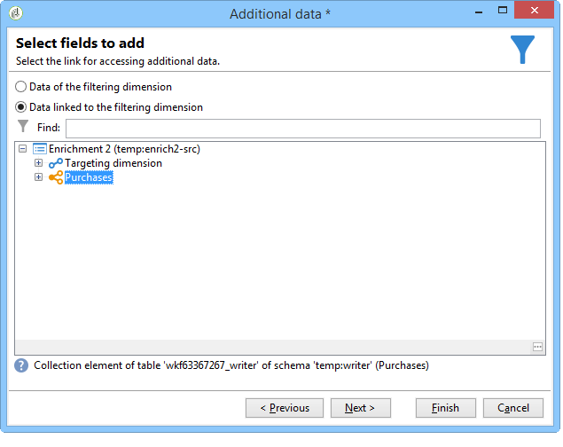

1. Change the **[!UICONTROL Collected data]** field by selecting the **[!UICONTROL Aggregates]** option.

   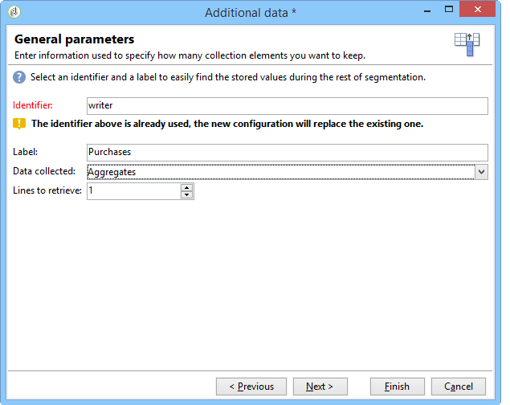

1. Click **[!UICONTROL Next]**.
1. Add the following expression to calculate the purchase total for each contact: "Sum(@prodprice)".

   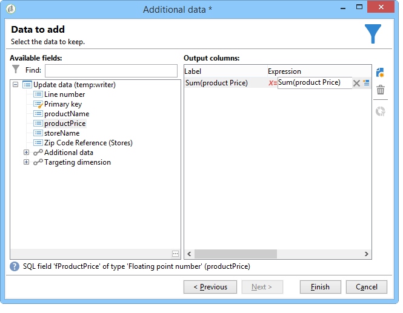

To prepare the summary list, you need to add fields from the "Purchases" fields and from the first enrichment: the "ZipCode Reference" field.

1. Click the **[!UICONTROL Edit additional data...]** link in the enrichment activity.
1. Add the "Store name" and "Purchases / Zip Code Reference" fields.

   

1. Click the **[!UICONTROL Properties]** tab.
1. Change the second link to create only one line.

   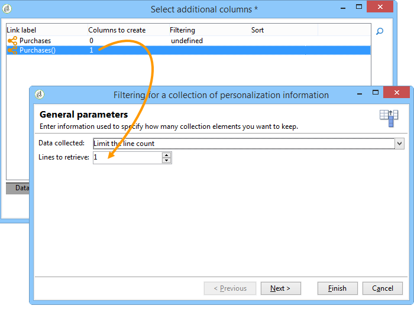

## Step 4: Creating and adding to a summary list {#step-4--creating-and-adding-to-a-summary-list}

The last step involves writing all the enriched data to a list.

1. Add a **List update** activity to the workflow. This activity must be linked to the outbound transition of the second enrichment activity.
1. Select the **[!UICONTROL Create the list if necessary (Calculated name)]** option.
1. Select a value for the calculated name. The label chosen for the list is the current date: <%= formatDate(new Date(), "%2D/%2M/%2Y") %>.

Once the workflow is executed, the list will include:

* a list of contacts,
* a "Total purchases" column,
* a "Store name" column,
* a "Zip Code Reference" column entered for all stores contained in the store reference schema.

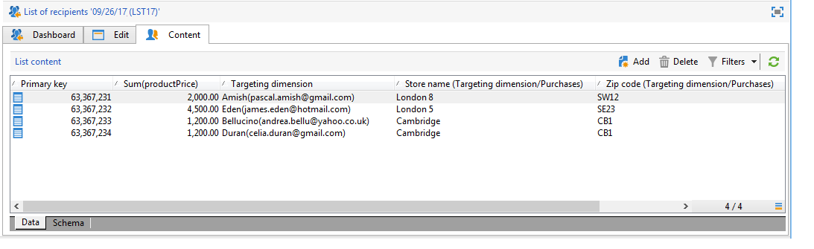
