# CRM Connector{#crm-connector}

The **CRM connector** lets you configure the data synchronization between Adobe Campaign and a CRM.

For more information on CRM connectors in Adobe Campaign, refer to this [section](../../platform/using/crm-connectors.md).

This means you can:

* Import from the CRM (refer to [Importing from the CRM](#importing-from-the-crm)),
* Export to CRM (refer to [Exporting to the CRM](#exporting-to-the-crm)),
* Import objects deleted in the CRM (refer to [Importing objects deleted in the CRM](#importing-objects-deleted-in-the-crm)),
* Delete objects in the CRM (refer to [Deleting objects in the CRM](#deleting-objects-in-the-crm)).


Select the external account that matches the CRM that you want to configure synchronization with, then select the object to be synchronized (accounts, opportunities, contacts, etc.).


The configuration of this activity depends on the process to be carried out. Various configurations are detailed below.

## Importing from the CRM {#importing-from-the-crm}

To import data via the CRM in Adobe Campaign, you need to create the following type of workflow:

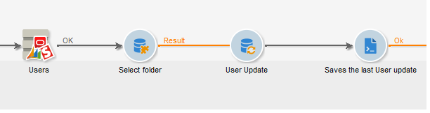

For an import activity, the **CRM Connector** activity configuration steps are:

1. Select an **[!UICONTROL Import from the CRM]** operation.
1. Go to the **[!UICONTROL Remote object]** drop-down list and select the object concerned by the process. This object coincides with one of the tables created in Adobe Campaign during connector configuration.
1. Go to the **[!UICONTROL Remote fields]** section and enter the fields to be imported.

   To add a field, click the **[!UICONTROL Add]** button in the toolbar, then click the **[!UICONTROL Edit expression]** icon.

   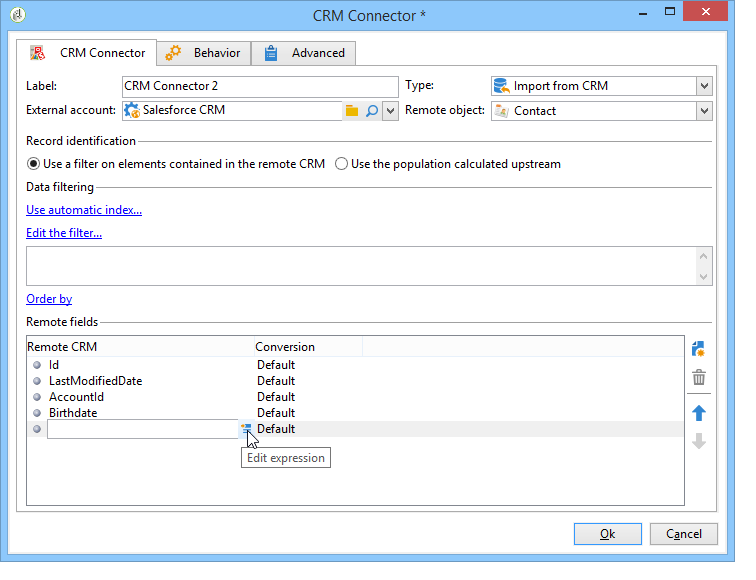

   If necessary, alter the data format via the drop-down list of the **[!UICONTROL Conversion]** columns. Possible conversion types are detailed in this [page](../../platform/using/crm-connectors.md#data-format).

   >[!CAUTION]
   >
   >The identifier of the record in the CRM is mandatory for linking objects in CRM and in Adobe Campaign. It is automatically added when the activity is approved. 
   > 
   >The last modification date on the CRM side is also mandatory for incremental data imports.

1. You can also filter the data to be imported based on your needs. To do this, click the **[!UICONTROL Edit the filter...]** link.

   In the following example, Adobe Campaign will only import contacts for which some activity has been recorded since July 31th 2012.

   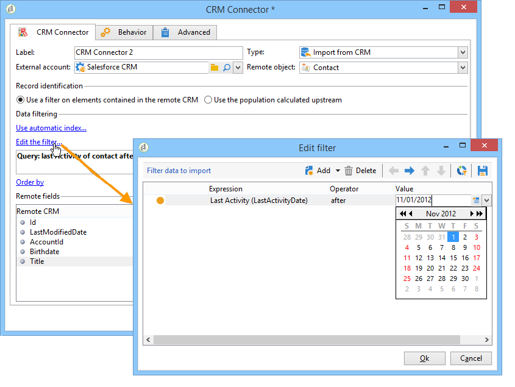

   The limitations linked to data filtering modes are detailed in [Filter on data](#filter-on-data) section.

1. The **[!UICONTROL Use automatic index]** option enables you to automatically manage incremental object synchronization between the CRM and Adobe Campaign, depending on the date and their last modification.

   For more on this, refer to [Variable management](#variable-management).

## Variable management {#variable-management}

Enabling the **[!UICONTROL Automatic index]** option lets you collect only objects modified since the last import.

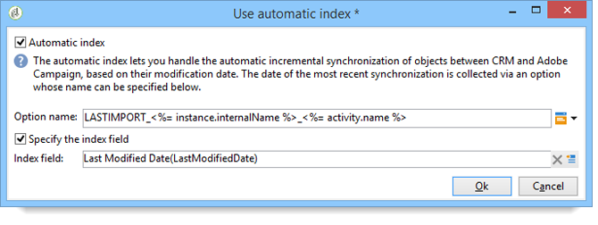

The date of the last synchronization is stored in the option specified in the configuration window, by default:

```
LASTIMPORT_<%=instance.internalName%>_<%=activityName%>
```

You can specify the remote CRM field to be taken into account to identify the most recent changes.

By default, the following fields are used (in the specified order):

* For Microsoft Dynamics: **modifiedon**,
* For Oracle On Demand: **LastUpdated**, **ModifiedDate**, **LastLoggedIn**,
* For Salesforce.com: **LastModifiedDate**, **SystemModstamp**.

Activating the **[!UICONTROL Automatic index]** option generates three variables that can be used in the synchronization workflow via a **[!UICONTROL JavaScript code]** type activity. These activities are:

* **varscrmOptionName**: represents the name of the option that contains the last import date.
* **vars.crmStartImport**: represents the start date (included) of the last data recovery.
* **vars.crmEndDate**: represents the end date (excluded) of the last data recovery.

  These dates are shown in the following format: **yyyy/MM/dd hh:mm:ss**.

## Filter on data {#filter-on-data}

To ensure efficient operation with the various CRMs, filters need to be created using the following rules:

* Each filtering level may only use one type of logical operator.
* The EXCEPT (AND NOT) operator is not supported.
* Comparisons may only concern null values ('is empty'/'is not empty' type) or numbers. This means that once the **[!UICONTROL Value]** column (right-hand column) is assessed, the result of this assessment must be a number.
* The data in the **[!UICONTROL Value]** column is assessed in JavaScript.
* JOIN comparisons are not supported.
* The expression in the left-hand column must be a field. It cannot be a combination of several expressions, a number, etc.

For example, the filtering condition illustrated below will NOT be valid for a CRM import, because:

* The OR operator is placed on the same level as the AND operators.
* Comparisons are carried out on text strings.

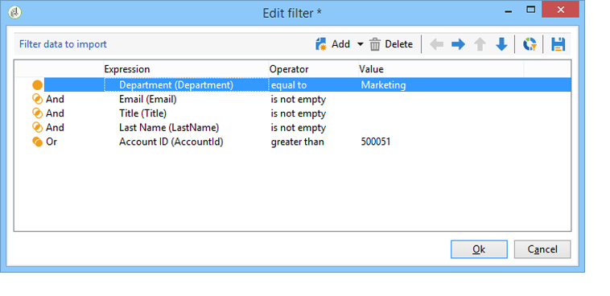

## Order by {#order-by}

In Microsoft Dynamics and Salesforce.com, you can sort the remote fields to be imported in ascending or descending order.

To do this, click the **[!UICONTROL Order by]** link and add the columns to the list.

The order of the columns in the list is the sorting order:

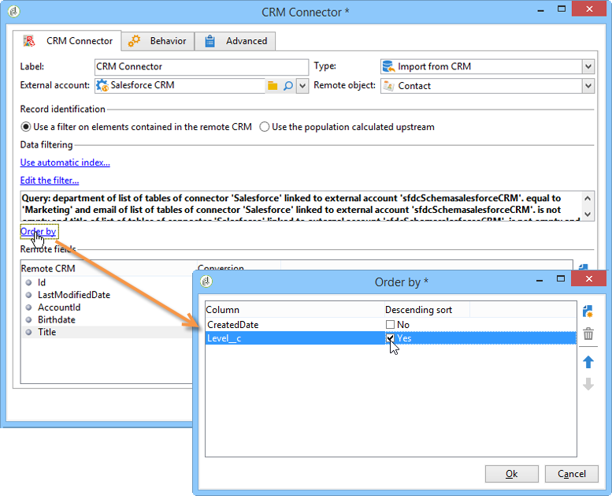

## Record identification {#record-identification}

Rather than import elements included (and possibly filtered) in the CRM, you can use a population calculated beforehand in the workflow.

To do this, select the **[!UICONTROL Use the population calculated upstream]** option and specify the field that contains the remote identifier.

Then select the fields of the inbound population that you want to import, as shown below:

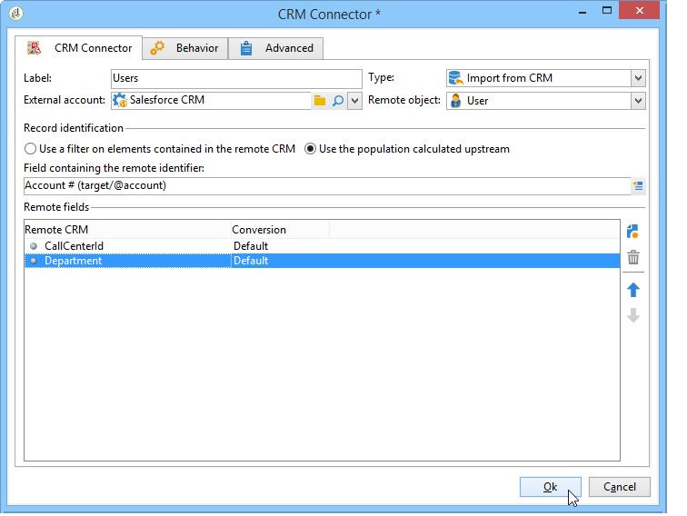

## Exporting to the CRM {#exporting-to-the-crm}

Exporting Adobe Campaign data into the CRM lets you copy entire contents to a CRM database.

To export data towards the CRM, you need to create the following type of workflow:

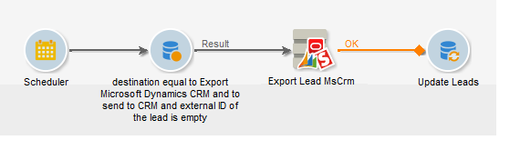

For an export, apply the following configuration to the **CRM Connector** activity:

1. Select an **[!UICONTROL Export to CRM]** operation.
1. Go to the **[!UICONTROL Remote object]** drop-down list and select the object concerned by the process. This object coincides with one of the tables created in Adobe Campaign during connector configuration.

   >[!CAUTION]
   >
   >The export function of the **CRM Connectors** activity can insert or update fields on the CRM side. To enable field updates in the CRM, you need to specify the primary key of the remote table. If the key is missing, data will be inserted (instead of being updated).

1. In the **[!UICONTROL Mapping]** section, specify the fields to be exported and their mapping in the CRM.

   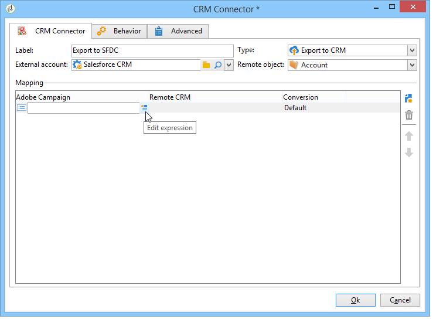

   To add a field, click the **[!UICONTROL Add]** button in the toolbar, then click the **[!UICONTROL Edit expression]** icon.

   For a given field, if no match is defined on the CRM side, the values cannot be updated: they are inserted directly into the CRM.

   If necessary, alter the data format via the drop-down list of the **[!UICONTROL Conversion]** columns. Possible conversion types are detailed in this [section](../../platform/using/crm-connectors.md#data-format).

   The list of records to be exported and the result of the export are saved in a temporary file that remains accessible until the workflow is finished or re-started. This enables you to start the process again in case of errors without running the risk of exporting the same record several times or losing data.

## Data format and error processing {#data-format-and-error-processing}

You can convert data format on the fly when importing them to or from the CRM.

To do this, select the conversion to be applied in the matching column.

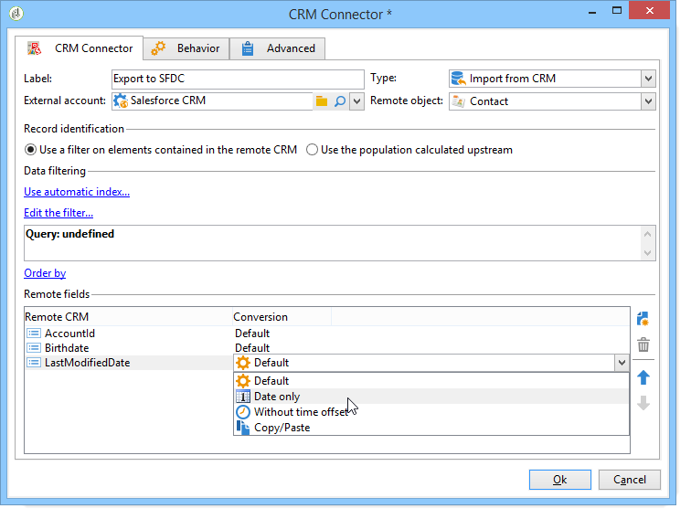

The **[!UICONTROL Default]** mode applies automatic data conversion, which in most cases equals a copy/paste of the data. However, time zone management is applied.

Other possible conversions are:

* **[!UICONTROL Date only]**: this mode deletes Date + Time type fields.
* **[!UICONTROL Without time offset]**: this mode cancels the time zone management applied in the default mode.
* **[!UICONTROL Copy/Paste]**: this mode uses raw data such as strings (no conversion).


Within the framework of data imports or exports, you can apply a specific process to errors and rejects. To do this, select the **[!UICONTROL Process rejects]** and **[!UICONTROL Process errors]** options in the **[!UICONTROL Behavior]** tab.

These options place the matching outbound transitions.

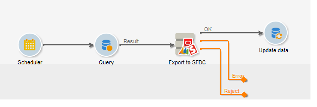

Then place the activities relevant to the processes you want to apply.

To process errors for instance, you can add a wait activity and schedule workflow retries.

Rejects are collected with their error code and the related message, this means you can set up the tracking of rejects to optimize your synchronization process.

Even when the **[!UICONTROL Process rejects]** option isn't enabled, a warning is generated for each rejected column with an error code and message.

The **[!UICONTROL Reject]** outbound transition lets you access the output schema that contains the specific columns relevant to error messages and codes. These columns are:

* For Oracle On Demand: **errorLogFilename** (name of the log file on the Oracle side), **errorCode** (error code), **errorSymbol** (error symbol, different from the error code), **errorMessage** (description of the error context).
* For Salesforce.com: **errorSymbol** (error symbol, different from the error code), **errorMessage** (description of the error context).

## Importing objects deleted in the CRM {#importing-objects-deleted-in-the-crm}

To enable the setting up of an extensive data synchronization process, you can import objects deleted in the CRM into Adobe Campaign.

To do this, apply the following steps:

1. Select an **[!UICONTROL Import objects deleted in the CRM]** operation.
1. Go to the **[!UICONTROL Remote object]** drop-down list and select the object concerned by the process. This object coincides with one of the tables created in Adobe Campaign during connector configuration.
1. Specify the deletion period to be taken into account in the **[!UICONTROL Start date]** and the **[!UICONTROL End date]** fields. These dates will be included in the period.

   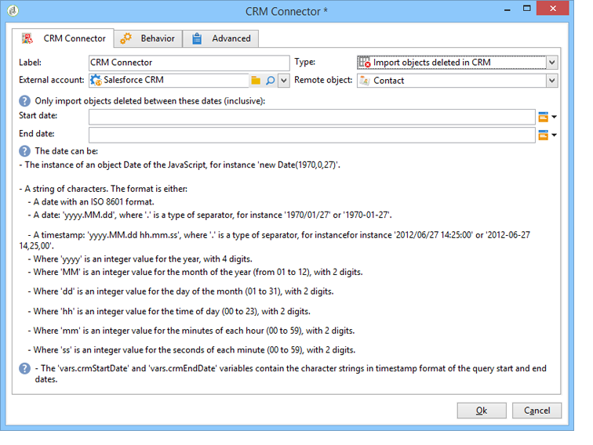

   >[!CAUTION]
   >
   >The element deletion period must coincide with the limitations specific to the CRM. This means that for Salesforce.com, for instance, elements deleted over 30 days ago cannot be recovered.

## Deleting objects in the CRM {#deleting-objects-in-the-crm}

To delete objects on the CRM side, you need to specify the primary key of the remote elements to be deleted.

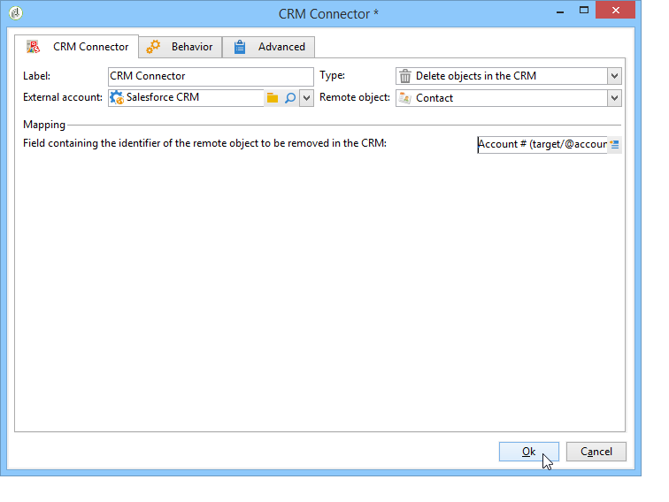

The **[!UICONTROL Behavior]** tab lets you enable the processing of rejects. This option generates a second output transition for the **[!UICONTROL CRM connector]** activity. For more on this, refer to this [section](../../platform/using/crm-connectors.md#error-processing).

Even when the **[!UICONTROL Process rejects]** option is disabled, a warning is generated for each rejected column.

## Example of how to configure a contact import {#example-of-how-to-configure-a-contact-import}

In the following example, the activity is configured to import contacts from an Oracle On Demand CRM. Before being imported, the CRM fields are selected in a way so that they coincide with those that already exist in the Adobe Campaign database.

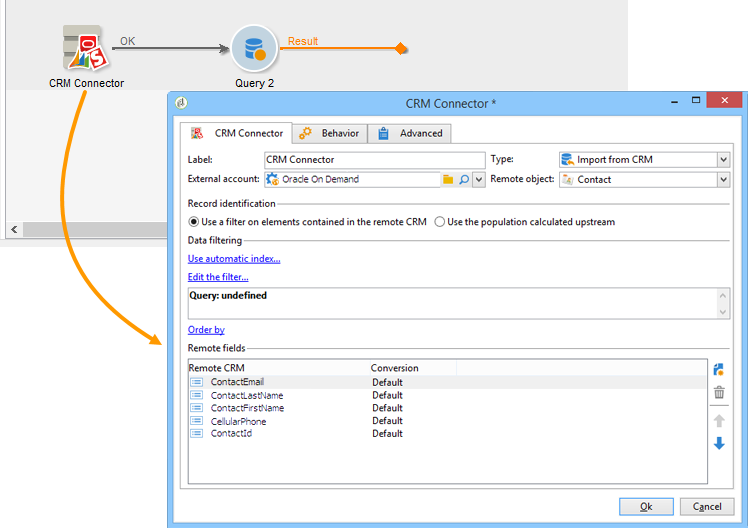

