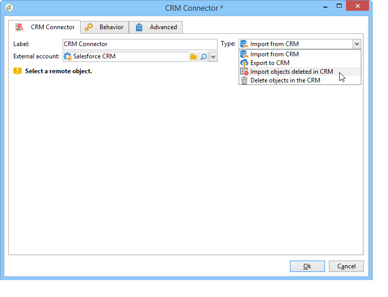
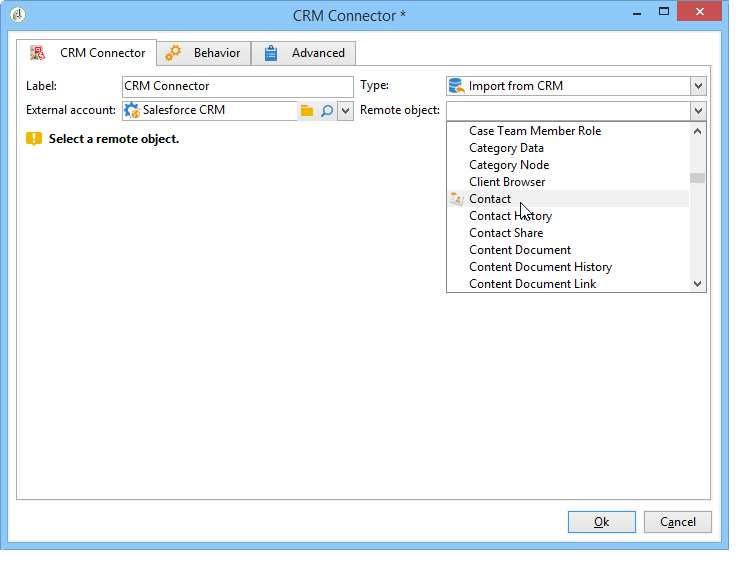

# CRM Connector{#crm-connector}

The **CRM connector** activity lets you configure the data synchronization between Adobe Campaign and a CRM system.

For more information on CRM connectors in Adobe Campaign, refer to this [section](../../platform/using/crm-connectors.md).

With this activity, you can:

* Import from the CRM
* Export to CRM
* Import objects deleted in the CRM
* Delete objects in the CRM

Select the external account that matches the CRM that you want to configure synchronization with, then select the object to be synchronized (accounts, opportunities, contacts, etc.).

The configuration of this activity depends on the process to be carried out. Various configurations are detailed [in this page](../../platform/using/crm-data-sync.md).
