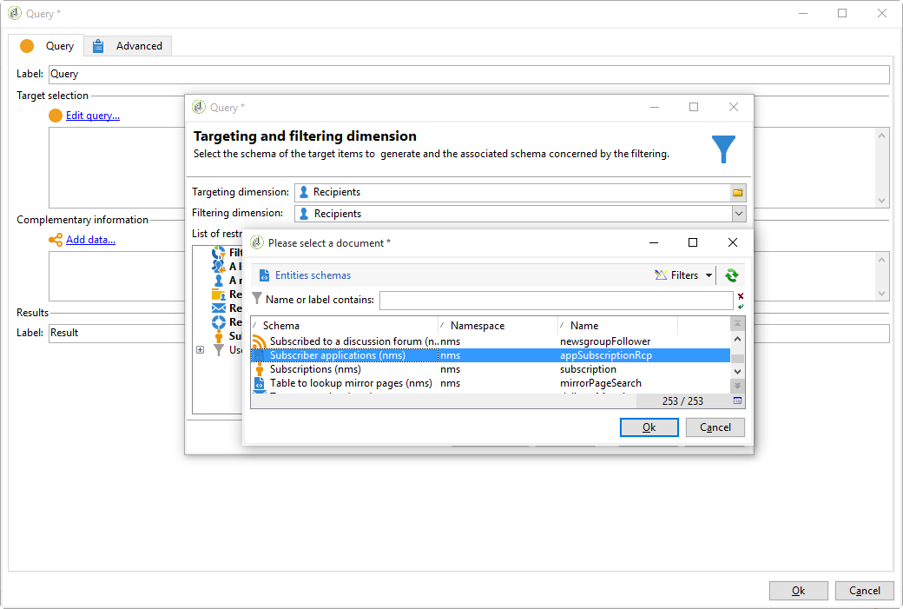
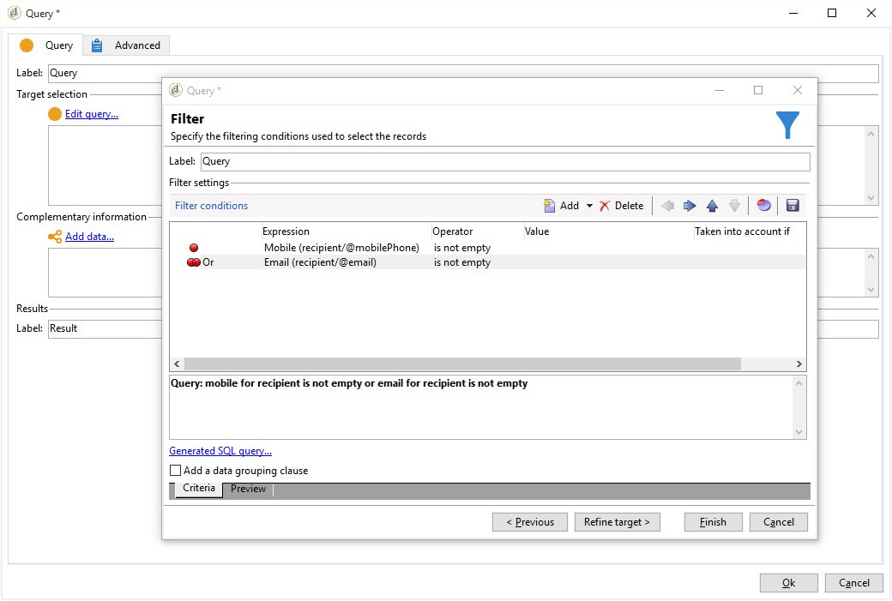
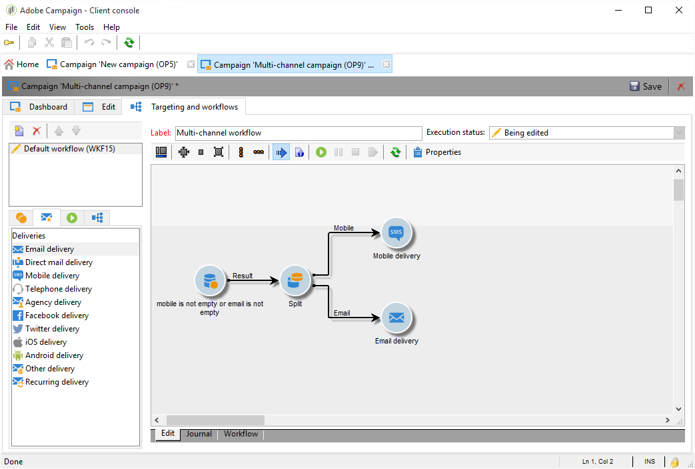
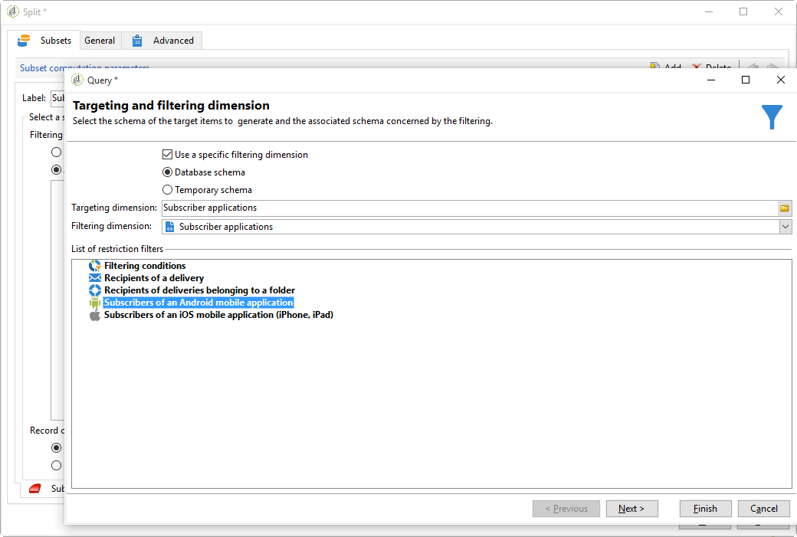
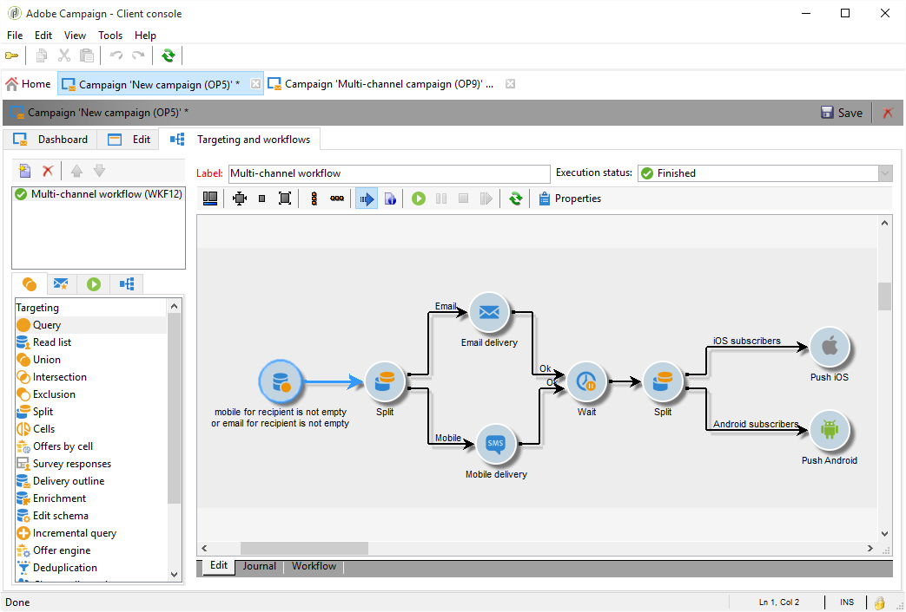

# Cross-channel deliveries{#cross-channel-deliveries}

Cross-channel deliveries are available in the **[!UICONTROL Deliveries]** tab of campaign workflow activities.

They let you create a delivery that is specific to a particular channel. You can specify the template on which you want to base your delivery as well as its content, in the same way as with a a classic delivery wizard.

The various channels available are:

* [Email](https://helpx.adobe.com/campaign/classic/delivery/using/about-email-channel.html)
* [Direct Mail](https://helpx.adobe.com/campaign/classic/delivery/using/about-direct-mail-channel.html)
* [Mobile](https://helpx.adobe.com/campaign/classic/delivery/using/sms-channel.html)
* [Twitter](https://helpx.adobe.com/campaign/classic/social/using/publishing-on-twitter.html)
* [Facebook](https://helpx.adobe.com/campaign/classic/social/using/publishing-on-facebook.html)
* [iOS](https://helpx.adobe.com/campaign/classic/delivery/using/creating-notifications.html#sending-notifications-on-ios)
* [Android](https://helpx.adobe.com/campaign/classic/delivery/using/creating-notifications.html#sending-notifications-on-android)

You can specify a target for your delivery upstream of the workflow using the different targeting activities.

For example, here we will create a workflow to send an email or an SMS for push notification subscribers then a push notification one week later. To do this:

1. Create a campaign.
1. In the **[!UICONTROL Targeting and workflows]** tab of your campaign, add a **[!UICONTROL Query]** to your workflow.
1. Configure your query. For example, here we select the recipients who are subscribed to push notifications as the target dimension.

   >[!NOTE]
   >
   >For the push notifications, remember to use the **subscriber applications** target dimension.

   

1. Add the filter conditions to your query. In this case, we will select recipients who have a mobile number or email address.

   

1. Add a **[!UICONTROL Split]** activity to your workflow to divide recipients who have a mobile number and those who have an email address.
1. In the **[!UICONTROL Delivery]** tab, select a delivery for each of your targets.

   Create your delivery in the same way as with a classic delivery wizard by double-clicking the delivery activity in your workflow. For more on this, refer to this [page](https://helpx.adobe.com/campaign/classic/delivery/using/about-email-channel.html).

   

1. Add and configure a **[!UICONTROL Wait]** activity in order for the recipients not to receive too many deliveries at once.
1. Add a **[!UICONTROL Split]** activity to divide subscribers of an iOS or Android mobile applications.

   Select a service for each of the operating systems. For more on service creation, refer to this [page](https://helpx.adobe.com/campaign/classic/delivery/using/setting-up-mobile-app-channel.html#creating-the-service-and-collecting-subscriptions).

   

1. Select and configure a mobile application delivery for each of the operating systems.

   

