# Cross-channel delivery workflow{#cross-channel-delivery-workflow}

This use case presents an example involving a cross-channel delivery workflow. The general concept of cross-channel deliveries is presented in [this section](cross-channel-deliveries.md).

The objective is to segment an audience from the recipients of your database into different groups with the aim of sending an email to a group and an SMS message to another group.

The main implementation steps for this use case are as follows:

1. Creating a **[!UICONTROL Query]** activity to target your audience.
1. Creating an **[!UICONTROL Email delivery]** activity containing a link to an offer.
1. Using a **[!UICONTROL Split]** activity to:

    * Send another email to the recipients who did not open the first email.
    * Send an SMS to the recipients who opened the email but did not click the link to the offer.
    * Add to the database the recipients who opened the email and clicked the link.

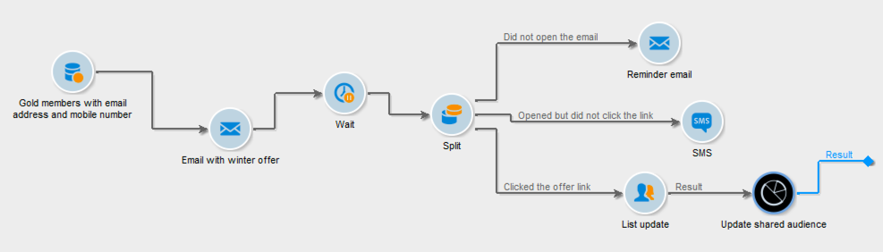

## Step 1: Targeting the audience {#step-1--targeting-the-audience}

To define your target, create a query to identify the recipients.

1. Create a campaign. For more on this, refer to [this section](../../campaign/using/setting-up-marketing-campaigns.md#creating-a-campaign).
1. In the **[!UICONTROL Targeting and workflows]** tab of your campaign, add a **Query** activity to your workflow. For more on using this activity, refer to [this section](query.md).
1. Define the recipients who will receive your deliveries. For example, select 'Gold' members as the target dimension.
1. Add filtering conditions to your query. In this example, select recipients who have an email address and a mobile number.

   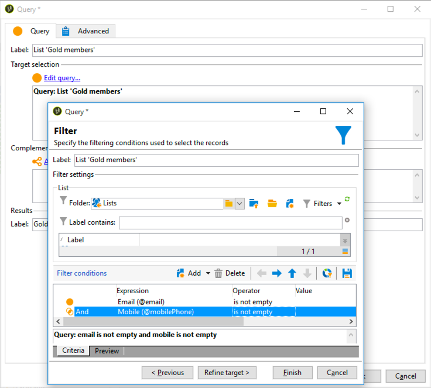

1. Save your changes.

## Step 2: Creating an email including an offer {#step-2--creating-an-email-including-an-offer}

1. Create an **[!UICONTROL Email delivery]** activity and double-click it in your workflow to edit it. For more on creating an email, refer to [this section](../../delivery/using/about-email-channel.md).
1. Design the message and insert a link including an offer into the content.

   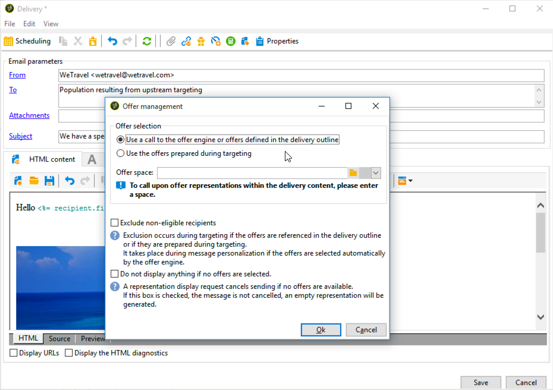

   For more on integrating an offer into the body of a message, refer to [this section](../../interaction/using/integrating-an-offer-via-the-wizard.md#delivering-with-a-call-to-the-offer-engine).

1. Save your changes.
1. Right-click the **[!UICONTROL Email delivery]** activity to open it.
1. Select the **[!UICONTROL Generate an outbound transition]** option to recover the population and the tracking logs.

   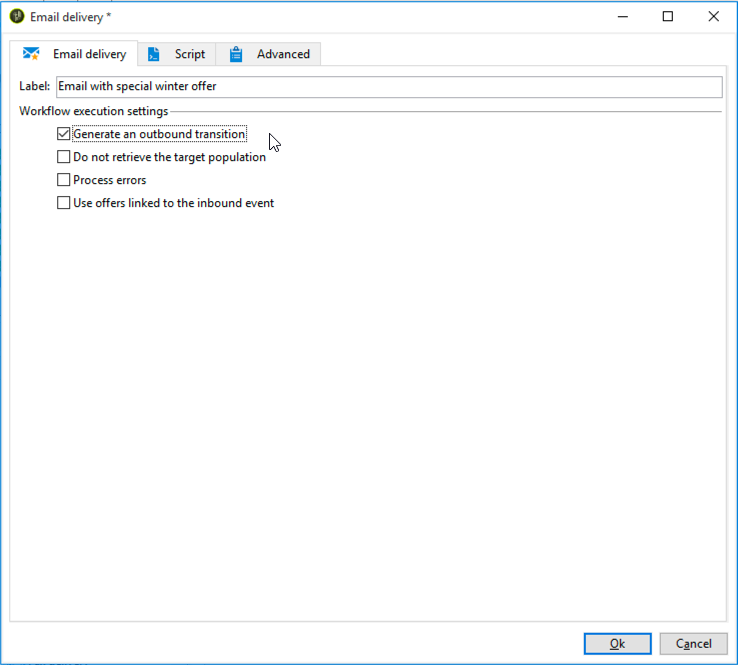

   This will enable you to use this information to send another delivery depending on the recipients' behaviors when receiving the first email.

1. Add a **[!UICONTROL Wait]** activity to let a few days for the recipients to open the email.

   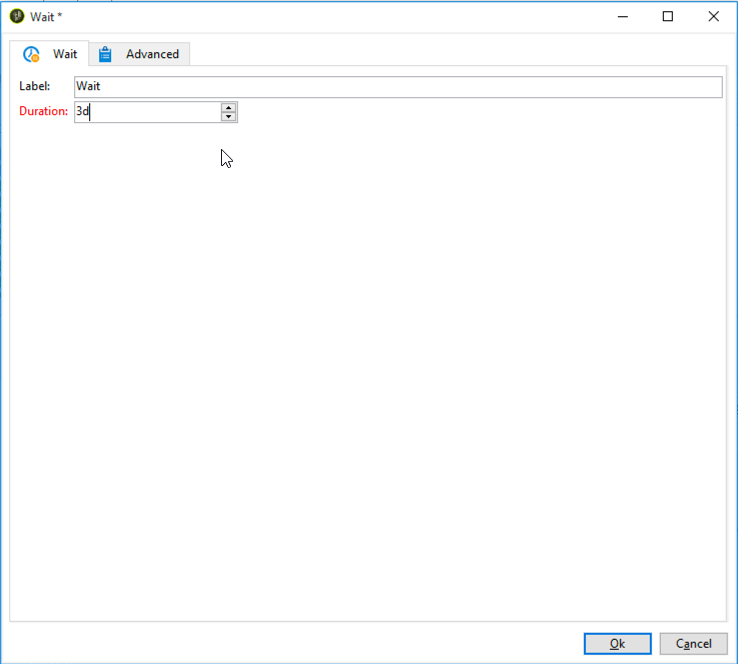

## Step 3: Segmenting the resulting audience {#step-3--segmenting-the-resulting-audience}

Once your target is identified and your first delivery created, you need to segment the target into different populations using filtering conditions.

1. Add a **Split** activity to the workflow and open it. For more on using this activity, refer to [this section](split.md).
1. Create three segments from the population computed upstream in the query.

   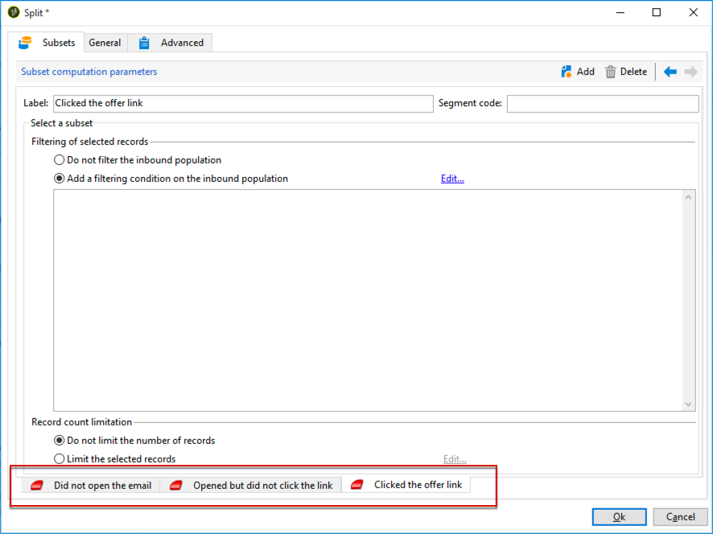

1. For the first subset, select the **[!UICONTROL Add a filtering condition on the inbound population]** option and click **[!UICONTROL Edit]**.

   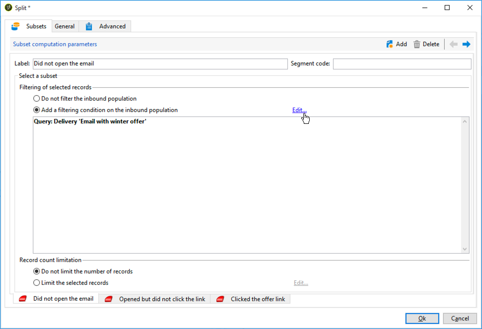

1. Select **[!UICONTROL Recipients of a delivery]** as the restriction filter and click **[!UICONTROL Next]**.

   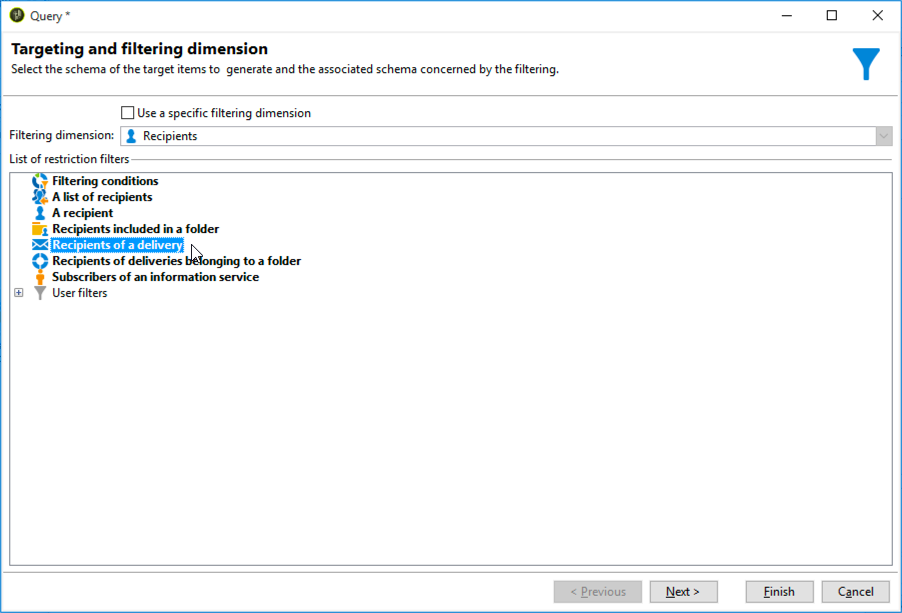

1. In the filter settings, select **[!UICONTROL Recipients who have not opened or clicked (email)]** from the **[!UICONTROL Behavior]** drop-down list and select the email including the offer you want to send from the delivery list. Click **[!UICONTROL Finish]**.

   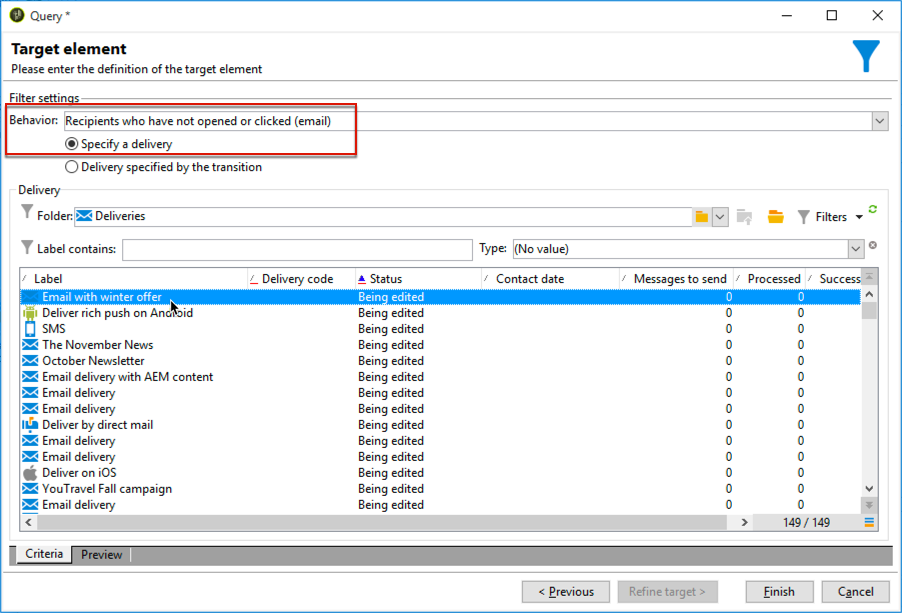

1. Proceed similarly for the second subset and select **[!UICONTROL Recipients who have not clicked (email)]** from the **[!UICONTROL Behavior]** drop-down-list.

   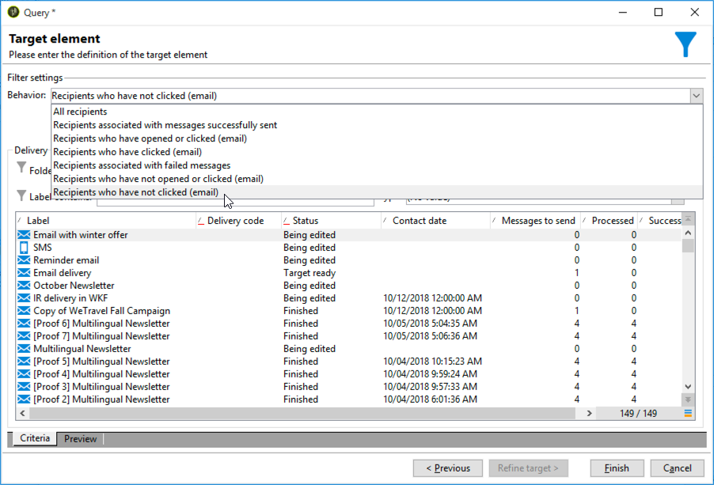

1. For the third subset, after selecting the **[!UICONTROL Add a filtering condition on the inbound population]** and clicking **[!UICONTROL Edit]**, select the **[!UICONTROL Use a specific filtering dimension]** option.
1. Select **[!UICONTROL Recipient tracking log]** from the **[!UICONTROL Filtering dimension]** drop-down list, highlight **[!UICONTROL Filtering conditions]** from the **[!UICONTROL List of restriction filters]** and click **[!UICONTROL Next]**.

   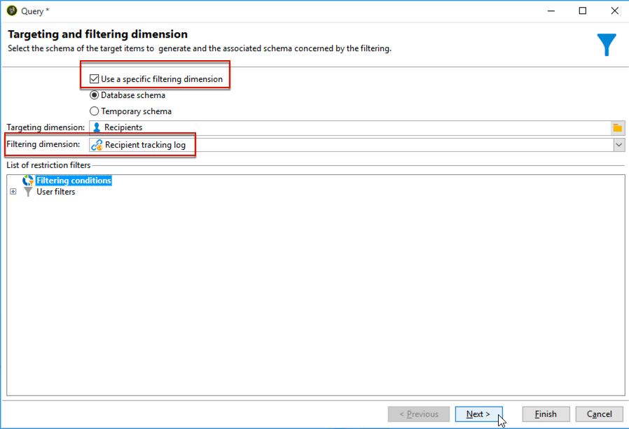

1. Select the filter conditions as follows:

   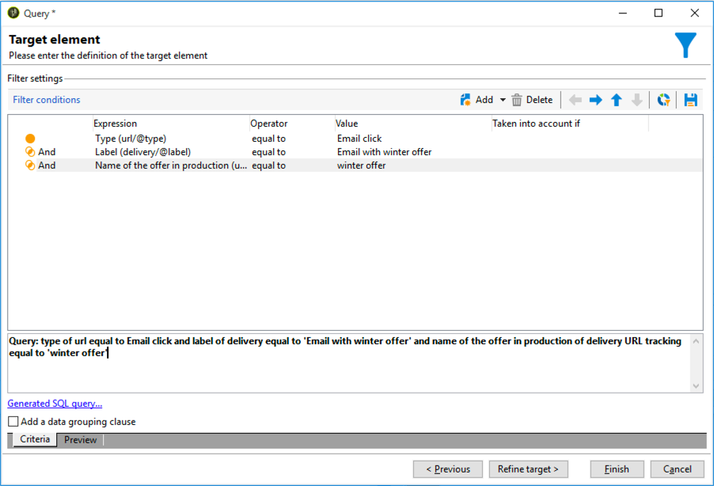

1. Click **[!UICONTROL Finish]** to save your changes.

## Step 4: Finalizing the workflow {#step-4--finalizing-the-workflow}

1. Add the relevant activities to your workflow after the three subsets resulting from the **[!UICONTROL Split]** activity:

    * Add an **[!UICONTROL Email delivery]** activity to send a reminder email to the first subset.
    * Add a **[!UICONTROL Mobile delivery]** activity to send an SMS message to the second subset.
    * Add a **[!UICONTROL List update]** activity to add the corresponding recipients to the database.

1. Double-click the delivery activities in your workflow to edit them. For more on creating an email and an SMS, refer to [Email channel](../../delivery/using/about-email-channel.md) and [SMS channel](../../delivery/using/sms-channel.md).
1. Double-click the **[!UICONTROL List update]** activity and select the **[!UICONTROL Generate an outbound transition]** option.

   You can then export the resulting recipients from Adobe Campaign to the Adobe Experience Cloud. For example, you can use the audience in Adobe Target by adding an **[!UICONTROL Update shared audience]** activity to the workflow. For more on this, refer to [Exporting an audience](../../integrations/using/importing-and-exporting-audiences.md#exporting-an-audience).

1. Click the **Start** button in the action bar to execute the workflow.

The population targeted by the **Query** activity will be segmented to receive an email or an SMS delivery according to the recipients' behaviors. The remaining population will be added to the database using the **[!UICONTROL List update]** activity.
