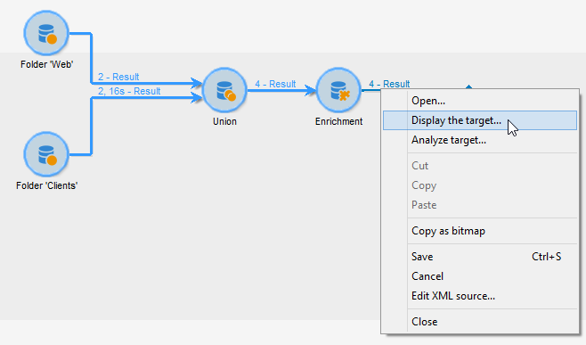
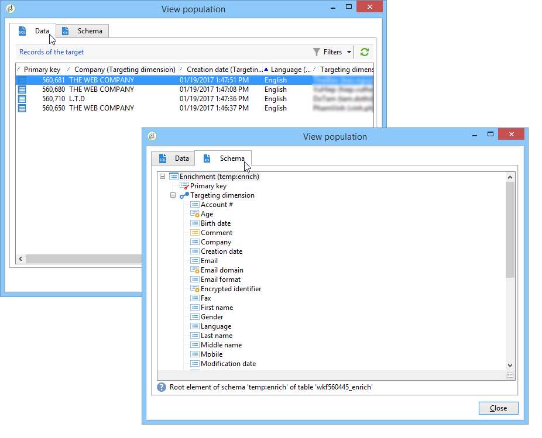
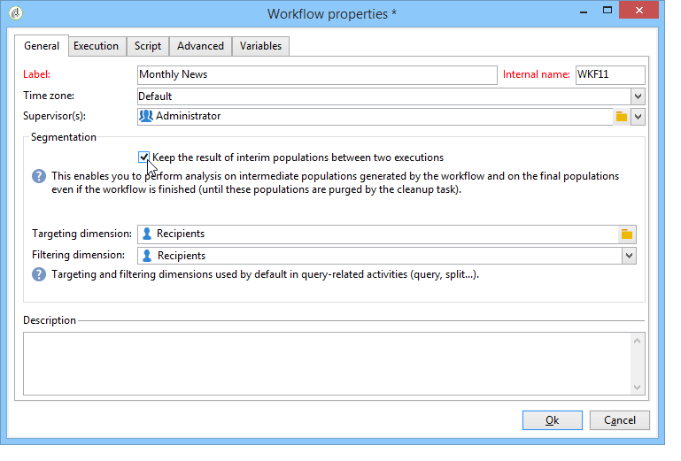
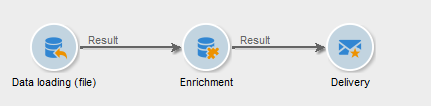
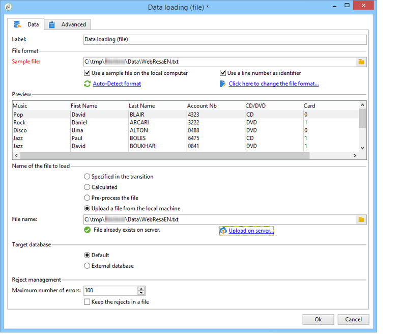
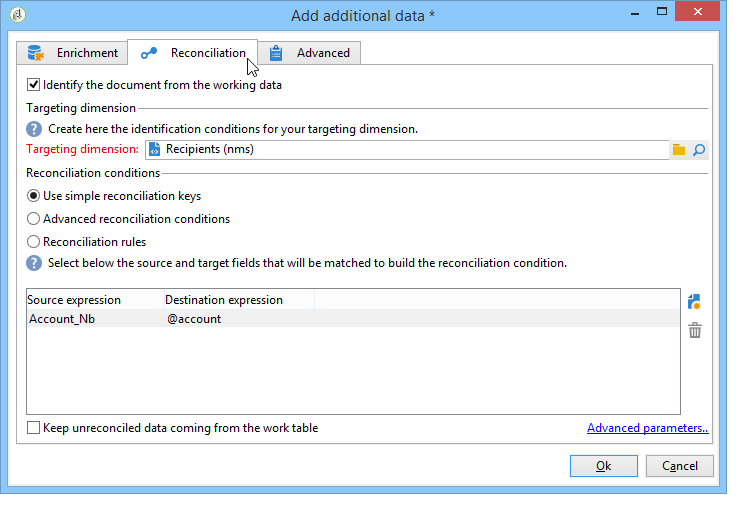
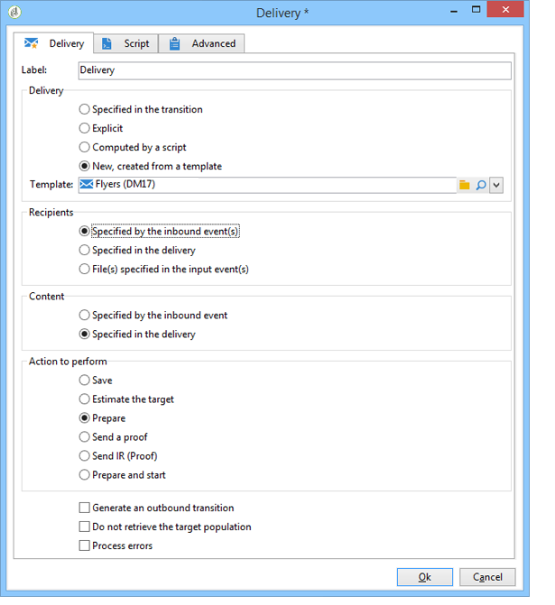
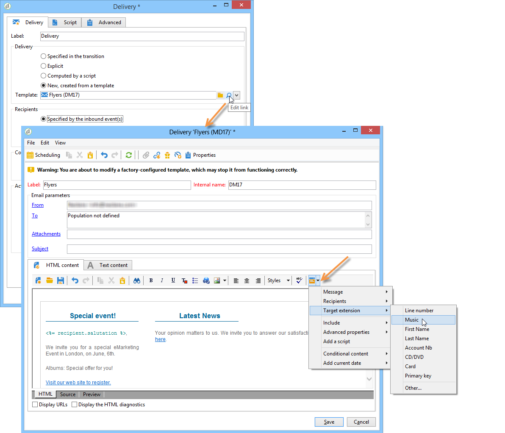
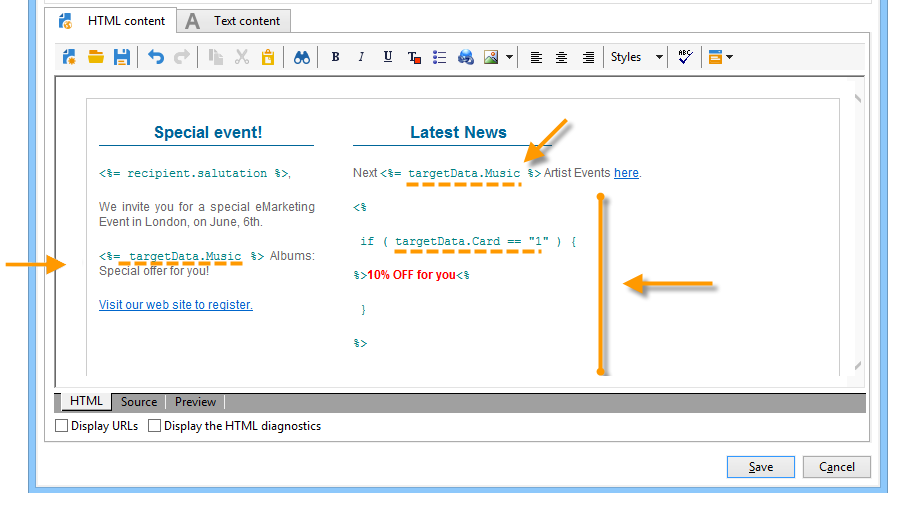
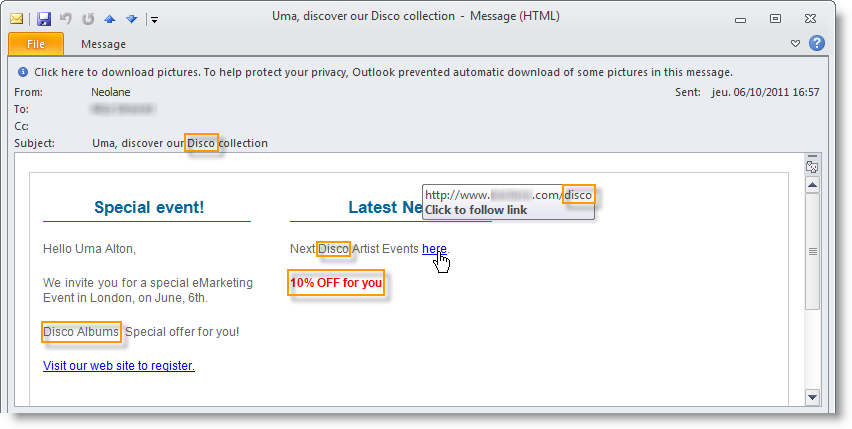

# Data life cycle {#data-life-cycle}

## Work table {#work-table}

In workflows, data transported from one activity to another is stored in a temporary work table.

This data can be displayed and analyzed by right-clicking the appropriate transition. 



To do this, select the relevant menu:

* Displaying the target

  This menu displays the available data on the target population as well as the structure of the work table (**[!UICONTROL Schema]** tab).

  

  For more on this, refer to [Worktables and workflow schema](../../workflow/using/monitoring-workflow-execution.md#worktables-and-workflow-schema).

* Analyzing the target

  This menu lets you access the descriptive analysis wizard which lets you produce statistics and reports on the transition data.

  For more on this, refer to this [section](../../reporting/using/using-the-descriptive-analysis-wizard.md).

The target data is purged as the workflow is executed. Only the last work table is accessible. You can configure the workflow so that all work tables remain accessible: check the **[!UICONTROL Keep the result of interim populations between two executions]** option in the workflow properties.

However, we recommend that you avoid activating this option in case of significant amounts of data. 



## Target data {#target-data}

The data stored in the workflow's work table is accessible in the personalization fields.

This lets you use data collected via a list or based on answers to a survey in a delivery. To do this, use the following syntax:

```
%= targetData.FIELD %
```

**[!UICONTROL Target extension]** (targetData) type personalization elements are not available for targeting workflows. The delivery target has to be built in the workflow and specified in the inbound transition of the delivery.

If you want to create delivery proofs, the proof target needs to be built based on the **[!UICONTROL Address substitution]** mode so that the personalization data can be entered. For more on this, refer to this [section](../../delivery/using/steps-defining-the-target-population.md#using-address-substitution-in-proof).

In the following example, we are going to collect a list of information on customers, to be used in a personalized email.

Apply the following steps:

1. Create a workflow to collect information, reconcile it with the data already in the database, then start a delivery. 

   

   In our example, the file content is as follows:

   ```
   Music,First name,Last name,Account,CD/DVD,Card
   Pop,David,BLAIR,4323,CD,0
   Rock,Daniel,ARCARI,3222,DVD,1
   Disco,Uma,ALTON,0488,DVD,0
   Jazz,Paul,BOLES,6475,CD,1
   Jazz,David,BOUKHARI,0841,DVD,1
   [...]
   ```

   To load the file, apply the following steps:

   

1. Configure the **[!UICONTROL Enrichment]** type activity to reconcile the collected data with that already in the Adobe Campaign database.

   Here, the reconciliation key is the account number:

   

1. Then configure the **[!UICONTROL Delivery]**: it is created based on a template, and the recipients are specified by the inbound transition. 

   

   >[!CAUTION]
   >
   >Only data contained in the transition may be used to personalize the delivery. **targetData** type personalization fields are only available for the inbound population of the **[!UICONTROL Delivery]** activity.

1. In the delivery template, use the fields collected in the workflow.

   To do this, insert **[!UICONTROL Target extension]** type personalization fields.

   

   Here, we want to insert the customer's favorite music genre and media type (CD or DVD) as stated in the file collected by the workflow.

   As a plus, we are going to add a coupon for loyalty card holders, i.e. recipients for whom the 'Card' value equals 1.

   

   **[!UICONTROL Target extension]** (targetData) type data is inserted into deliveries using the same characteristics as all personalization fields. They may also be used in the subject, link labels, or the links themselves.

   Messages addressed to collected recipients will contain the following data:

   
