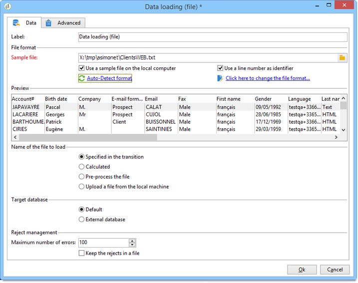
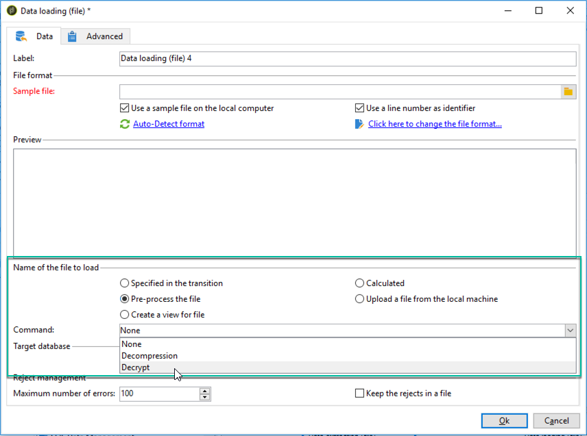
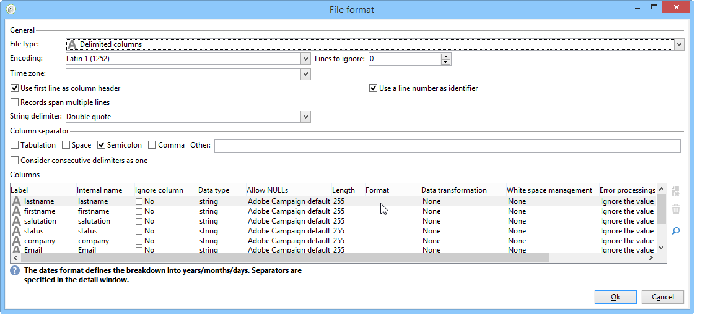
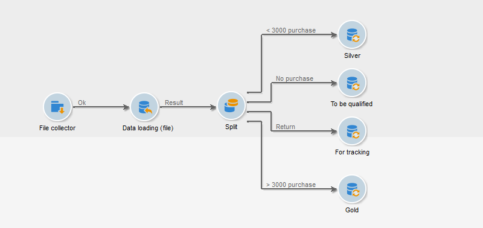
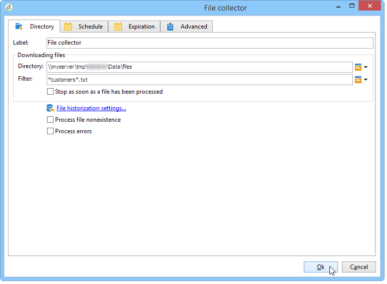
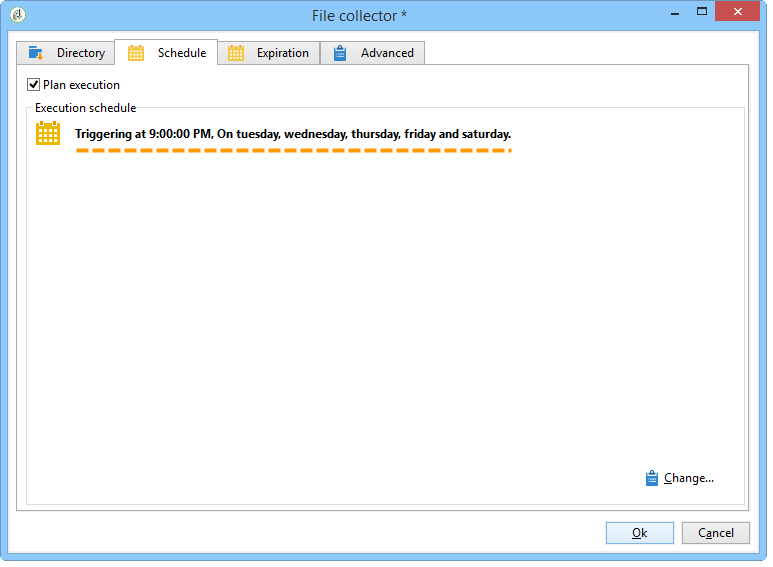
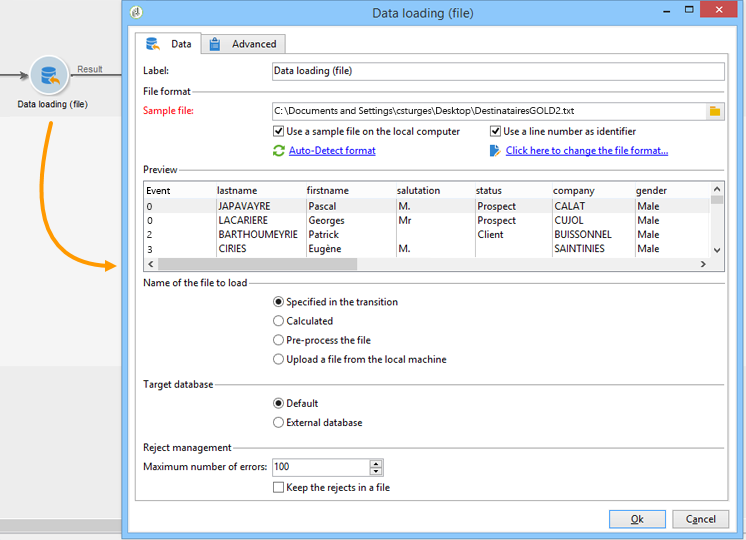
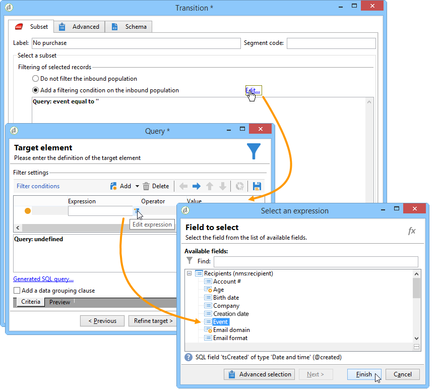
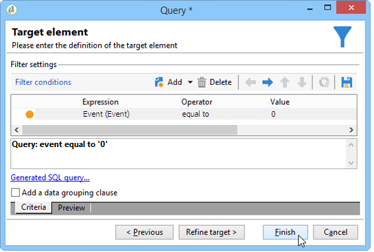
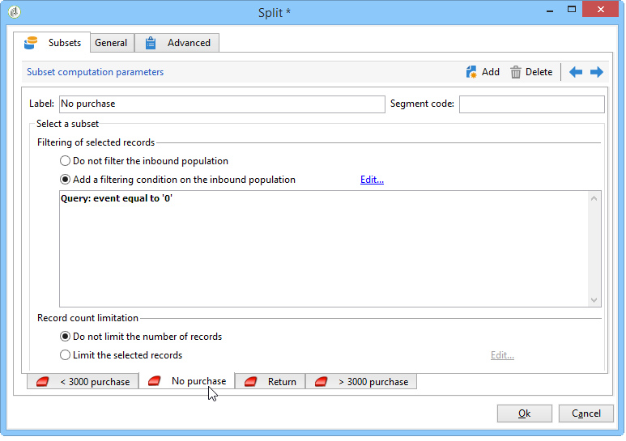

# Data loading (file){#data-loading-file}

## Use {#use}

The **[!UICONTROL Data loading (File)]** activity lets you directly access a source of external data and use it in Adobe Campaign. Indeed, all the data required for targeting operations isn't always found in the Adobe Campaign database: it can be made available in external files.

The file to be loaded can be specified by the transition or calculated during the execution of this activity. For example, it can be the list of a client's 10 favorite products whose purchases are managed in an external database.

The upper section of the configuration window for this activity lets you define the file format. To do this, use a sample file with the same format as the one to be imported. This file can be stored locally or on the server.

>[!CAUTION]
>
>Only "flat" structure files are supported (e.g. CSV, TXT, etc.). Using the XML format is not recommended.

You can define a pre-process to be executed during file import, for example so as not to have to unzip the file on the server (and therefore save space for the unzipped file) but to include unzipping in file processing. Select the **[!UICONTROL Pre-process the file]** option and choose from one of 3 options: **[!UICONTROL None]**, **[!UICONTROL Decompression]** (zcat) or **[!UICONTROL Decrypt]** (gpg).

   

For more on this, refer to this section: [Unzippping or decrypting a file before processing](../../platform/using/unzip-decrypt.md).

## Defining the file format {#defining-the-file-format}

When you load a file, the column format is automatically detected with the default parameters for each data type. You can modify these default parameters in order to specify the particular processes to apply to your data, particularly when there is an error or an empty value.

To do this, select **[!UICONTROL Click here to change the file format...]** in the main window of the **[!UICONTROL Data loading (file)]** activity. The format detail window will then open.

You can then modify the general formatting of the file as well as the formatting for each column.

The general file formatting allows you to define the way in which the columns will be recognized (file encoding, separators used, etc.).

The column formatting allows you to define the value processing of each column:

* **[!UICONTROL Ignore column]**: does not process this column during data loading.
* **[!UICONTROL Data type]**: specifies the type of data expected for each column.
* **[!UICONTROL Allow NULLs]**: specifies how to manage empty values.

    * **[!UICONTROL Adobe Campaign default]**: generates an error for the numerical fields only, otherwise inserts a NULL value.
    * **[!UICONTROL Empty value allowed]**: authorizes empty values. The value NULL is therefore inserted.
    * **[!UICONTROL Always populated]**: generates an error if a value is empty.

* **[!UICONTROL Length]**: specifies the maximum number of characters for the **string** data type.
* **[!UICONTROL Format]**: defines the time and date format.
* **[!UICONTROL Data transformation]**: defines whether a character case process needs to be applied on a **string**.

    * **[!UICONTROL None]**: the imported string is not modified.
    * **[!UICONTROL First letter in upper case]**: the first letter of each word of the string starts with an upper case.
    * **[!UICONTROL Upper case]**: all characters in the string are in upper case.
    * **[!UICONTROL Lower case]**: all characters in the string are in lower case.

* **[!UICONTROL White space management]**: specifies whether certain spaces need to be ignored in a string. The **[!UICONTROL Ignore spaces]** value only allows spaces at the beginning and at the end of a string to be ignored.
* **[!UICONTROL Error processings]**: defines the behavior if an error is encountered.

    * **[!UICONTROL Ignore the value]**: the value is ignored. A warning is generated in the workflow execution log.
    * **[!UICONTROL Reject line]**: the entire line is not processed.
    * **[!UICONTROL Use a default value in case of error]**: replaces the value causing the error with a default value, defined in the **[!UICONTROL Default value]** field.
    * **[!UICONTROL Reject the line when there is no remapping value]**: the whole line is not processed unless a mapping had been defined for the erroneous value (see the **[!UICONTROL Mapping]** option below).
    * **[!UICONTROL Use a default value in case the value is not remapped]**: replaces the value causing the error with a default value, defined in the **[!UICONTROL Default value]** field, unless a mapping had been defined for the erroneous value (see the **[!UICONTROL Mapping]** option below).

* **[!UICONTROL Default value]**: specifies the default value according to the error processing chosen.
* **[!UICONTROL Mapping]**: this field is only available in the column detail configuration (accessed via a double-click or via the options on the right of the column list). This transforms certain values when they are imported. For example, you can transform "three" into "3".

## Example: Collecting data and loading it in the database {#example--collecting-data-and-loading-it-in-the-database}

The following example lets you collect a file on the server every day, load its content and update the data in the database depending on the information it contains. The file to be collected contains information on clients who may have made purchases (for more or less than 3,000 Euro), asked for a refund on a purchase or visited the shop without purchasing anything. Depending on this information, various processes will be applied to their profile in the database.

1. The file collector lets you recover files stored in a directory, depending on the given frequency.

   The **[!UICONTROL Directory]** tab contains information on the file(s) to be recovered. In our example, all files in text format whose names contain the word 'customers' and which are stored in the tmp/Adobe/Data/files directory of the server will be recovered.

   Using the **[!UICONTROL File collector]** is detailed in the [File collector](../../workflow/using/file-collector.md) section.

   

   The **[!UICONTROL Schedule]** tab lets you schedule the execution of the collector, i.e. to specify the frequency with which the presence of these files will be checked.

   Here, we want to trigger the collector every workday at 9PM.

   

   To do this, click the **[!UICONTROL Change...]** button located in the lower right-hand section of the editing tool and configure the schedule.

   For more on this, refer to [Scheduler](../../workflow/using/scheduler.md).

1. Then configure the data loading (file) activity to indicate how the collected file(s) should be read. To do this, select a sample file with the same structure as the files to be loaded.

   

   Here, the file contains five columns:

    * the first column contains a code that coincides with the event: purchase (more or less than 3,000 euro), no purchase or refund on one or more purchases.
    * the four following columns contain the client's first name, last name, email and account number.

   The format configuration of the file to be loaded coincides with that defined during a data import in Adobe Campaign. For more on this, refer to this [section](../../platform/using/executing-import-jobs.md#step-2---source-file-selection).

1. In the split activity, specify the subsets to create, according to the **Event** column value.

   The Split activity is detailed in the section.

   

   For each subset, specify one of the values in the **Event** column.

   

   The **[!UICONTROL Split]** activity will therefore contain the following information:

   

1. Then specify the processes to be carried out for each type of population. In our example, we are going to **[!UICONTROL Update the data]** in the database. To do this, place an **[!UICONTROL Update data]** activity at the end of each outbound transition from the split activity.

   The **[!UICONTROL Update data]** activity is detailed in the [Update data](../../workflow/using/update-data.md) section.
