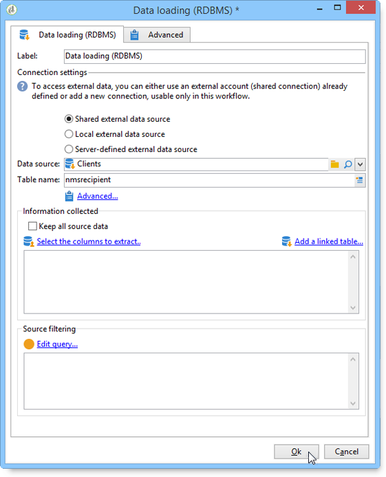
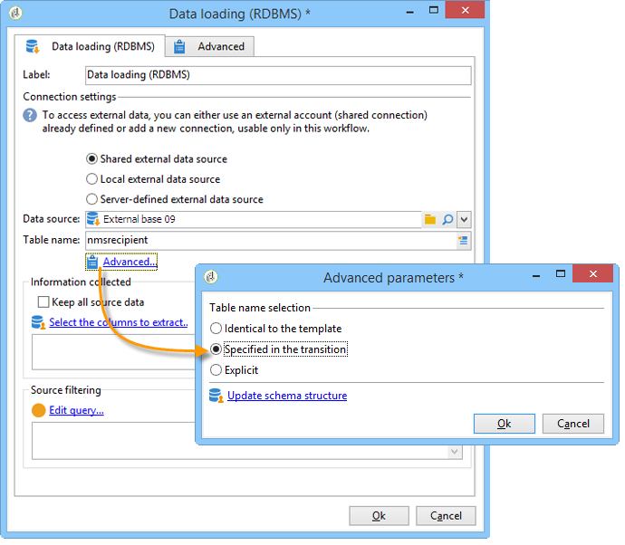
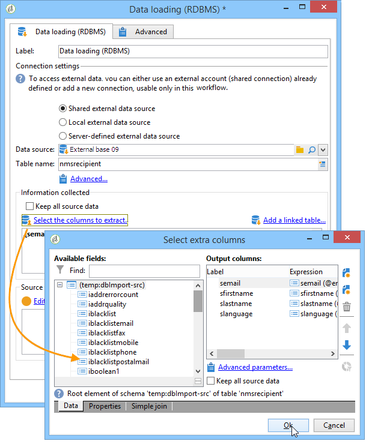

# Data loading (RDBMS){#data-loading-rdbms}

The **[!UICONTROL Data loading (RDBMS)]** activity lets you access this external database directly and to collect only the data required for targeting.

To improve performance, we recommend using the query activity (where the data of an external database can be used). For more on this, refer to [Accessing an external database (FDA)](../../workflow/using/accessing-an-external-database--fda-.md).

Operation is as follows:

1. Select the data source from the list and enter the name of the table that contains the data to be extracted.

   

   The name of the table entered in the corresponding field is used as a template for collecting data in the external database. The name of the table processed by the workflow can be computed or conveyed by the inbound transition of the data loading activity. To select the table to be used, click the **[!UICONTROL Advanced..]**. link and select the **[!UICONTROL Specified in the transition]** or **[!UICONTROL Explicit]** option.

   

1. Click the **[!UICONTROL Select the columns to extract...]** link to choose the data to be collected in the database.

   

1. You can define a filter on this data. To do this, click the **[!UICONTROL Edit query....]** link.

   The data collected like this can be used throughout the workflow's life cycle.
