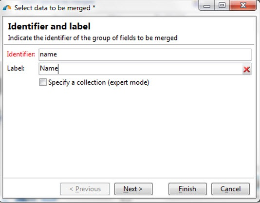
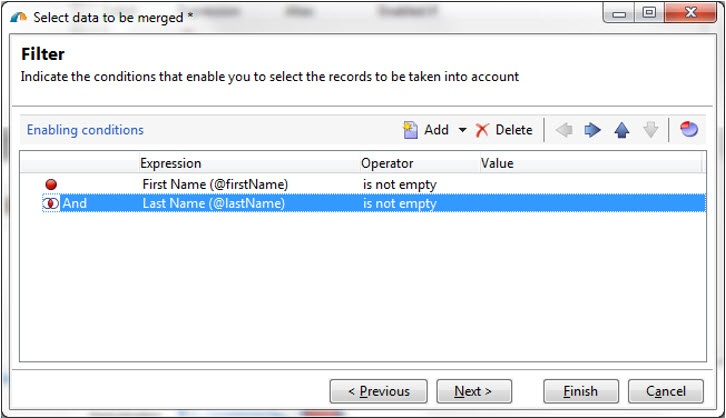
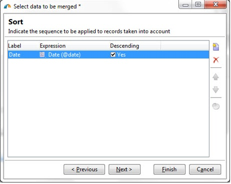
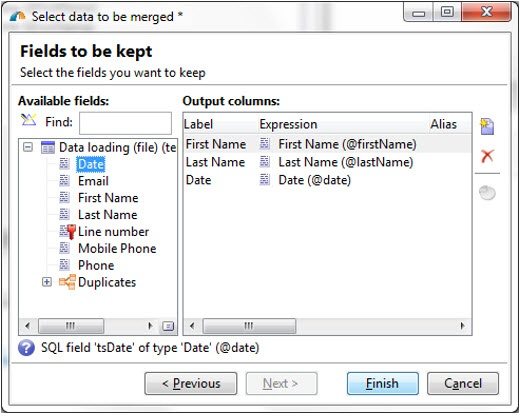

# Using the Deduplication activity's Merge functionality {#deduplication-merge}

This use case describes how to use of the **[!UICONTROL Merge]** functionality in the **[!UICONTROL Deduplication]** activity in Adobe Campaign Classic.

## Description {#description}

The **[!UICONTROL Deduplication]** activity is used for removing duplicate rows from a data set. For example, the records below could be considered duplicate as they have the same email address and same mobile and/or home phone.

Date | First Name | Last Name | Email | Mobile Phone | Phone
-----|------------|-----------|-------|--------------|------
2/3/2013 | Bob | Tisner | bob@mycompany.com | 444-444-4444 | 888-888-8888
5/19/2013 | Robert | Tisner | bob@mycompany.com | 444-444-4444 | 777-777-7777
7/22/2013 | Bobby | Tisner | bob@mycompany.com | 444-444-4444 | 777-777-7777

In the earlier versions of Campaign Classic, the **[!UICONTROL Deduplication]** activity had the capability to keep an entire row as the unique record after duplicates were identified. For example, in the above use case, if the activity was configured to keep only the record with the oldest **[!UICONTROL Date]**, the result would be:

Date | First Name | Last Name | Email | Mobile Phone | Phone
-----|----------|------------|-------|--------------|------
2/3/2013 | Bob | Tisner | bob@mycompany.com | 444-444-4444 | 888-888-8888

The master record selected will carry forward the data without any merging of field data with other relevant data in the duplicate rows.

Complement:

Date | First Name | Last Name | Email | Mobile Phone | Phone
-----|------------|-----------|-------|--------------|------
5/19/2013 | Robert | Tisner | bob@mycompany.com | 444-444-4444 | 777-777-7777
7/22/2013 | Bobby | Tisner | bob@mycompany.com | 444-444-4444 | 777-777-7777

Starting Campaign Classic v6.1, an improved deduplication functionality known as **[!UICONTROL Merge]** was introduced. With **[!UICONTROL Merge]**, you can configure a set of rules for the deduplication to define a group of fields to merge into a single resulting data record. For example, with a set of duplicate records, you can choose to keep the oldest phone number or most recent name.

To do this, follow these steps:

1. In the **[!UICONTROL Deduplication]** activity, click the **[!UICONTROL Advanced Parameters]** link.

1. Select the **[!UICONTROL Merge records]** option to activate the functionality.

  The **[!UICONTROL Use several record merging criteria]** option allows grouping of multiple data fields in each merging condition.

After activating the functionality, a **[!UICONTROL Merge]** tab is added to the **[!UICONTROL Deduplication]** activity. It allows you to define groups of fields to merge and their associated rules.

## Use Case {#use-case}

The data shown below is duplicated based on the Email field.

### Data {#data}

Date | First Name | Last Name | Email | Mobile Phone | Phone
-----|------------|-----------|-------|--------------|------
2/3/2013 | Bob | Tisner | bob@mycompany.com | 444-444-4444 | 888-888-8888
5/19/2013 | Robert | Tisner | bob@mycompany.com |   | 777-777-7777
7/22/2013 | Bobby |   | bob@mycompany.com |   | 777-777-7777

### Rules {rules}

* Dedup on email
* Keep the most recent name (first name and last name)
* Keep the most recent mobile phone
* Keep the oldest phone
* All fields in a group must be non-null to be eligible for the final record

### Configuring {#configuring-rules}

1. Keep the most recent name (first name and last name).
1. Indicate the identifier of the group of fields to be merged.

  

1. Indicate the conditions for selecting the records to be taken into account.

  

1. Sort on date to select most recent first and the last name.

  

1. Select the data to be merged.

  

1. This rule is then added to the set of rules and a new element is added to the workflow schema.

  
  
  

### Results {#results}

Eventually when the user configures all the rules in the Merge tab, the following data is received at the end of the **[!UICONTROL Deduplication]** activity.

The result is merged from the three records as per the rules defined in the merge functionality. After comparison, it is concluded that the most recent first name, last name, and mobile phone are used, along with the original phone (Home) used to build the data.

**Original data**

Date | First Name | Last Name | Email | Mobile Phone | Phone
-----|------------|-----------|-------|--------------|------
2/3/2013 | Bob | Tisner | bob@mycompany.com | 444-444-4444 | 888-888-8888
5/19/2013 | Robert | Tisner | bob@mycompany.com |   | 777-777-7777
7/22/2013 | Bobby |   | bob@mycompany.com |   | 777-777-7777

**Result from the **[!UICONTROL Merge]** functionality**

Date | First Name | Last Name | Email | Mobile Phone | Phone
-----|------------|-----------|-------|--------------|------
2/3/2013 | Bobby | Tisner | bob@mycompany.com | 444-444-4444 | 888-888-8888

**Related topics:**

* Deduplication activity in Campaign Classic
* Targetting data
* Workflow best practices
* Importing profiles
