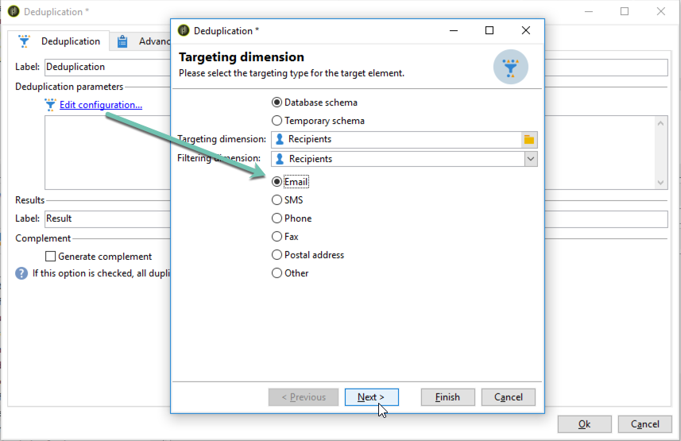
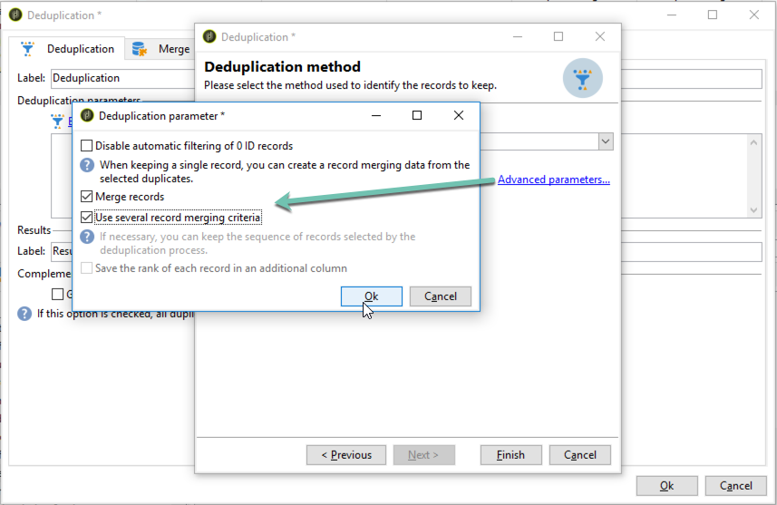
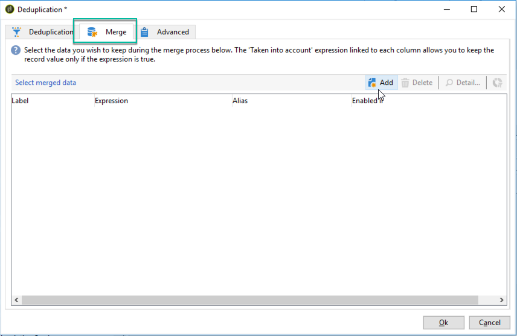
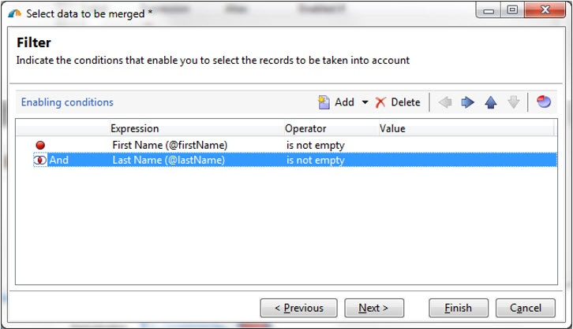
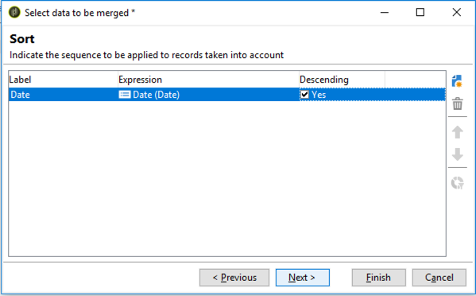
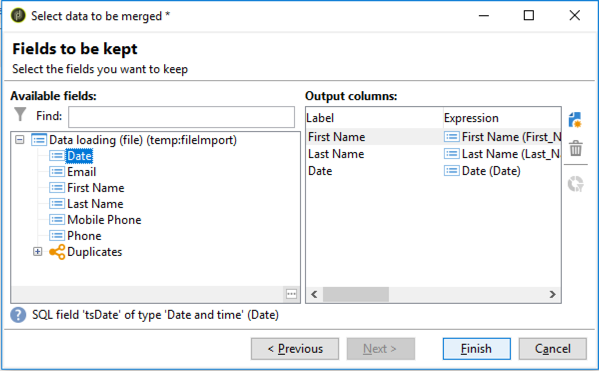
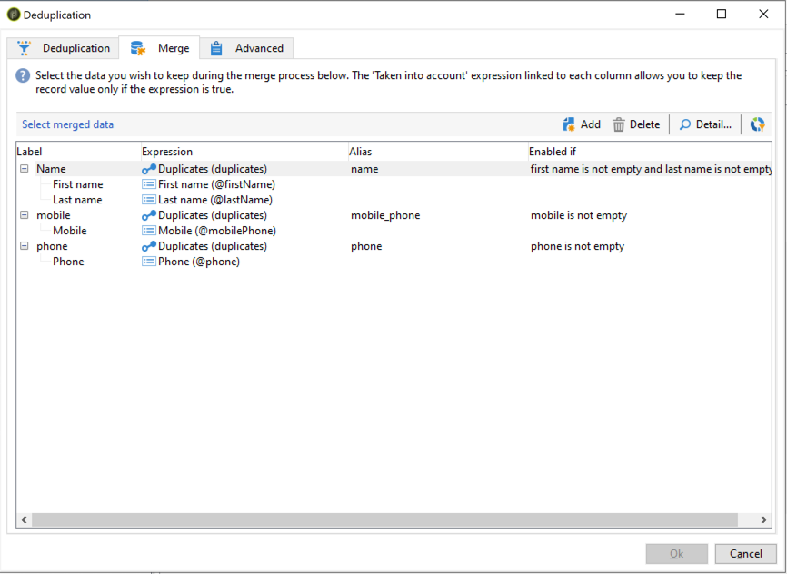
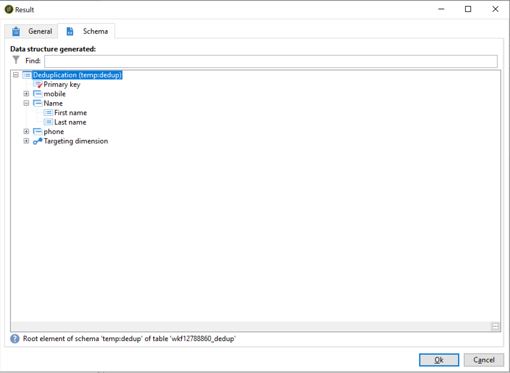

# Using the Deduplication activity's Merge functionality {#deduplication-merge}

## About this use case {#about-this-use-case}

This use case describes how to use of the **[!UICONTROL Merge]** functionality in the **[!UICONTROL Deduplication]** activity.

For more information on this fonctionality, refer to [this section](../../workflow/using/deduplication.md#merging-fields-into-single-record).

The **[!UICONTROL Deduplication]** activity is used for removing duplicate rows from a data set. In this use case, the data shown below is duplicated based on the Email field. 

|Last modification date | First Name | Last Name | Email | Mobile Phone | Phone|
|-----|------------|-----------|-------|--------------|------|
|5/19/2020 | Robert | Tisner | bob@mycompany.com | 444-444-444 | 777-777-7777|
|7/22/2020 | Bobby | Tisner | bob@mycompany.com | | 777-777-7777|
|10/03/2020 | Bob |  | bob@mycompany.com | | 888-888-8888|

With the Deduplication activity's **[!UICONTROL Merge]** fonctionality, you can configure a set of rules for the deduplication to define a group of fields to merge into a single resulting data record. For example, with a set of duplicate records, you can choose to keep the oldest phone number or most recent name.

## Activating the Merge functionality {#activating-merge}

To enable the merge functionality, you first need to configure the **[!UICONTROL Deduplication]** activity. To do this, follow these steps:

1. Open the activity, then click the **[Edit configuration]** link.

1. Select the reconciliation field to use for the deduplication, then click **[!UICONTROL Next]**. In this example, we want to deduplicate based on the email field.

    

1. Click the **[!UICONTROL Advanced parameters]** link, then activate the **[!UICONTROL Merge records]** and **[!UICONTROL Use several record merging criteria]** options.

    

1. The **[!UICONTROL Merge]** tab is added to the **[!UICONTROL Deduplication]** configuration screen. We will use this tab to specify the data to merge when performing deduplication.

## Configuring the fields to merge {#configuring-rules}

Here are the rules we want to use to merge the data into a single record:

* Keep the most recent name (first name and last name fields),
* Keep the most recent mobile phone,
* Keep the oldest phone number,
* All fields in a group must be non-null to be eligible for the final record.

To configure these rules, follow these steps:

1. Open the **[!UICONTROL Merge]** tab, then click the **[!UICONTROL Add]** button.

    

1. Specify the identifier and label of the group of fields to be merged.

    

1. Indicate the conditions for selecting the records to be taken into account.

    

1. Sort on the last modification date in order to select the most recent name.

    

1. Select the fields to merge. In this example, we want to keep the first name and last name fields.

    

1. The fields are added to the set of data to merge and a new element is added to the workflow schema.

    Repeat these steps to configure the mobile phone and phone fields.

    
  
    

## Results {#results}

After configuring these rules, the following data is received at the end of the **[!UICONTROL Deduplication]** activity.

Modification date | First Name | Last Name | Email | Mobile Phone | Phone|
-----|------------|-----------|-------|--------------|------|
|5/19/2020 | Robert | Tisner | bob@mycompany.com | 444-444-444 | 777-777-7777|
|7/22/2020 | Bobby | Tisner | bob@mycompany.com | | 777-777-7777|
|10/03/2020 | Bob |  | bob@mycompany.com | | 888-888-8888|

The result is merged from the three records according to the rules configured earlier. After comparison, it is concluded that the most recent name and mobile phone are used, along with the original phone number.

| First Name | Last Name | Email | Mobile Phone | Phone|
|------------|-----------|-------|--------------|------|
| Bobby | Tisner | bob@mycompany.com | 444-444-4444 | 888-888-8888|

>[!NOTE]
>
> Note that the first name that has been merged is "Bobby", because we configured a "Name" rule made of both the first name and last fields.
>
>As a result, "Bob" (the most recent first name) could not be taken into account because its associated last name field was empty. The most recent combination of first and last names was merged in the final record.
