# Deduplication{#deduplication}

Deduplication deletes duplicates from the results of inbound activities. Deduplication can be performed on the email address, telephone number, or another field.

The **[!UICONTROL Deduplication]** activity is used for removing duplicate rows from a data set. For example, the records below could be considered duplicate as they have the same email address and same mobile and/or home phone.

| Last modification date | First Name | Last Name | Email | Mobile Phone | Phone |
-----|------------|-----------|-------|--------------|------
02/03/2020 | Bob | Tisner | bob@mycompany.com | 444-444-4444 | 888-888-8888
05/19/2020 | Robert | Tisner | bob@mycompany.com | 444-444-4444 | 777-777-7777
07/22/2020 | Bobby | Tisner | bob@mycompany.com | 444-444-4444 | 777-777-7777

The **[!UICONTROL Deduplication]** activity has the capability to keep an entire row as the unique record after duplicates were identified. For example, in the above use case, if the activity is configured to keep only the record with the oldest **[!UICONTROL Date]**, the result would be:

| Date | First Name | Last Name | Email | Mobile Phone | Phone |
-----|----------|------------|-------|--------------|------
02/03/2020 | Bob | Tisner | bob@mycompany.com | 444-444-4444 | 888-888-8888

The master record selected will carry forward the data without any merging of field data with other relevant data in the duplicate rows.

Complement:

| Date | First Name | Last Name | Email | Mobile Phone | Phone |
-----|------------|-----------|-------|--------------|------
05/19/2020 | Robert | Tisner | bob@mycompany.com | 444-444-4444 | 777-777-7777
07/22/2020 | Bobby | Tisner | bob@mycompany.com | 444-444-4444 | 777-777-7777

## Best practices {#best-practices}

During deduplication, inbound flows are processed separately. If for instance recipient A is found in the result of query 1 as well as in the result of query 2, they will not be deduplicated.

This issue needs to be addressed as follows:

* Create a **Union** activity to unify each inbound flow.
* Create a **Deduplication** activity after the **Union** activity.

## Configuration {#configuration}

To configure a deduplication, enter its label, the method, and the deduplication criteria, and the options concerning the result.

1. Click the **[!UICONTROL Edit configuration...]** link to define the deduplication mode.

   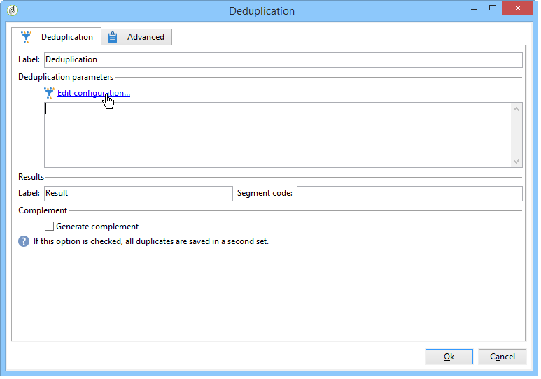

1. Select the type of target for this activity (by default, deduplication is linked to recipients) and the criterion to be used, i.e. the field for which identical values enable you to identify duplicates.

   >[!NOTE]
   >
   >If you are using external data as input, for example from an external file, make sure you select the **[!UICONTROL Temporary schema]** option.
   >
   >In the next step, the **[!UICONTROL Other]** option lets you select the criterion or criteria to be used:

   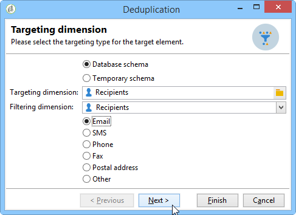

1. In the next step, the **[!UICONTROL Other]** option lets you select the criterion or criteria to be used in case of identical values.

   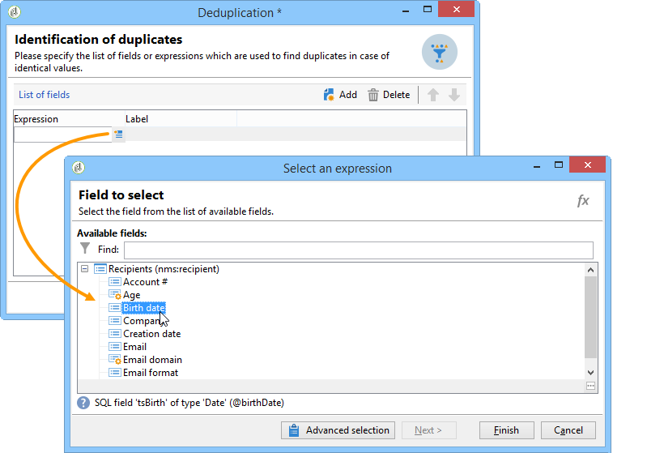

1. From the drop-down list, select the deduplication method to be used, and enter the number of duplicates to be kept.

   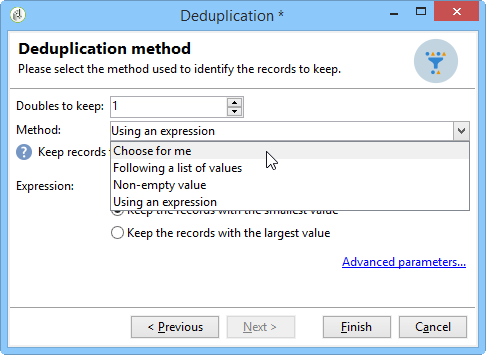

   The following methods are available:

    * **[!UICONTROL Choose for me]**: randomly selects the record to be kept out of the duplicates.
    * **[!UICONTROL Following a list of values]**: lets you define a value priority for one or more fields. To define the values, select a field or create an expression, then add the value(s) into the appropriate table. To define a new field, click the **[!UICONTROL Add]** button located above the list of values.

      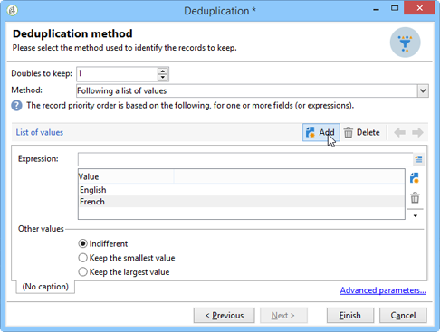

    * **[!UICONTROL Non-empty value]**: this lets you keep records for which the value of the selected expression is not empty as a priority.

      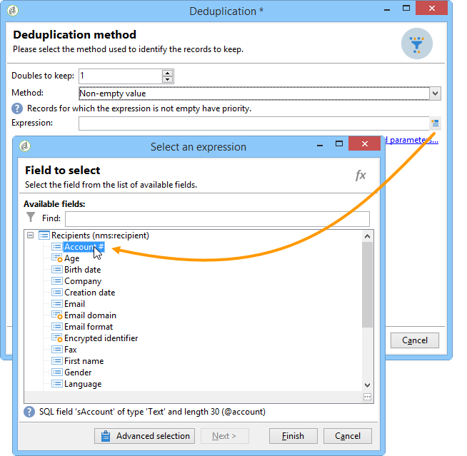

    * **[!UICONTROL Using an expression]**: lets you keep records with the lowest (or highest) value of the given expression. 

      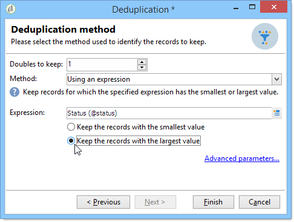

   >[!NOTE]
   >
   >The **[!UICONTROL Merge]** functionality, accessible via the **[!UICONTROL Advanced parameters]** link, allows you to configure a set of rules in order to merge a field or group of fields into a single resulting data record. For more on this, see [Merging fields into a single record](#merging-fields-into-single-record).

1. Click **[!UICONTROL Finish]** to approve the selected deduplication method.

   The middle section of the window summarizes the defined configuration.

   In the lower section of the activity editor window, you can modify the label for the outbound transition of the graphical object and enter a segment code that will be associated with the result of the activity. This code can later be used as a targeting criterion.

   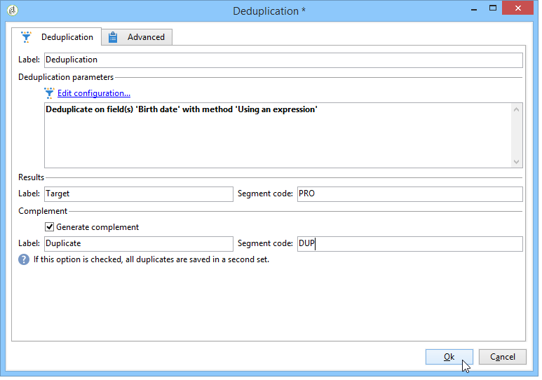

1. Check the **[!UICONTROL Generate complement]** option if you wish to exploit the remaining population. The complement consists of all the duplicates. An additional transition will then be added to the activity, as follows:

   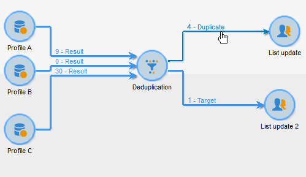

## Example: Identify the duplicates before a delivery {#example--identify-the-duplicates-before-a-delivery}

In the following example, the deduplication concerns the union of three queries.

The aim of the workflow is to define the target for a delivery by excluding duplicates to avoid sending it to the same recipient several times.

The identified duplicates will also be integrated into a dedicated duplicates list that can be reused if necessary.

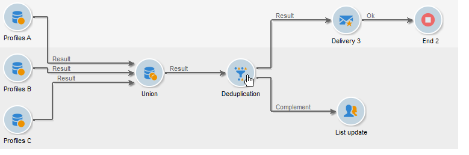

1. Add and link the various activities required for the workflow to operate as shown above.

   The union activity is used here to "unify" the three queries into one single transition. Thus, deduplication will not work for each query individually but for the whole of the query. For more on this subject, refer to [Best practices](#best-practices).

1. Open the deduplication activity then click the **[!UICONTROL Edit configuration...]** link to define the deduplication mode.
1. In the new window, select **[!UICONTROL Database schema]**.
1. Select **Recipients** as targeting and filtering dimensions.
1. Select the ID field for the **[!UICONTROL Email]** duplicates, to send the delivery only once to every email address, then click **[!UICONTROL Next]**.

   If you wish to base the duplicate IDs on a specific field, select **[!UICONTROL Other]** to access the list of available fields.

1. Choose to keep only one entry when the same email address is identified for multiple recipients.
1. Select the **[!UICONTROL Choose for me]** deduplication mode so that the records saved in case of identified duplicates are randomly chosen, then click **[!UICONTROL Finish]**.

When running the workflow, all recipients identified as duplicates are excluded from the result (and therefore the delivery) and added to the duplicates list. This list may be used again rather than having to re-identify the duplicates.

## Merging fields into a single data record {#merging-fields-into-single-record}

The **[!UICONTROL Merge]** functionality allows you to configure a set of rules for the deduplication to define a field or group of fields to merge into a single resulting data record.

For example, with a set of duplicate records, you can choose to keep the oldest phone number or most recent name.

A use case leveraging this feature is available in [this section](deduplication-merge.md).

To do this, follow these steps:

1. In the **[!UICONTROL Deduplication method]** selection step, click the **[!UICONTROL Advanced Parameters]** link.

   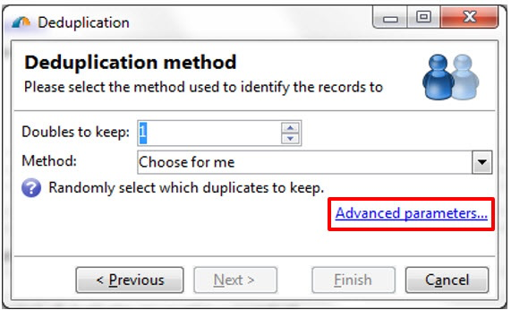

1. Select the **[!UICONTROL Merge records]** option to activate the functionality.

   If you want to group multiple data fields in each merging condition, activate the **[!UICONTROL Use several record merging criteria]** option.

   

1. After activating the functionality, a **[!UICONTROL Merge]** tab is added to the **[!UICONTROL Deduplication]** activity. It allows you to define groups of fields to merge and their associated rules.

   For more on this, refer to the dedicated use case available in [this section](deduplication-merge.md).

   

## Input parameters {#input-parameters}

* tableName
* schema

Each inbound event must specify a target defined by these parameters.

## Output parameters {#output-parameters}

* tableName
* schema
* recCount

This set of three values identifies the target resulting from the deduplication. **[!UICONTROL tableName]** is the name of the table which saves target identifiers, **[!UICONTROL schema]** is the schema of the population (usually nms:recipient) and **[!UICONTROL recCount]** is the number of elements in the table.

The transition associated with the complement has the same parameters.
