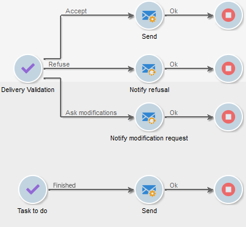
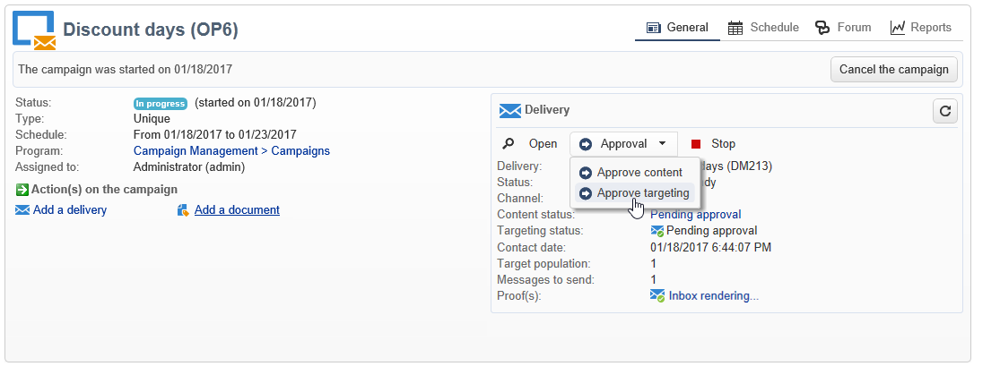
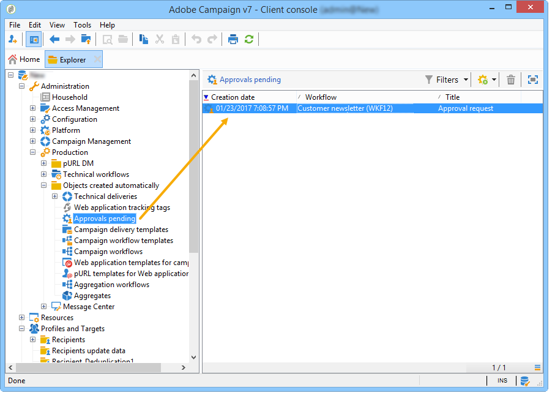
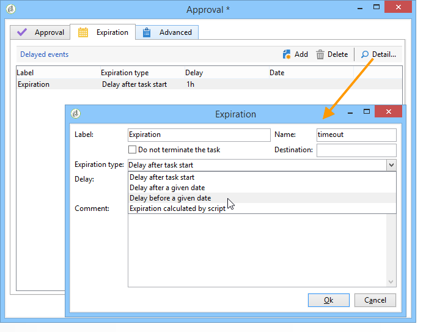

# Defining approvals {#defining-approvals}

Approvals enable operators to make decisions governing a workflow or to confirm its continued execution.

A message is sent to a group of operators and the workflow waits for a response before resuming. The workflow is not stopped and other operations can take place. For example, there may be multiple simultaneous approvals pending.

An approval can contain multiple options for the operator to choose. However, it is possible to restrict the number of choices to one in order to submit a task to be performed to an operator, such as performing targeting. The operator can then respond once the task is performed (the process then resumes). The following example illustrates these types of approvals:



In operations, all stages that require approval are based on the same principle. 



Approval examples can be found in this [section](../../campaign/using/marketing-campaign-approval.md#checking-and-approving-deliveries).

An operator can respond in one of two ways: validating using the Web page linked in the email message, or via the console.

>[!NOTE]
>
>Once the response is saved it may not be modified.

## Sending emails {#sending-emails}

It is possible to receive an approval message containing a link to a Web page via which it is possible to respond. For the targeted operator to receive an approval email, the operator email address must be complete. If this is not the case, the operator must use the console to respond

Operator management is detailed in this [section](../../platform/using/access-management.md).

Approval emails are sent continuously. The default delivery template is **[!UICONTROL notifyAssignee]**: It is saved in the **[!UICONTROL Administration > Campaign management > Technical delivery templates]** folder. This scenario can be customized and it is also recommended to make a copy and to change templates for each activity.

Deliveries created via this template are stored in the **[!UICONTROL Administration > Production > Objects created automatically > Technical deliveries > Workflow notifications]** folder.

## Approval via the console {#approval-via-the-console}

In operations, elements to be approved are displayed on the campaign dashboard.

For technical workflows, the tasks that the user can approve can be accessed from the tree structure in the **[!UICONTROL Administration > Production > Objects created automatically > Pending approvals]** folder.



## Groups {#groups}

An approval is assigned to a group of operators, a single operator or a set of operators selected via a filtering condition.

1. For the simplest form of approval, the task is finished as soon as an operator responds. Any other operator who tries to respond will be notified that someone has already done it.
1. For multiple approvals, refer to [Multiple approval](#multiple-approval).

The operator groups for approvals should be designated as roles or functions rather than named individuals. For example, a "Campaign budget" group is preferable to "Harry's group". We recommend having at least two persons in a group who can approve a task. In this way, if one is absent, the other can respond.

## Expirations {#expirations}

Expirations are specific transitions that are used in different types of activity, and particularly in approvals. You can use an expiration to trigger an action after a given time without response. It can also be used, for example, to pursue the workflow and assign an approval to a different group.

The second tab in the activity approval properties lets you define one or more expirations. In fact, you can define multiple expiration types.



To add a new expiration, click **[!UICONTROL Add]**. A transition is added to each of the expirations created. You can:

* modify the typical parameters directly by clicking on a cell in the list (or by pressing F2),
* or edit the expression by clicking the **[!UICONTROL Detail...]** button.

>[!NOTE]
>
>It is not necessary to specify an order for the expirations as they are processed in chronological order.

The **[!UICONTROL Do not terminate the task]** option leaves the approval active when the delay is overrun. This mode makes it possible to manage reminders while leaving the approval active: operators can still respond. This option is disabled by default meaning that the task is considered finished on expiration and that the operators may no longer respond.

You can create four types of expirations:

* **Delay after task start**: The expiration is calculated by adding a specified length of time to the date on which the approval is activated.
* **Delay after a given date**: The expiration is calculated by adding a length of time to a date that you specify.
* **Delay before a given date**: The expiration is calculated by subtracting a length of time from a date that you specify.
* **Expiration calculated by script**: The expiration is calculated using JavaScript.

  The following example calculates an expiration 24 hours before the date a delivery is started (identified by **vars.deliveryId**):

  ```
  var delivery = nms.delivery.get(vars.deliveryId)
  var expiration = delivery.scheduling.contactDate
  var oneDay = 1000*60*60*24
  expiration.setTime(expiration.getTime() - oneDay)
  return expiration
  ```

## Multiple approval {#multiple-approval}

Multiple approval is a mechanism enabling all approval operators to respond. A transition is activated for each response.

Multiple approval is useful for vote or survey mechanisms. You can count answers and process their result after a given period by adding a deadline.

## Required rights {#required-rights}

The operators in a group must at least have the following rights in order to be able to respond to an approval request:

* Write permissions for workflow.
* Read and write permissions for the folder containing the tasks to approve.

The 'Workflow execution' group has these rights. An operator added to this group has the rights to respond to an approval request.
