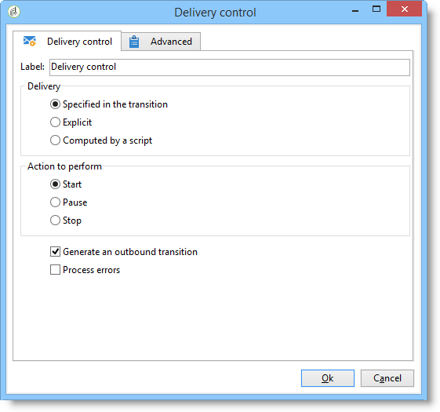

# Delivery control{#delivery-control}

A **Delivery control**-type action lets you start, pause, or stop a delivery.

This can be the delivery specified in the transition, a delivery selected explicitly, or a delivery calculated by a script. For more on this, refer to [Delivery](delivery.md).

If you select **[!UICONTROL Start]**, the activity will perform all the steps required to start the delivery (target calculation, content preparation, delivery). If some of these steps have already been performed by a previous workflow activity they won't be performed again. For instance, if the target estimation was already performed by a **[!UICONTROL Delivery]** type activity (refer to [Delivery](delivery.md)), the **[!UICONTROL Act on the delivery]** activity will launch the remaining steps (content preparation and delivery).

The following options are available:

* **[!UICONTROL Generate an outbound transition]**

  Creates an outbound transition that will be activated at the end of execution. You can choose whether or not to retrieve the target of the outbound delivery.

* **[!UICONTROL Processing errors]**

  Refer to [Processing errors](monitoring-workflow-execution.md#processing-errors).

## Input parameters {#input-parameters}

* deliveryId

Delivery identifier, if the selected action is **[!UICONTROL Specified in the transition]**.
