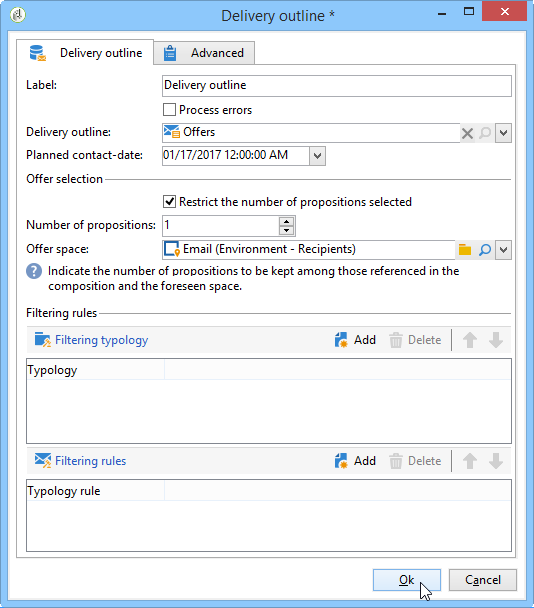

# Delivery outline{#delivery-outline}

The delivery outline lets you use an outline in a campaign workflow. The outline must have been created in the campaign beforehand.

For more information on delivery outlines in Adobe Campaign, refer to this [section](../../campaign/using/marketing-campaign-deliveries.md#associating-and-structuring-resources-linked-via-a-delivery-outline).

To configure the activity, you simply have to select the outline you like as well as the planned contact date. You can add filtering rules by adding typologies or typology rules.

## Example: Inserting an offer via a delivery outline {#example--inserting-an-offer-via-a-delivery-outline}

The delivery outline activity, available in the campaign workflows, lets you present offers that are referenced in a delivery outline from the current campaign in progress.

>[!NOTE]
>
>The **Interaction** package must be installed.

1. In a workflow, add a delivery outline activity before adding a delivery activity.
1. In the delivery outline activity, specify the outline you would like to use.

   For more information on specifying delivery outlines, refer to this [section](../../campaign/using/marketing-campaign-deliveries.md#associating-and-structuring-resources-linked-via-a-delivery-outline).

1. Complete the available fields according to your delivery.
1. There are two possible cases:

    * If you would like to call the offer engine, check the **[!UICONTROL Restrict the number of propositions selected]** box. Specify the offer space and the number of propositions that will be presented in the delivery.

      The offer weights and eligibility rules will be taken into account by the offer engine.
    
    * If you do not check the box, all the offers in the delivery outline will be presented without making a call to the offer engine.

   The preview takes into account the number of offers specified in the delivery. When executing a workflow, it is the number specified in the delivery outline that is taken into account.

   

